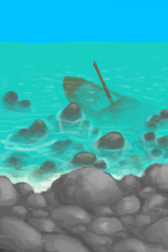

# 绳子  
> 有很多用途。可以带上绳子用来爬椰子树。  
  
<table class="table table-bordered" data-toggle="table"  data-show-header="false"><thead style="display:none"><tr ><th  style="width:50%;text-align:left;vertical-align:top;"  >title</th><th  style="width:50%;text-align:left;vertical-align:top;"  ></th></tr></thead><tr ><td  style="width:50%;text-align:left;vertical-align:top;"  >**重量：**250  **装备时减重：**-75  **标签：**	[“细线”](tag_Cord.md)  **装备：**[“肩部装备”](eTag_Shoulder.md)</td><td  style="width:50%;text-align:left;vertical-align:top;"  >

<a href="Rope.md" style="color:black">绳子</a>

</td></tr></tbody></table>  
  
## 获取来源  
<table class="table table-bordered" data-toggle="table"  ><thead style=""><tr ><th  style="text-align:left;vertical-align:top;"  >来源</th><th  style="text-align:left;vertical-align:top;"  >操作</th></tr></thead><tr ><td  style="text-align:left;vertical-align:top;"  >[

[睡袋](BedRoll.md)](BedRoll.md)</td><td  style="text-align:left;vertical-align:top;"  >拆解</td></tr><tr ><td  style="text-align:left;vertical-align:top;"  >[

[睡袋](BedRoll.md)](BedRoll.md)</td><td  style="text-align:left;vertical-align:top;"  >转化</td></tr><tr ><td  style="text-align:left;vertical-align:top;"  >[

[吊床](Hammock.md)](Hammock.md)</td><td  style="text-align:left;vertical-align:top;"  >拆解</td></tr><tr ><td  style="text-align:left;vertical-align:top;"  >[

[打开的降落伞](ParachuteDeployed.md)](ParachuteDeployed.md)</td><td  style="text-align:left;vertical-align:top;"  >切下塑料布 ** 拖入：**[“切割工具”](tag_Cutter.md)</td></tr><tr ><td  style="text-align:left;vertical-align:top;"  >[

[背篓](BackpackBasket.md)](BackpackBasket.md)</td><td  style="text-align:left;vertical-align:top;"  >解开绳子</td></tr><tr ><td  style="text-align:left;vertical-align:top;"  >[

[补给箱](SupplyChestRaft.md)](SupplyChestRaft.md)</td><td  style="text-align:left;vertical-align:top;"  >拆解</td></tr><tr ><td  style="text-align:left;vertical-align:top;"  >[

[鱼镖](HarpoonBone.md)](HarpoonBone.md)</td><td  style="text-align:left;vertical-align:top;"  >鱼镖坏了</td></tr><tr ><td  style="text-align:left;vertical-align:top;"  >[

[铜长矛](SpearCopper.md)](SpearCopper.md)</td><td  style="text-align:left;vertical-align:top;"  >拆解</td></tr><tr ><td  style="text-align:left;vertical-align:top;"  >[

[铜长矛](SpearCopper.md)](SpearCopper.md)</td><td  style="text-align:left;vertical-align:top;"  >长矛坏了</td></tr><tr ><td  style="text-align:left;vertical-align:top;"  >[

[燧石长矛](SpearFlint.md)](SpearFlint.md)</td><td  style="text-align:left;vertical-align:top;"  >拆解</td></tr><tr ><td  style="text-align:left;vertical-align:top;"  >[

[燧石长矛](SpearFlint.md)](SpearFlint.md)</td><td  style="text-align:left;vertical-align:top;"  >长矛坏了</td></tr><tr ><td  style="text-align:left;vertical-align:top;"  >[

[黑曜石长矛](SpearObsidian.md)](SpearObsidian.md)</td><td  style="text-align:left;vertical-align:top;"  >拆解</td></tr><tr ><td  style="text-align:left;vertical-align:top;"  >[

[黑曜石长矛](SpearObsidian.md)](SpearObsidian.md)</td><td  style="text-align:left;vertical-align:top;"  >长矛坏了</td></tr><tr ><td  style="text-align:left;vertical-align:top;"  >[

[废金属长矛](SpearScrap.md)](SpearScrap.md)</td><td  style="text-align:left;vertical-align:top;"  >拆解</td></tr><tr ><td  style="text-align:left;vertical-align:top;"  >[

[废金属长矛](SpearScrap.md)](SpearScrap.md)</td><td  style="text-align:left;vertical-align:top;"  >长矛坏了</td></tr><tr ><td  style="text-align:left;vertical-align:top;"  >[

[线团](YarnFiber.md)](YarnFiber.md)</td><td  style="text-align:left;vertical-align:top;"  >制作绳子 ** 拖入：**[线团](YarnFiber.md)</td></tr><tr ><td  style="text-align:left;vertical-align:top;"  >[

[漂浮的残骸](FloatingDebris.md)](FloatingDebris.md)</td><td  style="text-align:left;vertical-align:top;"  >采集</td></tr><tr ><td  style="text-align:left;vertical-align:top;"  >[

[沉船(鸟岩岛)](Shipwreck.md)](Shipwreck.md)</td><td  style="text-align:left;vertical-align:top;"  >探索沉船</td></tr><tr ><td  style="text-align:left;vertical-align:top;"  >[

[树液收集处](PalmTreeSapStation.md)](PalmTreeSapStation.md)</td><td  style="text-align:left;vertical-align:top;"  >砍倒 ** 拖入：**[石斧](StoneAxe.md)</td></tr><tr ><td  style="text-align:left;vertical-align:top;"  >[

[树液收集处](PalmTreeSapStation.md)](PalmTreeSapStation.md)</td><td  style="text-align:left;vertical-align:top;"  >砍倒 ** 拖入：**[“斧”](tag_Axe.md)</td></tr><tr ><td  style="text-align:left;vertical-align:top;"  >[

[树液补给点(空)](PalmTreeSapStationEmpty.md)](PalmTreeSapStationEmpty.md)</td><td  style="text-align:left;vertical-align:top;"  >砍倒 ** 拖入：**[石斧](StoneAxe.md)</td></tr><tr ><td  style="text-align:left;vertical-align:top;"  >[

[树液补给点(空)](PalmTreeSapStationEmpty.md)](PalmTreeSapStationEmpty.md)</td><td  style="text-align:left;vertical-align:top;"  >砍倒 ** 拖入：**[“斧”](tag_Axe.md)</td></tr></tbody></table>  
  
## 动作  
<table class="table table-bordered" data-toggle="table"  ><thead style=""><tr ><th  style="text-align:left;vertical-align:top;"  >动作</th><th  style="text-align:left;vertical-align:top;"  >耗时</th><th  style="text-align:left;vertical-align:top;"  >条件</th><th  style="text-align:left;vertical-align:top;"  >变化</th><th  style="text-align:left;vertical-align:top;"  data-sortable="true"  >状态</th></tr></thead><tr ><td  style="text-align:left;vertical-align:top;"  >拆开 [“手部动作(组)”](HandAction.md)</td><td  style="text-align:left;vertical-align:top;"  >30分</td><td  style="text-align:left;vertical-align:top;"  >[

[光亮](Light.md)](Light.md): 10-100</td><td  style="text-align:left;vertical-align:top;"  >** 自身：** →消失  ** 获得： ** ** [yarn]  **   [

[线团](YarnFiber.md)](YarnFiber.md)(+2) </td><td  style="text-align:left;vertical-align:top;"  ></td></tr></tbody></table>  
  
## 可拖至  

[编织篓](Basket.md)

[坑洞(无绳子)(西部高地)](HighlandHoleNoRope.md)

  
  
## 可用于蓝图  

[

[水窖(蓝图)](Bp_Cistern.md)](Bp_Cistern.md)

[

[铜长矛(蓝图)](Bp_CopperSpear.md)](Bp_CopperSpear.md)

[

[燧石长矛(蓝图)](Bp_FlintSpear.md)](Bp_FlintSpear.md)

[

[鱼镖(蓝图)](Bp_Harpoon.md)](Bp_Harpoon.md)

[

[蜥蜴皮手鼓(蓝图)](Bp_LizardDrum.md)](Bp_LizardDrum.md)

[

[黑曜石长矛(蓝图)](Bp_ObsidianSpear.md)](Bp_ObsidianSpear.md)

[

[木筏(蓝图)](Bp_Raft.md)](Bp_Raft.md)

[

[废金属长矛(蓝图)](Bp_ScrapSpear.md)](Bp_ScrapSpear.md)

[

[补给箱(蓝图)](Bp_SupplyChest.md)](Bp_SupplyChest.md)

[

[水井(蓝图)](Bp_Well.md)](Bp_Well.md)

[

[背篓(蓝图)](Bp_WovenBackpack.md)](Bp_WovenBackpack.md)

[

[睡袋(蓝图)](Bp_Bedroll.md)](Bp_Bedroll.md)

[

[吊床(蓝图)](Bp_Hammock.md)](Bp_Hammock.md)

  
  
  

