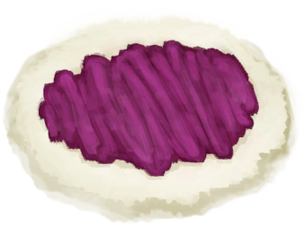
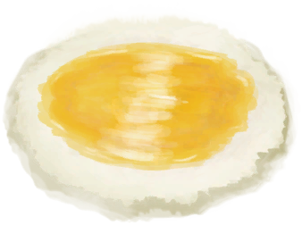
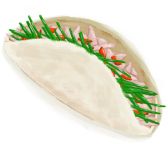

# 西米饼  
> 美味。  
  
<table class="table table-bordered" data-toggle="table"  data-show-header="false"><thead style="display:none"><tr ><th  style="width:50%;text-align:left;vertical-align:top;"  >title</th><th  style="width:50%;text-align:left;vertical-align:top;"  ></th></tr></thead><tr ><td  style="width:50%;text-align:left;vertical-align:top;"  >**重量：**25  **标签：**	[“可烹饪的”](tag_Cookable.md), [“饲料”](tag_Feed.md), [“强效食料”](tag_FeedRich.md), [“喂食（草食动物）”](tag_FeedHerb.md), [“人类食物”](tag_HumanFood.md)</td><td  style="width:50%;text-align:left;vertical-align:top;"  >

<a href="SagoFlatbread.md" style="color:black">西米饼</a>

西米粉只需放置在<b>营火或火炉</b>中30分钟即可烤成面饼。  烤好后它可以涂抹上<b>蜂蜜或果酱</b>来做成更有营养的食物，也可以用在一些<b>烹饪食谱</b>中。</td></tr></tbody></table>  
  
## 获取来源  

西米饼

[西米粉](SagoFlour.md)

西米饼

[西米粉](SagoFlour.md)

西米饼

[西米粉](SagoFlour.md)

西米饼

[西米粉](SagoFlour.md)

面饼

[西米粉](SagoFlour.md)

西米饼

[西米粉](SagoFlour.md)

烹饪蛋糕

[烟熏炉](Smoker.md)

蛋糕

[烟熏炉](Smoker.md)

  
  
## 动作  

<table><tr><td rowspan="2" style="width:200px;text-align:center;font-size:1.3em;font-weight:bold">

食用

</td><td>[“食用蔬菜类动作(组)”](VegetarianAction.md), [“进食动作(组)”](EatingAction.md)</td></tr><tr><td><b>自身：</b>→消失</td></tr><tr><td colspan="2"><b>状态变化：</b>[

[饱食](Satiation.md)](Satiation.md)<b>+20</b>, [

[胃](Stomach.md)](Stomach.md)<b>+25</b>, [

[水分](Hydration.md)](Hydration.md)<b>-1</b>, [

[西米<nobr>厌倦度</nobr>](SaturationSago.md)](SaturationSago.md)<b>+40</b>, [

[污垢](Filth.md)](Filth.md)<b>+3</b>, [

[压力](Stress.md)](Stress.md)<b>-10</b>, [

[情绪](Morale.md)](Morale.md)<b>+1</b></td></tr></table>
  
  
  
## 可拖入  

<table style="margin-bottom:0px;"><tr><td style="width:40%;text-align:left; background-color:#FEFEFE"><b>拖入：</b>[

[参薯酱](YamJam.md)](YamJam.md)</td><td style="width:40%;font-size:1em;font-weight:bold;background-color:#FEFEFE">涂抹果酱  </td></tr><tr style="background-color:#FFFFFF"><td style=""><b>使用物：</b>可用次数  <b>-1</b></td><td style=""><b>自身：</b>→ [

[果酱西米饼](SagoFlatbreadJam.md)](SagoFlatbreadJam.md)</td></tr></table>
  

<table style="margin-bottom:0px;"><tr><td style="width:40%;text-align:left; background-color:#FEFEFE"><b>拖入：</b>[“储水容器”](tag_WaterContainer.md)</td><td style="width:40%;font-size:1em;font-weight:bold;background-color:#FEFEFE">涂抹蜂蜜  </td></tr><tr style="background-color:#FFFFFF"><td style=""><b>使用物：</b>含水量  <b>-75</b></td><td style=""><b>自身：</b>→ [

[蜂蜜西米饼](SagoFlatbreadHoney.md)](SagoFlatbreadHoney.md)</td></tr></table>
  
  
## 可拖至  

[猪食槽](BoarFeeder.md)

[猪食槽(空)](BoarFeederEmpty.md)

[堆肥箱](CompostBin.md)

[羊食槽](GoatFeeder.md)

[羊食槽(空)](GoatFeederEmpty.md)

[灰山鹑喂食器](PartridgeFeeder.md)

[灰山鹑喂食器(空)](PartridgeFeederEmpty.md)

[中陷阱的猕猴](CageTrapMacaque.md)

[母猪](BoarEnclosureFemale.md)

[公猪](BoarEnclosureMale.md)

[小猪](BoarEnclosurePiglet.md)

[母猪](BoarTiedFemale.md)

[公猪](BoarTiedMale.md)

[小猪](BoarTiedPiglet.md)

[母山羊](GoatEnclosureFemale.md)

[小羊](GoatEnclosureKid.md)

[哺乳期山羊](GoatEnclosureLactating.md)

[公山羊](GoatEnclosureMale.md)

[母山羊](GoatTiedFemale.md)

[哺乳期山羊](GoatTiedFemaleLactating.md)

[小羊](GoatTiedKid.md)

[公山羊](GoatTiedMale.md)

[祖父](Grandfather.md)

[祖父(健康)](GrandfatherHealthy.md)

[猕猴朋友](MacaqueFriend.md)

[受伤的猕猴](MacaqueWounded.md)

[小灰山鹑](PartridgeChick.md)

[雌灰山鹑](PartridgeFemaleEnclosure.md)

[雌灰山鹑](PartridgeFemaleLive.md)

[雄灰山鹑](PartridgeMaleEnclosure.md)

[雄灰山鹑](PartridgeMaleLive.md)

  
  
## 可用于蓝图  

<a href="Bp_ChickenSandwich.md" style="color:black">鸡肉三明治</a>

<a href="Bp_FishTaco.md" style="color:black">鱼肉塔可</a>

  
  
  
## 可用于转化  
<table class="table table-bordered" data-toggle="table"  ><thead style=""><tr ><th  style="text-align:left;vertical-align:top;"  >转化为</th><th  style="text-align:left;vertical-align:top;"  >容器</th></tr></thead><tr ><td  style="text-align:left;vertical-align:top;"  >[

[烧焦物](CharredRemains.md)](CharredRemains.md)</td><td  style="text-align:left;vertical-align:top;"  >[

[营火](Campfire.md)](Campfire.md)</td></tr><tr ><td  style="text-align:left;vertical-align:top;"  >[

[烧焦物](CharredRemains.md)](CharredRemains.md)</td><td  style="text-align:left;vertical-align:top;"  >[

[粘土火盆](ClayFirePit.md)](ClayFirePit.md)</td></tr><tr ><td  style="text-align:left;vertical-align:top;"  >[

[烧焦物](CharredRemains.md)](CharredRemains.md)</td><td  style="text-align:left;vertical-align:top;"  >[

[火堆](Fire.md)](Fire.md)</td></tr><tr ><td  style="text-align:left;vertical-align:top;"  >[

[烧焦物](CharredRemains.md)](CharredRemains.md)</td><td  style="text-align:left;vertical-align:top;"  >[

[火堆](Fire.md)](Fire.md)</td></tr><tr ><td  style="text-align:left;vertical-align:top;"  >[

[烧焦物](CharredRemains.md)](CharredRemains.md)</td><td  style="text-align:left;vertical-align:top;"  >[

[瓦斯炉(开)](GasCookerOn.md)](GasCookerOn.md)</td></tr><tr ><td  style="text-align:left;vertical-align:top;"  >[

[烧焦物](CharredRemains.md)](CharredRemains.md)</td><td  style="text-align:left;vertical-align:top;"  >[

[火炉](Stove.md)](Stove.md)</td></tr></tbody></table>  
  
## 属性   

<table style="margin-bottom:0px;"><tr><td style="width:30%;text-align:left; background-color:#FEFEFE;font-size:1.3em;font-weight:bold;">耐久</td><td style="font-size:1em;background-color:#FEFEFE">初始：480 每15分钟-1 , 最多需要：5天</td></tr><tr style="background-color:#FFFFFF"><td colspan=2>** 到达0时： ** 自身: → [

[腐烂物](RottenRemains.md)](RottenRemains.md)</td></tr></table>
  

