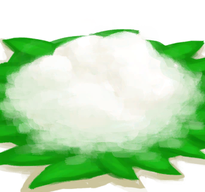
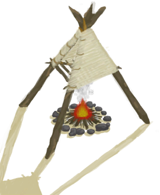

# 西米饼  
> 美味。  
   
> 西米粉只需放置在<b>营火或火炉</b>中30分钟即可烤成面饼。  烤好后它可以涂抹上<b>蜂蜜或果酱</b>来做成更有营养的食物，也可以用在一些<b>烹饪食谱</b>中。  
  
<table class="table table-bordered"><tbody><tr ><td  style="width:80%;text-align:left;vertical-align:top;" >**重量：**25  **标签：**	[“可烹饪的”](tag_Cookable.md), [“饲料”](tag_Feed.md), [“强效食料”](tag_FeedRich.md), [“喂食（草食动物）”](tag_FeedHerb.md), [“人类食物”](tag_HumanFood.md)</td><td  style="width:20%;text-align:left;vertical-align:top;" >

</td></tr></tbody></tbody></table>  
  
## 获取来源  
<table class="table table-bordered"><thead><tr ><th  style="text-align:left;vertical-align:top;" >来源</th><th  style="text-align:left;vertical-align:top;" >操作</th></tr></thead><tr ><td  style="text-align:left;vertical-align:top;" >[

[西米粉](SagoFlour.md)](SagoFlour.md) , [

[营火](Campfire.md)](Campfire.md)</td><td  style="text-align:left;vertical-align:top;" >西米饼</td></tr><tr ><td  style="text-align:left;vertical-align:top;" >[

[西米粉](SagoFlour.md)](SagoFlour.md) , [

[粘土火盆](ClayFirePit.md)](ClayFirePit.md)</td><td  style="text-align:left;vertical-align:top;" >西米饼</td></tr><tr ><td  style="text-align:left;vertical-align:top;" >[

[西米粉](SagoFlour.md)](SagoFlour.md) , [

[火堆](Fire.md)](Fire.md)</td><td  style="text-align:left;vertical-align:top;" >西米饼</td></tr><tr ><td  style="text-align:left;vertical-align:top;" >[

[西米粉](SagoFlour.md)](SagoFlour.md) , [

[瓦斯炉(开)](GasCookerOn.md)](GasCookerOn.md)</td><td  style="text-align:left;vertical-align:top;" >西米饼</td></tr><tr ><td  style="text-align:left;vertical-align:top;" >[

[西米粉](SagoFlour.md)](SagoFlour.md) , [

[火炉](Stove.md)](Stove.md)</td><td  style="text-align:left;vertical-align:top;" >面饼</td></tr><tr ><td  style="text-align:left;vertical-align:top;" >[

[西米粉](SagoFlour.md)](SagoFlour.md) , [

[火炉](Stove.md)](Stove.md)</td><td  style="text-align:left;vertical-align:top;" >西米饼</td></tr><tr ><td  style="text-align:left;vertical-align:top;" >[

[烟熏炉](Smoker.md)](Smoker.md)</td><td  style="text-align:left;vertical-align:top;" >烹饪蛋糕</td></tr><tr ><td  style="text-align:left;vertical-align:top;" >[

[烟熏炉](Smoker.md)](Smoker.md)</td><td  style="text-align:left;vertical-align:top;" >蛋糕</td></tr></tbody></table>  
  
## 动作  
<table class="table table-bordered"><thead><tr ><th  style="text-align:left;vertical-align:top;" >动作</th><th  style="text-align:left;vertical-align:top;" >耗时</th><th  style="text-align:left;vertical-align:top;" >条件</th><th  style="text-align:left;vertical-align:top;" >变化</th><th  style="text-align:left;vertical-align:top;" >状态</th></tr></thead><tr ><td  style="text-align:left;vertical-align:top;" >食用 [食用蔬菜类动作(组)](VegetarianAction.md) [进食动作(组)](EatingAction.md)</td><td  style="text-align:left;vertical-align:top;" >-</td><td  style="text-align:left;vertical-align:top;" ></td><td  style="text-align:left;vertical-align:top;" >** 自身：** →消失</td><td  style="text-align:left;vertical-align:top;" >[

[饱食](Satiation.md)](Satiation.md)+20 [

[胃](Stomach.md)](Stomach.md)+25 [

[水分](Hydration.md)](Hydration.md)-1 [

[西米<nobr>厌倦度</nobr>](SaturationSago.md)](SaturationSago.md)+40 [

[污垢](Filth.md)](Filth.md)+3 [

[压力](Stress.md)](Stress.md)-10 [

[情绪](Morale.md)](Morale.md)+1</td></tr></tbody></table>  
  
## 可拖入  
<table class="table table-bordered"><thead><tr ><th  style="text-align:left;vertical-align:top;" >使用</th><th  style="text-align:left;vertical-align:top;" >动作</th><th  style="text-align:left;vertical-align:top;" >耗时</th><th  style="text-align:left;vertical-align:top;" >条件</th><th  style="text-align:left;vertical-align:top;" >变化</th><th  style="text-align:left;vertical-align:top;" >玩家状态</th></tr></thead><tr ><td  style="text-align:left;vertical-align:top;" >[

[参薯酱](YamJam.md)](YamJam.md)</td><td  style="text-align:left;vertical-align:top;" >涂抹果酱 </td><td  style="text-align:left;vertical-align:top;" >-</td><td  style="text-align:left;vertical-align:top;" ></td><td  style="text-align:left;vertical-align:top;" >** 自身: ** → [

[果酱西米饼](SagoFlatbreadJam.md)](SagoFlatbreadJam.md)  ** 使用物: ** 可用次数  -1</td><td  style="text-align:left;vertical-align:top;" ></td></tr><tr ><td  style="text-align:left;vertical-align:top;" >[“储水容器”](tag_WaterContainer.md)</td><td  style="text-align:left;vertical-align:top;" >涂抹蜂蜜 </td><td  style="text-align:left;vertical-align:top;" >-</td><td  style="text-align:left;vertical-align:top;" ></td><td  style="text-align:left;vertical-align:top;" >** 自身: ** → [

[蜂蜜西米饼](SagoFlatbreadHoney.md)](SagoFlatbreadHoney.md)  ** 使用物: ** 含水量  -75</td><td  style="text-align:left;vertical-align:top;" ></td></tr></tbody></table>  
  
## 可拖至  

[猪食槽](BoarFeeder.md)

[猪食槽](BoarFeeder.md)

[猪食槽(空)](BoarFeederEmpty.md)

[猪食槽(空)](BoarFeederEmpty.md)

[堆肥箱](CompostBin.md)

[羊食槽](GoatFeeder.md)

[羊食槽(空)](GoatFeederEmpty.md)

[灰山鹑喂食器](PartridgeFeeder.md)

[灰山鹑喂食器(空)](PartridgeFeederEmpty.md)

[中陷阱的猕猴](CageTrapMacaque.md)

[母猪](BoarEnclosureFemale.md)

[母猪](BoarEnclosureFemale.md)

[公猪](BoarEnclosureMale.md)

[公猪](BoarEnclosureMale.md)

[小猪](BoarEnclosurePiglet.md)

[小猪](BoarEnclosurePiglet.md)

[母猪](BoarTiedFemale.md)

[母猪](BoarTiedFemale.md)

[公猪](BoarTiedMale.md)

[公猪](BoarTiedMale.md)

[小猪](BoarTiedPiglet.md)

[小猪](BoarTiedPiglet.md)

[母山羊](GoatEnclosureFemale.md)

[小羊](GoatEnclosureKid.md)

[哺乳期山羊](GoatEnclosureLactating.md)

[公山羊](GoatEnclosureMale.md)

[母山羊](GoatTiedFemale.md)

[哺乳期山羊](GoatTiedFemaleLactating.md)

[小羊](GoatTiedKid.md)

[公山羊](GoatTiedMale.md)

[祖父](Grandfather.md)

[祖父(健康)](GrandfatherHealthy.md)

[猕猴朋友](MacaqueFriend.md)

[受伤的猕猴](MacaqueWounded.md)

[小灰山鹑](PartridgeChick.md)

[雌灰山鹑](PartridgeFemaleEnclosure.md)

[雌灰山鹑](PartridgeFemaleLive.md)

[雄灰山鹑](PartridgeMaleEnclosure.md)

[雄灰山鹑](PartridgeMaleLive.md)

  
  
## 可用于蓝图  

[

[鸡肉三明治(蓝图)](Bp_ChickenSandwich.md)](Bp_ChickenSandwich.md)

[

[鱼肉塔可(蓝图)](Bp_FishTaco.md)](Bp_FishTaco.md)

  
  
  
## 可用于转化  
<table class="table table-bordered"><thead><tr ><th  style="text-align:left;vertical-align:top;" >转化为</th><th  style="text-align:left;vertical-align:top;" >容器</th></tr></thead><tr ><td  style="text-align:left;vertical-align:top;" >[烧焦物](CharredRemains.md)</td><td  style="text-align:left;vertical-align:top;" >[营火](Campfire.md)</td></tr><tr ><td  style="text-align:left;vertical-align:top;" >[烧焦物](CharredRemains.md)</td><td  style="text-align:left;vertical-align:top;" >[粘土火盆](ClayFirePit.md)</td></tr><tr ><td  style="text-align:left;vertical-align:top;" >[烧焦物](CharredRemains.md)</td><td  style="text-align:left;vertical-align:top;" >[火堆](Fire.md)</td></tr><tr ><td  style="text-align:left;vertical-align:top;" >[烧焦物](CharredRemains.md)</td><td  style="text-align:left;vertical-align:top;" >[火堆](Fire.md)</td></tr><tr ><td  style="text-align:left;vertical-align:top;" >[烧焦物](CharredRemains.md)</td><td  style="text-align:left;vertical-align:top;" >[瓦斯炉(开)](GasCookerOn.md)</td></tr><tr ><td  style="text-align:left;vertical-align:top;" >[烧焦物](CharredRemains.md)</td><td  style="text-align:left;vertical-align:top;" >[火炉](Stove.md)</td></tr></tbody></table>  
  
## 属性   
<table class="table table-bordered"><thead><tr ><th  style="text-align:left;vertical-align:top;" >属性</th><th  style="text-align:left;vertical-align:top;" >值</th><th  style="text-align:left;vertical-align:top;" >耗时</th><th  style="text-align:left;vertical-align:top;" >变化</th></tr></thead><tr ><td  style="text-align:left;vertical-align:top;" >耐久</td><td  style="text-align:left;vertical-align:top;" >初始：480</td><td  style="text-align:left;vertical-align:top;" >每15分钟-1 最多需要：5天</td><td  style="text-align:left;vertical-align:top;" >** 到达0时： **  ** 自身 ** → [

[腐烂物](RottenRemains.md)](RottenRemains.md)</td></tr></tbody></table>  
  

