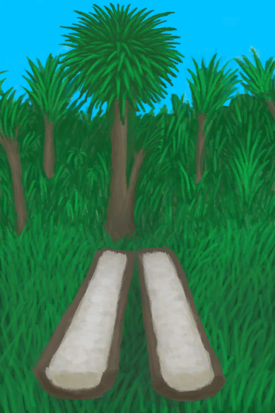

# 劈开的西米树干  
> 下一步是刮取树芯。  
  
<table class="table table-bordered table3059" data-toggle="table"  data-show-header="false"><thead style="display:none"><tr ><th  style="width:50%;"  >title</th><th  style="width:50%;"  ></th></tr></thead><tr ><td  style="width:50%;"  >**可用次数：**8</td><td  style="width:50%;"  >

<a href="SagoSplitLog.md" style="color:black">劈开的西米树干</a>

</td></tr></tbody></table>  
  
## 获取来源  

** 使用**[石斧](StoneAxe.md)从中劈开

[倒下的西米树](SagoPalmFelled.md)

** 使用**[“斧”](tag_Axe.md)从中劈开

[倒下的西米树](SagoPalmFelled.md)

  
  
## 可拖入  

<table style="margin-bottom:0px;"><tr><td style="width:40%;text-align:left; background-color:#FEFEFE"><b>拖入：</b>[“切割工具”](tag_Cutter.md) | [“斧”](tag_Axe.md)</td><td style="width:40%;font-size:1em;font-weight:bold;background-color:#FEFEFE">刮取树芯 (15分) [“手部动作(组)”](HandAction.md)</td></tr><tr style="background-color:#FFFFFF"><td style=""><b>使用物：</b>可用次数  <b>-1</b></td><td style=""><b>自身：</b>使用次数  <b>-1(-12.5%)</b></td></tr><tr><td colspan="2"><b>状态变化：</b>[

[耐力](Stamina.md)](Stamina.md)<b>-3</b>, [

[体重](Weight.md)](Weight.md)<b>-4</b></td></tr><tr><td colspan="2"><b>需求：</b>[

[光亮](Light.md)](Light.md): <b>10-100</b>, [

[耐力](Stamina.md)](Stamina.md): <b>8-32</b></td></tr><tr><td colspan="2">[

[西米树芯](SagoSawdust.md)](SagoSawdust.md)(<b>+1</b>)</td></tr></table>
  
  
## 属性   

<table style="margin-bottom:0px;"><tr><td style="width:30%;text-align:left; background-color:#FEFEFE;font-size:1.3em;font-weight:bold;">耐久</td><td style="font-size:1em;background-color:#FEFEFE">初始：96 , 最大：96 每15分钟-1 , 最多需要：1天</td></tr><tr style="background-color:#FFFFFF"><td colspan=2>** 到达0时： ** 自身: →消失 [

[腐烂物](RottenRemains.md)](RottenRemains.md)(<b>+2～+4</b>)</td></tr></table>
  

<table style="margin-bottom:0px;"><tr><td style="width:30%;text-align:left; background-color:#FEFEFE;font-size:1.3em;font-weight:bold;">使用次数</td><td style="font-size:1em;background-color:#FEFEFE">初始：8 , 最大：8 -</td></tr><tr style="background-color:#FFFFFF"><td colspan=2>** 到达0时： ** 自身: →消失</td></tr></table>
  

