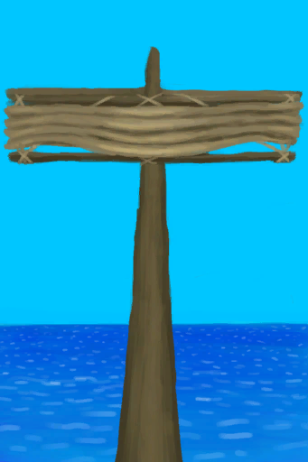

# 损坏的帆  
> 我应当修好它。下次在坏之前我应该多加注意。  
  
<table class="table table-bordered"><tbody><tr ><td  style="width:80%;text-align:left;vertical-align:top;" >**可使用次数：**0</td><td  style="width:20%;text-align:left;vertical-align:top;" >

</td></tr></tbody></tbody></table>  
  
## 获取来源  
<table class="table table-bordered"><thead><tr ><th  style="text-align:left;vertical-align:top;" >来源</th><th  style="text-align:left;vertical-align:top;" >操作</th></tr></thead><tr ><td  style="text-align:left;vertical-align:top;" >[

[收起的帆](SailDown_Raft.md)](SailDown_Raft.md)</td><td  style="text-align:left;vertical-align:top;" >转化</td></tr><tr ><td  style="text-align:left;vertical-align:top;" >[

[扬起的帆](SailUp_Raft.md)](SailUp_Raft.md)</td><td  style="text-align:left;vertical-align:top;" >转化</td></tr></tbody></table>  
  
## 可拖入  
<table class="table table-bordered"><thead><tr ><th  style="text-align:left;vertical-align:top;" >使用</th><th  style="text-align:left;vertical-align:top;" >动作</th><th  style="text-align:left;vertical-align:top;" >耗时</th><th  style="text-align:left;vertical-align:top;" >条件</th><th  style="text-align:left;vertical-align:top;" >变化</th><th  style="text-align:left;vertical-align:top;" >玩家状态</th></tr></thead><tr ><td  style="text-align:left;vertical-align:top;" >[

[细线](CordFiber.md)](CordFiber.md)</td><td  style="text-align:left;vertical-align:top;" >修理船帆 </td><td  style="text-align:left;vertical-align:top;" >30分</td><td  style="text-align:left;vertical-align:top;" >[

[光亮](Light.md)](Light.md): 10-100</td><td  style="text-align:left;vertical-align:top;" >** 自身: ** 使用次数  +96(20%)  ** 使用物: ** →消失</td><td  style="text-align:left;vertical-align:top;" ></td></tr></tbody></table>  
  
## 属性   
<table class="table table-bordered"><thead><tr ><th  style="text-align:left;vertical-align:top;" >属性</th><th  style="text-align:left;vertical-align:top;" >值</th><th  style="text-align:left;vertical-align:top;" >耗时</th><th  style="text-align:left;vertical-align:top;" >变化</th></tr></thead><tr ><td  style="text-align:left;vertical-align:top;" >使用次数</td><td  style="text-align:left;vertical-align:top;" >初始：0 最大：480</td><td  style="text-align:left;vertical-align:top;" >每15分钟-1 最多需要：5天</td><td  style="text-align:left;vertical-align:top;" >** 到达上限时： **  ** 自身 ** → [

[收起的帆](SailDown_Raft.md)](SailDown_Raft.md)</td></tr></tbody></table>  
  

