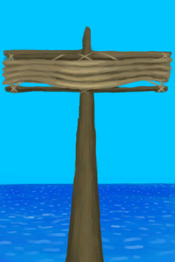

# 收起的帆  
> 当风向有利时，我应该升起船帆。  
  
  收起的帆  |   图片   
 ----  |  ----:   
 **可使用次数：**480  |     
  
## 获取来源  
来源  |  操作  
----  |  ----  
[扬起的帆](SailUp_Raft.md)  |  收帆  
[开始冒险](Start_Raft.md)  |  把木筏推下水  
[开始冒险](Start_RaftAtoll.md)  |  把木筏推下水  
## 动作  
动作  |  耗时  |  条件  |  变化  |  状态  
----  |  ----  |  ----  |  ----  |  ----  
扬帆   |  -  |    |  → [扬起的帆](SailUp_Raft.md)   |    
## 可拖入  
使用  |  动作  |  耗时  |  条件  |  变化  |  玩家状态  
----  |  ----  |  ----  |  ----  |  ----  |  ----  
[细线](CordFiber.md)  |  修理船帆  |  30分  |  [光亮](Light.md): 10-100  |  自身: → [扬起的帆](SailUp_Raft.md) 使用次数 + 96    |    
## 属性   
属性  |  值  |  耗时  |  变化  
----  |  ----  |  ----  |  ----  
使用次数  |  初始：480 最大：480  |  每15分钟-1 最多需要：5天  |  ** 到达0时： ** → [损坏的帆](SailBroken_Raft.md)  
