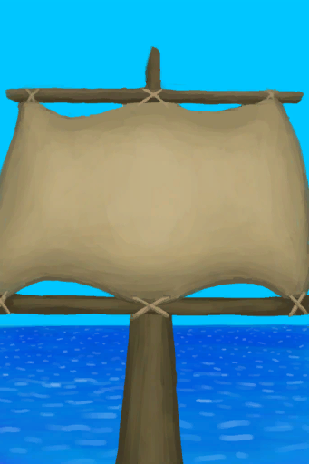

# 收起的帆  
> 当风向有利时，我应该升起船帆。  
  
<table class="table table-bordered" data-toggle="table"  data-show-header="false"><thead style="display:none"><tr ><th  style="width:50%;text-align:left;vertical-align:top;"  >title</th><th  style="width:50%;text-align:left;vertical-align:top;"  ></th></tr></thead><tr ><td  style="width:50%;text-align:left;vertical-align:top;"  >**可用次数：**480</td><td  style="width:50%;text-align:left;vertical-align:top;"  >

<a href="SailDown_Raft.md" style="color:black">收起的帆</a>

当你被困在热带岛屿上时，建造一艘<b>木筏</b>来航行可能是你<b>重返文明社会</b>的唯一机会。  建造木筏是一个大工程，需要将若干<b>原木</b>用<b>绳子</b>捆绑在一起，还需要将许多<b>皮革</b>用<b>细线</b>缝在一起作为船帆。 一旦木筏拥有了基础的框架，你就可以加入很多<b>改进工程</b>。  同时，木筏本身也只是计划的一半：由于不知道需要多长时间才能到达目的地，你还需要很多的<b>补给</b>。  <b>食物、水、用于修理的细线</b>都是至关重要的。此外，取决于你的航行计划，你还可以带上火盆所需的<b>燃料</b>、<b>捕鱼工具</b>或者一些<b>薬品</b>。  准备越充分越好！一旦开始航行，留意<b>顺风或逆风</b>，张开或合上船帆直到你获得救援。</td></tr></tbody></table>  
  
## 获取来源  
<table class="table table-bordered" data-toggle="table"  ><thead style=""><tr ><th  style="text-align:left;vertical-align:top;"  >来源</th><th  style="text-align:left;vertical-align:top;"  >操作</th></tr></thead><tr ><td  style="text-align:left;vertical-align:top;"  >[

[损坏的帆](SailBroken_Raft.md)](SailBroken_Raft.md)</td><td  style="text-align:left;vertical-align:top;"  >转化</td></tr><tr ><td  style="text-align:left;vertical-align:top;"  >[

[扬起的帆](SailUp_Raft.md)](SailUp_Raft.md)</td><td  style="text-align:left;vertical-align:top;"  >收帆</td></tr><tr ><td  style="text-align:left;vertical-align:top;"  >[

[开始冒险](Start_Raft.md)](Start_Raft.md)</td><td  style="text-align:left;vertical-align:top;"  >把木筏推下水</td></tr></tbody></table>  
  
## 动作  
<table class="table table-bordered" data-toggle="table"  ><thead style=""><tr ><th  style="text-align:left;vertical-align:top;"  >动作</th><th  style="text-align:left;vertical-align:top;"  data-sortable="true"  >耗时</th><th  style="text-align:left;vertical-align:top;"  data-sortable="true"  >条件</th><th  style="text-align:left;vertical-align:top;"  >变化</th><th  style="text-align:left;vertical-align:top;"  data-sortable="true"  >状态</th></tr></thead><tr ><td  style="text-align:left;vertical-align:top;"  >扬帆 </td><td  style="text-align:left;vertical-align:top;"  >-</td><td  style="text-align:left;vertical-align:top;"  ></td><td  style="text-align:left;vertical-align:top;"  >** 自身：** → [

[扬起的帆](SailUp_Raft.md)](SailUp_Raft.md)</td><td  style="text-align:left;vertical-align:top;"  ></td></tr></tbody></table>  
  
## 可拖入  
<table class="table table-bordered" data-toggle="table"  ><thead style=""><tr ><th  style="text-align:left;vertical-align:top;"  >使用</th><th  style="text-align:left;vertical-align:top;"  >动作</th><th  style="text-align:left;vertical-align:top;"  >耗时</th><th  style="text-align:left;vertical-align:top;"  >条件</th><th  style="text-align:left;vertical-align:top;"  >变化</th><th  style="text-align:left;vertical-align:top;"  data-sortable="true"  >玩家状态</th></tr></thead><tr ><td  style="text-align:left;vertical-align:top;"  >[

[细线](CordFiber.md)](CordFiber.md)</td><td  style="text-align:left;vertical-align:top;"  >修理船帆 </td><td  style="text-align:left;vertical-align:top;"  >30分</td><td  style="text-align:left;vertical-align:top;"  >[

[光亮](Light.md)](Light.md): 10-100</td><td  style="text-align:left;vertical-align:top;"  >** 自身: ** 使用次数  +96(20%)  ** 使用物: ** →消失</td><td  style="text-align:left;vertical-align:top;"  ></td></tr></tbody></table>  
  
## 属性   
<table class="table table-bordered" data-toggle="table"  ><thead style=""><tr ><th  style="text-align:left;vertical-align:top;"  >属性</th><th  style="text-align:left;vertical-align:top;"  >值</th><th  style="text-align:left;vertical-align:top;"  >耗时</th><th  style="text-align:left;vertical-align:top;"  >变化</th></tr></thead><tr ><td  style="text-align:left;vertical-align:top;"  >使用次数</td><td  style="text-align:left;vertical-align:top;"  >初始：480 最大：480</td><td  style="text-align:left;vertical-align:top;"  >每15分钟-1 最多需要：5天</td><td  style="text-align:left;vertical-align:top;"  >** 到达0时： **  ** 自身 ** → [

[损坏的帆](SailBroken_Raft.md)](SailBroken_Raft.md)</td></tr></tbody></table>  
  

