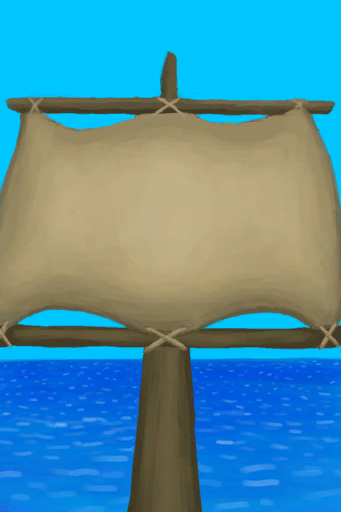

# 扬起的帆  
> 当风向不利时，我应该收起船帆，否则船帆会受损。  
   
> 当你被困在热带岛屿上时，建造一艘<b>木筏</b>来航行可能是你<b>重返文明社会</b>的唯一机会。  建造木筏是一个大工程，需要将若干<b>原木</b>用<b>绳子</b>捆绑在一起，还需要将许多<b>皮革</b>用<b>细线</b>缝在一起作为船帆。 一旦木筏拥有了基础的框架，你就可以加入很多<b>改进工程</b>。  同时，木筏本身也只是计划的一半：由于不知道需要多长时间才能到达目的地，你还需要很多的<b>补给</b>。  <b>食物、水、用于修理的细线</b>都是至关重要的。此外，取决于你的航行计划，你还可以带上火盆所需的<b>燃料</b>、<b>捕鱼工具</b>或者一些<b>药品</b>。  准备越充分越好！一旦开始航行，留意<b>顺风或逆风</b>，张开或合上船帆直到你获得救援。  
  
  扬起的帆  |   图片   
 ----  |  ----:   
 **可使用次数：**480  |     
  
## 获取来源  
来源  |  操作  
----  |  ----  
[收起的帆](SailDown_Raft.md)  |  扬帆  
## 动作  
动作  |  耗时  |  条件  |  变化  |  状态  
----  |  ----  |  ----  |  ----  |  ----  
收帆   |  -  |    |  ** 自身：** → [收起的帆](SailDown_Raft.md)  |    
## 属性   
属性  |  值  |  耗时  |  变化  
----  |  ----  |  ----  |  ----  
使用次数  |  初始：480 最大：480  |  每15分钟-1 最多需要：5天  |  ** 到达0时： **  ** 自身 ** → [损坏的帆](SailBroken_Raft.md)  
## 被动效果  
名称  |  条件  |  变化(每15分钟)  |  玩家状态  
----  |  ----  |  ----  |  ----  
Storm Back  |  ** 需要状态：** [风](Wind.md): 3-5  |  使用次数 -3(-0.63%)  |  [距离](Distance.md)加成+3  
Very Favourable Wind  |  ** 需要状态：** [风](Wind.md): 2-2  |  使用次数 -1(-0.21%)  |  [距离](Distance.md)加成+2  
Favourable Wind  |  ** 需要状态：** [风](Wind.md): 1-1  |    |  [距离](Distance.md)加成+1  
Unfavourable Wind  |  ** 需要状态：** [风](Wind.md): -1--1  |  使用次数 -1(-0.21%)  |  [距离](Distance.md)加成-1.5  
Very Unfavourable Wind  |  ** 需要状态：** [风](Wind.md): -2--2  |  使用次数 -2(-0.42%)  |  [距离](Distance.md)加成-2.5  
Storm Front  |  ** 需要状态：** [风](Wind.md): -5--3  |  使用次数 -4(-0.84%)  |  [距离](Distance.md)加成-3.5  

