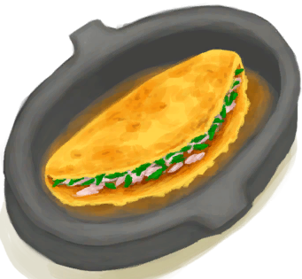

# 盐  
> 可以用来腌鱼和肉来长期保存。  
  
<table class="table table-bordered table7646" data-toggle="table"  data-show-header="false"><thead style="display:none"><tr ><th  style="width:50%;"  >title</th><th  style="width:50%;"  ></th></tr></thead><tr ><td  style="width:50%;"  >**重量：**15</td><td  style="width:50%;"  >

<a href="Salt.md" style="color:black">盐</a>

盐作为一种矿物质，可以通过在营火上煮干海水获得。  盐可以用于很多<b>烹饪食谱</b>，亦或是腌制保存<b>鱼和肉</b>。</td></tr></tbody></table>  
  
## 获取来源  

蒸发制盐

[盐水](LQ_WaterSalt.md)

蒸发制盐

[盐水](LQ_WaterSalt.md)

蒸发制盐

[盐水](LQ_WaterSalt.md)

蒸发制盐

[盐水](LQ_WaterSalt.md)

蒸发制盐

[盐水](LQ_WaterSalt.md)

蒸发制盐

[烟熏炉](Smoker.md)

蒸发制盐

[烟熏炉(塑料布)(点燃)](SmokerPlastic.md)

  
  
## 可拖至  

[野猪肉](BoarMeat.md)

[北梭鱼肉](BonefishMeat.md)

[羊肉](GoatMeat.md)

[绯鲤](Goatfish.md)

[石斑鱼肉](GrouperMeat.md)

[鲱鱼](Herring.md)

[猕猴肉](MacaqueMeat.md)

[鹦哥鱼](ParrotFish.md)

[鲨鱼肉](SharkMeat.md)

[马鲅鱼肉](ThreadfinMeat.md)

  
  
## 可用于蓝图  

<a href="Bp_Butter.md" style="color:black">黄油</a>

<a href="Bp_CandiedGinger.md" style="color:black">姜糖</a>

<a href="Bp_Cheese.md" style="color:black">奶酪</a>

<a href="Bp_FishOmelette.md" style="color:black">鱼肉煎蛋饼</a>

<a href="Bp_Alembic.md" style="color:black">蒸馏器</a>

<a href="Bp_GlazedVase.md" style="color:black">釉面陶罐</a>

  
  
  

