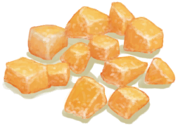

# 盐  
> 可以用来腌鱼和肉来长期保存。  
   
> 盐作为一种矿物质，可以通过在营火上煮干海水获得。  盐可以用于很多<b>烹饪食谱</b>，亦或是腌制保存<b>鱼和肉</b>。  
  
<table class="table table-bordered" data-toggle="table" ><tbody><tr ><td  style="width:80%;text-align:left;vertical-align:top;"  >**重量：**15</td><td  style="width:20%;text-align:left;vertical-align:top;"  >

</td></tr></tbody></tbody></table>  
  
## 获取来源  
<table class="table table-bordered" data-toggle="table" ><thead><tr ><th  style="text-align:left;vertical-align:top;"  >来源</th><th  style="text-align:left;vertical-align:top;"  >操作</th></tr></thead><tr ><td  style="text-align:left;vertical-align:top;"  >[

[盐水](LQ_WaterSalt.md)](LQ_WaterSalt.md) , [

[营火](Campfire.md)](Campfire.md)</td><td  style="text-align:left;vertical-align:top;"  >蒸发制盐</td></tr><tr ><td  style="text-align:left;vertical-align:top;"  >[

[盐水](LQ_WaterSalt.md)](LQ_WaterSalt.md) , [

[粘土火盆](ClayFirePit.md)](ClayFirePit.md)</td><td  style="text-align:left;vertical-align:top;"  >蒸发制盐</td></tr><tr ><td  style="text-align:left;vertical-align:top;"  >[

[盐水](LQ_WaterSalt.md)](LQ_WaterSalt.md) , [

[火堆](Fire.md)](Fire.md)</td><td  style="text-align:left;vertical-align:top;"  >蒸发制盐</td></tr><tr ><td  style="text-align:left;vertical-align:top;"  >[

[盐水](LQ_WaterSalt.md)](LQ_WaterSalt.md) , [

[瓦斯炉(开)](GasCookerOn.md)](GasCookerOn.md)</td><td  style="text-align:left;vertical-align:top;"  >蒸发制盐</td></tr><tr ><td  style="text-align:left;vertical-align:top;"  >[

[盐水](LQ_WaterSalt.md)](LQ_WaterSalt.md) , [

[火炉](Stove.md)](Stove.md)</td><td  style="text-align:left;vertical-align:top;"  >蒸发制盐</td></tr><tr ><td  style="text-align:left;vertical-align:top;"  >[

[烟熏炉](Smoker.md)](Smoker.md)</td><td  style="text-align:left;vertical-align:top;"  >蒸发制盐</td></tr><tr ><td  style="text-align:left;vertical-align:top;"  >[

[烟熏炉(塑料布)(点燃)](SmokerPlastic.md)](SmokerPlastic.md)</td><td  style="text-align:left;vertical-align:top;"  >蒸发制盐</td></tr></tbody></table>  
  
## 可拖至  

[野猪肉](BoarMeat.md)

[北梭鱼肉](BonefishMeat.md)

[羊肉](GoatMeat.md)

[绯鲤](Goatfish.md)

[石斑鱼肉](GrouperMeat.md)

[鲱鱼](Herring.md)

[猕猴肉](MacaqueMeat.md)

[鹦哥鱼](ParrotFish.md)

[鲨鱼肉](SharkMeat.md)

[马鲅鱼肉](ThreadfinMeat.md)

  
  
## 可用于蓝图  

[

[黄油(蓝图)](Bp_Butter.md)](Bp_Butter.md)

[

[姜糖(蓝图)](Bp_CandiedGinger.md)](Bp_CandiedGinger.md)

[

[奶酪(蓝图)](Bp_Cheese.md)](Bp_Cheese.md)

[

[鱼肉煎蛋饼(蓝图)](Bp_FishOmelette.md)](Bp_FishOmelette.md)

[

[蒸馏器(蓝图)](Bp_Alembic.md)](Bp_Alembic.md)

[

[釉面陶罐(蓝图)](Bp_GlazedVase.md)](Bp_GlazedVase.md)

  
  
  

