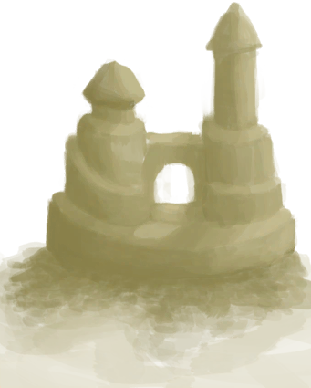

# 沙堡  
> 精致的沙堡，我的得意之作~  
  
<table class="table table-bordered" data-toggle="table"  data-show-header="false"><thead style="display:none"><tr ><th  style="width:50%;text-align:left;vertical-align:top;"  >title</th><th  style="width:50%;text-align:left;vertical-align:top;"  ></th></tr></thead><tr ><td  style="width:50%;text-align:left;vertical-align:top;"  >** 不可删除 **  **重量：**150  **标签：**	[“大的”](tag_Large.md)</td><td  style="width:50%;text-align:left;vertical-align:top;"  >

<a href="SandCastle.md" style="color:black">沙堡</a>

沙子可以在岛上的沙滩地区获取。它在某些蓝图中有一定的用途，也可以用于<b>防止粘土开裂</b>。  此外，如果你感到无聊，建造<b>沙堡</b>也是一种娱乐方式。</td></tr></tbody></table>  
  
## 获取来源  

堆沙堡

[沙堆(环礁)](SandSource.md)

  
  
## 动作  

<table><tr><td rowspan="2" style="width:200px;text-align:center;font-size:1.3em;font-weight:bold">

推倒

</td><td></td></tr><tr><td><b>自身：</b>→消失</td></tr></table>
  
  
  
## 可拖入  
  
## 属性   

<table style="margin-bottom:0px;"><tr><td style="width:30%;text-align:left; background-color:#FEFEFE;font-size:1.3em;font-weight:bold;">耐久</td><td style="font-size:1em;background-color:#FEFEFE">初始：96 , 最大：96 每15分钟-1 , 最多需要：1天</td></tr><tr style="background-color:#FFFFFF"><td colspan=2>** 到达0时： ** 自身: → [

[沙子](Sand.md)](Sand.md)</td></tr></table>
  

