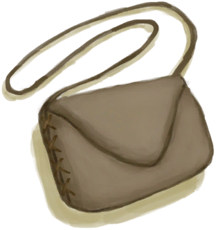

# 挎包  
> 我可以把物品储存在里面。<b>可在装备栏装备</b>  
  
  挎包  |   图片   
 ----  |  ----:   
 **重量：**250  **标签：**	[“袋子”](tag_Bag.md), [“挎包”](tag_Satchel.md), [“高价值物品”](tag_Valuable.md)  **装备：**[“肩部装备”](eTag_Shoulder.md)  **槽位：**3  **过滤器：**~~[“袋子”](tag_Bag.md)~~ , ~~[“大的”](tag_Large.md)~~ , ~~[“火源”](tag_FireSource.md)~~ , ~~[“火”](tag_Fire.md)~~ , ~~[“可泼溅的”](tag_Spillable.md)~~  **容重量：**350  **减重量：**-300  |     
  
## 获取来源  
来源  |  操作  
----  |  ----  
[挎包(蓝图)](Bp_Satchel.md)  |  蓝图制造  
## 动作  
动作  |  耗时  |  条件  |  变化  |  状态  
----  |  ----  |  ----  |  ----  |  ----  
拆解 [手部动作](HandAction.md) [CraftAction](CraftAction.md)  |  30分  |  [光亮](Light.md): 5-100  |  [鞣制兽皮](CuredSkin.md)(+2) [细线](CordFiber.md)(+2～+4)   |    
