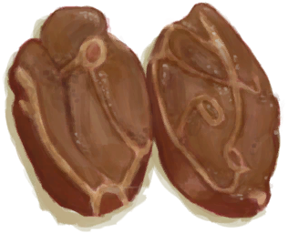
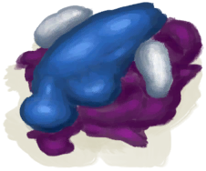

# 饱食  
>   
  
#### ** 基础值: ** 49   
#### ** 变化范围: ** 0 ~ 200  
#### ** 基础变化率: ** 无   
## 阶段  
<table class="table table-bordered"><thead><tr ><th  style="text-align:left;vertical-align:top;" >范围</th><th  style="text-align:left;vertical-align:top;" >名称</th><th  style="text-align:left;vertical-align:top;" >描述</th><th  style="text-align:left;vertical-align:top;" >影响状态</th><th  style="text-align:left;vertical-align:top;" >影响动作</th></tr></thead><tr ><td  style="text-align:left;vertical-align:top;" >151 ～ 200</td><td  style="text-align:left;vertical-align:top;" >

肚子疼</td><td  style="text-align:left;vertical-align:top;" >吃太多了，想吐。</td><td  style="text-align:left;vertical-align:top;" >[

[情绪](Morale.md)](Morale.md)加成-1 [

[恶心](Nausea.md)](Nausea.md)加成+4 [

[饱食](Satiation.md)](Satiation.md)加成-4 [

[食欲](Appetite.md)](Appetite.md)加成+0.5</td><td  style="text-align:left;vertical-align:top;" ></td></tr><tr ><td  style="text-align:left;vertical-align:top;" >126 ～ 150</td><td  style="text-align:left;vertical-align:top;" >

非常饱</td><td  style="text-align:left;vertical-align:top;" >我好像吃得太多了。</td><td  style="text-align:left;vertical-align:top;" >[

[情绪](Morale.md)](Morale.md)加成-0.5 [

[恶心](Nausea.md)](Nausea.md)加成+2 [

[饱食](Satiation.md)](Satiation.md)加成-3 [

[食欲](Appetite.md)](Appetite.md)加成+0.25</td><td  style="text-align:left;vertical-align:top;" ></td></tr><tr ><td  style="text-align:left;vertical-align:top;" >100 ～ 125</td><td  style="text-align:left;vertical-align:top;" >

饱</td><td  style="text-align:left;vertical-align:top;" >我吃撑了。</td><td  style="text-align:left;vertical-align:top;" >[

[情绪](Morale.md)](Morale.md) [

[恶心](Nausea.md)](Nausea.md)加成+1 [

[饱食](Satiation.md)](Satiation.md)加成-2 [

[食欲](Appetite.md)](Appetite.md)加成+0.25</td><td  style="text-align:left;vertical-align:top;" ></td></tr><tr ><td  style="text-align:left;vertical-align:top;" >62 ～ 74</td><td  style="text-align:left;vertical-align:top;" >

轻微饥饿</td><td  style="text-align:left;vertical-align:top;" >我有点饿了</td><td  style="text-align:left;vertical-align:top;" ></td><td  style="text-align:left;vertical-align:top;" ></td></tr><tr ><td  style="text-align:left;vertical-align:top;" >40 ～ 61</td><td  style="text-align:left;vertical-align:top;" >

饿</td><td  style="text-align:left;vertical-align:top;" >我想吃点东西</td><td  style="text-align:left;vertical-align:top;" >[

[食欲](Appetite.md)](Appetite.md)</td><td  style="text-align:left;vertical-align:top;" ></td></tr><tr ><td  style="text-align:left;vertical-align:top;" >25 ～ 39</td><td  style="text-align:left;vertical-align:top;" >

非常饿</td><td  style="text-align:left;vertical-align:top;" >我需要吃点东西</td><td  style="text-align:left;vertical-align:top;" >[

[情绪](Morale.md)](Morale.md)加成-1 [

[压力](Stress.md)](Stress.md)加成+1 [

[食欲](Appetite.md)](Appetite.md)加成-0.1 [

[香蕉<nobr>厌倦度</nobr>](SaturationBananas.md)](SaturationBananas.md)加成-1 [

[鸟类<nobr>厌倦度</nobr>](SaturationBird.md)](SaturationBird.md)加成-1 [

[椰子<nobr>厌倦度</nobr>](SaturationCoconuts.md)](SaturationCoconuts.md)加成-1 [

[甲壳类<nobr>厌倦度</nobr>](SaturationCrustaceans.md)](SaturationCrustaceans.md)加成-1 [

[乳品<nobr>厌倦度</nobr>](SaturationDairy.md)](SaturationDairy.md)加成-1 [

[蛋类<nobr>厌倦度</nobr>](SaturationEggs.md)](SaturationEggs.md)加成-1 [

[鱼类<nobr>厌倦度</nobr>](SaturationFish.md)](SaturationFish.md)加成-1 [

[水果<nobr>厌倦度</nobr>](SaturationFruits.md)](SaturationFruits.md)加成-1 [

[肉类<nobr>厌倦度</nobr>](SaturationMeat.md)](SaturationMeat.md)加成-1 [

[软体类<nobr>厌倦度</nobr>](SaturationMollusks.md)](SaturationMollusks.md)加成-1 [

[蘑菇<nobr>厌倦度</nobr>](SaturationMushrooms.md)](SaturationMushrooms.md)加成-1 [

[坚果<nobr>厌倦度</nobr>](SaturationNuts.md)](SaturationNuts.md)加成-1 [

[干粮<nobr>厌倦度</nobr>](SaturationRations.md)](SaturationRations.md)加成-1 [

[稻米<nobr>厌倦度</nobr>](SaturationRice.md)](SaturationRice.md)加成-1 [

[爬行类厌倦度](SaturationReptile.md)](SaturationReptile.md)加成-1 [

[西米<nobr>厌倦度</nobr>](SaturationSago.md)](SaturationSago.md)加成-1 [

[糖<nobr>厌倦度</nobr>](SaturationSugar.md)](SaturationSugar.md)加成-1 [

[蔬菜<nobr>厌倦度</nobr>](SaturationVegetables.md)](SaturationVegetables.md)加成-1 [

[参薯<nobr>厌倦度</nobr>](SaturationYam.md)](SaturationYam.md)加成-1</td><td  style="text-align:left;vertical-align:top;" ></td></tr><tr ><td  style="text-align:left;vertical-align:top;" >0 ～ 24</td><td  style="text-align:left;vertical-align:top;" >

饥肠辘辘</td><td  style="text-align:left;vertical-align:top;" >我必须要赶紧吃点什么</td><td  style="text-align:left;vertical-align:top;" >[

[情绪](Morale.md)](Morale.md)加成-2 [

[压力](Stress.md)](Stress.md)加成+2 [

[食欲](Appetite.md)](Appetite.md)加成-0.25 [

[香蕉<nobr>厌倦度</nobr>](SaturationBananas.md)](SaturationBananas.md)加成-2 [

[鸟类<nobr>厌倦度</nobr>](SaturationBird.md)](SaturationBird.md)加成-2 [

[椰子<nobr>厌倦度</nobr>](SaturationCoconuts.md)](SaturationCoconuts.md)加成-2 [

[甲壳类<nobr>厌倦度</nobr>](SaturationCrustaceans.md)](SaturationCrustaceans.md)加成-2 [

[乳品<nobr>厌倦度</nobr>](SaturationDairy.md)](SaturationDairy.md)加成-2 [

[蛋类<nobr>厌倦度</nobr>](SaturationEggs.md)](SaturationEggs.md)加成-2 [

[鱼类<nobr>厌倦度</nobr>](SaturationFish.md)](SaturationFish.md)加成-2 [

[水果<nobr>厌倦度</nobr>](SaturationFruits.md)](SaturationFruits.md)加成-2 [

[肉类<nobr>厌倦度</nobr>](SaturationMeat.md)](SaturationMeat.md)加成-2 [

[软体类<nobr>厌倦度</nobr>](SaturationMollusks.md)](SaturationMollusks.md)加成-2 [

[蘑菇<nobr>厌倦度</nobr>](SaturationMushrooms.md)](SaturationMushrooms.md)加成-2 [

[坚果<nobr>厌倦度</nobr>](SaturationNuts.md)](SaturationNuts.md)加成-2 [

[干粮<nobr>厌倦度</nobr>](SaturationRations.md)](SaturationRations.md)加成-2 [

[稻米<nobr>厌倦度</nobr>](SaturationRice.md)](SaturationRice.md)加成-2 [

[爬行类厌倦度](SaturationReptile.md)](SaturationReptile.md)加成-2 [

[西米<nobr>厌倦度</nobr>](SaturationSago.md)](SaturationSago.md)加成-2 [

[糖<nobr>厌倦度</nobr>](SaturationSugar.md)](SaturationSugar.md)加成-2 [

[蔬菜<nobr>厌倦度</nobr>](SaturationVegetables.md)](SaturationVegetables.md)加成-2 [

[参薯<nobr>厌倦度</nobr>](SaturationYam.md)](SaturationYam.md)加成-2</td><td  style="text-align:left;vertical-align:top;" ></td></tr></tbody></table>  
  
## 相关卡牌  
[食欲](Appetite.md)  
## 加成值影响因素  
<table class="table table-bordered"><thead><tr ><th  style="text-align:left;vertical-align:top;" >来源</th><th  style="text-align:left;vertical-align:top;" >操作</th><th  style="text-align:left;vertical-align:top;" >值</th></tr></thead><tr ><td  style="text-align:left;vertical-align:top;" >

[胃口大开](Pk_4_Gluttonous.md)</td><td  style="text-align:left;vertical-align:top;" >特质影响</td><td  style="text-align:left;vertical-align:top;" >加成-0.5</td></tr></tbody></table>  
  
## 可被以下操作改变  
<table class="table table-bordered"><thead><tr ><th  style="text-align:left;vertical-align:top;" >来源</th><th  style="text-align:left;vertical-align:top;" >操作</th><th  style="text-align:left;vertical-align:top;" >值</th></tr></thead><tr ><td  style="text-align:left;vertical-align:top;" >[

[炸鱼薯条](FishNChips.md)](FishNChips.md)</td><td  style="text-align:left;vertical-align:top;" >食用</td><td  style="text-align:left;vertical-align:top;" >80</td></tr><tr ><td  style="text-align:left;vertical-align:top;" >[

[肉食盛宴](HeartyFeast.md)](HeartyFeast.md)</td><td  style="text-align:left;vertical-align:top;" >食用</td><td  style="text-align:left;vertical-align:top;" >60</td></tr><tr ><td  style="text-align:left;vertical-align:top;" >[

[蜜汁火腿](HoneyGlazedPork.md)](HoneyGlazedPork.md)</td><td  style="text-align:left;vertical-align:top;" >食用</td><td  style="text-align:left;vertical-align:top;" >60</td></tr><tr ><td  style="text-align:left;vertical-align:top;" >[

[辣炒巨蜥肉](LizardFry.md)](LizardFry.md)</td><td  style="text-align:left;vertical-align:top;" >食用</td><td  style="text-align:left;vertical-align:top;" >60</td></tr><tr ><td  style="text-align:left;vertical-align:top;" >[

[参薯咖喱](YamCurry.md)](YamCurry.md)</td><td  style="text-align:left;vertical-align:top;" >食用</td><td  style="text-align:left;vertical-align:top;" >60</td></tr><tr ><td  style="text-align:left;vertical-align:top;" >[

[炒菇球](FriedPuffballs.md)](FriedPuffballs.md)</td><td  style="text-align:left;vertical-align:top;" >食用</td><td  style="text-align:left;vertical-align:top;" >55</td></tr><tr ><td  style="text-align:left;vertical-align:top;" >[

[热带烤鸡](IslandChicken.md)](IslandChicken.md)</td><td  style="text-align:left;vertical-align:top;" >食用</td><td  style="text-align:left;vertical-align:top;" >55</td></tr><tr ><td  style="text-align:left;vertical-align:top;" >[

[压缩干粮](FoodRation.md)](FoodRation.md)</td><td  style="text-align:left;vertical-align:top;" >食用</td><td  style="text-align:left;vertical-align:top;" >50</td></tr><tr ><td  style="text-align:left;vertical-align:top;" >[

[巧克力](Chocolate.md)](Chocolate.md)</td><td  style="text-align:left;vertical-align:top;" >食用</td><td  style="text-align:left;vertical-align:top;" >50</td></tr><tr ><td  style="text-align:left;vertical-align:top;" >[

[蛋炒饭](EggFriedRice.md)](EggFriedRice.md)</td><td  style="text-align:left;vertical-align:top;" >食用</td><td  style="text-align:left;vertical-align:top;" >50</td></tr><tr ><td  style="text-align:left;vertical-align:top;" >[

[鱼肉蛋饼](FishOmelette.md)](FishOmelette.md)</td><td  style="text-align:left;vertical-align:top;" >食用</td><td  style="text-align:left;vertical-align:top;" >50</td></tr><tr ><td  style="text-align:left;vertical-align:top;" >[

[猕猴肉串](MacaqueSkewers.md)](MacaqueSkewers.md)</td><td  style="text-align:left;vertical-align:top;" >食用</td><td  style="text-align:left;vertical-align:top;" >50</td></tr><tr ><td  style="text-align:left;vertical-align:top;" >[

[蜂蜜西米饼](SagoFlatbreadHoney.md)](SagoFlatbreadHoney.md)</td><td  style="text-align:left;vertical-align:top;" >食用</td><td  style="text-align:left;vertical-align:top;" >50</td></tr><tr ><td  style="text-align:left;vertical-align:top;" >[

[果酱西米饼](SagoFlatbreadJam.md)](SagoFlatbreadJam.md)</td><td  style="text-align:left;vertical-align:top;" >食用</td><td  style="text-align:left;vertical-align:top;" >50</td></tr><tr ><td  style="text-align:left;vertical-align:top;" >[

[鸡肉三明治](ChickenSandwich.md)](ChickenSandwich.md)</td><td  style="text-align:left;vertical-align:top;" >食用</td><td  style="text-align:left;vertical-align:top;" >45</td></tr><tr ><td  style="text-align:left;vertical-align:top;" >[

[椰子鱼](CoconutFish.md)](CoconutFish.md)</td><td  style="text-align:left;vertical-align:top;" >食用</td><td  style="text-align:left;vertical-align:top;" >45</td></tr><tr ><td  style="text-align:left;vertical-align:top;" >[

[醉蟹](DrunkenCrab.md)](DrunkenCrab.md)</td><td  style="text-align:left;vertical-align:top;" >食用</td><td  style="text-align:left;vertical-align:top;" >45</td></tr><tr ><td  style="text-align:left;vertical-align:top;" >[

[丛林沙拉](JungleSalad.md)](JungleSalad.md)</td><td  style="text-align:left;vertical-align:top;" >食用</td><td  style="text-align:left;vertical-align:top;" >45</td></tr><tr ><td  style="text-align:left;vertical-align:top;" >[

[西米蛋糕](SagoCake.md)](SagoCake.md)</td><td  style="text-align:left;vertical-align:top;" >食用</td><td  style="text-align:left;vertical-align:top;" >45</td></tr><tr ><td  style="text-align:left;vertical-align:top;" >[

[姜糖](CandiedGinger.md)](CandiedGinger.md)</td><td  style="text-align:left;vertical-align:top;" >食用</td><td  style="text-align:left;vertical-align:top;" >40</td></tr><tr ><td  style="text-align:left;vertical-align:top;" >[

[山羊奶酪](Cheese.md)](Cheese.md)</td><td  style="text-align:left;vertical-align:top;" >食用</td><td  style="text-align:left;vertical-align:top;" >40</td></tr><tr ><td  style="text-align:left;vertical-align:top;" >[

[鱼肉塔可](FishTaco.md)](FishTaco.md)</td><td  style="text-align:left;vertical-align:top;" >食用</td><td  style="text-align:left;vertical-align:top;" >40</td></tr><tr ><td  style="text-align:left;vertical-align:top;" >[

[炖羊汤](GoatStew.md)](GoatStew.md)</td><td  style="text-align:left;vertical-align:top;" >食用</td><td  style="text-align:left;vertical-align:top;" >40</td></tr><tr ><td  style="text-align:left;vertical-align:top;" >[

[油](LQ_Oil.md)](LQ_Oil.md)</td><td  style="text-align:left;vertical-align:top;" >饮用</td><td  style="text-align:left;vertical-align:top;" >40</td></tr><tr ><td  style="text-align:left;vertical-align:top;" >[

[香茅精油](LQ_OilCitronella.md)](LQ_OilCitronella.md)</td><td  style="text-align:left;vertical-align:top;" >饮用</td><td  style="text-align:left;vertical-align:top;" >40</td></tr><tr ><td  style="text-align:left;vertical-align:top;" >[

[香茅油混合物](LQ_OilCitronellaMix.md)](LQ_OilCitronellaMix.md)</td><td  style="text-align:left;vertical-align:top;" >饮用</td><td  style="text-align:left;vertical-align:top;" >40</td></tr><tr ><td  style="text-align:left;vertical-align:top;" >[

[茉莉精油](LQ_OilJasmine.md)](LQ_OilJasmine.md)</td><td  style="text-align:left;vertical-align:top;" >饮用</td><td  style="text-align:left;vertical-align:top;" >40</td></tr><tr ><td  style="text-align:left;vertical-align:top;" >[

[茉莉油混合物](LQ_OilJasmineMix.md)](LQ_OilJasmineMix.md)</td><td  style="text-align:left;vertical-align:top;" >饮用</td><td  style="text-align:left;vertical-align:top;" >40</td></tr><tr ><td  style="text-align:left;vertical-align:top;" >[

[烤野猪肉](BoarMeatCooked.md)](BoarMeatCooked.md)</td><td  style="text-align:left;vertical-align:top;" >食用</td><td  style="text-align:left;vertical-align:top;" >35</td></tr><tr ><td  style="text-align:left;vertical-align:top;" >[

[烤羊肉](GoatMeatCooked.md)](GoatMeatCooked.md)</td><td  style="text-align:left;vertical-align:top;" >食用</td><td  style="text-align:left;vertical-align:top;" >35</td></tr><tr ><td  style="text-align:left;vertical-align:top;" >[

[烤猕猴肉](MacaqueMeatCooked.md)](MacaqueMeatCooked.md)</td><td  style="text-align:left;vertical-align:top;" >食用</td><td  style="text-align:left;vertical-align:top;" >35</td></tr><tr ><td  style="text-align:left;vertical-align:top;" >[

[海鲜杂烩](SeafoodCup.md)](SeafoodCup.md)</td><td  style="text-align:left;vertical-align:top;" >食用</td><td  style="text-align:left;vertical-align:top;" >35</td></tr><tr ><td  style="text-align:left;vertical-align:top;" >[

[烤蛇肉](SnakeCooked.md)](SnakeCooked.md)</td><td  style="text-align:left;vertical-align:top;" >食用</td><td  style="text-align:left;vertical-align:top;" >35</td></tr><tr ><td  style="text-align:left;vertical-align:top;" >[

[参薯酱](YamJam.md)](YamJam.md)</td><td  style="text-align:left;vertical-align:top;" >食用</td><td  style="text-align:left;vertical-align:top;" >34</td></tr><tr ><td  style="text-align:left;vertical-align:top;" >[

[巢脾](BeeHoneycomb.md)](BeeHoneycomb.md)</td><td  style="text-align:left;vertical-align:top;" >食用</td><td  style="text-align:left;vertical-align:top;" >30</td></tr><tr ><td  style="text-align:left;vertical-align:top;" >[

[野猪肉](BoarMeat.md)](BoarMeat.md)</td><td  style="text-align:left;vertical-align:top;" >食用</td><td  style="text-align:left;vertical-align:top;" >30</td></tr><tr ><td  style="text-align:left;vertical-align:top;" >[

[野猪肉干](BoarMeatDried.md)](BoarMeatDried.md)</td><td  style="text-align:left;vertical-align:top;" >食用</td><td  style="text-align:left;vertical-align:top;" >30</td></tr><tr ><td  style="text-align:left;vertical-align:top;" >[

[腌野猪肉](BoarMeatSalted.md)](BoarMeatSalted.md)</td><td  style="text-align:left;vertical-align:top;" >食用</td><td  style="text-align:left;vertical-align:top;" >30</td></tr><tr ><td  style="text-align:left;vertical-align:top;" >[

[腌制中的野猪肉](BoarMeatSaltedDrying.md)](BoarMeatSaltedDrying.md)</td><td  style="text-align:left;vertical-align:top;" >食用</td><td  style="text-align:left;vertical-align:top;" >30</td></tr><tr ><td  style="text-align:left;vertical-align:top;" >[

[烟熏野猪肉](BoarMeatSmoked.md)](BoarMeatSmoked.md)</td><td  style="text-align:left;vertical-align:top;" >食用</td><td  style="text-align:left;vertical-align:top;" >30</td></tr><tr ><td  style="text-align:left;vertical-align:top;" >[

[黄油](Butter.md)](Butter.md)</td><td  style="text-align:left;vertical-align:top;" >食用</td><td  style="text-align:left;vertical-align:top;" >30</td></tr><tr ><td  style="text-align:left;vertical-align:top;" >[

[脂肪](Fat.md)](Fat.md)</td><td  style="text-align:left;vertical-align:top;" >食用</td><td  style="text-align:left;vertical-align:top;" >30</td></tr><tr ><td  style="text-align:left;vertical-align:top;" >[

[羊肉](GoatMeat.md)](GoatMeat.md)</td><td  style="text-align:left;vertical-align:top;" >食用</td><td  style="text-align:left;vertical-align:top;" >30</td></tr><tr ><td  style="text-align:left;vertical-align:top;" >[

[羊肉干](GoatMeatDried.md)](GoatMeatDried.md)</td><td  style="text-align:left;vertical-align:top;" >食用</td><td  style="text-align:left;vertical-align:top;" >30</td></tr><tr ><td  style="text-align:left;vertical-align:top;" >[

[腌羊肉](GoatMeatSalted.md)](GoatMeatSalted.md)</td><td  style="text-align:left;vertical-align:top;" >食用</td><td  style="text-align:left;vertical-align:top;" >30</td></tr><tr ><td  style="text-align:left;vertical-align:top;" >[

[腌制中的羊肉](GoatMeatSaltedDrying.md)](GoatMeatSaltedDrying.md)</td><td  style="text-align:left;vertical-align:top;" >食用</td><td  style="text-align:left;vertical-align:top;" >30</td></tr><tr ><td  style="text-align:left;vertical-align:top;" >[

[烟熏羊肉](GoatMeatSmoked.md)](GoatMeatSmoked.md)</td><td  style="text-align:left;vertical-align:top;" >食用</td><td  style="text-align:left;vertical-align:top;" >30</td></tr><tr ><td  style="text-align:left;vertical-align:top;" >[

[猕猴肉](MacaqueMeat.md)](MacaqueMeat.md)</td><td  style="text-align:left;vertical-align:top;" >食用</td><td  style="text-align:left;vertical-align:top;" >30</td></tr><tr ><td  style="text-align:left;vertical-align:top;" >[

[猕猴肉干](MacaqueMeatDried.md)](MacaqueMeatDried.md)</td><td  style="text-align:left;vertical-align:top;" >食用</td><td  style="text-align:left;vertical-align:top;" >30</td></tr><tr ><td  style="text-align:left;vertical-align:top;" >[

[腌猕猴肉](MacaqueMeatSalted.md)](MacaqueMeatSalted.md)</td><td  style="text-align:left;vertical-align:top;" >食用</td><td  style="text-align:left;vertical-align:top;" >30</td></tr><tr ><td  style="text-align:left;vertical-align:top;" >[

[腌制中的猕猴肉](MacaqueMeatSaltedDrying.md)](MacaqueMeatSaltedDrying.md)</td><td  style="text-align:left;vertical-align:top;" >食用</td><td  style="text-align:left;vertical-align:top;" >30</td></tr><tr ><td  style="text-align:left;vertical-align:top;" >[

[烟熏猕猴肉](MacaqueMeatSmoked.md)](MacaqueMeatSmoked.md)</td><td  style="text-align:left;vertical-align:top;" >食用</td><td  style="text-align:left;vertical-align:top;" >30</td></tr><tr ><td  style="text-align:left;vertical-align:top;" >[

[骨头汤](BoneBroth.md)](BoneBroth.md)</td><td  style="text-align:left;vertical-align:top;" >饮用</td><td  style="text-align:left;vertical-align:top;" >30</td></tr><tr ><td  style="text-align:left;vertical-align:top;" >[

[蜜糖](HoneyCandy.md)](HoneyCandy.md)</td><td  style="text-align:left;vertical-align:top;" >食用</td><td  style="text-align:left;vertical-align:top;" >30</td></tr><tr ><td  style="text-align:left;vertical-align:top;" >[

[蛋白棒](ProteinBar.md)](ProteinBar.md)</td><td  style="text-align:left;vertical-align:top;" >食用</td><td  style="text-align:left;vertical-align:top;" >30</td></tr><tr ><td  style="text-align:left;vertical-align:top;" >[

[巨蜥肉](MonitorMeat.md)](MonitorMeat.md)</td><td  style="text-align:left;vertical-align:top;" >食用</td><td  style="text-align:left;vertical-align:top;" >30</td></tr><tr ><td  style="text-align:left;vertical-align:top;" >[

[烤巨蜥肉](MonitorMeatCooked.md)](MonitorMeatCooked.md)</td><td  style="text-align:left;vertical-align:top;" >食用</td><td  style="text-align:left;vertical-align:top;" >30</td></tr><tr ><td  style="text-align:left;vertical-align:top;" >[

[巨蜥肉干](MonitorMeatDried.md)](MonitorMeatDried.md)</td><td  style="text-align:left;vertical-align:top;" >食用</td><td  style="text-align:left;vertical-align:top;" >30</td></tr><tr ><td  style="text-align:left;vertical-align:top;" >[

[腌巨蜥肉](MonitorMeatSalted.md)](MonitorMeatSalted.md)</td><td  style="text-align:left;vertical-align:top;" >食用</td><td  style="text-align:left;vertical-align:top;" >30</td></tr><tr ><td  style="text-align:left;vertical-align:top;" >[

[腌制中的巨蜥肉](MonitorMeatSaltedDrying.md)](MonitorMeatSaltedDrying.md)</td><td  style="text-align:left;vertical-align:top;" >食用</td><td  style="text-align:left;vertical-align:top;" >30</td></tr><tr ><td  style="text-align:left;vertical-align:top;" >[

[烟熏巨蜥肉](MonitorMeatSmoked.md)](MonitorMeatSmoked.md)</td><td  style="text-align:left;vertical-align:top;" >食用</td><td  style="text-align:left;vertical-align:top;" >30</td></tr><tr ><td  style="text-align:left;vertical-align:top;" >[

[米饭](RiceCooked.md)](RiceCooked.md)</td><td  style="text-align:left;vertical-align:top;" >食用</td><td  style="text-align:left;vertical-align:top;" >30</td></tr><tr ><td  style="text-align:left;vertical-align:top;" >[

[糖](Sugar.md)](Sugar.md)</td><td  style="text-align:left;vertical-align:top;" >食用</td><td  style="text-align:left;vertical-align:top;" >30</td></tr><tr ><td  style="text-align:left;vertical-align:top;" >[

[寿司](Sushi.md)](Sushi.md)</td><td  style="text-align:left;vertical-align:top;" >食用</td><td  style="text-align:left;vertical-align:top;" >30</td></tr><tr ><td  style="text-align:left;vertical-align:top;" >[

[煮熟的参薯](YamBoiled.md)](YamBoiled.md)</td><td  style="text-align:left;vertical-align:top;" >食用</td><td  style="text-align:left;vertical-align:top;" >30</td></tr><tr ><td  style="text-align:left;vertical-align:top;" >[

[蜂蜜](LQ_Honey.md)](LQ_Honey.md)</td><td  style="text-align:left;vertical-align:top;" >饮用</td><td  style="text-align:left;vertical-align:top;" >30</td></tr><tr ><td  style="text-align:left;vertical-align:top;" >[

[炸香蕉](FriedBanana.md)](FriedBanana.md)</td><td  style="text-align:left;vertical-align:top;" >食用</td><td  style="text-align:left;vertical-align:top;" >25</td></tr><tr ><td  style="text-align:left;vertical-align:top;" >[

[马勃菌](Puffballs.md)](Puffballs.md)</td><td  style="text-align:left;vertical-align:top;" >食用</td><td  style="text-align:left;vertical-align:top;" >25</td></tr><tr ><td  style="text-align:left;vertical-align:top;" >[

[剥皮的蛇](SnakeSkinned.md)](SnakeSkinned.md)</td><td  style="text-align:left;vertical-align:top;" >食用</td><td  style="text-align:left;vertical-align:top;" >25</td></tr><tr ><td  style="text-align:left;vertical-align:top;" >[

[参薯片](YamCut.md)](YamCut.md)</td><td  style="text-align:left;vertical-align:top;" >食用</td><td  style="text-align:left;vertical-align:top;" >25</td></tr><tr ><td  style="text-align:left;vertical-align:top;" >[

[浸泡的西米](LQ_SoakedSago.md)](LQ_SoakedSago.md)</td><td  style="text-align:left;vertical-align:top;" >食用</td><td  style="text-align:left;vertical-align:top;" >25</td></tr><tr ><td  style="text-align:left;vertical-align:top;" >[

[浸泡的参薯](LQ_SoakedYam.md)](LQ_SoakedYam.md)</td><td  style="text-align:left;vertical-align:top;" >食用</td><td  style="text-align:left;vertical-align:top;" >25</td></tr><tr ><td  style="text-align:left;vertical-align:top;" >[

[外星结节](AlienNodule.md)](AlienNodule.md)</td><td  style="text-align:left;vertical-align:top;" >食用</td><td  style="text-align:left;vertical-align:top;" >20</td></tr><tr ><td  style="text-align:left;vertical-align:top;" >[

[香蕉](Banana.md)](Banana.md)</td><td  style="text-align:left;vertical-align:top;" >食用</td><td  style="text-align:left;vertical-align:top;" >20</td></tr><tr ><td  style="text-align:left;vertical-align:top;" >[

[烤鸟肉](BirdMeatCooked.md)](BirdMeatCooked.md)</td><td  style="text-align:left;vertical-align:top;" >食用</td><td  style="text-align:left;vertical-align:top;" >20</td></tr><tr ><td  style="text-align:left;vertical-align:top;" >[

[烟熏鸟肉](BirdMeatSmoked.md)](BirdMeatSmoked.md)</td><td  style="text-align:left;vertical-align:top;" >食用</td><td  style="text-align:left;vertical-align:top;" >20</td></tr><tr ><td  style="text-align:left;vertical-align:top;" >[

[烤北梭鱼](BonefishCooked.md)](BonefishCooked.md)</td><td  style="text-align:left;vertical-align:top;" >食用</td><td  style="text-align:left;vertical-align:top;" >20</td></tr><tr ><td  style="text-align:left;vertical-align:top;" >[

[烟熏北梭鱼](BonefishSmoked.md)](BonefishSmoked.md)</td><td  style="text-align:left;vertical-align:top;" >食用</td><td  style="text-align:left;vertical-align:top;" >20</td></tr><tr ><td  style="text-align:left;vertical-align:top;" >[

[辣椒](Chilies.md)](Chilies.md)</td><td  style="text-align:left;vertical-align:top;" >食用</td><td  style="text-align:left;vertical-align:top;" >20</td></tr><tr ><td  style="text-align:left;vertical-align:top;" >[

[干辣椒](ChiliesDried.md)](ChiliesDried.md)</td><td  style="text-align:left;vertical-align:top;" >食用</td><td  style="text-align:left;vertical-align:top;" >20</td></tr><tr ><td  style="text-align:left;vertical-align:top;" >[

[烤绯鲤](GoatfishCooked.md)](GoatfishCooked.md)</td><td  style="text-align:left;vertical-align:top;" >食用</td><td  style="text-align:left;vertical-align:top;" >20</td></tr><tr ><td  style="text-align:left;vertical-align:top;" >[

[烟熏绯鲤](GoatfishSmoked.md)](GoatfishSmoked.md)</td><td  style="text-align:left;vertical-align:top;" >食用</td><td  style="text-align:left;vertical-align:top;" >20</td></tr><tr ><td  style="text-align:left;vertical-align:top;" >[

[烤石斑鱼](GrouperMeatCooked.md)](GrouperMeatCooked.md)</td><td  style="text-align:left;vertical-align:top;" >食用</td><td  style="text-align:left;vertical-align:top;" >20</td></tr><tr ><td  style="text-align:left;vertical-align:top;" >[

[烟熏石斑鱼](GrouperMeatSmoked.md)](GrouperMeatSmoked.md)</td><td  style="text-align:left;vertical-align:top;" >食用</td><td  style="text-align:left;vertical-align:top;" >20</td></tr><tr ><td  style="text-align:left;vertical-align:top;" >[

[烤鲱鱼](HerringCooked.md)](HerringCooked.md)</td><td  style="text-align:left;vertical-align:top;" >食用</td><td  style="text-align:left;vertical-align:top;" >20</td></tr><tr ><td  style="text-align:left;vertical-align:top;" >[

[烟熏鲱鱼](HerringSmoked.md)](HerringSmoked.md)</td><td  style="text-align:left;vertical-align:top;" >食用</td><td  style="text-align:left;vertical-align:top;" >20</td></tr><tr ><td  style="text-align:left;vertical-align:top;" >[

[芒果](Mango.md)](Mango.md)</td><td  style="text-align:left;vertical-align:top;" >食用</td><td  style="text-align:left;vertical-align:top;" >20</td></tr><tr ><td  style="text-align:left;vertical-align:top;" >[

[烤鹦哥鱼](ParrotFishCooked.md)](ParrotFishCooked.md)</td><td  style="text-align:left;vertical-align:top;" >食用</td><td  style="text-align:left;vertical-align:top;" >20</td></tr><tr ><td  style="text-align:left;vertical-align:top;" >[

[烟熏鹦哥鱼](ParrotFishSmoked.md)](ParrotFishSmoked.md)</td><td  style="text-align:left;vertical-align:top;" >食用</td><td  style="text-align:left;vertical-align:top;" >20</td></tr><tr ><td  style="text-align:left;vertical-align:top;" >[

[西米饼](SagoFlatbread.md)](SagoFlatbread.md)</td><td  style="text-align:left;vertical-align:top;" >食用</td><td  style="text-align:left;vertical-align:top;" >20</td></tr><tr ><td  style="text-align:left;vertical-align:top;" >[

[西米粉](SagoFlour.md)](SagoFlour.md)</td><td  style="text-align:left;vertical-align:top;" >食用</td><td  style="text-align:left;vertical-align:top;" >20</td></tr><tr ><td  style="text-align:left;vertical-align:top;" >[

[烤海怪肉](SeahoundCooked.md)](SeahoundCooked.md)</td><td  style="text-align:left;vertical-align:top;" >食用</td><td  style="text-align:left;vertical-align:top;" >20</td></tr><tr ><td  style="text-align:left;vertical-align:top;" >[

[海怪肉](Seahoundmeat.md)](Seahoundmeat.md)</td><td  style="text-align:left;vertical-align:top;" >食用</td><td  style="text-align:left;vertical-align:top;" >20</td></tr><tr ><td  style="text-align:left;vertical-align:top;" >[

[烤鲨鱼肉](SharkCooked.md)](SharkCooked.md)</td><td  style="text-align:left;vertical-align:top;" >食用</td><td  style="text-align:left;vertical-align:top;" >20</td></tr><tr ><td  style="text-align:left;vertical-align:top;" >[

[烟熏鲨鱼肉](SharkSmoked.md)](SharkSmoked.md)</td><td  style="text-align:left;vertical-align:top;" >食用</td><td  style="text-align:left;vertical-align:top;" >20</td></tr><tr ><td  style="text-align:left;vertical-align:top;" >[

[烤马鲅鱼](ThreadfinCooked.md)](ThreadfinCooked.md)</td><td  style="text-align:left;vertical-align:top;" >食用</td><td  style="text-align:left;vertical-align:top;" >20</td></tr><tr ><td  style="text-align:left;vertical-align:top;" >[

[烟熏马鲅鱼](ThreadfinSmoked.md)](ThreadfinSmoked.md)</td><td  style="text-align:left;vertical-align:top;" >食用</td><td  style="text-align:left;vertical-align:top;" >20</td></tr><tr ><td  style="text-align:left;vertical-align:top;" >[

[鸟肉](BirdMeat.md)](BirdMeat.md)</td><td  style="text-align:left;vertical-align:top;" >食用</td><td  style="text-align:left;vertical-align:top;" >18</td></tr><tr ><td  style="text-align:left;vertical-align:top;" >[

[芦荟膏](AloeVeraGel.md)](AloeVeraGel.md)</td><td  style="text-align:left;vertical-align:top;" >食用</td><td  style="text-align:left;vertical-align:top;" >15</td></tr><tr ><td  style="text-align:left;vertical-align:top;" >[

[北梭鱼肉](BonefishMeat.md)](BonefishMeat.md)</td><td  style="text-align:left;vertical-align:top;" >食用</td><td  style="text-align:left;vertical-align:top;" >15</td></tr><tr ><td  style="text-align:left;vertical-align:top;" >[

[椰肉](CoconutMeat.md)](CoconutMeat.md)</td><td  style="text-align:left;vertical-align:top;" >食用</td><td  style="text-align:left;vertical-align:top;" >15</td></tr><tr ><td  style="text-align:left;vertical-align:top;" >[

[烤椰肉](CoconutMeatCooked.md)](CoconutMeatCooked.md)</td><td  style="text-align:left;vertical-align:top;" >食用</td><td  style="text-align:left;vertical-align:top;" >15</td></tr><tr ><td  style="text-align:left;vertical-align:top;" >[

[咖啡果](CoffeeBerries.md)](CoffeeBerries.md)</td><td  style="text-align:left;vertical-align:top;" >食用</td><td  style="text-align:left;vertical-align:top;" >15</td></tr><tr ><td  style="text-align:left;vertical-align:top;" >[

[咖啡果浆](CoffeeBerryPulp.md)](CoffeeBerryPulp.md)</td><td  style="text-align:left;vertical-align:top;" >食用</td><td  style="text-align:left;vertical-align:top;" >15</td></tr><tr ><td  style="text-align:left;vertical-align:top;" >[

[鱼干](FishDried.md)](FishDried.md)</td><td  style="text-align:left;vertical-align:top;" >食用</td><td  style="text-align:left;vertical-align:top;" >15</td></tr><tr ><td  style="text-align:left;vertical-align:top;" >[

[咸鱼](FishSalted.md)](FishSalted.md)</td><td  style="text-align:left;vertical-align:top;" >食用</td><td  style="text-align:left;vertical-align:top;" >15</td></tr><tr ><td  style="text-align:left;vertical-align:top;" >[

[腌制中的咸鱼肉](FishSaltedDrying.md)](FishSaltedDrying.md)</td><td  style="text-align:left;vertical-align:top;" >食用</td><td  style="text-align:left;vertical-align:top;" >15</td></tr><tr ><td  style="text-align:left;vertical-align:top;" >[

[绯鲤](Goatfish.md)](Goatfish.md)</td><td  style="text-align:left;vertical-align:top;" >食用</td><td  style="text-align:left;vertical-align:top;" >15</td></tr><tr ><td  style="text-align:left;vertical-align:top;" >[

[石斑鱼肉](GrouperMeat.md)](GrouperMeat.md)</td><td  style="text-align:left;vertical-align:top;" >食用</td><td  style="text-align:left;vertical-align:top;" >15</td></tr><tr ><td  style="text-align:left;vertical-align:top;" >[

[鲱鱼](Herring.md)](Herring.md)</td><td  style="text-align:left;vertical-align:top;" >食用</td><td  style="text-align:left;vertical-align:top;" >15</td></tr><tr ><td  style="text-align:left;vertical-align:top;" >[

[柠檬草](LemongrassStalks.md)](LemongrassStalks.md)</td><td  style="text-align:left;vertical-align:top;" >食用</td><td  style="text-align:left;vertical-align:top;" >15</td></tr><tr ><td  style="text-align:left;vertical-align:top;" >[

[西米糕](SagoSlime.md)](SagoSlime.md)</td><td  style="text-align:left;vertical-align:top;" >食用</td><td  style="text-align:left;vertical-align:top;" >15</td></tr><tr ><td  style="text-align:left;vertical-align:top;" >[

[水椰籽](NipaSeeds.md)](NipaSeeds.md)</td><td  style="text-align:left;vertical-align:top;" >食用</td><td  style="text-align:left;vertical-align:top;" >15</td></tr><tr ><td  style="text-align:left;vertical-align:top;" >[

[黄油焗牡蛎](OysterMeatBaked.md)](OysterMeatBaked.md)</td><td  style="text-align:left;vertical-align:top;" >食用</td><td  style="text-align:left;vertical-align:top;" >15</td></tr><tr ><td  style="text-align:left;vertical-align:top;" >[

[鹦哥鱼](ParrotFish.md)](ParrotFish.md)</td><td  style="text-align:left;vertical-align:top;" >食用</td><td  style="text-align:left;vertical-align:top;" >15</td></tr><tr ><td  style="text-align:left;vertical-align:top;" >[

[腐烂物](RottenRemains.md)](RottenRemains.md)</td><td  style="text-align:left;vertical-align:top;" >食用</td><td  style="text-align:left;vertical-align:top;" >15</td></tr><tr ><td  style="text-align:left;vertical-align:top;" >[

[西米树芯](SagoSawdust.md)](SagoSawdust.md)</td><td  style="text-align:left;vertical-align:top;" >食用</td><td  style="text-align:left;vertical-align:top;" >15</td></tr><tr ><td  style="text-align:left;vertical-align:top;" >[

[海藻](Seaweed.md)](Seaweed.md)</td><td  style="text-align:left;vertical-align:top;" >食用</td><td  style="text-align:left;vertical-align:top;" >15</td></tr><tr ><td  style="text-align:left;vertical-align:top;" >[

[鲨鱼肉](SharkMeat.md)](SharkMeat.md)</td><td  style="text-align:left;vertical-align:top;" >食用</td><td  style="text-align:left;vertical-align:top;" >15</td></tr><tr ><td  style="text-align:left;vertical-align:top;" >[

[马鲅鱼肉](ThreadfinMeat.md)](ThreadfinMeat.md)</td><td  style="text-align:left;vertical-align:top;" >食用</td><td  style="text-align:left;vertical-align:top;" >15</td></tr><tr ><td  style="text-align:left;vertical-align:top;" >[

[热带杏仁核](TropicalAlmondKernels.md)](TropicalAlmondKernels.md)</td><td  style="text-align:left;vertical-align:top;" >食用</td><td  style="text-align:left;vertical-align:top;" >15</td></tr><tr ><td  style="text-align:left;vertical-align:top;" >[

[烤热带杏仁](TropicalAlmondsRoasted.md)](TropicalAlmondsRoasted.md)</td><td  style="text-align:left;vertical-align:top;" >食用</td><td  style="text-align:left;vertical-align:top;" >15</td></tr><tr ><td  style="text-align:left;vertical-align:top;" >[

[烤海胆](UrchinMeatCooked.md)](UrchinMeatCooked.md)</td><td  style="text-align:left;vertical-align:top;" >食用</td><td  style="text-align:left;vertical-align:top;" >15</td></tr><tr ><td  style="text-align:left;vertical-align:top;" >[

[全脂羊奶](LQ_MilkWhole.md)](LQ_MilkWhole.md)</td><td  style="text-align:left;vertical-align:top;" >饮用</td><td  style="text-align:left;vertical-align:top;" >12</td></tr><tr ><td  style="text-align:left;vertical-align:top;" >[

[蝙蝠尸体](Bat.md)](Bat.md)</td><td  style="text-align:left;vertical-align:top;" >食用</td><td  style="text-align:left;vertical-align:top;" >10</td></tr><tr ><td  style="text-align:left;vertical-align:top;" >[

[烤蝙蝠](BatCooked.md)](BatCooked.md)</td><td  style="text-align:left;vertical-align:top;" >食用</td><td  style="text-align:left;vertical-align:top;" >10</td></tr><tr ><td  style="text-align:left;vertical-align:top;" >[

[烧焦物](CharredRemains.md)](CharredRemains.md)</td><td  style="text-align:left;vertical-align:top;" >吃烧焦物</td><td  style="text-align:left;vertical-align:top;" >10</td></tr><tr ><td  style="text-align:left;vertical-align:top;" >[

[海螺肉](ConchMeat.md)](ConchMeat.md)</td><td  style="text-align:left;vertical-align:top;" >食用</td><td  style="text-align:left;vertical-align:top;" >10</td></tr><tr ><td  style="text-align:left;vertical-align:top;" >[

[松软的海螺肉](ConchMeatSoft.md)](ConchMeatSoft.md)</td><td  style="text-align:left;vertical-align:top;" >食用</td><td  style="text-align:left;vertical-align:top;" >10</td></tr><tr ><td  style="text-align:left;vertical-align:top;" >[

[松软的烤海螺肉](ConchMeatSoftCooked.md)](ConchMeatSoftCooked.md)</td><td  style="text-align:left;vertical-align:top;" >食用</td><td  style="text-align:left;vertical-align:top;" >10</td></tr><tr ><td  style="text-align:left;vertical-align:top;" >[

[螃蟹](Crab.md)](Crab.md)</td><td  style="text-align:left;vertical-align:top;" >食用</td><td  style="text-align:left;vertical-align:top;" >10</td></tr><tr ><td  style="text-align:left;vertical-align:top;" >[

[烤螃蟹](CrabCooked.md)](CrabCooked.md)</td><td  style="text-align:left;vertical-align:top;" >食用</td><td  style="text-align:left;vertical-align:top;" >10</td></tr><tr ><td  style="text-align:left;vertical-align:top;" >[

[蛋](Egg.md)](Egg.md)</td><td  style="text-align:left;vertical-align:top;" >食用</td><td  style="text-align:left;vertical-align:top;" >10</td></tr><tr ><td  style="text-align:left;vertical-align:top;" >[

[水煮蛋](EggBoiled.md)](EggBoiled.md)</td><td  style="text-align:left;vertical-align:top;" >食用</td><td  style="text-align:left;vertical-align:top;" >10</td></tr><tr ><td  style="text-align:left;vertical-align:top;" >[

[烤蛋](EggCooked.md)](EggCooked.md)</td><td  style="text-align:left;vertical-align:top;" >食用</td><td  style="text-align:left;vertical-align:top;" >10</td></tr><tr ><td  style="text-align:left;vertical-align:top;" >[

[受精蛋](EggPartridgeFertilized.md)](EggPartridgeFertilized.md)</td><td  style="text-align:left;vertical-align:top;" >食用</td><td  style="text-align:left;vertical-align:top;" >10</td></tr><tr ><td  style="text-align:left;vertical-align:top;" >[

[姜](Ginger.md)](Ginger.md)</td><td  style="text-align:left;vertical-align:top;" >食用</td><td  style="text-align:left;vertical-align:top;" >10</td></tr><tr ><td  style="text-align:left;vertical-align:top;" >[

[干姜](GingerDried.md)](GingerDried.md)</td><td  style="text-align:left;vertical-align:top;" >食用</td><td  style="text-align:left;vertical-align:top;" >10</td></tr><tr ><td  style="text-align:left;vertical-align:top;" >[

[姜末](GingerGround.md)](GingerGround.md)</td><td  style="text-align:left;vertical-align:top;" >食用</td><td  style="text-align:left;vertical-align:top;" >10</td></tr><tr ><td  style="text-align:left;vertical-align:top;" >[

[茉莉花](JasmineFlowers.md)](JasmineFlowers.md)</td><td  style="text-align:left;vertical-align:top;" >食用</td><td  style="text-align:left;vertical-align:top;" >10</td></tr><tr ><td  style="text-align:left;vertical-align:top;" >[

[捣碎的茉莉花](JasmineFlowersGround.md)](JasmineFlowersGround.md)</td><td  style="text-align:left;vertical-align:top;" >食用</td><td  style="text-align:left;vertical-align:top;" >10</td></tr><tr ><td  style="text-align:left;vertical-align:top;" >[

[野枣](JujubeFruits.md)](JujubeFruits.md)</td><td  style="text-align:left;vertical-align:top;" >食用</td><td  style="text-align:left;vertical-align:top;" >10</td></tr><tr ><td  style="text-align:left;vertical-align:top;" >[

[卡瓦根](KavaRoot.md)](KavaRoot.md)</td><td  style="text-align:left;vertical-align:top;" >食用</td><td  style="text-align:left;vertical-align:top;" >10</td></tr><tr ><td  style="text-align:left;vertical-align:top;" >[

[干燥的卡瓦根](KavaRootDried.md)](KavaRootDried.md)</td><td  style="text-align:left;vertical-align:top;" >食用</td><td  style="text-align:left;vertical-align:top;" >10</td></tr><tr ><td  style="text-align:left;vertical-align:top;" >[

[捣碎的卡瓦根](KavaRootGround.md)](KavaRootGround.md)</td><td  style="text-align:left;vertical-align:top;" >食用</td><td  style="text-align:left;vertical-align:top;" >10</td></tr><tr ><td  style="text-align:left;vertical-align:top;" >[

[捣碎的柠檬草](LemonGrassGround.md)](LemonGrassGround.md)</td><td  style="text-align:left;vertical-align:top;" >食用</td><td  style="text-align:left;vertical-align:top;" >10</td></tr><tr ><td  style="text-align:left;vertical-align:top;" >[

[蜥蜴](Lizard.md)](Lizard.md)</td><td  style="text-align:left;vertical-align:top;" >食用</td><td  style="text-align:left;vertical-align:top;" >10</td></tr><tr ><td  style="text-align:left;vertical-align:top;" >[

[烤蜥蜴](LizardCooked.md)](LizardCooked.md)</td><td  style="text-align:left;vertical-align:top;" >食用</td><td  style="text-align:left;vertical-align:top;" >10</td></tr><tr ><td  style="text-align:left;vertical-align:top;" >[

[老鼠尸体](Mouse.md)](Mouse.md)</td><td  style="text-align:left;vertical-align:top;" >食用</td><td  style="text-align:left;vertical-align:top;" >10</td></tr><tr ><td  style="text-align:left;vertical-align:top;" >[

[烤老鼠](MouseCooked.md)](MouseCooked.md)</td><td  style="text-align:left;vertical-align:top;" >食用</td><td  style="text-align:left;vertical-align:top;" >10</td></tr><tr ><td  style="text-align:left;vertical-align:top;" >[

[剥皮的老鼠](MouseSkinned.md)](MouseSkinned.md)</td><td  style="text-align:left;vertical-align:top;" >食用</td><td  style="text-align:left;vertical-align:top;" >10</td></tr><tr ><td  style="text-align:left;vertical-align:top;" >[

[弹涂鱼](Mudskipper.md)](Mudskipper.md)</td><td  style="text-align:left;vertical-align:top;" >食用</td><td  style="text-align:left;vertical-align:top;" >10</td></tr><tr ><td  style="text-align:left;vertical-align:top;" >[

[烤弹涂鱼](MudskipperCooked.md)](MudskipperCooked.md)</td><td  style="text-align:left;vertical-align:top;" >食用</td><td  style="text-align:left;vertical-align:top;" >10</td></tr><tr ><td  style="text-align:left;vertical-align:top;" >[

[牡蛎肉](OysterMeat.md)](OysterMeat.md)</td><td  style="text-align:left;vertical-align:top;" >食用</td><td  style="text-align:left;vertical-align:top;" >10</td></tr><tr ><td  style="text-align:left;vertical-align:top;" >[

[烤牡蛎肉](OysterMeatCooked.md)](OysterMeatCooked.md)</td><td  style="text-align:left;vertical-align:top;" >食用</td><td  style="text-align:left;vertical-align:top;" >10</td></tr><tr ><td  style="text-align:left;vertical-align:top;" >[

[小灰山鹑尸体](PartridgeChickDead.md)](PartridgeChickDead.md)</td><td  style="text-align:left;vertical-align:top;" >食用</td><td  style="text-align:left;vertical-align:top;" >10</td></tr><tr ><td  style="text-align:left;vertical-align:top;" >[

[西米浆](SagoPulp.md)](SagoPulp.md)</td><td  style="text-align:left;vertical-align:top;" >食用</td><td  style="text-align:left;vertical-align:top;" >10</td></tr><tr ><td  style="text-align:left;vertical-align:top;" >[

[捣碎的蛇草](SnakeGrassGround.md)](SnakeGrassGround.md)</td><td  style="text-align:left;vertical-align:top;" >食用</td><td  style="text-align:left;vertical-align:top;" >10</td></tr><tr ><td  style="text-align:left;vertical-align:top;" >[

[捣碎的蜘蛛兰](SpiderLilyGround.md)](SpiderLilyGround.md)</td><td  style="text-align:left;vertical-align:top;" >食用</td><td  style="text-align:left;vertical-align:top;" >10</td></tr><tr ><td  style="text-align:left;vertical-align:top;" >[

[蜘蛛兰叶](SpiderLilyLeaves.md)](SpiderLilyLeaves.md)</td><td  style="text-align:left;vertical-align:top;" >食用</td><td  style="text-align:left;vertical-align:top;" >10</td></tr><tr ><td  style="text-align:left;vertical-align:top;" >[

[干燥的蜘蛛兰叶](SpiderLilyLeavesDried.md)](SpiderLilyLeavesDried.md)</td><td  style="text-align:left;vertical-align:top;" >食用</td><td  style="text-align:left;vertical-align:top;" >10</td></tr><tr ><td  style="text-align:left;vertical-align:top;" >[

[海胆肉](UrchinMeat.md)](UrchinMeat.md)</td><td  style="text-align:left;vertical-align:top;" >食用</td><td  style="text-align:left;vertical-align:top;" >10</td></tr><tr ><td  style="text-align:left;vertical-align:top;" >[

[椰奶](LQ_CoconutMilk.md)](LQ_CoconutMilk.md)</td><td  style="text-align:left;vertical-align:top;" >饮用</td><td  style="text-align:left;vertical-align:top;" >10</td></tr><tr ><td  style="text-align:left;vertical-align:top;" >[

[蜂蜜水](LQ_HoneyWater.md)](LQ_HoneyWater.md)</td><td  style="text-align:left;vertical-align:top;" >饮用</td><td  style="text-align:left;vertical-align:top;" >10</td></tr><tr ><td  style="text-align:left;vertical-align:top;" >[

[乳清](LQ_MilkWhey.md)](LQ_MilkWhey.md)</td><td  style="text-align:left;vertical-align:top;" >饮用</td><td  style="text-align:left;vertical-align:top;" >10</td></tr><tr ><td  style="text-align:left;vertical-align:top;" >[

[水椰树汁](LQ_Sap.md)](LQ_Sap.md)</td><td  style="text-align:left;vertical-align:top;" >饮用</td><td  style="text-align:left;vertical-align:top;" >10</td></tr><tr ><td  style="text-align:left;vertical-align:top;" >[

[糖水](LQ_SugarWater.md)](LQ_SugarWater.md)</td><td  style="text-align:left;vertical-align:top;" >饮用</td><td  style="text-align:left;vertical-align:top;" >10</td></tr><tr ><td  style="text-align:left;vertical-align:top;" >[

[月季](ChinaRoseFlowers.md)](ChinaRoseFlowers.md)</td><td  style="text-align:left;vertical-align:top;" >食用</td><td  style="text-align:left;vertical-align:top;" >7</td></tr><tr ><td  style="text-align:left;vertical-align:top;" >[

[烤虾](PrawnsCooked.md)](PrawnsCooked.md)</td><td  style="text-align:left;vertical-align:top;" >食用</td><td  style="text-align:left;vertical-align:top;" >7</td></tr><tr ><td  style="text-align:left;vertical-align:top;" >[

[杂菌](AssortedMushrooms.md)](AssortedMushrooms.md)</td><td  style="text-align:left;vertical-align:top;" >食用</td><td  style="text-align:left;vertical-align:top;" >5</td></tr><tr ><td  style="text-align:left;vertical-align:top;" >[

[香蕉树芯](BananaStem.md)](BananaStem.md)</td><td  style="text-align:left;vertical-align:top;" >食用</td><td  style="text-align:left;vertical-align:top;" >5</td></tr><tr ><td  style="text-align:left;vertical-align:top;" >[

[烤海螺肉](ConchMeatCooked.md)](ConchMeatCooked.md)</td><td  style="text-align:left;vertical-align:top;" >食用</td><td  style="text-align:left;vertical-align:top;" >5</td></tr><tr ><td  style="text-align:left;vertical-align:top;" >[

[迷幻菇](MagicMushrooms.md)](MagicMushrooms.md)</td><td  style="text-align:left;vertical-align:top;" >食用</td><td  style="text-align:left;vertical-align:top;" >5</td></tr><tr ><td  style="text-align:left;vertical-align:top;" >[

[虾](Prawns.md)](Prawns.md)</td><td  style="text-align:left;vertical-align:top;" >食用</td><td  style="text-align:left;vertical-align:top;" >5</td></tr><tr ><td  style="text-align:left;vertical-align:top;" >[

[蜂蜜酒](LQ_Mead.md)](LQ_Mead.md)</td><td  style="text-align:left;vertical-align:top;" >饮用</td><td  style="text-align:left;vertical-align:top;" >5</td></tr><tr ><td  style="text-align:left;vertical-align:top;" >[

[脱脂羊奶](LQ_MilkSkimmed.md)](LQ_MilkSkimmed.md)</td><td  style="text-align:left;vertical-align:top;" >饮用</td><td  style="text-align:left;vertical-align:top;" >5</td></tr><tr ><td  style="text-align:left;vertical-align:top;" >[

[棕榈酒](LQ_PalmWine.md)](LQ_PalmWine.md)</td><td  style="text-align:left;vertical-align:top;" >饮用</td><td  style="text-align:left;vertical-align:top;" >5</td></tr><tr ><td  style="text-align:left;vertical-align:top;" >[

[糖酒](LQ_SugarWine.md)](LQ_SugarWine.md)</td><td  style="text-align:left;vertical-align:top;" >饮用</td><td  style="text-align:left;vertical-align:top;" >5</td></tr><tr ><td  style="text-align:left;vertical-align:top;" >[

[鱼杂](FishScraps.md)](FishScraps.md)</td><td  style="text-align:left;vertical-align:top;" >食用</td><td  style="text-align:left;vertical-align:top;" >2.5</td></tr><tr ><td  style="text-align:left;vertical-align:top;" >[

[烤鱼杂](FishScrapsCooked.md)](FishScrapsCooked.md)</td><td  style="text-align:left;vertical-align:top;" >食用</td><td  style="text-align:left;vertical-align:top;" >2.5</td></tr><tr ><td  style="text-align:left;vertical-align:top;" >[

[虫子](Bugs.md)](Bugs.md)</td><td  style="text-align:left;vertical-align:top;" >食用</td><td  style="text-align:left;vertical-align:top;" >2</td></tr><tr ><td  style="text-align:left;vertical-align:top;" >[

[鱼片](FishSlices.md)](FishSlices.md)</td><td  style="text-align:left;vertical-align:top;" >食用</td><td  style="text-align:left;vertical-align:top;" >2</td></tr><tr ><td  style="text-align:left;vertical-align:top;" >[

[烤鱼片](FishSlicesCooked.md)](FishSlicesCooked.md)</td><td  style="text-align:left;vertical-align:top;" >食用</td><td  style="text-align:left;vertical-align:top;" >2</td></tr></tbody></table>  
  
## 被以下操作需求  
<table class="table table-bordered"><thead><tr ><th  style="text-align:left;vertical-align:top;" >来源</th><th  style="text-align:left;vertical-align:top;" >操作</th><th  style="text-align:left;vertical-align:top;" >值</th></tr></thead><tr ><td  style="text-align:left;vertical-align:top;" >[一具骷髅！(事件)(坑洞)](Event_SkeletonSeen.md)</td><td  style="text-align:left;vertical-align:top;" >触发事件</td><td  style="text-align:left;vertical-align:top;" >0 ~ 1000</td></tr></tbody></table>  
  

