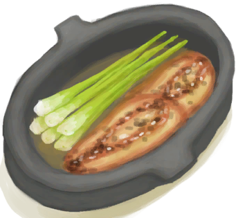

# 鸟类<nobr>厌倦度</nobr>  
> 显示你对鸟肉的厌倦度。数值过高会降低情绪，感到恶心。  
> 如果你吃太多同样的食物，你就会开始对其厌倦。这将降低你的<b>情绪</b>，如果吃得再多甚至会使你<b>恶心</b>。  因此，最好交替食用不同类型的食物。  喝<b>姜茶</b>可以帮助降低厌倦度、安抚你的肠胃。当然，处于非常<b>饥饿</b>的时候你的厌倦度也会降低。  
  

<b>基础值: </b> 0 
  

<b>变化范围: </b> 0 ~ 288 
  

<b>基础变化率: </b> -1 / 每15分钟 
  
  
## 阶段  

<table><tr style="height:2em;"><td style="background-color:#F0F0F0;text-align:center;width:180px;font-size:1.4em;font-weight:bold;vertical-align:middle;">
193 ～ 288

67% ～ 100%
</td><td colspan=2 style="font-size:1.1em;vertical-align:middle;background-color:#F9F9F9;">
<b>

我讨厌吃鸟肉……</b>

</td></tr><tr><td colspan=2><b>影响：</b>[

[情绪](Morale.md)](Morale.md)加成<b>-1.5</b>, [

[恶心](Nausea.md)](Nausea.md)加成<b>+1.25</b></td></tr><tr><td colspan=2></td></tr><tr style="height:2em;"><td style="background-color:#F0F0F0;text-align:center;width:180px;font-size:1.4em;font-weight:bold;vertical-align:middle;">
97 ～ 192

33% ～ 66%
</td><td colspan=2 style="font-size:1.1em;vertical-align:middle;background-color:#F9F9F9;">
<b>

我有点厌倦吃鸟肉了……</b>

</td></tr><tr><td colspan=2><b>影响：</b>[

[情绪](Morale.md)](Morale.md)加成<b>-0.75</b></td></tr><tr><td colspan=2></td></tr></table>
  
  
## 相关卡牌  
[饱食](Satiation.md)  |  [姜效果](GingerEffect.md)  
  
## 加成值影响因素  
<table class="table table-bordered" data-toggle="table"  ><thead style=""><tr ><th  style="text-align:left;vertical-align:top;"  >来源</th><th  style="text-align:left;vertical-align:top;"  >操作</th><th  style="text-align:left;vertical-align:top;"  >值</th></tr></thead><tr ><td  style="text-align:left;vertical-align:top;"  >

[食欲不振](Pk_4_Inappetent.md)</td><td  style="text-align:left;vertical-align:top;"  >特质影响</td><td  style="text-align:left;vertical-align:top;"  >加成+0.5</td></tr><tr ><td  style="text-align:left;vertical-align:top;"  >

[胃口大开](Pk_4_Gluttonous.md)</td><td  style="text-align:left;vertical-align:top;"  >特质影响</td><td  style="text-align:left;vertical-align:top;"  >加成-0.5</td></tr></tbody></table>  
  
  
## 可被以下操作改变  
<table class="table table-bordered" data-toggle="table"  ><thead style=""><tr ><th  style="text-align:left;vertical-align:top;"  >来源</th><th  style="text-align:left;vertical-align:top;"  >操作</th><th  style="text-align:left;vertical-align:top;"  data-sortable="true"  >值</th></tr></thead><tr ><td  style="text-align:left;vertical-align:top;"  >[

[鸟肉](BirdMeat.md)](BirdMeat.md)</td><td  style="text-align:left;vertical-align:top;"  >食用</td><td  style="text-align:left;vertical-align:top;"  >45</td></tr><tr ><td  style="text-align:left;vertical-align:top;"  >[

[烤鸟肉](BirdMeatCooked.md)](BirdMeatCooked.md)</td><td  style="text-align:left;vertical-align:top;"  >食用</td><td  style="text-align:left;vertical-align:top;"  >45</td></tr><tr ><td  style="text-align:left;vertical-align:top;"  >[

[烟熏鸟肉](BirdMeatSmoked.md)](BirdMeatSmoked.md)</td><td  style="text-align:left;vertical-align:top;"  >食用</td><td  style="text-align:left;vertical-align:top;"  >45</td></tr><tr ><td  style="text-align:left;vertical-align:top;"  >[

[蝙蝠尸体](Bat.md)](Bat.md)</td><td  style="text-align:left;vertical-align:top;"  >食用</td><td  style="text-align:left;vertical-align:top;"  >35</td></tr><tr ><td  style="text-align:left;vertical-align:top;"  >[

[小灰山鹑尸体](PartridgeChickDead.md)](PartridgeChickDead.md)</td><td  style="text-align:left;vertical-align:top;"  >食用</td><td  style="text-align:left;vertical-align:top;"  >35</td></tr><tr ><td  style="text-align:left;vertical-align:top;"  >[

[鸡肉三明治](ChickenSandwich.md)](ChickenSandwich.md)</td><td  style="text-align:left;vertical-align:top;"  >食用</td><td  style="text-align:left;vertical-align:top;"  >30</td></tr><tr ><td  style="text-align:left;vertical-align:top;"  >[

[热带烤鸡](IslandChicken.md)](IslandChicken.md)</td><td  style="text-align:left;vertical-align:top;"  >食用</td><td  style="text-align:left;vertical-align:top;"  >30</td></tr></tbody></table>  
  

