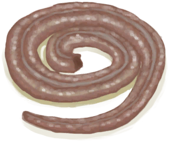

# 爬行类厌倦度  
#### ** 基础值: ** 0   
#### ** 变化范围: ** 0 ~ 288  
#### ** 基础变化率: ** -1 / 每15分钟   
## 阶段  
<table class="table table-bordered"><thead><tr ><th  style="text-align:left;vertical-align:top;" >范围</th><th  style="text-align:left;vertical-align:top;" >名称</th><th  style="text-align:left;vertical-align:top;" >描述</th><th  style="text-align:left;vertical-align:top;" >影响状态</th><th  style="text-align:left;vertical-align:top;" >影响动作</th></tr></thead><tr ><td  style="text-align:left;vertical-align:top;" >193 ～ 288</td><td  style="text-align:left;vertical-align:top;" >

我讨厌吃爬行动物……</td><td  style="text-align:left;vertical-align:top;" ></td><td  style="text-align:left;vertical-align:top;" >[

[情绪](Morale.md)](Morale.md)加成-1.5 [

[恶心](Nausea.md)](Nausea.md)加成+1.25</td><td  style="text-align:left;vertical-align:top;" ></td></tr><tr ><td  style="text-align:left;vertical-align:top;" >97 ～ 192</td><td  style="text-align:left;vertical-align:top;" >

我有点厌倦吃爬行生物了……</td><td  style="text-align:left;vertical-align:top;" ></td><td  style="text-align:left;vertical-align:top;" >[

[情绪](Morale.md)](Morale.md)加成-0.75</td><td  style="text-align:left;vertical-align:top;" ></td></tr></tbody></table>  
  
## 相关卡牌  
[饱食](Satiation.md)  |  [姜效果](GingerEffect.md)  
## 加成值影响因素  
<table class="table table-bordered"><thead><tr ><th  style="text-align:left;vertical-align:top;" >来源</th><th  style="text-align:left;vertical-align:top;" >操作</th><th  style="text-align:left;vertical-align:top;" >值</th></tr></thead><tr ><td  style="text-align:left;vertical-align:top;" >

[胃口大开](Pk_4_Gluttonous.md)</td><td  style="text-align:left;vertical-align:top;" >特质影响</td><td  style="text-align:left;vertical-align:top;" >加成-0.5</td></tr></tbody></table>  
  
## 可被以下操作改变  
<table class="table table-bordered"><thead><tr ><th  style="text-align:left;vertical-align:top;" >来源</th><th  style="text-align:left;vertical-align:top;" >操作</th><th  style="text-align:left;vertical-align:top;" >值</th></tr></thead><tr ><td  style="text-align:left;vertical-align:top;" >[

[烤巨蜥肉](MonitorMeatCooked.md)](MonitorMeatCooked.md)</td><td  style="text-align:left;vertical-align:top;" >食用</td><td  style="text-align:left;vertical-align:top;" >45</td></tr><tr ><td  style="text-align:left;vertical-align:top;" >[

[巨蜥肉干](MonitorMeatDried.md)](MonitorMeatDried.md)</td><td  style="text-align:left;vertical-align:top;" >食用</td><td  style="text-align:left;vertical-align:top;" >45</td></tr><tr ><td  style="text-align:left;vertical-align:top;" >[

[腌巨蜥肉](MonitorMeatSalted.md)](MonitorMeatSalted.md)</td><td  style="text-align:left;vertical-align:top;" >食用</td><td  style="text-align:left;vertical-align:top;" >45</td></tr><tr ><td  style="text-align:left;vertical-align:top;" >[

[烟熏巨蜥肉](MonitorMeatSmoked.md)](MonitorMeatSmoked.md)</td><td  style="text-align:left;vertical-align:top;" >食用</td><td  style="text-align:left;vertical-align:top;" >45</td></tr><tr ><td  style="text-align:left;vertical-align:top;" >[

[辣炒巨蜥肉](LizardFry.md)](LizardFry.md)</td><td  style="text-align:left;vertical-align:top;" >食用</td><td  style="text-align:left;vertical-align:top;" >40</td></tr><tr ><td  style="text-align:left;vertical-align:top;" >[

[蜥蜴](Lizard.md)](Lizard.md)</td><td  style="text-align:left;vertical-align:top;" >食用</td><td  style="text-align:left;vertical-align:top;" >35</td></tr><tr ><td  style="text-align:left;vertical-align:top;" >[

[烤蜥蜴](LizardCooked.md)](LizardCooked.md)</td><td  style="text-align:left;vertical-align:top;" >食用</td><td  style="text-align:left;vertical-align:top;" >35</td></tr><tr ><td  style="text-align:left;vertical-align:top;" >[

[巨蜥肉](MonitorMeat.md)](MonitorMeat.md)</td><td  style="text-align:left;vertical-align:top;" >食用</td><td  style="text-align:left;vertical-align:top;" >30</td></tr><tr ><td  style="text-align:left;vertical-align:top;" >[

[腌制中的巨蜥肉](MonitorMeatSaltedDrying.md)](MonitorMeatSaltedDrying.md)</td><td  style="text-align:left;vertical-align:top;" >食用</td><td  style="text-align:left;vertical-align:top;" >30</td></tr><tr ><td  style="text-align:left;vertical-align:top;" >[

[烤蛇肉](SnakeCooked.md)](SnakeCooked.md)</td><td  style="text-align:left;vertical-align:top;" >食用</td><td  style="text-align:left;vertical-align:top;" >30</td></tr><tr ><td  style="text-align:left;vertical-align:top;" >[

[剥皮的蛇](SnakeSkinned.md)](SnakeSkinned.md)</td><td  style="text-align:left;vertical-align:top;" >食用</td><td  style="text-align:left;vertical-align:top;" >30</td></tr></tbody></table>  
  

