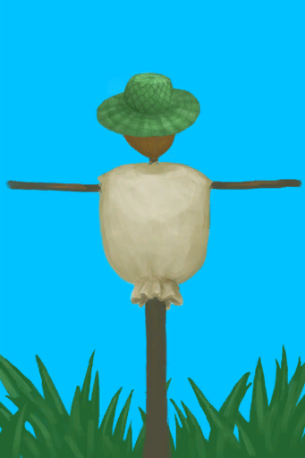
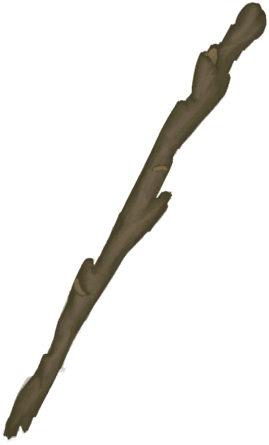
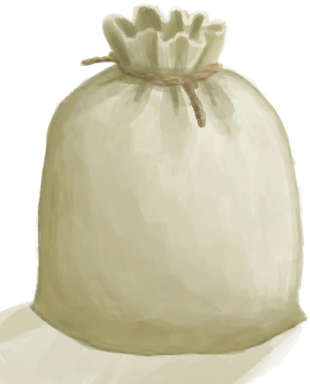
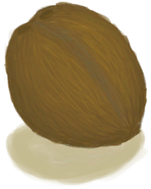
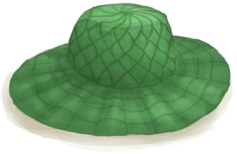

# 稻草人  
> 可以帮忙赶走海鸥。希望如此。  
  
<table class="table table-bordered" data-toggle="table"  data-show-header="false"><thead style="display:none"><tr ><th  style="width:50%;text-align:left;vertical-align:top;"  >title</th><th  style="width:50%;text-align:left;vertical-align:top;"  ></th></tr></thead><tr ><td  style="width:50%;text-align:left;vertical-align:top;"  >** 区域唯一 **  ** 不可删除 **  **可用次数：**2880  ** 效果: ** [海鸥之惧](SeagullFear.md)<b>+3000</b> [MacaqueFear_GameName](MacaqueFear.md)<b>+1000</b></td><td  style="width:50%;text-align:left;vertical-align:top;"  >

<a href="Scarecrow.md" style="color:black">稻草人</a>

</td></tr></tbody></table>  
  
## 获取来源  

蓝图制造

[稻草人(蓝图)](Bp_Scarecrow.md)

  
  
## 动作  

<table><tr><td rowspan="2" style="width:200px;text-align:center;font-size:1.3em;font-weight:bold">

拆除

30分

</td><td></td></tr><tr><td><b>自身：</b>→消失</td></tr><tr><td colspan="2"><b>需求：</b>[

[光亮](Light.md)](Light.md): <b>10-100</b></td></tr><tr><td colspan="2">[

[长木棍](StickLong.md)](StickLong.md)(<b>+2</b>), [

[细线](CordFiber.md)](CordFiber.md)(<b>+1</b>), [

[布袋](Sack.md)](Sack.md)(<b>+1</b>), [

[椰子](Coconut.md)](Coconut.md)(<b>+1</b>), [

[棕榈编织帽](HatWoven.md)](HatWoven.md)(<b>+1</b>)</td></tr></table>
  
  
  
## 可拖入  

<table style="margin-bottom:0px;"><tr><td style="width:40%;text-align:left; background-color:#FEFEFE"><b>拖入：</b>[

[细线](CordFiber.md)](CordFiber.md)</td><td style="width:40%;font-size:1em;font-weight:bold;background-color:#FEFEFE">修理 (30分) </td></tr><tr><td colspan="2"><b>需求：</b>[

[光亮](Light.md)](Light.md): <b>10-100</b></td></tr><tr style="background-color:#FFFFFF"><td style=""><b>使用物：</b>→消失</td><td style=""><b>自身：</b>使用次数  <b>+500(17.36%)</b></td></tr></table>
  
  
## 属性   

<table style="margin-bottom:0px;"><tr><td style="width:30%;text-align:left; background-color:#FEFEFE;font-size:1.3em;font-weight:bold;">使用次数</td><td style="font-size:1em;background-color:#FEFEFE">初始：2880 , 最大：2880 每15分钟-1 , 最多需要：30天</td></tr><tr style="background-color:#FFFFFF"><td colspan=2>** 到达0时： ** 自身: →消失 [

[长木棍](StickLong.md)](StickLong.md)(<b>+2</b>), [

[细线](CordFiber.md)](CordFiber.md)(<b>+1</b>), [

[布袋](Sack.md)](Sack.md)(<b>+1</b>), [

[椰子](Coconut.md)](Coconut.md)(<b>+1</b>), [

[棕榈编织帽](HatWoven.md)](HatWoven.md)(<b>+1</b>)</td></tr></table>
  

