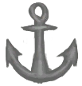

# 航海技术  
> 如果你不习惯于航海，那么海上的风浪越大，你就越会觉得恶心。 幸运的是，随着你在海上度过越来越多的时间，你会逐渐习惯海上航行，进而不会再感到恶心。  
  

<b>基础值: </b> 0 
  

<b>变化范围: </b> 0 ~ 128 
  

<b>基础变化率: </b> -0.15 / 每15分钟 
  
## 阶段  

<table><tr style="height:2em;"><td style="background-color:#F0F0F0;text-align:center;width:180px;font-size:1.4em;font-weight:bold;vertical-align:middle;">
0 ～ 25

0% ～ 19%
</td><td colspan=2 style="font-size:1.1em;vertical-align:middle;background-color:#F9F9F9;">
<b>

毫无抵抗力</b>

</td></tr><tr><td colspan=2><b>影响：</b>[

[晕船](SeaSickness.md)](SeaSickness.md)</td></tr><tr><td colspan=2></td></tr><tr style="height:2em;"><td style="background-color:#F0F0F0;text-align:center;width:180px;font-size:1.4em;font-weight:bold;vertical-align:middle;">
26 ～ 50

20% ～ 39%
</td><td colspan=2 style="font-size:1.1em;vertical-align:middle;background-color:#F9F9F9;">
<b>

轻度抗性</b>

</td></tr><tr><td colspan=2><b>影响：</b>[

[晕船](SeaSickness.md)](SeaSickness.md)加成<b>-0.5</b></td></tr><tr><td colspan=2></td></tr><tr style="height:2em;"><td style="background-color:#F0F0F0;text-align:center;width:180px;font-size:1.4em;font-weight:bold;vertical-align:middle;">
51 ～ 75

39% ～ 58%
</td><td colspan=2 style="font-size:1.1em;vertical-align:middle;background-color:#F9F9F9;">
<b>

中度抗性</b>

</td></tr><tr><td colspan=2><b>影响：</b>[

[晕船](SeaSickness.md)](SeaSickness.md)加成<b>-1</b></td></tr><tr><td colspan=2></td></tr><tr style="height:2em;"><td style="background-color:#F0F0F0;text-align:center;width:180px;font-size:1.4em;font-weight:bold;vertical-align:middle;">
76 ～ 100

59% ～ 78%
</td><td colspan=2 style="font-size:1.1em;vertical-align:middle;background-color:#F9F9F9;">
<b>

高度抗性</b>

</td></tr><tr><td colspan=2><b>影响：</b>[

[晕船](SeaSickness.md)](SeaSickness.md)加成<b>-2</b></td></tr><tr><td colspan=2></td></tr><tr style="height:2em;"><td style="background-color:#F0F0F0;text-align:center;width:180px;font-size:1.4em;font-weight:bold;vertical-align:middle;">
101 ～ 128

78% ～ 100%
</td><td colspan=2 style="font-size:1.1em;vertical-align:middle;background-color:#F9F9F9;">
<b>

重度抗性</b>

</td></tr><tr><td colspan=2><b>影响：</b>[

[晕船](SeaSickness.md)](SeaSickness.md)加成<b>-4</b></td></tr><tr><td colspan=2></td></tr></table>
  
## 相关卡牌  
[晕船](SeaSickness.md)  
## 可被以下操作改变  
<table class="table table-bordered" data-toggle="table"  ><thead style=""><tr ><th  style="text-align:left;vertical-align:top;"  >来源</th><th  style="text-align:left;vertical-align:top;"  >操作</th><th  style="text-align:left;vertical-align:top;"  data-sortable="true"  >值</th></tr></thead><tr ><td  style="text-align:left;vertical-align:top;"  >

[水手](Pk_4_Sailor.md)</td><td  style="text-align:left;vertical-align:top;"  >特质影响</td><td  style="text-align:left;vertical-align:top;"  >128 ~ 0</td></tr></tbody></table>  
  

