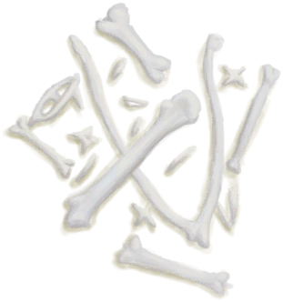

# 海鸥遗骸  
> 这只海鸥已经死了一段时间了。  
   
>   
  
<table class="table table-bordered"><tbody><tr ><td  style="width:80%;text-align:left;vertical-align:top;" >**重量：**100</td><td  style="width:20%;text-align:left;vertical-align:top;" >

</td></tr></tbody></tbody></table>  
  
## 获取来源  
<table class="table table-bordered"><thead><tr ><th  style="text-align:left;vertical-align:top;" >来源</th><th  style="text-align:left;vertical-align:top;" >操作</th></tr></thead><tr ><td  style="text-align:left;vertical-align:top;" >[

[海鸥尸体](SeagullDead.md)](SeagullDead.md)</td><td  style="text-align:left;vertical-align:top;" >转化</td></tr><tr ><td  style="text-align:left;vertical-align:top;" >[

[鸟岩岛](BirdRock.md)](BirdRock.md)</td><td  style="text-align:left;vertical-align:top;" >探索</td></tr><tr ><td  style="text-align:left;vertical-align:top;" >[

[荒芜沙滩](DesolateBeach.md)](DesolateBeach.md)</td><td  style="text-align:left;vertical-align:top;" >探索</td></tr><tr ><td  style="text-align:left;vertical-align:top;" >[

[岩滩](Rocks.md)](Rocks.md)</td><td  style="text-align:left;vertical-align:top;" >探索</td></tr></tbody></table>  
  
## 动作  
<table class="table table-bordered"><thead><tr ><th  style="text-align:left;vertical-align:top;" >动作</th><th  style="text-align:left;vertical-align:top;" >耗时</th><th  style="text-align:left;vertical-align:top;" >条件</th><th  style="text-align:left;vertical-align:top;" >变化</th><th  style="text-align:left;vertical-align:top;" >状态</th></tr></thead><tr ><td  style="text-align:left;vertical-align:top;" >处理 [手部动作(组)](HandAction.md) [制造动作(组)](CraftAction.md)</td><td  style="text-align:left;vertical-align:top;" >15分</td><td  style="text-align:left;vertical-align:top;" >[

[光亮](Light.md)](Light.md): 10-100</td><td  style="text-align:left;vertical-align:top;" >** 自身：** →消失  ** 获得： **   [

[鸟骨](BonesBird.md)](BonesBird.md)(+1)   [

[羽毛](Feathers.md)](Feathers.md)(+1～+3) </td><td  style="text-align:left;vertical-align:top;" ></td></tr></tbody></table>  
  

