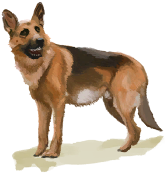

# 海鸥尸体  
> 一只我自己猎杀的新鲜海鸥。需要一把刀才能剖开它。  
   
>   
  
<table class="table table-bordered"><tbody><tr ><td  style="width:80%;text-align:left;vertical-align:top;" >**重量：**150  **标签：**	[“饲料”](tag_Feed.md), [“肉”](tag_Meat.md)</td><td  style="width:20%;text-align:left;vertical-align:top;" >

</td></tr></tbody></tbody></table>  
  
## 获取来源  
<table class="table table-bordered"><thead><tr ><th  style="text-align:left;vertical-align:top;" >来源</th><th  style="text-align:left;vertical-align:top;" >操作</th></tr></thead><tr ><td  style="text-align:left;vertical-align:top;" >[

[落石陷阱](DeadfallTrap.md)](DeadfallTrap.md)</td><td  style="text-align:left;vertical-align:top;" >捕捉猎物</td></tr><tr ><td  style="text-align:left;vertical-align:top;" >[

[套索陷阱](SnareTrap.md)](SnareTrap.md)</td><td  style="text-align:left;vertical-align:top;" >捕捉猎物</td></tr><tr ><td  style="text-align:left;vertical-align:top;" >[

[拿下了！(事件)](Event_SeagullFightSuccess.md)](Event_SeagullFightSuccess.md)</td><td  style="text-align:left;vertical-align:top;" >继续</td></tr><tr ><td  style="text-align:left;vertical-align:top;" >[

[礼物！(事件)](Event_DogFriendGift.md)](Event_DogFriendGift.md)</td><td  style="text-align:left;vertical-align:top;" >看看礼物</td></tr></tbody></table>  
  
## 可拖入  
<table class="table table-bordered"><thead><tr ><th  style="text-align:left;vertical-align:top;" >使用</th><th  style="text-align:left;vertical-align:top;" >动作</th><th  style="text-align:left;vertical-align:top;" >耗时</th><th  style="text-align:left;vertical-align:top;" >条件</th><th  style="text-align:left;vertical-align:top;" >变化</th><th  style="text-align:left;vertical-align:top;" >玩家状态</th></tr></thead><tr ><td  style="text-align:left;vertical-align:top;" >[

[黑曜石刀](KnifeObsidian.md)](KnifeObsidian.md)</td><td  style="text-align:left;vertical-align:top;" >剖开 [手部动作(组)](HandAction.md) [制造动作(组)](CraftAction.md)</td><td  style="text-align:left;vertical-align:top;" >15分</td><td  style="text-align:left;vertical-align:top;" >[

[光亮](Light.md)](Light.md): 10-100</td><td  style="text-align:left;vertical-align:top;" >** 自身: ** →消失  ** 使用物: ** 可用次数  -1  ** 获得: ** ** [Harvest]  **   [

[鸟肉](BirdMeat.md)](BirdMeat.md)(+1)   [

[鸟骨](BonesBird.md)](BonesBird.md)(+1)   [

[羽毛](Feathers.md)](Feathers.md)(+2～+4) </td><td  style="text-align:left;vertical-align:top;" >[

[污垢](Filth.md)](Filth.md)+20</td></tr><tr ><td  style="text-align:left;vertical-align:top;" >[“切割工具”](tag_Cutter.md)</td><td  style="text-align:left;vertical-align:top;" >剖开 [手部动作(组)](HandAction.md) [制造动作(组)](CraftAction.md)</td><td  style="text-align:left;vertical-align:top;" >30分</td><td  style="text-align:left;vertical-align:top;" >[

[光亮](Light.md)](Light.md): 10-100</td><td  style="text-align:left;vertical-align:top;" >** 自身: ** →消失  ** 使用物: ** 可用次数  -1  ** 获得: ** ** [Harvest]  **   [

[鸟肉](BirdMeat.md)](BirdMeat.md)(+1)   [

[鸟骨](BonesBird.md)](BonesBird.md)(+1)   [

[羽毛](Feathers.md)](Feathers.md)(+2～+4) </td><td  style="text-align:left;vertical-align:top;" >[

[污垢](Filth.md)](Filth.md)+20</td></tr></tbody></table>  
  
## 可拖至  

[猪食槽](BoarFeeder.md)

[猪食槽](BoarFeeder.md)

[猪食槽(空)](BoarFeederEmpty.md)

[猪食槽(空)](BoarFeederEmpty.md)

[堆肥箱](CompostBin.md)

[灰山鹑喂食器](PartridgeFeeder.md)

[灰山鹑喂食器(空)](PartridgeFeederEmpty.md)

[中陷阱的猕猴](CageTrapMacaque.md)

[母猪](BoarEnclosureFemale.md)

[母猪](BoarEnclosureFemale.md)

[公猪](BoarEnclosureMale.md)

[公猪](BoarEnclosureMale.md)

[小猪](BoarEnclosurePiglet.md)

[小猪](BoarEnclosurePiglet.md)

[母猪](BoarTiedFemale.md)

[母猪](BoarTiedFemale.md)

[公猪](BoarTiedMale.md)

[公猪](BoarTiedMale.md)

[小猪](BoarTiedPiglet.md)

[小猪](BoarTiedPiglet.md)

[忠犬朋友](DogFriend.md)

[猕猴朋友](MacaqueFriend.md)

[受伤的猕猴](MacaqueWounded.md)

[小灰山鹑](PartridgeChick.md)

[雌灰山鹑](PartridgeFemaleEnclosure.md)

[雌灰山鹑](PartridgeFemaleLive.md)

[雄灰山鹑](PartridgeMaleEnclosure.md)

[雄灰山鹑](PartridgeMaleLive.md)

  
  
## 属性   
<table class="table table-bordered"><thead><tr ><th  style="text-align:left;vertical-align:top;" >属性</th><th  style="text-align:left;vertical-align:top;" >值</th><th  style="text-align:left;vertical-align:top;" >耗时</th><th  style="text-align:left;vertical-align:top;" >变化</th></tr></thead><tr ><td  style="text-align:left;vertical-align:top;" >耐久</td><td  style="text-align:left;vertical-align:top;" >初始：192 最大：192</td><td  style="text-align:left;vertical-align:top;" >每15分钟-1 最多需要：2天</td><td  style="text-align:left;vertical-align:top;" >** 到达0时： **  ** 自身 ** → [

[海鸥遗骸](SeagullCarcass.md)](SeagullCarcass.md)</td></tr></tbody></table>  
  

