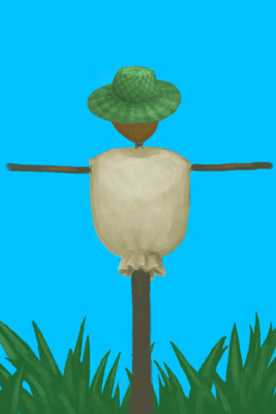

# 海鸥之惧  
#### ** 基础值: ** 1500   
#### ** 变化范围: ** 0 ~ 10000  
#### ** 基础变化率: ** -1 / 每15分钟   
## 阶段  
<table class="table table-bordered"><thead><tr ><th  style="text-align:left;vertical-align:top;" >范围</th><th  style="text-align:left;vertical-align:top;" >名称</th><th  style="text-align:left;vertical-align:top;" >描述</th><th  style="text-align:left;vertical-align:top;" >影响状态</th><th  style="text-align:left;vertical-align:top;" >影响动作</th></tr></thead><tr ><td  style="text-align:left;vertical-align:top;" >0 ～ 500</td><td  style="text-align:left;vertical-align:top;" >舒适的</td><td  style="text-align:left;vertical-align:top;" ></td><td  style="text-align:left;vertical-align:top;" ></td><td  style="text-align:left;vertical-align:top;" ></td></tr><tr ><td  style="text-align:left;vertical-align:top;" >501 ～ 1000</td><td  style="text-align:left;vertical-align:top;" >勇敢</td><td  style="text-align:left;vertical-align:top;" ></td><td  style="text-align:left;vertical-align:top;" ></td><td  style="text-align:left;vertical-align:top;" ></td></tr><tr ><td  style="text-align:left;vertical-align:top;" >1001 ～ 1500</td><td  style="text-align:left;vertical-align:top;" >小心谨慎</td><td  style="text-align:left;vertical-align:top;" ></td><td  style="text-align:left;vertical-align:top;" ></td><td  style="text-align:left;vertical-align:top;" ></td></tr><tr ><td  style="text-align:left;vertical-align:top;" >1501 ～ 2000</td><td  style="text-align:left;vertical-align:top;" >害怕的</td><td  style="text-align:left;vertical-align:top;" ></td><td  style="text-align:left;vertical-align:top;" ></td><td  style="text-align:left;vertical-align:top;" ></td></tr><tr ><td  style="text-align:left;vertical-align:top;" >2001 ～ 10000</td><td  style="text-align:left;vertical-align:top;" >恐惧的</td><td  style="text-align:left;vertical-align:top;" ></td><td  style="text-align:left;vertical-align:top;" ></td><td  style="text-align:left;vertical-align:top;" ></td></tr></tbody></table>  
  
## 可被以下操作改变  
<table class="table table-bordered"><thead><tr ><th  style="text-align:left;vertical-align:top;" >来源</th><th  style="text-align:left;vertical-align:top;" >操作</th><th  style="text-align:left;vertical-align:top;" >值</th></tr></thead><tr ><td  style="text-align:left;vertical-align:top;" >[

[稻草人](Scarecrow.md)](Scarecrow.md)</td><td  style="text-align:left;vertical-align:top;" >被动</td><td  style="text-align:left;vertical-align:top;" >3000</td></tr><tr ><td  style="text-align:left;vertical-align:top;" >[

[忠犬朋友](DogFriend.md)](DogFriend.md)</td><td  style="text-align:left;vertical-align:top;" >被动</td><td  style="text-align:left;vertical-align:top;" >1000</td></tr><tr ><td  style="text-align:left;vertical-align:top;" >[

[拿下了！(事件)](Event_SeagullFightSuccess.md)](Event_SeagullFightSuccess.md)</td><td  style="text-align:left;vertical-align:top;" >继续</td><td  style="text-align:left;vertical-align:top;" >250</td></tr><tr ><td  style="text-align:left;vertical-align:top;" >[

[诱捕笼](CageTrapPlaced.md)](CageTrapPlaced.md)</td><td  style="text-align:left;vertical-align:top;" >陷阱触发了！</td><td  style="text-align:left;vertical-align:top;" >100</td></tr><tr ><td  style="text-align:left;vertical-align:top;" >[

[落石陷阱](DeadfallTrap.md)](DeadfallTrap.md)</td><td  style="text-align:left;vertical-align:top;" >捕捉猎物</td><td  style="text-align:left;vertical-align:top;" >100</td></tr><tr ><td  style="text-align:left;vertical-align:top;" >[

[套索陷阱](SnareTrap.md)](SnareTrap.md)</td><td  style="text-align:left;vertical-align:top;" >捕捉猎物</td><td  style="text-align:left;vertical-align:top;" >100</td></tr><tr ><td  style="text-align:left;vertical-align:top;" >[

[它逃跑了！(事件)](Event_SeagullFightFailure.md)](Event_SeagullFightFailure.md)</td><td  style="text-align:left;vertical-align:top;" >继续</td><td  style="text-align:left;vertical-align:top;" >-50 ~ 50</td></tr><tr ><td  style="text-align:left;vertical-align:top;" >[

[一只海鸥！(事件)](Event_SeagullRaid.md)](Event_SeagullRaid.md)</td><td  style="text-align:left;vertical-align:top;" >不管它</td><td  style="text-align:left;vertical-align:top;" >-100</td></tr><tr ><td  style="text-align:left;vertical-align:top;" >[

[一只海鸥！(事件)](Event_SeagullRaidCrop.md)](Event_SeagullRaidCrop.md)</td><td  style="text-align:left;vertical-align:top;" >不管它</td><td  style="text-align:left;vertical-align:top;" >-100</td></tr></tbody></table>  
  

