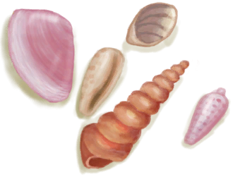

[返回首页](index.md)   |  [查看所有物品](object.md)
# 漂亮贝壳  
> 一些漂亮的贝壳，可以做一些好康的东西。  
  
  属性  |   图片   
 ----  |  ----:   
 **重量：**25  **标签：**	[“贝壳”](tag_Seashell.md), [“美丽的/好看的”](tag_Pretty.md)  |     
  
## 获取来源  
来源  |  操作  
----  |  ----  
[贝壳项链](SeashellNecklace.md)  |  拆解  
[环礁](Atoll.md)  |  探索  
[海湾](Bay.md)  |  随便逛逛  
[沙滩](Beach.md)  |  随便逛逛  
[鸟岩岛](BirdRock.md)  |  探索  
[隐秘港湾](Cove.md)  |  探索  
[荒芜沙滩](DesolateBeach.md)  |  探索  
[岩滩](Rocks.md)  |  探索  
## 可用于蓝图  
- [鱼饵(蓝图)](Bp_FishBait.md)  
- [贝壳项链(蓝图)](Bp_SeashellNecklace.md)  
  
  
## 可用于转化  
转化为  |  容器  
----  |  ----  
[生石灰](Quicklime.md)  |  [窑炉](Kiln.md)  
[生石灰](Quicklime.md)  |  [高级窑炉](KilnAdvanced.md)  
