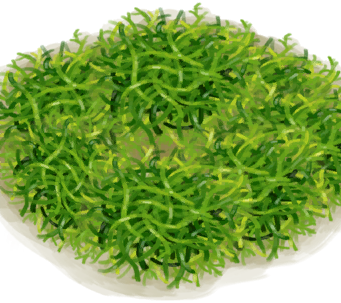

# 海藻  
> 能吃。  
   
>   
  
<table class="table table-bordered"><tbody><tr ><td  style="width:80%;text-align:left;vertical-align:top;" >**重量：**50  **标签：**	[“可烹饪的”](tag_Cookable.md), [“喂食（草食动物）”](tag_FeedHerb.md), [“饲料”](tag_Feed.md)</td><td  style="width:20%;text-align:left;vertical-align:top;" >

</td></tr></tbody></tbody></table>  
  
## 获取来源  
<table class="table table-bordered"><thead><tr ><th  style="text-align:left;vertical-align:top;" >来源</th><th  style="text-align:left;vertical-align:top;" >操作</th></tr></thead><tr ><td  style="text-align:left;vertical-align:top;" >[

[潮汐池(岩滩)](TidePool.md)](TidePool.md)</td><td  style="text-align:left;vertical-align:top;" >拾海</td></tr><tr ><td  style="text-align:left;vertical-align:top;" >[

[海(海湾)](Sea_Bay.md)](Sea_Bay.md)</td><td  style="text-align:left;vertical-align:top;" >潜水</td></tr><tr ><td  style="text-align:left;vertical-align:top;" >[

[海(荒芜沙滩)](Sea_DesolateBeach.md)](Sea_DesolateBeach.md)</td><td  style="text-align:left;vertical-align:top;" >潜水</td></tr><tr ><td  style="text-align:left;vertical-align:top;" >[

[海(红树林)](Sea_Mangroves.md)](Sea_Mangroves.md)</td><td  style="text-align:left;vertical-align:top;" >潜水</td></tr></tbody></table>  
  
## 动作  
<table class="table table-bordered"><thead><tr ><th  style="text-align:left;vertical-align:top;" >动作</th><th  style="text-align:left;vertical-align:top;" >耗时</th><th  style="text-align:left;vertical-align:top;" >条件</th><th  style="text-align:left;vertical-align:top;" >变化</th><th  style="text-align:left;vertical-align:top;" >状态</th></tr></thead><tr ><td  style="text-align:left;vertical-align:top;" >食用 [食用蔬菜类动作(组)](VegetarianAction.md) [进食动作(组)](EatingAction.md)</td><td  style="text-align:left;vertical-align:top;" >15分</td><td  style="text-align:left;vertical-align:top;" ></td><td  style="text-align:left;vertical-align:top;" >** 自身：** →消失</td><td  style="text-align:left;vertical-align:top;" >[

[饱食](Satiation.md)](Satiation.md)+15 [

[胃](Stomach.md)](Stomach.md)+2 [

[水分](Hydration.md)](Hydration.md)+5 [

[蔬菜<nobr>厌倦度</nobr>](SaturationVegetables.md)](SaturationVegetables.md)+30</td></tr></tbody></table>  
  
## 可拖至  

[人鱼巢](MermaidNest.md)

[猪食槽](BoarFeeder.md)

[猪食槽(空)](BoarFeederEmpty.md)

[堆肥箱](CompostBin.md)

[羊食槽](GoatFeeder.md)

[羊食槽(空)](GoatFeederEmpty.md)

[灰山鹑喂食器](PartridgeFeeder.md)

[灰山鹑喂食器(空)](PartridgeFeederEmpty.md)

[中陷阱的猕猴](CageTrapMacaque.md)

[母猪](BoarEnclosureFemale.md)

[公猪](BoarEnclosureMale.md)

[小猪](BoarEnclosurePiglet.md)

[母猪](BoarTiedFemale.md)

[公猪](BoarTiedMale.md)

[小猪](BoarTiedPiglet.md)

[母山羊](GoatEnclosureFemale.md)

[小羊](GoatEnclosureKid.md)

[哺乳期山羊](GoatEnclosureLactating.md)

[公山羊](GoatEnclosureMale.md)

[母山羊](GoatTiedFemale.md)

[哺乳期山羊](GoatTiedFemaleLactating.md)

[小羊](GoatTiedKid.md)

[公山羊](GoatTiedMale.md)

[猕猴朋友](MacaqueFriend.md)

[受伤的猕猴](MacaqueWounded.md)

[小灰山鹑](PartridgeChick.md)

[雌灰山鹑](PartridgeFemaleEnclosure.md)

[雌灰山鹑](PartridgeFemaleLive.md)

[雄灰山鹑](PartridgeMaleEnclosure.md)

[雄灰山鹑](PartridgeMaleLive.md)

  
  
## 可用于蓝图  

[

[人鱼巢(蓝图)](Bp_MermaidNest.md)](Bp_MermaidNest.md)

[

[骨头汤(蓝图)](Bp_BoneBroth.md)](Bp_BoneBroth.md)

[

[鸡肉三明治(蓝图)](Bp_ChickenSandwich.md)](Bp_ChickenSandwich.md)

[

[椰子鱼(蓝图)](Bp_CoconutFish.md)](Bp_CoconutFish.md)

[

[鱼肉煎蛋饼(蓝图)](Bp_FishOmelette.md)](Bp_FishOmelette.md)

[

[鱼肉塔可(蓝图)](Bp_FishTaco.md)](Bp_FishTaco.md)

[

[炒菇球(蓝图)](Bp_FriedPuffballs.md)](Bp_FriedPuffballs.md)

[

[炖羊肉(蓝图)](Bp_GoatStew.md)](Bp_GoatStew.md)

[

[热带烤鸡(蓝图)](Bp_IslandChicken.md)](Bp_IslandChicken.md)

[

[丛林沙拉(蓝图)](Bp_JungleSalad.md)](Bp_JungleSalad.md)

[

[海鲜杂烩(蓝图)](Bp_SeafoodCup.md)](Bp_SeafoodCup.md)

[

[寿司(蓝图)](Bp_Sushi.md)](Bp_Sushi.md)

  
  
  
## 属性   
<table class="table table-bordered"><thead><tr ><th  style="text-align:left;vertical-align:top;" >属性</th><th  style="text-align:left;vertical-align:top;" >值</th><th  style="text-align:left;vertical-align:top;" >耗时</th><th  style="text-align:left;vertical-align:top;" >变化</th></tr></thead><tr ><td  style="text-align:left;vertical-align:top;" >耐久</td><td  style="text-align:left;vertical-align:top;" >初始：192</td><td  style="text-align:left;vertical-align:top;" >每15分钟-1 最多需要：2天</td><td  style="text-align:left;vertical-align:top;" >** 到达0时： **  ** 自身 ** → [

[腐烂物](RottenRemains.md)](RottenRemains.md)</td></tr></tbody></table>  
  

