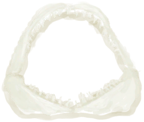

# 鲨鱼下颚  
> 可以用来制作成霸气的装饰物。  
  
<table class="table table-bordered table6963" data-toggle="table"  data-show-header="false"><thead style="display:none"><tr ><th  style="width:50%;"  >title</th><th  style="width:50%;"  ></th></tr></thead><tr ><td  style="width:50%;"  >**重量：**100</td><td  style="width:50%;"  >

<a href="SharkJaws.md" style="color:black">鲨鱼下颚</a>

如果你够倒霉的话，这种大鱼可能会袭击你。它只会出现在海湾和木筏航行中。 比起普通的鱼类，它的肉更有营养，也同样可以被熏制。此外，它的颌骨也是不错的装饰品。</td></tr></tbody></table>  
  
## 获取来源  

拆解

[鲨鱼头饰](SharkHeadpiece.md)

** 使用**[黑曜石刀](KnifeObsidian.md)切割

[鲨鱼尸体](SharkCarcass.md)

** 使用**[“切割工具”](tag_Cutter.md)切割

[鲨鱼尸体](SharkCarcass.md)

  
  
## 可用于蓝图  

<a href="Bp_SharkHeadpiece.md" style="color:black">鲨鱼头饰</a>

  
  
  

