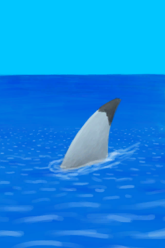
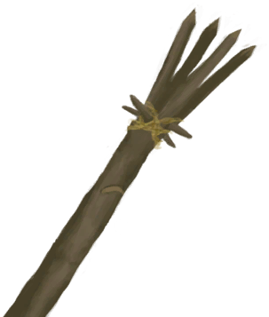

# 鲨鱼  
> 一条鲨鱼好像在紧紧地跟着我。也许我该暂时远离水体。  
  
<table class="table table-bordered table0484" data-toggle="table"  data-show-header="false"><thead style="display:none"><tr ><th  style="width:50%;"  >title</th><th  style="width:50%;"  ></th></tr></thead><tr ><td  style="width:50%;"  >**可用次数：**1  ** 效果: ** [

[不适](Discomfort.md)](Discomfort.md)<b>+500</b></td><td  style="width:50%;"  >

<a href="SharkVisitor.md" style="color:black">鲨鱼</a>

如果你够倒霉的话，这种大鱼可能会袭击你。它只会出现在海湾和木筏航行中。 比起普通的鱼类，它的肉更有营养，也同样可以被熏制。此外，它的颌骨也是不错的装饰品。</td></tr></tbody></table>  
  
## 获取来源  

继续

[一条鲨鱼！(事件)](Event_Raft_SharkVisitor.md)

  
  
## 动作  

<table><tr><td rowspan="2" style="width:200px;text-align:center;font-size:1.3em;font-weight:bold">

用长矛攻击！

30分

</td><td></td></tr><tr><td><b>自身：</b>→消失</td></tr><tr><td colspan="2"><b>需求：</b>[“一级矛”](tag_Spear.md)存在于手中/身上(部分)</td></tr><tr><td colspan="2"><b>相关卡牌变化：</b>[“一级矛”](tag_Spear.md)使用次数  <b>-30～-5</b>, [盾牌](Shield.md)可用次数  <b>-15～-5</b></td></tr><tr><td colspan="2"><b>状态变化：</b>[

[矛战(技能)](Skill_SpearFighting.md)](Skill_SpearFighting.md)<b>+1</b></td></tr><tr><td colspan="2">

<table style="margin-bottom:3px;"><tr><td rowspan=2 style="text-align:center" width="80px">
基础权重

10
</td><td style="font-size:0.6em;line-height:0.6em;font-weight:bold">Success</td></tr><tr><td>[

[鲨鱼死了！(事件)](Event_SharkFightSuccess.md)](Event_SharkFightSuccess.md)(<b>+1</b>)</td></tr><tr><td colspan=2><li>[

[叉鱼(技能)](Skill_SpearFishing.md)](Skill_SpearFishing.md)为<b>0～150</b>时权重限定为<b>+0～+150</b></li><li>[

[矛战(技能)](Skill_SpearFighting.md)](Skill_SpearFighting.md)为<b>0～150</b>时权重限定为<b>+0～+50</b></li><li>[攀爬动作受限](ModifierClimb.md)为<b>0～3</b>时权重限定为<b>+0～-125</b></li>以下取最高1个：<li>[

[燧石长矛](SpearFlint.md)](SpearFlint.md)存在于*手中/身上*，权重<b>+5</b>,</li><li>[

[铜长矛](SpearCopper.md)](SpearCopper.md)存在于*手中/身上*，权重<b>+10</b>,</li><li>[

[黑曜石长矛](SpearObsidian.md)](SpearObsidian.md)存在于*手中/身上*，权重<b>+13</b>,</li><li>[

[鱼镖](HarpoonBone.md)](HarpoonBone.md)存在于*手中/身上*，权重<b>+25</b>,</li></td></tr></table>

<table style="margin-bottom:3px;"><tr><td rowspan=2 style="text-align:center" width="80px">
基础权重

20
</td><td style="font-size:0.6em;line-height:0.6em;font-weight:bold">Minor Success</td></tr><tr><td>[

[我拿下它了，但我受伤了。(事件)](Event_SharkFightMixedSuccess.md)](Event_SharkFightMixedSuccess.md)(<b>+1</b>)</td></tr><tr><td colspan=2><li>[

[叉鱼(技能)](Skill_SpearFishing.md)](Skill_SpearFishing.md)为<b>0～150</b>时权重限定为<b>+0～+150</b></li><li>[

[矛战(技能)](Skill_SpearFighting.md)](Skill_SpearFighting.md)为<b>0～150</b>时权重限定为<b>+0～+25</b></li><li>[

[游泳(技能)](Skill_Swimming.md)](Skill_Swimming.md)为<b>0～150</b>时权重限定为<b>+0～-25</b></li><li>[攀爬动作受限](ModifierClimb.md)为<b>0～3</b>时权重限定为<b>+0～-60</b></li><li>[

[腿部防护](LegProtection.md)](LegProtection.md)为<b>1～10</b>时权重<b>-1～-15</b></li>以下取最高1个：<li>[

[燧石长矛](SpearFlint.md)](SpearFlint.md)存在于*手中/身上*，权重<b>+5</b>,</li><li>[

[铜长矛](SpearCopper.md)](SpearCopper.md)存在于*手中/身上*，权重<b>+10</b>,</li><li>[

[黑曜石长矛](SpearObsidian.md)](SpearObsidian.md)存在于*手中/身上*，权重<b>+13</b>,</li><li>[

[鱼镖](HarpoonBone.md)](HarpoonBone.md)存在于*手中/身上*，权重<b>+25</b>,</li></td></tr></table>

<table style="margin-bottom:3px;"><tr><td rowspan=2 style="text-align:center" width="80px">
基础权重

30
</td><td style="font-size:0.6em;line-height:0.6em;font-weight:bold">Failure</td></tr><tr><td>[

[它逃跑了！(事件)](Event_SharkFightFailure.md)](Event_SharkFightFailure.md)(<b>+1</b>)</td></tr></table>

</td></tr></table>
  
  
  
## 属性   

<table style="margin-bottom:0px;"><tr><td style="width:30%;text-align:left; background-color:#FEFEFE;font-size:1.3em;font-weight:bold;">次数</td><td style="font-size:1em;background-color:#FEFEFE">初始：96 , 最大：96 每15分钟-1 , 最多需要：1天</td></tr><tr style="background-color:#FFFFFF"><td colspan=2>** 到达0时： ** 

<table style="margin-bottom:3px;"><tr><td rowspan=2 style="text-align:center" width="80px">
基础权重

50
</td><td style="font-size:0.6em;line-height:0.6em;font-weight:bold">stays</td></tr><tr><td></td></tr></table>

<table style="margin-bottom:3px;"><tr><td rowspan=2 style="text-align:center" width="80px">
基础权重

50
</td><td style="font-size:0.6em;line-height:0.6em;font-weight:bold">leaves</td></tr><tr><td></td></tr></table>

</td></tr></table>
  

<table style="margin-bottom:0px;"><tr><td style="width:30%;text-align:left; background-color:#FEFEFE;font-size:1.3em;font-weight:bold;">离开</td><td style="font-size:1em;background-color:#FEFEFE">初始：1 , 最大：1 -</td></tr><tr style="background-color:#FFFFFF"><td colspan=2>** 到达0时： ** 自身: →消失</td></tr></table>
  

