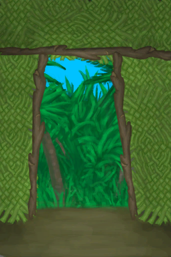

# 离开  
> 离开棚屋  
   
> 一个小而廉价的棚屋，由<b>长木棍和棕榈编织片</b>搭建来的，可以帮助你抵御<b>风暴，雨和日晒</b>。  它没有像泥屋或石屋那么多的存储空间和抵御风暴的能力，但可以在岛屿较远的部分作为一个快速基地或一个前哨站。  棚屋可以升级改造，包括存储扩展，门和其他什么的。 屋顶一旦受损，就应该修理，不然有倒塌的危险。  
  
  离开  |   图片   
 ----  |  ----:   
 ** 区域唯一 **  **环境：**[棚屋(环境)](Env_Shed.md)  |     
  
## 获取来源  
来源  |  操作  
----  |  ----  
[棚屋](ShedEntrance.md)  |  进入  
## 动作  
动作  |  耗时  |  条件  |  变化  |  状态  
----  |  ----  |  ----  |  ----  |  ----  
离开   |  -  |    |    |    
