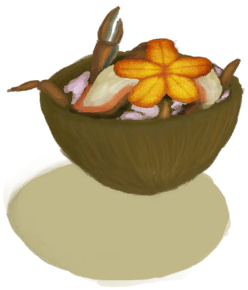

# “食用海鲜动作(组)”  

食用 [

[虫子](Bugs.md)](Bugs.md)

食用 [

[海螺肉](ConchMeat.md)](ConchMeat.md)

食用 [

[烤海螺肉](ConchMeatCooked.md)](ConchMeatCooked.md)

食用 [

[松软的海螺肉](ConchMeatSoft.md)](ConchMeatSoft.md)

食用 [

[松软的烤海螺肉](ConchMeatSoftCooked.md)](ConchMeatSoftCooked.md)

食用 [

[螃蟹](Crab.md)](Crab.md)

食用 [

[烤螃蟹](CrabCooked.md)](CrabCooked.md)

食用 [

[海鲜杂烩](SeafoodCup.md)](SeafoodCup.md)

食用 [

[牡蛎肉](OysterMeat.md)](OysterMeat.md)

食用 [

[黄油焗牡蛎](OysterMeatBaked.md)](OysterMeatBaked.md)

食用 [

[烤牡蛎肉](OysterMeatCooked.md)](OysterMeatCooked.md)

食用 [

[虾](Prawns.md)](Prawns.md)

食用 [

[烤虾](PrawnsCooked.md)](PrawnsCooked.md)

食用 [

[海胆肉](UrchinMeat.md)](UrchinMeat.md)

食用 [

[烤海胆](UrchinMeatCooked.md)](UrchinMeatCooked.md)

  
  

