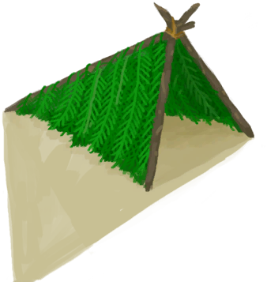
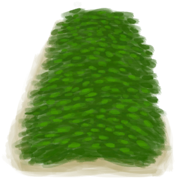
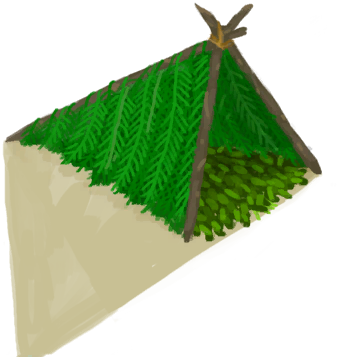

# 窝棚  
> 比睡在地上更加舒服。提供了轻微的雨水防护。 应该确保通过添加新叶子来保持良好的状态。  
  
<table class="table table-bordered table6971" data-toggle="table"  data-show-header="false"><thead style="display:none"><tr ><th  style="width:50%;"  >title</th><th  style="width:50%;"  ></th></tr></thead><tr ><td  style="width:50%;"  >** 区域唯一 **  ** 不可删除 **  **可用次数：**576  ** 效果: ** [

[雨水防护](RainProtection.md)](RainProtection.md)<b>+2</b> [

[保温](InsulationCold.md)](InsulationCold.md)<b>+5</b> [

[绝热](InsulationHeat.md)](InsulationHeat.md)<b>+5</b> [

[阳光防护](SunProtection.md)](SunProtection.md)<b>+1</b></td><td  style="width:50%;"  >

<a href="Shelter.md" style="color:black">窝棚</a>

这张床相对廉价，虽然不舒服，但总比睡在地上好。  它还提供轻微的<b>避雨和遮阳</b>，也可以与<b>叶床</b>组合，效果更好。</td></tr></tbody></table>  
  
## 获取来源  

转化

[有遮蔽的叶床](ShelteredLeafBed.md)

蓝图制造

[窝棚(蓝图)](Bp_Shelter.md)

  
  
## 动作  

<table><tr><td rowspan="2" style="width:200px;text-align:center;font-size:1.3em;font-weight:bold">

小憩

4小时

</td><td>[“休息动作(组)”](SleepAction.md)</td></tr><tr><td></td></tr><tr><td colspan="2"><b>需求：</b>**不能处于以下状态**：, [睡眠中断](SleepInterrupt.md): <b>1-1</b>, [

[水分](Hydration.md)](Hydration.md): <b>0-30</b>, [

[过热](Hyperthermia.md)](Hyperthermia.md): <b>51-200</b>, [

[失温](Hypothermia.md)](Hypothermia.md): <b>26-100</b>, [

[血压](Blood.md)](Blood.md): <b>0-30</b>, [

[恶心](Nausea.md)](Nausea.md): <b>20-24</b>, [

[体重](Weight.md)](Weight.md): <b>0-74</b></td></tr><tr><td colspan="2"><b>状态变化：</b>[睡眠中断](SleepInterrupt.md)<b>-1</b>, [睡眠钟](SleepClock.md)<b>+15</b>, [睡眠风险](SleepRisk.md)<b>+15</b>, [

[压力](Stress.md)](Stress.md)<b>-1</b> (每15分钟), [

[世界观](Structure.md)](Structure.md)<b>+1</b> (每15分钟), [

[情绪](Morale.md)](Morale.md)<b>+1.25</b> (每15分钟), [

[恶心](Nausea.md)](Nausea.md)<b>-1.5</b> (每15分钟), [

[清醒度](Wakefulness.md)](Wakefulness.md)<b>+6</b> (每15分钟), [

[背痛](BackPain.md)](BackPain.md)<b>+5</b> (每15分钟)</td></tr></table>
  

<table><tr><td rowspan="2" style="width:200px;text-align:center;font-size:1.3em;font-weight:bold">

睡觉

8小时

</td><td>[“休息动作(组)”](SleepAction.md)</td></tr><tr><td></td></tr><tr><td colspan="2"><b>需求：</b>**不能处于以下状态**：, [睡眠中断](SleepInterrupt.md): <b>1-1</b>, [

[水分](Hydration.md)](Hydration.md): <b>0-30</b>, [

[过热](Hyperthermia.md)](Hyperthermia.md): <b>51-200</b>, [

[失温](Hypothermia.md)](Hypothermia.md): <b>26-100</b>, [

[血压](Blood.md)](Blood.md): <b>0-30</b>, [

[恶心](Nausea.md)](Nausea.md): <b>20-24</b>, [

[体重](Weight.md)](Weight.md): <b>0-74</b></td></tr><tr><td colspan="2"><b>状态变化：</b>[睡眠中断](SleepInterrupt.md)<b>-1</b>, [睡眠钟](SleepClock.md)<b>+31</b>, [睡眠风险](SleepRisk.md)<b>+31</b>, [

[压力](Stress.md)](Stress.md)<b>-1</b> (每15分钟), [

[世界观](Structure.md)](Structure.md)<b>+2</b> (每15分钟), [

[情绪](Morale.md)](Morale.md)<b>+1.25</b> (每15分钟), [

[恶心](Nausea.md)](Nausea.md)<b>-1.5</b> (每15分钟), [

[清醒度](Wakefulness.md)](Wakefulness.md)<b>+6</b> (每15分钟), [

[背痛](BackPain.md)](BackPain.md)<b>+5</b> (每15分钟)</td></tr></table>
  

<table><tr><td rowspan="2" style="width:200px;text-align:center;font-size:1.3em;font-weight:bold">

拆除

30分

</td><td></td></tr><tr><td><b>自身：</b>→消失</td></tr><tr><td colspan="2"><b>需求：</b>[

[光亮](Light.md)](Light.md): <b>10-100</b></td></tr><tr><td colspan="2">[

[长木棍](StickLong.md)](StickLong.md)(<b>+3</b>), [

[细线](CordFiber.md)](CordFiber.md)(<b>+2</b>), [

[棕榈叶](PalmFronds.md)](PalmFronds.md)(<b>+1～+4</b>)</td></tr></table>
  
  
  
## 可拖入  

<table style="margin-bottom:0px;"><tr><td style="width:40%;text-align:left; background-color:#FEFEFE"><b>拖入：</b>[

[棕榈叶](PalmFronds.md)](PalmFronds.md)</td><td style="width:40%;font-size:1em;font-weight:bold;background-color:#FEFEFE">修理窝棚 (30分) </td></tr><tr style="background-color:#FFFFFF"><td style=""><b>使用物：</b>→消失</td><td style=""><b>自身：</b>使用次数  <b>+288(50%)</b></td></tr><tr><td colspan="2"><b>需求：</b>[

[光亮](Light.md)](Light.md): <b>10-100</b></td></tr></table>
  

<table style="margin-bottom:0px;"><tr><td style="width:40%;text-align:left; background-color:#FEFEFE"><b>拖入：</b>[

[叶床](LeafBed.md)](LeafBed.md)</td><td style="width:40%;font-size:1em;font-weight:bold;background-color:#FEFEFE">组合 (30分) </td></tr><tr style="background-color:#FFFFFF"><td style=""><b>使用物：</b>→消失</td><td style=""><b>自身：</b>→ [

[有遮蔽的叶床](ShelteredLeafBed.md)](ShelteredLeafBed.md), 使用次数  <b>+288(50%)</b></td></tr><tr><td colspan="2"><b>需求：</b>[

[光亮](Light.md)](Light.md): <b>10-100</b></td></tr></table>
  
  
## 属性   

<table style="margin-bottom:0px;"><tr><td style="width:30%;text-align:left; background-color:#FEFEFE;font-size:1.3em;font-weight:bold;">使用次数</td><td style="font-size:1em;background-color:#FEFEFE">初始：576 , 最大：576 每15分钟-1 , 最多需要：6天</td></tr><tr style="background-color:#FFFFFF"><td colspan=2>** 到达0时： ** 自身: →消失 [

[长木棍](StickLong.md)](StickLong.md)(<b>+3</b>), [

[细线](CordFiber.md)](CordFiber.md)(<b>+2</b>)</td></tr></table>
  

