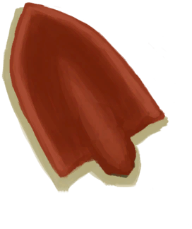

# 铲子头  
> 可被用来制作铲子。  
  
  铲子头  |   图片   
 ----  |  ----:   
 **重量：**100  **标签：**	[“刮具”](tag_Scraper.md), [“锤”](tag_Hammer.md), [“沉重的”](tag_Heavy.md), [“铜制大物件”](tag_CopperBig.md)  |     
  
## 获取来源  
来源  |  操作  
----  |  ----  
[铲头模具](MoldShovel.md) , [熔炉](Forge.md)  |  铲子头  
[铲头模具](MoldShovel.md) , [高级窑炉](KilnAdvanced.md)  |  熔炼铲子头  
[铜铲](ShovelCopper.md)  |  拆解  
## 可拖至  
[铜矿脉(狭窄隧道)](CopperVein.md), [干土堆](DirtPile.md), [火炉(熄灭)](StoveExtinguished.md), [泥堆](MudPile.md), [水槽](WateringTrough.md), [骨头碎片](BoneSplinters.md), [骨头](Bones.md), [木炭](Charcoal.md), [椰子](Coconut.md), [青椰子](CoconutHusked.md), [带孔椰子](CoconutPerforated.md), [腐烂的椰子](CoconutRotten.md), [海螺](Conch.md), [铜制装饰品](CopperDecoration_Mold.md), [干辣椒](ChiliesDried.md), [海螺肉](ConchMeat.md), [姜](Ginger.md), [干姜](GingerDried.md), [茉莉花](JasmineFlowers.md), [卡瓦根](KavaRoot.md), [干燥的卡瓦根](KavaRootDried.md), [柠檬草](LemongrassStalks.md), [蜘蛛兰叶](SpiderLilyLeaves.md), [干燥的蜘蛛兰叶](SpiderLilyLeavesDried.md), [晶洞](Geode.md), [大海螺](GiantConch.md), [煅烧后的砂浆](MortarBurnt.md), [泥砖](MudBrick.md), [硝石晶体](NiterCrystals.md), [牡蛎](Oyster.md), [蛇草](SnakeGrass.md), [煅烧后的石头](StoneBurnt.md), [煅烧后的大石块](StoneHeavyBurnt.md), [热带杏仁](TropicalAlmonds.md), [海胆](Urchin.md), [硫磺喷口(酸湖)](VentBrimstone.md), [韦斯顿](Weston.md), [狭窄通道(洞穴底层)](CrystalChamberEntranceClosed.md), [狭窄通道(潮湿洞穴)](DarkCaveCaveEntranceClosed.md), [狭窄通道(洞穴中层)](DarkChamberCaveEntranceClosed.md), [狭窄通道(晶石洞穴)](FloodedChamberEntranceClosed.md), [狭窄通道(隧道)](HighChamberEntranceClosed.md), [滤水器](WaterFilter.md)  
## 可用于蓝图  
- [铜铲(蓝图)](Bp_CopperShovel.md)  
  
  
## 可用于转化  
转化为  |  容器  
----  |  ----  
[铜](Copper.md)  |  [熔炉](Forge.md)  
[铜](Copper.md)  |  [高级窑炉](KilnAdvanced.md)  
