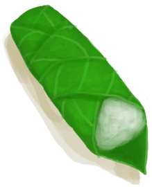
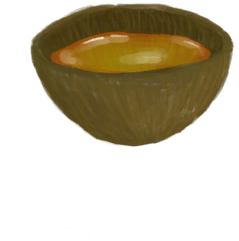

# 烹饪(技能)  
> 显示你烹饪的熟练程度。提升烹饪水平可以解锁新的食谱。  
> 提升烹饪技能可以领悟新的<b>烹饪食谱</b>。  可以通过制作<b>菜品</b>或者<b>烤熟</b>食物来提升该技能。  
  

<b>基础值: </b> 0 
  

<b>变化范围: </b> 0 ~ 150 
  

<b>基础变化率: </b> 无 
  

<b>衰减: </b>相同来源3小时内衰减80%，叠加2次 
  
## 可被以下操作改变  
<table class="table table-bordered table2242" data-toggle="table"  ><thead style=""><tr ><th  style=""  >来源</th><th  style=""  >操作</th><th  style=""  data-sortable="true"  >值</th></tr></thead><tr ><td  style=""  >[

[骨头汤(蓝图)](Bp_BoneBroth.md)](Bp_BoneBroth.md)</td><td  style=""  >蓝图制造</td><td  style=""  >0.5</td></tr><tr ><td  style=""  >[

[黄油(蓝图)](Bp_Butter.md)](Bp_Butter.md)</td><td  style=""  >蓝图制造</td><td  style=""  >0.5</td></tr><tr ><td  style=""  >[

[黄油焗牡蛎(蓝图)](Bp_ButterBakedOysters.md)](Bp_ButterBakedOysters.md)</td><td  style=""  >蓝图制造</td><td  style=""  >0.5</td></tr><tr ><td  style=""  >[

[姜糖(蓝图)](Bp_CandiedGinger.md)](Bp_CandiedGinger.md)</td><td  style=""  >蓝图制造</td><td  style=""  >0.5</td></tr><tr ><td  style=""  >[

[奶酪(蓝图)](Bp_Cheese.md)](Bp_Cheese.md)</td><td  style=""  >蓝图制造</td><td  style=""  >0.5</td></tr><tr ><td  style=""  >[

[鸡肉三明治(蓝图)](Bp_ChickenSandwich.md)](Bp_ChickenSandwich.md)</td><td  style=""  >蓝图制造</td><td  style=""  >0.5</td></tr><tr ><td  style=""  >[

[椰子鱼(蓝图)](Bp_CoconutFish.md)](Bp_CoconutFish.md)</td><td  style=""  >蓝图制造</td><td  style=""  >0.5</td></tr><tr ><td  style=""  >[

[醉蟹(蓝图)](Bp_DrunkenCrab.md)](Bp_DrunkenCrab.md)</td><td  style=""  >蓝图制造</td><td  style=""  >0.5</td></tr><tr ><td  style=""  >[

[蛋炒饭(蓝图)](Bp_EggFriedRice.md)](Bp_EggFriedRice.md)</td><td  style=""  >蓝图制造</td><td  style=""  >0.5</td></tr><tr ><td  style=""  >[

[炸鱼薯条(蓝图)](Bp_FishNChips.md)](Bp_FishNChips.md)</td><td  style=""  >蓝图制造</td><td  style=""  >0.5</td></tr><tr ><td  style=""  >[

[鱼肉煎蛋饼(蓝图)](Bp_FishOmelette.md)](Bp_FishOmelette.md)</td><td  style=""  >蓝图制造</td><td  style=""  >0.5</td></tr><tr ><td  style=""  >[

[鱼肉塔可(蓝图)](Bp_FishTaco.md)](Bp_FishTaco.md)</td><td  style=""  >蓝图制造</td><td  style=""  >0.5</td></tr><tr ><td  style=""  >[

[炸香蕉(蓝图)](Bp_FriedBananas.md)](Bp_FriedBananas.md)</td><td  style=""  >蓝图制造</td><td  style=""  >0.5</td></tr><tr ><td  style=""  >[

[炒菇球(蓝图)](Bp_FriedPuffballs.md)](Bp_FriedPuffballs.md)</td><td  style=""  >蓝图制造</td><td  style=""  >0.5</td></tr><tr ><td  style=""  >[

[炖羊肉(蓝图)](Bp_GoatStew.md)](Bp_GoatStew.md)</td><td  style=""  >蓝图制造</td><td  style=""  >0.5</td></tr><tr ><td  style=""  >[

[肉食盛宴(蓝图)](Bp_HeartyFeast.md)](Bp_HeartyFeast.md)</td><td  style=""  >蓝图制造</td><td  style=""  >0.5</td></tr><tr ><td  style=""  >[

[蜜糖(蓝图)](Bp_HoneyCandy.md)](Bp_HoneyCandy.md)</td><td  style=""  >蓝图制造</td><td  style=""  >0.5</td></tr><tr ><td  style=""  >[

[蜜汁火腿(蓝图)](Bp_HoneyGlazedPork.md)](Bp_HoneyGlazedPork.md)</td><td  style=""  >蓝图制造</td><td  style=""  >0.5</td></tr><tr ><td  style=""  >[

[热带烤鸡(蓝图)](Bp_IslandChicken.md)](Bp_IslandChicken.md)</td><td  style=""  >蓝图制造</td><td  style=""  >0.5</td></tr><tr ><td  style=""  >[

[丛林沙拉(蓝图)](Bp_JungleSalad.md)](Bp_JungleSalad.md)</td><td  style=""  >蓝图制造</td><td  style=""  >0.5</td></tr><tr ><td  style=""  >[

[辣炒巨蜥肉(蓝图)](Bp_LizardFry.md)](Bp_LizardFry.md)</td><td  style=""  >蓝图制造</td><td  style=""  >0.5</td></tr><tr ><td  style=""  >[

[猕猴肉串(蓝图)](Bp_MacaqueSkewers.md)](Bp_MacaqueSkewers.md)</td><td  style=""  >蓝图制造</td><td  style=""  >0.5</td></tr><tr ><td  style=""  >[

[蛋白棒(蓝图)](Bp_ProteinBar.md)](Bp_ProteinBar.md)</td><td  style=""  >蓝图制造</td><td  style=""  >0.5</td></tr><tr ><td  style=""  >[

[西米蛋糕(蓝图)](Bp_SagoCake.md)](Bp_SagoCake.md)</td><td  style=""  >蓝图制造</td><td  style=""  >0.5</td></tr><tr ><td  style=""  >[

[西米糕(蓝图)](Bp_SagoSlime.md)](Bp_SagoSlime.md)</td><td  style=""  >蓝图制造</td><td  style=""  >0.5</td></tr><tr ><td  style=""  >[

[海鲜杂烩(蓝图)](Bp_SeafoodCup.md)](Bp_SeafoodCup.md)</td><td  style=""  >蓝图制造</td><td  style=""  >0.5</td></tr><tr ><td  style=""  >[

[寿司(蓝图)](Bp_Sushi.md)](Bp_Sushi.md)</td><td  style=""  >蓝图制造</td><td  style=""  >0.5</td></tr><tr ><td  style=""  >[

[参薯咖喱(蓝图)](Bp_YamCurry.md)](Bp_YamCurry.md)</td><td  style=""  >蓝图制造</td><td  style=""  >0.5</td></tr><tr ><td  style=""  >[

[参薯酱(蓝图)](Bp_YamJam.md)](Bp_YamJam.md)</td><td  style=""  >蓝图制造</td><td  style=""  >0.5</td></tr><tr ><td  style=""  >[

[蜂蜜(蓝图)](Bp_Honey.md)](Bp_Honey.md)</td><td  style=""  >蓝图制造</td><td  style=""  >0.25</td></tr><tr ><td  style=""  >[

[椰奶(蓝图)](Bp_CoconutMilk.md)](Bp_CoconutMilk.md)</td><td  style=""  >蓝图制造</td><td  style=""  >0.25</td></tr><tr ><td  style=""  >[

[汤力水(蓝图)](Bp_TonicWater.md)](Bp_TonicWater.md)</td><td  style=""  >蓝图制造</td><td  style=""  >0.25</td></tr></tbody></table>  
  
## 被以下操作需求  
<table class="table table-bordered table7393" data-toggle="table"  ><thead style=""><tr ><th  style=""  >来源</th><th  style=""  >操作</th><th  style=""  >值</th></tr></thead><tr ><td  style=""  >[烹饪技能提升！(事件)](Event_SkillCooking4.md)</td><td  style=""  >触发事件</td><td  style=""  >150</td></tr><tr ><td  style=""  >[烹饪技能提升！(事件)](Event_SkillCooking3.md)</td><td  style=""  >触发事件</td><td  style=""  >70 ~ 150</td></tr><tr ><td  style=""  >[烹饪技能提升！(事件)](Event_SkillCooking2.md)</td><td  style=""  >触发事件</td><td  style=""  >30 ~ 150</td></tr><tr ><td  style=""  >[烹饪技能提升！(事件)](Event_SkillCooking1.md)</td><td  style=""  >触发事件</td><td  style=""  >10 ~ 150</td></tr></tbody></table>  
  

