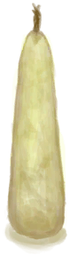

# 制作(技能)  
>   
  
#### ** 基础值: ** 0   
#### ** 变化范围: ** 0 ~ 150  
#### ** 基础变化率: ** 无   
## 阶段  
<table class="table table-bordered" data-toggle="table" ><thead><tr ><th  style="text-align:left;vertical-align:top;"  data-sortable="true"  >范围</th><th  style="text-align:left;vertical-align:top;"  data-sortable="true"  >名称</th><th  style="text-align:left;vertical-align:top;"  data-sortable="true"  >描述</th><th  style="text-align:left;vertical-align:top;"  data-sortable="true"  >影响状态</th><th  style="text-align:left;vertical-align:top;"  data-sortable="true"  >影响动作</th></tr></thead></tbody></table>  
  
## 可被以下操作改变  
<table class="table table-bordered" data-toggle="table" ><thead><tr ><th  style="text-align:left;vertical-align:top;"  >来源</th><th  style="text-align:left;vertical-align:top;"  >操作</th><th  style="text-align:left;vertical-align:top;"  data-sortable="true"  >值</th></tr></thead><tr ><td  style="text-align:left;vertical-align:top;"  >[

[泥屋(蓝图)](Bp_MudHut.md)](Bp_MudHut.md)</td><td  style="text-align:left;vertical-align:top;"  >蓝图制造</td><td  style="text-align:left;vertical-align:top;"  >10</td></tr><tr ><td  style="text-align:left;vertical-align:top;"  >[

[木筏(蓝图)](Bp_Raft.md)](Bp_Raft.md)</td><td  style="text-align:left;vertical-align:top;"  >蓝图制造</td><td  style="text-align:left;vertical-align:top;"  >10</td></tr><tr ><td  style="text-align:left;vertical-align:top;"  >[

[石屋(蓝图)](Bp_StoneHut.md)](Bp_StoneHut.md)</td><td  style="text-align:left;vertical-align:top;"  >蓝图制造</td><td  style="text-align:left;vertical-align:top;"  >10</td></tr><tr ><td  style="text-align:left;vertical-align:top;"  >[

[畜栏(蓝图)](Bp_Enclosure.md)](Bp_Enclosure.md)</td><td  style="text-align:left;vertical-align:top;"  >蓝图制造</td><td  style="text-align:left;vertical-align:top;"  >5</td></tr><tr ><td  style="text-align:left;vertical-align:top;"  >[

[棚屋(蓝图)](Bp_Shed.md)](Bp_Shed.md)</td><td  style="text-align:left;vertical-align:top;"  >蓝图制造</td><td  style="text-align:left;vertical-align:top;"  >5</td></tr><tr ><td  style="text-align:left;vertical-align:top;"  >[

[补给箱(蓝图)](Bp_SupplyChest.md)](Bp_SupplyChest.md)</td><td  style="text-align:left;vertical-align:top;"  >蓝图制造</td><td  style="text-align:left;vertical-align:top;"  >3</td></tr><tr ><td  style="text-align:left;vertical-align:top;"  >[

[简易床(蓝图)](Bp_BedRustic.md)](Bp_BedRustic.md)</td><td  style="text-align:left;vertical-align:top;"  >蓝图制造</td><td  style="text-align:left;vertical-align:top;"  >2</td></tr><tr ><td  style="text-align:left;vertical-align:top;"  >[

[仪式匕首(蓝图)](Bp_CeremonialDagger.md)](Bp_CeremonialDagger.md)</td><td  style="text-align:left;vertical-align:top;"  >蓝图制造</td><td  style="text-align:left;vertical-align:top;"  >2</td></tr><tr ><td  style="text-align:left;vertical-align:top;"  >[

[熔炉(蓝图)](Bp_Forge.md)](Bp_Forge.md)</td><td  style="text-align:left;vertical-align:top;"  >蓝图制造</td><td  style="text-align:left;vertical-align:top;"  >2</td></tr><tr ><td  style="text-align:left;vertical-align:top;"  >[

[窑炉(蓝图)](Bp_Kiln.md)](Bp_Kiln.md)</td><td  style="text-align:left;vertical-align:top;"  >蓝图制造</td><td  style="text-align:left;vertical-align:top;"  >2</td></tr><tr ><td  style="text-align:left;vertical-align:top;"  >[

[高级窑炉(蓝图)](Bp_KilnAdvanced.md)](Bp_KilnAdvanced.md)</td><td  style="text-align:left;vertical-align:top;"  >蓝图制造</td><td  style="text-align:left;vertical-align:top;"  >2</td></tr><tr ><td  style="text-align:left;vertical-align:top;"  >[

[织布机(蓝图)](Bp_Loom.md)](Bp_Loom.md)</td><td  style="text-align:left;vertical-align:top;"  >蓝图制造</td><td  style="text-align:left;vertical-align:top;"  >2</td></tr><tr ><td  style="text-align:left;vertical-align:top;"  >[

[火炉(蓝图)](Bp_Stove.md)](Bp_Stove.md)</td><td  style="text-align:left;vertical-align:top;"  >蓝图制造</td><td  style="text-align:left;vertical-align:top;"  >2</td></tr><tr ><td  style="text-align:left;vertical-align:top;"  >[

[滤水器(蓝图)](Bp_WaterFilter.md)](Bp_WaterFilter.md)</td><td  style="text-align:left;vertical-align:top;"  >蓝图制造</td><td  style="text-align:left;vertical-align:top;"  >2</td></tr><tr ><td  style="text-align:left;vertical-align:top;"  >[

[蓄水池(蓝图)](Bp_WaterReservoir.md)](Bp_WaterReservoir.md)</td><td  style="text-align:left;vertical-align:top;"  >蓝图制造</td><td  style="text-align:left;vertical-align:top;"  >2</td></tr><tr ><td  style="text-align:left;vertical-align:top;"  >[

[水槽(蓝图)](Bp_WateringTrough.md)](Bp_WateringTrough.md)</td><td  style="text-align:left;vertical-align:top;"  >蓝图制造</td><td  style="text-align:left;vertical-align:top;"  >2</td></tr><tr ><td  style="text-align:left;vertical-align:top;"  >[

[木床(蓝图)](Bp_BedWooden.md)](Bp_BedWooden.md)</td><td  style="text-align:left;vertical-align:top;"  >蓝图制造</td><td  style="text-align:left;vertical-align:top;"  >1</td></tr><tr ><td  style="text-align:left;vertical-align:top;"  >[

[空蜂箱(蓝图)](Bp_BeeSkepEmpty.md)](Bp_BeeSkepEmpty.md)</td><td  style="text-align:left;vertical-align:top;"  >蓝图制造</td><td  style="text-align:left;vertical-align:top;"  >1</td></tr><tr ><td  style="text-align:left;vertical-align:top;"  >[

[熏蜂器(蓝图)](Bp_BeeSmoker.md)](Bp_BeeSmoker.md)</td><td  style="text-align:left;vertical-align:top;"  >蓝图制造</td><td  style="text-align:left;vertical-align:top;"  >1</td></tr><tr ><td  style="text-align:left;vertical-align:top;"  >[

[猪食槽(蓝图)](Bp_BoarFeeder.md)](Bp_BoarFeeder.md)</td><td  style="text-align:left;vertical-align:top;"  >蓝图制造</td><td  style="text-align:left;vertical-align:top;"  >1</td></tr><tr ><td  style="text-align:left;vertical-align:top;"  >[

[骨刀(蓝图)](Bp_BoneKnife.md)](Bp_BoneKnife.md)</td><td  style="text-align:left;vertical-align:top;"  >蓝图制造</td><td  style="text-align:left;vertical-align:top;"  >1</td></tr><tr ><td  style="text-align:left;vertical-align:top;"  >[

[弓(蓝图)](Bp_Bow.md)](Bp_Bow.md)</td><td  style="text-align:left;vertical-align:top;"  >蓝图制造</td><td  style="text-align:left;vertical-align:top;"  >1</td></tr><tr ><td  style="text-align:left;vertical-align:top;"  >[

[扫帚(蓝图)](Bp_Broom.md)](Bp_Broom.md)</td><td  style="text-align:left;vertical-align:top;"  >蓝图制造</td><td  style="text-align:left;vertical-align:top;"  >1</td></tr><tr ><td  style="text-align:left;vertical-align:top;"  >[

[营火(蓝图)](Bp_Campfire.md)](Bp_Campfire.md)</td><td  style="text-align:left;vertical-align:top;"  >蓝图制造</td><td  style="text-align:left;vertical-align:top;"  >1</td></tr><tr ><td  style="text-align:left;vertical-align:top;"  >[

[蜡烛(蓝图)](Bp_Candles.md)](Bp_Candles.md)</td><td  style="text-align:left;vertical-align:top;"  >蓝图制造</td><td  style="text-align:left;vertical-align:top;"  >1</td></tr><tr ><td  style="text-align:left;vertical-align:top;"  >[

[香茅蜡烛(蓝图)](Bp_CandlesCitronella.md)](Bp_CandlesCitronella.md)</td><td  style="text-align:left;vertical-align:top;"  >蓝图制造</td><td  style="text-align:left;vertical-align:top;"  >1</td></tr><tr ><td  style="text-align:left;vertical-align:top;"  >[

[茉莉蜡烛(蓝图)](Bp_CandlesJasmine.md)](Bp_CandlesJasmine.md)</td><td  style="text-align:left;vertical-align:top;"  >蓝图制造</td><td  style="text-align:left;vertical-align:top;"  >1</td></tr><tr ><td  style="text-align:left;vertical-align:top;"  >[

[地窖(蓝图)](Bp_Cellar.md)](Bp_Cellar.md)</td><td  style="text-align:left;vertical-align:top;"  >蓝图制造</td><td  style="text-align:left;vertical-align:top;"  >1</td></tr><tr ><td  style="text-align:left;vertical-align:top;"  >[

[椅子(蓝图)](Bp_Chair.md)](Bp_Chair.md)</td><td  style="text-align:left;vertical-align:top;"  >蓝图制造</td><td  style="text-align:left;vertical-align:top;"  >1</td></tr><tr ><td  style="text-align:left;vertical-align:top;"  >[

[储物箱(蓝图)](Bp_Chest.md)](Bp_Chest.md)</td><td  style="text-align:left;vertical-align:top;"  >蓝图制造</td><td  style="text-align:left;vertical-align:top;"  >1</td></tr><tr ><td  style="text-align:left;vertical-align:top;"  >[

[水窖(蓝图)](Bp_Cistern.md)](Bp_Cistern.md)</td><td  style="text-align:left;vertical-align:top;"  >蓝图制造</td><td  style="text-align:left;vertical-align:top;"  >1</td></tr><tr ><td  style="text-align:left;vertical-align:top;"  >[

[堆肥箱(蓝图)](Bp_CompostBin.md)](Bp_CompostBin.md)</td><td  style="text-align:left;vertical-align:top;"  >蓝图制造</td><td  style="text-align:left;vertical-align:top;"  >1</td></tr><tr ><td  style="text-align:left;vertical-align:top;"  >[

[铜斧(蓝图)](Bp_CopperAxe.md)](Bp_CopperAxe.md)</td><td  style="text-align:left;vertical-align:top;"  >蓝图制造</td><td  style="text-align:left;vertical-align:top;"  >1</td></tr><tr ><td  style="text-align:left;vertical-align:top;"  >[

[铜铲(蓝图)](Bp_CopperShovel.md)](Bp_CopperShovel.md)</td><td  style="text-align:left;vertical-align:top;"  >蓝图制造</td><td  style="text-align:left;vertical-align:top;"  >1</td></tr><tr ><td  style="text-align:left;vertical-align:top;"  >[

[铜长矛(蓝图)](Bp_CopperSpear.md)](Bp_CopperSpear.md)</td><td  style="text-align:left;vertical-align:top;"  >蓝图制造</td><td  style="text-align:left;vertical-align:top;"  >1</td></tr><tr ><td  style="text-align:left;vertical-align:top;"  >[

[鼓(蓝图)](Bp_Drum.md)](Bp_Drum.md)</td><td  style="text-align:left;vertical-align:top;"  >蓝图制造</td><td  style="text-align:left;vertical-align:top;"  >1</td></tr><tr ><td  style="text-align:left;vertical-align:top;"  >[

[晾晒架(蓝图)](Bp_DryingRack.md)](Bp_DryingRack.md)</td><td  style="text-align:left;vertical-align:top;"  >蓝图制造</td><td  style="text-align:left;vertical-align:top;"  >1</td></tr><tr ><td  style="text-align:left;vertical-align:top;"  >[

[炸药(蓝图)](Bp_Dynamite.md)](Bp_Dynamite.md)</td><td  style="text-align:left;vertical-align:top;"  >蓝图制造</td><td  style="text-align:left;vertical-align:top;"  >1</td></tr><tr ><td  style="text-align:left;vertical-align:top;"  >[

[鱼饵(蓝图)](Bp_FishBait.md)](Bp_FishBait.md)</td><td  style="text-align:left;vertical-align:top;"  >蓝图制造</td><td  style="text-align:left;vertical-align:top;"  >1</td></tr><tr ><td  style="text-align:left;vertical-align:top;"  >[

[钓鱼竿(蓝图)](Bp_FishingRod.md)](Bp_FishingRod.md)</td><td  style="text-align:left;vertical-align:top;"  >蓝图制造</td><td  style="text-align:left;vertical-align:top;"  >1</td></tr><tr ><td  style="text-align:left;vertical-align:top;"  >[

[鱼叉(蓝图)](Bp_FishingSpear.md)](Bp_FishingSpear.md)</td><td  style="text-align:left;vertical-align:top;"  >蓝图制造</td><td  style="text-align:left;vertical-align:top;"  >1</td></tr><tr ><td  style="text-align:left;vertical-align:top;"  >[

[羊食槽(蓝图)](Bp_GoatFeeder.md)](Bp_GoatFeeder.md)</td><td  style="text-align:left;vertical-align:top;"  >蓝图制造</td><td  style="text-align:left;vertical-align:top;"  >1</td></tr><tr ><td  style="text-align:left;vertical-align:top;"  >[

[鱼镖(蓝图)](Bp_Harpoon.md)](Bp_Harpoon.md)</td><td  style="text-align:left;vertical-align:top;"  >蓝图制造</td><td  style="text-align:left;vertical-align:top;"  >1</td></tr><tr ><td  style="text-align:left;vertical-align:top;"  >[

[蜥蜴皮手鼓(蓝图)](Bp_LizardDrum.md)](Bp_LizardDrum.md)</td><td  style="text-align:left;vertical-align:top;"  >蓝图制造</td><td  style="text-align:left;vertical-align:top;"  >1</td></tr><tr ><td  style="text-align:left;vertical-align:top;"  >[

[原木陷阱(蓝图)](Bp_LogTrap.md)](Bp_LogTrap.md)</td><td  style="text-align:left;vertical-align:top;"  >蓝图制造</td><td  style="text-align:left;vertical-align:top;"  >1</td></tr><tr ><td  style="text-align:left;vertical-align:top;"  >[

[斧头模具(蓝图)](Bp_MoldAxe.md)](Bp_MoldAxe.md)</td><td  style="text-align:left;vertical-align:top;"  >蓝图制造</td><td  style="text-align:left;vertical-align:top;"  >1</td></tr><tr ><td  style="text-align:left;vertical-align:top;"  >[

[装饰品模具(蓝图)](Bp_MoldDecoration.md)](Bp_MoldDecoration.md)</td><td  style="text-align:left;vertical-align:top;"  >蓝图制造</td><td  style="text-align:left;vertical-align:top;"  >1</td></tr><tr ><td  style="text-align:left;vertical-align:top;"  >[

[刀模具(蓝图)](Bp_MoldKnife.md)](Bp_MoldKnife.md)</td><td  style="text-align:left;vertical-align:top;"  >蓝图制造</td><td  style="text-align:left;vertical-align:top;"  >1</td></tr><tr ><td  style="text-align:left;vertical-align:top;"  >[

[铲头模具(蓝图)](Bp_MoldShovel.md)](Bp_MoldShovel.md)</td><td  style="text-align:left;vertical-align:top;"  >蓝图制造</td><td  style="text-align:left;vertical-align:top;"  >1</td></tr><tr ><td  style="text-align:left;vertical-align:top;"  >[

[矛头模具(蓝图)](Bp_MoldSpear.md)](Bp_MoldSpear.md)</td><td  style="text-align:left;vertical-align:top;"  >蓝图制造</td><td  style="text-align:left;vertical-align:top;"  >1</td></tr><tr ><td  style="text-align:left;vertical-align:top;"  >[

[灰山鹑喂食器(蓝图)](Bp_PartridgeFeeder.md)](Bp_PartridgeFeeder.md)</td><td  style="text-align:left;vertical-align:top;"  >蓝图制造</td><td  style="text-align:left;vertical-align:top;"  >1</td></tr><tr ><td  style="text-align:left;vertical-align:top;"  >[

[陶轮(蓝图)](Bp_PotteryWheel.md)](Bp_PotteryWheel.md)</td><td  style="text-align:left;vertical-align:top;"  >蓝图制造</td><td  style="text-align:left;vertical-align:top;"  >1</td></tr><tr ><td  style="text-align:left;vertical-align:top;"  >[

[木筏庇护所(蓝图)](Bp_RaftShelter.md)](Bp_RaftShelter.md)</td><td  style="text-align:left;vertical-align:top;"  >蓝图制造</td><td  style="text-align:left;vertical-align:top;"  >1</td></tr><tr ><td  style="text-align:left;vertical-align:top;"  >[

[废金属斧(蓝图)](Bp_ScrapAxe.md)](Bp_ScrapAxe.md)</td><td  style="text-align:left;vertical-align:top;"  >蓝图制造</td><td  style="text-align:left;vertical-align:top;"  >1</td></tr><tr ><td  style="text-align:left;vertical-align:top;"  >[

[废金属刀(蓝图)](Bp_ScrapKnife.md)](Bp_ScrapKnife.md)</td><td  style="text-align:left;vertical-align:top;"  >蓝图制造</td><td  style="text-align:left;vertical-align:top;"  >1</td></tr><tr ><td  style="text-align:left;vertical-align:top;"  >[

[废金属铲(蓝图)](Bp_ScrapShovel.md)](Bp_ScrapShovel.md)</td><td  style="text-align:left;vertical-align:top;"  >蓝图制造</td><td  style="text-align:left;vertical-align:top;"  >1</td></tr><tr ><td  style="text-align:left;vertical-align:top;"  >[

[废金属长矛(蓝图)](Bp_ScrapSpear.md)](Bp_ScrapSpear.md)</td><td  style="text-align:left;vertical-align:top;"  >蓝图制造</td><td  style="text-align:left;vertical-align:top;"  >1</td></tr><tr ><td  style="text-align:left;vertical-align:top;"  >[

[窝棚(蓝图)](Bp_Shelter.md)](Bp_Shelter.md)</td><td  style="text-align:left;vertical-align:top;"  >蓝图制造</td><td  style="text-align:left;vertical-align:top;"  >1</td></tr><tr ><td  style="text-align:left;vertical-align:top;"  >[

[石斧(蓝图)](Bp_StoneAxe.md)](Bp_StoneAxe.md)</td><td  style="text-align:left;vertical-align:top;"  >蓝图制造</td><td  style="text-align:left;vertical-align:top;"  >1</td></tr><tr ><td  style="text-align:left;vertical-align:top;"  >[

[木桌(蓝图)](Bp_Table.md)](Bp_Table.md)</td><td  style="text-align:left;vertical-align:top;"  >蓝图制造</td><td  style="text-align:left;vertical-align:top;"  >1</td></tr><tr ><td  style="text-align:left;vertical-align:top;"  >[

[火把(蓝图)](Bp_Torch.md)](Bp_Torch.md)</td><td  style="text-align:left;vertical-align:top;"  >蓝图制造</td><td  style="text-align:left;vertical-align:top;"  >1</td></tr><tr ><td  style="text-align:left;vertical-align:top;"  >[

[陷坑(蓝图)](Bp_TrappingPit.md)](Bp_TrappingPit.md)</td><td  style="text-align:left;vertical-align:top;"  >蓝图制造</td><td  style="text-align:left;vertical-align:top;"  >1</td></tr><tr ><td  style="text-align:left;vertical-align:top;"  >[

[小拉车(蓝图)](Bp_Travois.md)](Bp_Travois.md)</td><td  style="text-align:left;vertical-align:top;"  >蓝图制造</td><td  style="text-align:left;vertical-align:top;"  >1</td></tr><tr ><td  style="text-align:left;vertical-align:top;"  >[

[水井(蓝图)](Bp_Well.md)](Bp_Well.md)</td><td  style="text-align:left;vertical-align:top;"  >蓝图制造</td><td  style="text-align:left;vertical-align:top;"  >1</td></tr><tr ><td  style="text-align:left;vertical-align:top;"  >[

[韦斯顿(蓝图)](Bp_Weston.md)](Bp_Weston.md)</td><td  style="text-align:left;vertical-align:top;"  >蓝图制造</td><td  style="text-align:left;vertical-align:top;"  >1</td></tr><tr ><td  style="text-align:left;vertical-align:top;"  >[

[背篓(蓝图)](Bp_WovenBackpack.md)](Bp_WovenBackpack.md)</td><td  style="text-align:left;vertical-align:top;"  >蓝图制造</td><td  style="text-align:left;vertical-align:top;"  >1</td></tr><tr ><td  style="text-align:left;vertical-align:top;"  >[

[编织篓(蓝图)](Bp_WovenBasket.md)](Bp_WovenBasket.md)</td><td  style="text-align:left;vertical-align:top;"  >蓝图制造</td><td  style="text-align:left;vertical-align:top;"  >1</td></tr><tr ><td  style="text-align:left;vertical-align:top;"  >[

[棕榈编织帽(蓝图)](Bp_WovenHat.md)](Bp_WovenHat.md)</td><td  style="text-align:left;vertical-align:top;"  >蓝图制造</td><td  style="text-align:left;vertical-align:top;"  >1</td></tr><tr ><td  style="text-align:left;vertical-align:top;"  >[

[蒸馏器(蓝图)](Bp_Alembic.md)](Bp_Alembic.md)</td><td  style="text-align:left;vertical-align:top;"  >蓝图制造</td><td  style="text-align:left;vertical-align:top;"  >1</td></tr><tr ><td  style="text-align:left;vertical-align:top;"  >[

[陶碗(蓝图)](Bp_ClayBowl.md)](Bp_ClayBowl.md)</td><td  style="text-align:left;vertical-align:top;"  >蓝图制造</td><td  style="text-align:left;vertical-align:top;"  >1</td></tr><tr ><td  style="text-align:left;vertical-align:top;"  >[

[粘土火盆(蓝图)](Bp_ClayFirePit.md)](Bp_ClayFirePit.md)</td><td  style="text-align:left;vertical-align:top;"  >蓝图制造</td><td  style="text-align:left;vertical-align:top;"  >1</td></tr><tr ><td  style="text-align:left;vertical-align:top;"  >[

[小陶罐(蓝图)](Bp_ClayJar.md)](Bp_ClayJar.md)</td><td  style="text-align:left;vertical-align:top;"  >蓝图制造</td><td  style="text-align:left;vertical-align:top;"  >1</td></tr><tr ><td  style="text-align:left;vertical-align:top;"  >[

[保鲜罐(蓝图)](Bp_ClayPotCooler.md)](Bp_ClayPotCooler.md)</td><td  style="text-align:left;vertical-align:top;"  >蓝图制造</td><td  style="text-align:left;vertical-align:top;"  >1</td></tr><tr ><td  style="text-align:left;vertical-align:top;"  >[

[陶罐(蓝图)](Bp_ClayVase.md)](Bp_ClayVase.md)</td><td  style="text-align:left;vertical-align:top;"  >蓝图制造</td><td  style="text-align:left;vertical-align:top;"  >1</td></tr><tr ><td  style="text-align:left;vertical-align:top;"  >[

[烹饪锅(蓝图)](Bp_CookingPot.md)](Bp_CookingPot.md)</td><td  style="text-align:left;vertical-align:top;"  >蓝图制造</td><td  style="text-align:left;vertical-align:top;"  >1</td></tr><tr ><td  style="text-align:left;vertical-align:top;"  >[

[釉面陶罐(蓝图)](Bp_GlazedVase.md)](Bp_GlazedVase.md)</td><td  style="text-align:left;vertical-align:top;"  >蓝图制造</td><td  style="text-align:left;vertical-align:top;"  >1</td></tr><tr ><td  style="text-align:left;vertical-align:top;"  >[

[风箱(蓝图)](Bp_Bellows.md)](Bp_Bellows.md)</td><td  style="text-align:left;vertical-align:top;"  >蓝图制造</td><td  style="text-align:left;vertical-align:top;"  >1</td></tr><tr ><td  style="text-align:left;vertical-align:top;"  >[

[鲜花项链(蓝图)](Bp_FlowerNecklace.md)](Bp_FlowerNecklace.md)</td><td  style="text-align:left;vertical-align:top;"  >蓝图制造</td><td  style="text-align:left;vertical-align:top;"  >1</td></tr><tr ><td  style="text-align:left;vertical-align:top;"  >[

[防毒面具(蓝图)](Bp_GasMask.md)](Bp_GasMask.md)</td><td  style="text-align:left;vertical-align:top;"  >蓝图制造</td><td  style="text-align:left;vertical-align:top;"  >1</td></tr><tr ><td  style="text-align:left;vertical-align:top;"  >[

[珍珠项链(蓝图)](Bp_PearlNecklace.md)](Bp_PearlNecklace.md)</td><td  style="text-align:left;vertical-align:top;"  >蓝图制造</td><td  style="text-align:left;vertical-align:top;"  >1</td></tr><tr ><td  style="text-align:left;vertical-align:top;"  >[

[海鸥护符(蓝图)](Bp_SeagullCharm.md)](Bp_SeagullCharm.md)</td><td  style="text-align:left;vertical-align:top;"  >蓝图制造</td><td  style="text-align:left;vertical-align:top;"  >1</td></tr><tr ><td  style="text-align:left;vertical-align:top;"  >[

[贝壳项链(蓝图)](Bp_SeashellNecklace.md)](Bp_SeashellNecklace.md)</td><td  style="text-align:left;vertical-align:top;"  >蓝图制造</td><td  style="text-align:left;vertical-align:top;"  >1</td></tr><tr ><td  style="text-align:left;vertical-align:top;"  >[

[木斧柄](HandleWood.md)](HandleWood.md)</td><td  style="text-align:left;vertical-align:top;"  >制作石斧 ** 拖入：**[石刀](StoneSharpened.md)</td><td  style="text-align:left;vertical-align:top;"  >1</td></tr><tr ><td  style="text-align:left;vertical-align:top;"  >[

[长木棍](StickLong.md)](StickLong.md)</td><td  style="text-align:left;vertical-align:top;"  >削成简易长矛 ** 拖入：**[“切割工具”](tag_Cutter.md)</td><td  style="text-align:left;vertical-align:top;"  >1</td></tr><tr ><td  style="text-align:left;vertical-align:top;"  >[

[小树枝](Sticks.md)](Sticks.md)</td><td  style="text-align:left;vertical-align:top;"  >制作止血带 ** 拖入：**[细线](CordFiber.md)</td><td  style="text-align:left;vertical-align:top;"  >1</td></tr><tr ><td  style="text-align:left;vertical-align:top;"  >[

[石头](Stone.md)](Stone.md)</td><td  style="text-align:left;vertical-align:top;"  >打磨石头 ** 拖入：**[石头](Stone.md)</td><td  style="text-align:left;vertical-align:top;"  >1</td></tr><tr ><td  style="text-align:left;vertical-align:top;"  >[

[大石块](StoneHeavy.md)](StoneHeavy.md)</td><td  style="text-align:left;vertical-align:top;"  >打磨石头 ** 拖入：**[石头](Stone.md)</td><td  style="text-align:left;vertical-align:top;"  >1</td></tr><tr ><td  style="text-align:left;vertical-align:top;"  >[

[硫磺石](StoneHeavyBrimstone.md)](StoneHeavyBrimstone.md)</td><td  style="text-align:left;vertical-align:top;"  >打磨石头 ** 拖入：**[石头](Stone.md)</td><td  style="text-align:left;vertical-align:top;"  >1</td></tr><tr ><td  style="text-align:left;vertical-align:top;"  >[

[箭矢(蓝图)](Bp_Arrow.md)](Bp_Arrow.md)</td><td  style="text-align:left;vertical-align:top;"  >蓝图制造</td><td  style="text-align:left;vertical-align:top;"  >0.5</td></tr><tr ><td  style="text-align:left;vertical-align:top;"  >[

[诱捕笼(蓝图)](Bp_CageTrap.md)](Bp_CageTrap.md)</td><td  style="text-align:left;vertical-align:top;"  >蓝图制造</td><td  style="text-align:left;vertical-align:top;"  >0.5</td></tr><tr ><td  style="text-align:left;vertical-align:top;"  >[

[落石陷阱(蓝图)](Bp_DeadfallTrap.md)](Bp_DeadfallTrap.md)</td><td  style="text-align:left;vertical-align:top;"  >蓝图制造</td><td  style="text-align:left;vertical-align:top;"  >0.5</td></tr><tr ><td  style="text-align:left;vertical-align:top;"  >[

[火堆(蓝图)](Bp_Fire.md)](Bp_Fire.md)</td><td  style="text-align:left;vertical-align:top;"  >蓝图制造</td><td  style="text-align:left;vertical-align:top;"  >0.5</td></tr><tr ><td  style="text-align:left;vertical-align:top;"  >[

[捕鱼陷阱(蓝图)](Bp_FishTrap.md)](Bp_FishTrap.md)</td><td  style="text-align:left;vertical-align:top;"  >蓝图制造</td><td  style="text-align:left;vertical-align:top;"  >0.5</td></tr><tr ><td  style="text-align:left;vertical-align:top;"  >[

[钓鱼线(蓝图)](Bp_FishingLine.md)](Bp_FishingLine.md)</td><td  style="text-align:left;vertical-align:top;"  >蓝图制造</td><td  style="text-align:left;vertical-align:top;"  >0.5</td></tr><tr ><td  style="text-align:left;vertical-align:top;"  >[

[胶水(蓝图)](Bp_Glue.md)](Bp_Glue.md)</td><td  style="text-align:left;vertical-align:top;"  >蓝图制造</td><td  style="text-align:left;vertical-align:top;"  >0.5</td></tr><tr ><td  style="text-align:left;vertical-align:top;"  >[

[砂浆(蓝图)](Bp_Mortar.md)](Bp_Mortar.md)</td><td  style="text-align:left;vertical-align:top;"  >蓝图制造</td><td  style="text-align:left;vertical-align:top;"  >0.5</td></tr><tr ><td  style="text-align:left;vertical-align:top;"  >[

[硫酸奎宁(蓝图)](Bp_QuinineSulfate.md)](Bp_QuinineSulfate.md)</td><td  style="text-align:left;vertical-align:top;"  >蓝图制造</td><td  style="text-align:left;vertical-align:top;"  >0.5</td></tr><tr ><td  style="text-align:left;vertical-align:top;"  >[

[捕捞拖网(蓝图)](Bp_RaftFishTrap.md)](Bp_RaftFishTrap.md)</td><td  style="text-align:left;vertical-align:top;"  >蓝图制造</td><td  style="text-align:left;vertical-align:top;"  >0.5</td></tr><tr ><td  style="text-align:left;vertical-align:top;"  >[

[稻草人(蓝图)](Bp_Scarecrow.md)](Bp_Scarecrow.md)</td><td  style="text-align:left;vertical-align:top;"  >蓝图制造</td><td  style="text-align:left;vertical-align:top;"  >0.5</td></tr><tr ><td  style="text-align:left;vertical-align:top;"  >[

[盾牌(蓝图)](Bp_Shield.md)](Bp_Shield.md)</td><td  style="text-align:left;vertical-align:top;"  >蓝图制造</td><td  style="text-align:left;vertical-align:top;"  >0.5</td></tr><tr ><td  style="text-align:left;vertical-align:top;"  >[

[套索陷阱(蓝图)](Bp_SnareTrap.md)](Bp_SnareTrap.md)</td><td  style="text-align:left;vertical-align:top;"  >蓝图制造</td><td  style="text-align:left;vertical-align:top;"  >0.5</td></tr><tr ><td  style="text-align:left;vertical-align:top;"  >[

[纺锤(蓝图)](Bp_Spindle.md)](Bp_Spindle.md)</td><td  style="text-align:left;vertical-align:top;"  >蓝图制造</td><td  style="text-align:left;vertical-align:top;"  >0.5</td></tr><tr ><td  style="text-align:left;vertical-align:top;"  >[

[夹板(蓝图)](Bp_Splint.md)](Bp_Splint.md)</td><td  style="text-align:left;vertical-align:top;"  >蓝图制造</td><td  style="text-align:left;vertical-align:top;"  >0.5</td></tr><tr ><td  style="text-align:left;vertical-align:top;"  >[

[止血带(蓝图)](Bp_Tourniquet.md)](Bp_Tourniquet.md)</td><td  style="text-align:left;vertical-align:top;"  >蓝图制造</td><td  style="text-align:left;vertical-align:top;"  >0.5</td></tr><tr ><td  style="text-align:left;vertical-align:top;"  >[

[简易止血带(蓝图)](Bp_TourniquetRustic.md)](Bp_TourniquetRustic.md)</td><td  style="text-align:left;vertical-align:top;"  >蓝图制造</td><td  style="text-align:left;vertical-align:top;"  >0.5</td></tr><tr ><td  style="text-align:left;vertical-align:top;"  >[

[硫酸(蓝图)](Bp_Vitriol.md)](Bp_Vitriol.md)</td><td  style="text-align:left;vertical-align:top;"  >蓝图制造</td><td  style="text-align:left;vertical-align:top;"  >0.5</td></tr><tr ><td  style="text-align:left;vertical-align:top;"  >[

[草裙(蓝图)](Bp_LeafSkirt.md)](Bp_LeafSkirt.md)</td><td  style="text-align:left;vertical-align:top;"  >蓝图制造</td><td  style="text-align:left;vertical-align:top;"  >0.5</td></tr><tr ><td  style="text-align:left;vertical-align:top;"  >[

[骨头碎片](BoneSplinters.md)](BoneSplinters.md)</td><td  style="text-align:left;vertical-align:top;"  >制作钩</td><td  style="text-align:left;vertical-align:top;"  >0.5</td></tr><tr ><td  style="text-align:left;vertical-align:top;"  >[

[骨头碎片](BoneSplinters.md)](BoneSplinters.md)</td><td  style="text-align:left;vertical-align:top;"  >制作针</td><td  style="text-align:left;vertical-align:top;"  >0.5</td></tr><tr ><td  style="text-align:left;vertical-align:top;"  >[

[鸟骨](BonesBird.md)](BonesBird.md)</td><td  style="text-align:left;vertical-align:top;"  >制作钩</td><td  style="text-align:left;vertical-align:top;"  >0.5</td></tr><tr ><td  style="text-align:left;vertical-align:top;"  >[

[鸟骨](BonesBird.md)](BonesBird.md)</td><td  style="text-align:left;vertical-align:top;"  >制作针</td><td  style="text-align:left;vertical-align:top;"  >0.5</td></tr><tr ><td  style="text-align:left;vertical-align:top;"  >[

[木材](Wood.md)](Wood.md)</td><td  style="text-align:left;vertical-align:top;"  >堆成火堆 ** 拖入：**[小树枝](Sticks.md)</td><td  style="text-align:left;vertical-align:top;"  >0.5</td></tr><tr ><td  style="text-align:left;vertical-align:top;"  >[

[草木灰敷料(蓝图)](Bp_AshDressing.md)](Bp_AshDressing.md)</td><td  style="text-align:left;vertical-align:top;"  >蓝图制造</td><td  style="text-align:left;vertical-align:top;"  >0.25</td></tr><tr ><td  style="text-align:left;vertical-align:top;"  >[

[弓钻(蓝图)](Bp_BowDrill.md)](Bp_BowDrill.md)</td><td  style="text-align:left;vertical-align:top;"  >蓝图制造</td><td  style="text-align:left;vertical-align:top;"  >0.25</td></tr><tr ><td  style="text-align:left;vertical-align:top;"  >[

[木质餐具(蓝图)](Bp_EatingUtensilsWooden.md)](Bp_EatingUtensilsWooden.md)</td><td  style="text-align:left;vertical-align:top;"  >蓝图制造</td><td  style="text-align:left;vertical-align:top;"  >0.25</td></tr><tr ><td  style="text-align:left;vertical-align:top;"  >[

[手钻(蓝图)](Bp_HandDrill.md)](Bp_HandDrill.md)</td><td  style="text-align:left;vertical-align:top;"  >蓝图制造</td><td  style="text-align:left;vertical-align:top;"  >0.25</td></tr><tr ><td  style="text-align:left;vertical-align:top;"  >[

[简易长矛(蓝图)](Bp_RusticSpear.md)](Bp_RusticSpear.md)</td><td  style="text-align:left;vertical-align:top;"  >蓝图制造</td><td  style="text-align:left;vertical-align:top;"  >0.25</td></tr><tr ><td  style="text-align:left;vertical-align:top;"  >[

[石刀(蓝图)](Bp_SharpenedStone.md)](Bp_SharpenedStone.md)</td><td  style="text-align:left;vertical-align:top;"  >蓝图制造</td><td  style="text-align:left;vertical-align:top;"  >0.25</td></tr><tr ><td  style="text-align:left;vertical-align:top;"  >[

[小树枝](Sticks.md)](Sticks.md)</td><td  style="text-align:left;vertical-align:top;"  >制作手钻 ** 拖入：**[“切割工具”](tag_Cutter.md)</td><td  style="text-align:left;vertical-align:top;"  >0.25</td></tr></tbody></table>  
  
## 被以下操作需求  
<table class="table table-bordered" data-toggle="table" ><thead><tr ><th  style="text-align:left;vertical-align:top;"  >来源</th><th  style="text-align:left;vertical-align:top;"  >操作</th><th  style="text-align:left;vertical-align:top;"  >值</th></tr></thead><tr ><td  style="text-align:left;vertical-align:top;"  >[制作技能提升！(事件)](Event_SkillCrafting4.md)</td><td  style="text-align:left;vertical-align:top;"  >触发事件</td><td  style="text-align:left;vertical-align:top;"  >150</td></tr><tr ><td  style="text-align:left;vertical-align:top;"  >[制作技能提升！(事件)](Event_SkillCrafting3.md)</td><td  style="text-align:left;vertical-align:top;"  >触发事件</td><td  style="text-align:left;vertical-align:top;"  >70 ~ 150</td></tr><tr ><td  style="text-align:left;vertical-align:top;"  >[制作技能提升！(事件)](Event_SkillCrafting2.md)</td><td  style="text-align:left;vertical-align:top;"  >触发事件</td><td  style="text-align:left;vertical-align:top;"  >30 ~ 150</td></tr><tr ><td  style="text-align:left;vertical-align:top;"  >[制作技能提升！(事件)](Event_SkillCrafting1.md)</td><td  style="text-align:left;vertical-align:top;"  >触发事件</td><td  style="text-align:left;vertical-align:top;"  >10 ~ 150</td></tr></tbody></table>  
  

