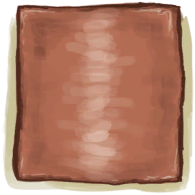
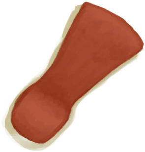

# 金工(技能)  
> 显示你金工的熟练度。当熟练度提高时解锁新的蓝图。  
> 金工技能可以让你用<b>铜</b>制造一些有用的工具。  技能越熟练，你就能制造越高级、越复杂的工艺品。 在低等级下，你能制造<b>刀、斧子和矛头</b>，随着等级提升，你能制造<b>铲子、针、装饰品、餐具、瓶子</b>以及其他结构更复杂的有用的物品。  金工技能可以通过<b>熔炼铜、制造金属制品和维修你的铜制工具</b>来练习。  
  

<b>基础值: </b> 0 
  

<b>变化范围: </b> 0 ~ 150 
  

<b>基础变化率: </b> 无 
  

<b>衰减: </b>相同来源3小时内衰减80%，叠加2次 
  
## 可被以下操作改变  
<table class="table table-bordered table2130" data-toggle="table"  ><thead style=""><tr ><th  style=""  >来源</th><th  style=""  >操作</th><th  style=""  data-sortable="true"  >值</th></tr></thead><tr ><td  style=""  >[

[铜瓶(蓝图)](Bp_CopperBottle.md)](Bp_CopperBottle.md)</td><td  style=""  >蓝图制造</td><td  style=""  >2</td></tr><tr ><td  style=""  >[

[铜项链(蓝图)](Bp_CopperNecklace.md)](Bp_CopperNecklace.md)</td><td  style=""  >蓝图制造</td><td  style=""  >2</td></tr><tr ><td  style=""  >[

[铜制餐具(蓝图)](Bp_EatingUtensilsCopper.md)](Bp_EatingUtensilsCopper.md)</td><td  style=""  >蓝图制造</td><td  style=""  >2</td></tr><tr ><td  style=""  >[

[铜罐(蓝图)](Bp_CopperJar.md)](Bp_CopperJar.md)</td><td  style=""  >蓝图制造</td><td  style=""  >1</td></tr><tr ><td  style=""  >[

[铜针(蓝图)](Bp_CopperNeedles.md)](Bp_CopperNeedles.md)</td><td  style=""  >蓝图制造</td><td  style=""  >1</td></tr><tr ><td  style=""  >[

[铜板(蓝图)](Bp_CopperSheet.md)](Bp_CopperSheet.md)</td><td  style=""  >蓝图制造</td><td  style=""  >0.5</td></tr><tr ><td  style=""  >[

[钝斧子头](AxeHeadBlunt.md)](AxeHeadBlunt.md)</td><td  style=""  >磨利 ** 拖入：**[石头](Stone.md) , [大石块](StoneHeavy.md)</td><td  style=""  >0.5</td></tr><tr ><td  style=""  >[

[钝刀](KnifeCopperBlunt.md)](KnifeCopperBlunt.md)</td><td  style=""  >磨利 ** 拖入：**[石头](Stone.md) , [大石块](StoneHeavy.md)</td><td  style=""  >0.5</td></tr><tr ><td  style=""  >[

[祖父的钝刀](KnifeGrandpaBlunt.md)](KnifeGrandpaBlunt.md)</td><td  style=""  >磨利 ** 拖入：**[石头](Stone.md) , [大石块](StoneHeavy.md) , [硫磺石](StoneHeavyBrimstone.md)</td><td  style=""  >0.5</td></tr><tr ><td  style=""  >[

[钝矛头](SpearHeadBlunt.md)](SpearHeadBlunt.md)</td><td  style=""  >磨利 ** 拖入：**[石头](Stone.md) , [大石块](StoneHeavy.md)</td><td  style=""  >0.5</td></tr><tr ><td  style=""  >[

[钝的求生斧](AxeSurvivalBlunt.md)](AxeSurvivalBlunt.md)</td><td  style=""  >磨利 ** 拖入：**[石头](Stone.md) , [大石块](StoneHeavy.md)</td><td  style=""  >0.25</td></tr><tr ><td  style=""  >[

[钝刀](KnifeMilitaryBlunt.md)](KnifeMilitaryBlunt.md)</td><td  style=""  >磨利 ** 拖入：**[石头](Stone.md) , [大石块](StoneHeavy.md)</td><td  style=""  >0.25</td></tr></tbody></table>  
  
## 被以下操作需求  
<table class="table table-bordered table9946" data-toggle="table"  ><thead style=""><tr ><th  style=""  >来源</th><th  style=""  >操作</th><th  style=""  >值</th></tr></thead><tr ><td  style=""  >[金工技能提升！(事件)](Event_SkillMetalworking4.md)</td><td  style=""  >触发事件</td><td  style=""  >150</td></tr><tr ><td  style=""  >[制作技能提升！(事件)](Event_SkillMetalworking3.md)</td><td  style=""  >触发事件</td><td  style=""  >70 ~ 150</td></tr><tr ><td  style=""  >[金工技能提升！(事件)](Event_SkillMetalworking2.md)</td><td  style=""  >触发事件</td><td  style=""  >30 ~ 150</td></tr><tr ><td  style=""  >[金工技能提升！(事件)](Event_SkillMetalworking1.md)</td><td  style=""  >触发事件</td><td  style=""  >10 ~ 150</td></tr><tr ><td  style=""  >[铜制装饰品](CopperDecoration_Mold.md)</td><td  style=""  >影响</td><td  style=""  >1 ~ 150</td></tr></tbody></table>  
  

