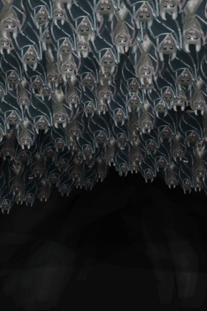

# 投石(技能)  
> 一项可以通过<b>投掷石头</b>来训练的简单技能。  尽管与长矛、弓箭和投石索相比，这可能是最没效率的<b>狩猎</b>方法，但一名称职的投掷者可以在不携带任何装备的情况下，以出色的投掷捕获大多数小型猎物，足够幸运的话甚至能捕获一些大型猎物。  你也可以向<b>椰子</b>扔石头，这样不用攀爬就能得到椰子。  
  

<b>基础值: </b> 0 
  

<b>变化范围: </b> 0 ~ 150 
  

<b>基础变化率: </b> 无 
  
## 可被以下操作改变  
<table class="table table-bordered" data-toggle="table"  ><thead style=""><tr ><th  style="text-align:left;vertical-align:top;"  >来源</th><th  style="text-align:left;vertical-align:top;"  >操作</th><th  style="text-align:left;vertical-align:top;"  data-sortable="true"  >值</th></tr></thead><tr ><td  style="text-align:left;vertical-align:top;"  >[

[一头山羊！(事件)](Event_GoatFight.md)](Event_GoatFight.md)</td><td  style="text-align:left;vertical-align:top;"  >朝它砸石头</td><td  style="text-align:left;vertical-align:top;"  >1</td></tr><tr ><td  style="text-align:left;vertical-align:top;"  >[

[一只灰山鹑！(事件)](Event_PartridgeFight.md)](Event_PartridgeFight.md)</td><td  style="text-align:left;vertical-align:top;"  >朝它砸石头</td><td  style="text-align:left;vertical-align:top;"  >1</td></tr><tr ><td  style="text-align:left;vertical-align:top;"  >[

[成功了！(事件)](Event_CoconutHit.md)](Event_CoconutHit.md)</td><td  style="text-align:left;vertical-align:top;"  >继续</td><td  style="text-align:left;vertical-align:top;"  >1</td></tr><tr ><td  style="text-align:left;vertical-align:top;"  >[

[燧石](Flint.md)](Flint.md)</td><td  style="text-align:left;vertical-align:top;"  >练习投石</td><td  style="text-align:left;vertical-align:top;"  >1</td></tr><tr ><td  style="text-align:left;vertical-align:top;"  >[

[石头](Stone.md)](Stone.md)</td><td  style="text-align:left;vertical-align:top;"  >练习投石</td><td  style="text-align:left;vertical-align:top;"  >1</td></tr><tr ><td  style="text-align:left;vertical-align:top;"  >[

[一只海鸥！(事件)](Event_SeagullFight.md)](Event_SeagullFight.md)</td><td  style="text-align:left;vertical-align:top;"  >朝它砸石头</td><td  style="text-align:left;vertical-align:top;"  >0.5</td></tr><tr ><td  style="text-align:left;vertical-align:top;"  >[

[一只海鸥！(事件)](Event_SeagullRaid.md)](Event_SeagullRaid.md)</td><td  style="text-align:left;vertical-align:top;"  >朝它砸石头</td><td  style="text-align:left;vertical-align:top;"  >0.5</td></tr><tr ><td  style="text-align:left;vertical-align:top;"  >[

[一只海鸥！(事件)](Event_SeagullRaidCrop.md)](Event_SeagullRaidCrop.md)</td><td  style="text-align:left;vertical-align:top;"  >朝它砸石头</td><td  style="text-align:left;vertical-align:top;"  >0.5</td></tr><tr ><td  style="text-align:left;vertical-align:top;"  >[

[蝙蝠群(蝙蝠洞)](BatColony.md)](BatColony.md)</td><td  style="text-align:left;vertical-align:top;"  >朝它砸石头</td><td  style="text-align:left;vertical-align:top;"  >0.5</td></tr><tr ><td  style="text-align:left;vertical-align:top;"  >[

[椰子树](PalmTreeNew.md)](PalmTreeNew.md)</td><td  style="text-align:left;vertical-align:top;"  >扔石头 ** 拖入：**[石头](Stone.md)</td><td  style="text-align:left;vertical-align:top;"  >0.5</td></tr></tbody></table>  
  
## 被以下操作需求  
<table class="table table-bordered" data-toggle="table"  ><thead style=""><tr ><th  style="text-align:left;vertical-align:top;"  >来源</th><th  style="text-align:left;vertical-align:top;"  >操作</th><th  style="text-align:left;vertical-align:top;"  >值</th></tr></thead><tr ><td  style="text-align:left;vertical-align:top;"  >[椰子树](PalmTreeNew.md)</td><td  style="text-align:left;vertical-align:top;"  >影响</td><td  style="text-align:left;vertical-align:top;"  >25 ~ 150</td></tr><tr ><td  style="text-align:left;vertical-align:top;"  >[一头山羊！(事件)](Event_GoatFight.md)</td><td  style="text-align:left;vertical-align:top;"  >影响</td><td  style="text-align:left;vertical-align:top;"  >1 ~ 150</td></tr><tr ><td  style="text-align:left;vertical-align:top;"  >[一只灰山鹑！(事件)](Event_PartridgeFight.md)</td><td  style="text-align:left;vertical-align:top;"  >影响</td><td  style="text-align:left;vertical-align:top;"  >1 ~ 150</td></tr><tr ><td  style="text-align:left;vertical-align:top;"  >[一只海鸥！(事件)](Event_SeagullFight.md)</td><td  style="text-align:left;vertical-align:top;"  >影响</td><td  style="text-align:left;vertical-align:top;"  >1 ~ 150</td></tr><tr ><td  style="text-align:left;vertical-align:top;"  >[一只海鸥！(事件)](Event_SeagullRaid.md)</td><td  style="text-align:left;vertical-align:top;"  >影响</td><td  style="text-align:left;vertical-align:top;"  >1 ~ 150</td></tr><tr ><td  style="text-align:left;vertical-align:top;"  >[一只海鸥！(事件)](Event_SeagullRaidCrop.md)</td><td  style="text-align:left;vertical-align:top;"  >影响</td><td  style="text-align:left;vertical-align:top;"  >1 ~ 150</td></tr><tr ><td  style="text-align:left;vertical-align:top;"  >[蝙蝠群(蝙蝠洞)](BatColony.md)</td><td  style="text-align:left;vertical-align:top;"  >影响</td><td  style="text-align:left;vertical-align:top;"  >1 ~ 150</td></tr><tr ><td  style="text-align:left;vertical-align:top;"  >[椰子树(旧)](PalmTreeOld.md)</td><td  style="text-align:left;vertical-align:top;"  >影响</td><td  style="text-align:left;vertical-align:top;"  >0 ~ 150</td></tr></tbody></table>  
  

