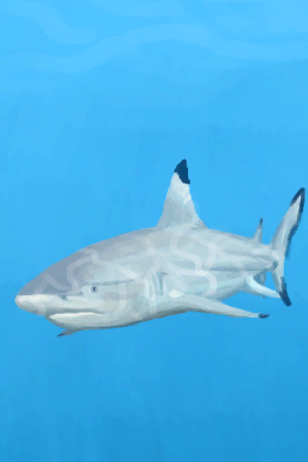

# 矛战(技能)  
> 显示你对使用长矛的熟练度。增加你使用这类武‍器捕猎的成功率。  
> 这项技能增加你使用长矛猎杀动物的<b>成功率</b>，并且降低你在此过程中<b>受伤</b>的几率。  与其他方式相比，长矛更容易狩猎成功，代价是受伤的风险更高。  
  

<b>基础值: </b> 0 
  

<b>变化范围: </b> 0 ~ 150 
  

<b>基础变化率: </b> 无 
  

<b>衰减: </b>相同来源3小时内衰减80%，叠加2次 
  
## 可被以下操作改变  
<table class="table table-bordered table6303" data-toggle="table"  ><thead style=""><tr ><th  style=""  >来源</th><th  style=""  >操作</th><th  style=""  data-sortable="true"  >值</th></tr></thead><tr ><td  style=""  >[

[鲨鱼头饰](SharkHeadpiece.md)](SharkHeadpiece.md)</td><td  style=""  >被动效果</td><td  style=""  >5</td></tr><tr ><td  style=""  >[

[我发现了一头野猪！(事件)](Event_BoarFight.md)](Event_BoarFight.md)</td><td  style=""  >用长矛攻击！</td><td  style=""  >1</td></tr><tr ><td  style=""  >[

[喷毒眼镜蛇！(事件)](Event_CobraFight.md)](Event_CobraFight.md)</td><td  style=""  >用长矛攻击！</td><td  style=""  >1</td></tr><tr ><td  style=""  >[

[攻击无人机！(事件)](Event_DroneFight.md)](Event_DroneFight.md)</td><td  style=""  >用长矛攻击！</td><td  style=""  >1</td></tr><tr ><td  style=""  >[

[宿敌来了！(事件)](Event_EnemyFight.md)](Event_EnemyFight.md)</td><td  style=""  >用长矛攻击！</td><td  style=""  >1</td></tr><tr ><td  style=""  >[

[一头山羊！(事件)](Event_GoatFight.md)](Event_GoatFight.md)</td><td  style=""  >使用长矛</td><td  style=""  >1</td></tr><tr ><td  style=""  >[

[猎手来了(事件)](Event_HunterFight.md)](Event_HunterFight.md)</td><td  style=""  >用长矛攻击！</td><td  style=""  >1</td></tr><tr ><td  style=""  >[

[猕猴们攻击了你！(事件)](Event_MacaqueDenFight.md)](Event_MacaqueDenFight.md)</td><td  style=""  >用长矛攻击！</td><td  style=""  >1</td></tr><tr ><td  style=""  >[

[一只猕猴！(事件)](Event_MacaqueFight.md)](Event_MacaqueFight.md)</td><td  style=""  >用长矛攻击！</td><td  style=""  >1</td></tr><tr ><td  style=""  >[

[一只猕猴！(事件)](Event_MacaqueFightRaid.md)](Event_MacaqueFightRaid.md)</td><td  style=""  >用长矛攻击！</td><td  style=""  >1</td></tr><tr ><td  style=""  >[

[一只猕猴！(事件)](Event_MacaqueUndeadFight.md)](Event_MacaqueUndeadFight.md)</td><td  style=""  >用长矛攻击！</td><td  style=""  >1</td></tr><tr ><td  style=""  >[

[一头巨蜥！(事件)(洞穴)](Event_MonitorFight.md)](Event_MonitorFight.md)</td><td  style=""  >用长矛攻击！</td><td  style=""  >1</td></tr><tr ><td  style=""  >[

[一只灰山鹑！(事件)](Event_PartridgeFight.md)](Event_PartridgeFight.md)</td><td  style=""  >使用长矛</td><td  style=""  >1</td></tr><tr ><td  style=""  >[

[一只海鸥！(事件)](Event_SeagullFight.md)](Event_SeagullFight.md)</td><td  style=""  >使用长矛</td><td  style=""  >1</td></tr><tr ><td  style=""  >[

[一只海鸥！(事件)](Event_SeagullRaid.md)](Event_SeagullRaid.md)</td><td  style=""  >使用长矛</td><td  style=""  >1</td></tr><tr ><td  style=""  >[

[一只海鸥！(事件)](Event_SeagullRaidCrop.md)](Event_SeagullRaidCrop.md)</td><td  style=""  >使用长矛</td><td  style=""  >1</td></tr><tr ><td  style=""  >[

[一头海怪！(事件)](Event_SeahoundFight.md)](Event_SeahoundFight.md)</td><td  style=""  >用长矛攻击！</td><td  style=""  >1</td></tr><tr ><td  style=""  >[

[一条鲨鱼！(事件)](Event_SharkFight.md)](Event_SharkFight.md)</td><td  style=""  >用长矛攻击！</td><td  style=""  >1</td></tr><tr ><td  style=""  >[

[鱼镖](HarpoonBone.md)](HarpoonBone.md)</td><td  style=""  >训练</td><td  style=""  >1</td></tr><tr ><td  style=""  >[

[铜长矛](SpearCopper.md)](SpearCopper.md)</td><td  style=""  >训练</td><td  style=""  >1</td></tr><tr ><td  style=""  >[

[鱼叉](SpearFishing.md)](SpearFishing.md)</td><td  style=""  >训练</td><td  style=""  >1</td></tr><tr ><td  style=""  >[

[燧石长矛](SpearFlint.md)](SpearFlint.md)</td><td  style=""  >训练</td><td  style=""  >1</td></tr><tr ><td  style=""  >[

[黑曜石长矛](SpearObsidian.md)](SpearObsidian.md)</td><td  style=""  >训练</td><td  style=""  >1</td></tr><tr ><td  style=""  >[

[简易长矛](SpearRustic.md)](SpearRustic.md)</td><td  style=""  >训练</td><td  style=""  >1</td></tr><tr ><td  style=""  >[

[废金属长矛](SpearScrap.md)](SpearScrap.md)</td><td  style=""  >训练</td><td  style=""  >1</td></tr><tr ><td  style=""  >[

[鲨鱼](SharkVisitor.md)](SharkVisitor.md)</td><td  style=""  >用长矛攻击！</td><td  style=""  >1</td></tr><tr ><td  style=""  >[

[扫帚](Broom.md)](Broom.md)</td><td  style=""  >训练</td><td  style=""  >0.5</td></tr></tbody></table>  
  
## 被以下操作需求  
<table class="table table-bordered table3412" data-toggle="table"  ><thead style=""><tr ><th  style=""  >来源</th><th  style=""  >操作</th><th  style=""  >值</th></tr></thead><tr ><td  style=""  >[长矛技巧提升！(事件)](Event_SkillSpearFighting4.md)</td><td  style=""  >触发事件</td><td  style=""  >150</td></tr><tr ><td  style=""  >[长矛技巧提升！(事件)](Event_SkillSpearFighting3.md)</td><td  style=""  >触发事件</td><td  style=""  >70 ~ 150</td></tr><tr ><td  style=""  >[长矛技巧提升！(事件)](Event_SkillSpearFighting2.md)</td><td  style=""  >触发事件</td><td  style=""  >30 ~ 150</td></tr><tr ><td  style=""  >[长矛技巧提升！(事件)](Event_SkillSpearFighting1.md)</td><td  style=""  >触发事件</td><td  style=""  >10 ~ 150</td></tr><tr ><td  style=""  >[一头山羊！(事件)](Event_GoatFight.md)</td><td  style=""  >影响</td><td  style=""  >1 ~ 150</td></tr><tr ><td  style=""  >[一只灰山鹑！(事件)](Event_PartridgeFight.md)</td><td  style=""  >影响</td><td  style=""  >1 ~ 150</td></tr><tr ><td  style=""  >[一只海鸥！(事件)](Event_SeagullFight.md)</td><td  style=""  >影响</td><td  style=""  >1 ~ 150</td></tr><tr ><td  style=""  >[一只海鸥！(事件)](Event_SeagullRaid.md)</td><td  style=""  >影响</td><td  style=""  >1 ~ 150</td></tr><tr ><td  style=""  >[一只海鸥！(事件)](Event_SeagullRaidCrop.md)</td><td  style=""  >影响</td><td  style=""  >1 ~ 150</td></tr><tr ><td  style=""  >[我发现了一头野猪！(事件)](Event_BoarFight.md)</td><td  style=""  >影响</td><td  style=""  >0 ~ 150</td></tr><tr ><td  style=""  >[喷毒眼镜蛇！(事件)](Event_CobraFight.md)</td><td  style=""  >影响</td><td  style=""  >0 ~ 150</td></tr><tr ><td  style=""  >[喷毒眼镜蛇！(事件)](Event_CobraFight.md)</td><td  style=""  >影响</td><td  style=""  >0 ~ 100</td></tr><tr ><td  style=""  >[攻击无人机！(事件)](Event_DroneFight.md)</td><td  style=""  >影响</td><td  style=""  >0 ~ 150</td></tr><tr ><td  style=""  >[攻击无人机！(事件)](Event_DroneFight.md)</td><td  style=""  >影响</td><td  style=""  >0 ~ 100</td></tr><tr ><td  style=""  >[宿敌来了！(事件)](Event_EnemyFight.md)</td><td  style=""  >影响</td><td  style=""  >0 ~ 150</td></tr><tr ><td  style=""  >[猎手来了(事件)](Event_HunterFight.md)</td><td  style=""  >影响</td><td  style=""  >0 ~ 150</td></tr><tr ><td  style=""  >[猕猴们攻击了你！(事件)](Event_MacaqueDenFight.md)</td><td  style=""  >影响</td><td  style=""  >0 ~ 150</td></tr><tr ><td  style=""  >[一只猕猴！(事件)](Event_MacaqueFight.md)</td><td  style=""  >影响</td><td  style=""  >0 ~ 150</td></tr><tr ><td  style=""  >[一只猕猴！(事件)](Event_MacaqueFightRaid.md)</td><td  style=""  >影响</td><td  style=""  >0 ~ 150</td></tr><tr ><td  style=""  >[一只猕猴！(事件)](Event_MacaqueUndeadFight.md)</td><td  style=""  >影响</td><td  style=""  >0 ~ 150</td></tr><tr ><td  style=""  >[一头巨蜥！(事件)(洞穴)](Event_MonitorFight.md)</td><td  style=""  >影响</td><td  style=""  >0 ~ 150</td></tr><tr ><td  style=""  >[一头海怪！(事件)](Event_SeahoundFight.md)</td><td  style=""  >影响</td><td  style=""  >0 ~ 150</td></tr><tr ><td  style=""  >[一条鲨鱼！(事件)](Event_SharkFight.md)</td><td  style=""  >影响</td><td  style=""  >0 ~ 150</td></tr><tr ><td  style=""  >[鲨鱼](SharkVisitor.md)</td><td  style=""  >影响</td><td  style=""  >0 ~ 150</td></tr></tbody></table>  
  

