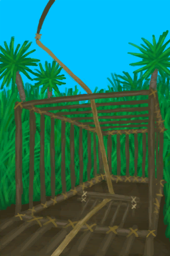

# 陷阱(技能)  
> 你的陷阱技能决定了你可以建造哪些陷阱蓝图，也影响你真正捕获到猎物的<b>概率</b>。  大多数陷阱需要<b>诱饵</b>才能工作。使用合适的诱饵来引诱你想要的<b>动物</b>。  除非真的有必要，否则尽量不要更换<b>诱饵</b>，这样做会吓跑动物并重置陷阱的计时器。  
  

<b>基础值: </b> 0 
  

<b>变化范围: </b> 0 ~ 150 
  

<b>基础变化率: </b> 无 
  

<b>衰减: </b>相同来源3小时内衰减80% ，叠加2次 
  
## 可被以下操作改变  
<table class="table table-bordered" data-toggle="table"  ><thead style=""><tr ><th  style="text-align:left;vertical-align:top;"  >来源</th><th  style="text-align:left;vertical-align:top;"  >操作</th><th  style="text-align:left;vertical-align:top;"  data-sortable="true"  >值</th></tr></thead><tr ><td  style="text-align:left;vertical-align:top;"  >[

[诱捕笼](CageTrapPlaced.md)](CageTrapPlaced.md)</td><td  style="text-align:left;vertical-align:top;"  >陷阱触发了！</td><td  style="text-align:left;vertical-align:top;"  >0.5</td></tr><tr ><td  style="text-align:left;vertical-align:top;"  >[

[解除陷阱](CageTrapPlacedTriggered.md)](CageTrapPlacedTriggered.md)</td><td  style="text-align:left;vertical-align:top;"  >重置陷阱</td><td  style="text-align:left;vertical-align:top;"  >0.5</td></tr><tr ><td  style="text-align:left;vertical-align:top;"  >[

[解除陷阱(雌灰山鹑)](CageTrapPlacedTriggeredPartridgeFemale.md)](CageTrapPlacedTriggeredPartridgeFemale.md)</td><td  style="text-align:left;vertical-align:top;"  >重置陷阱</td><td  style="text-align:left;vertical-align:top;"  >0.5</td></tr><tr ><td  style="text-align:left;vertical-align:top;"  >[

[解除陷阱(雄灰山鹑)](CageTrapPlacedTriggeredPartridgeMale.md)](CageTrapPlacedTriggeredPartridgeMale.md)</td><td  style="text-align:left;vertical-align:top;"  >重置陷阱</td><td  style="text-align:left;vertical-align:top;"  >0.5</td></tr><tr ><td  style="text-align:left;vertical-align:top;"  >[

[解除陷阱(海鸥)](CageTrapPlacedTriggeredSeagull.md)](CageTrapPlacedTriggeredSeagull.md)</td><td  style="text-align:left;vertical-align:top;"  >重置陷阱</td><td  style="text-align:left;vertical-align:top;"  >0.5</td></tr><tr ><td  style="text-align:left;vertical-align:top;"  >[

[落石陷阱(未重置)](DeadfallTrapTriggered.md)](DeadfallTrapTriggered.md)</td><td  style="text-align:left;vertical-align:top;"  >重置陷阱</td><td  style="text-align:left;vertical-align:top;"  >0.5</td></tr><tr ><td  style="text-align:left;vertical-align:top;"  >[

[原木陷阱(未重置)](LogTrapTriggered.md)](LogTrapTriggered.md)</td><td  style="text-align:left;vertical-align:top;"  >重置陷阱</td><td  style="text-align:left;vertical-align:top;"  >0.5</td></tr><tr ><td  style="text-align:left;vertical-align:top;"  >[

[套索陷阱(未重置)](SnareTrapTriggered.md)](SnareTrapTriggered.md)</td><td  style="text-align:left;vertical-align:top;"  >重置陷阱</td><td  style="text-align:left;vertical-align:top;"  >0.5</td></tr><tr ><td  style="text-align:left;vertical-align:top;"  >[

[陷坑](TrappingPitTriggered.md)](TrappingPitTriggered.md)</td><td  style="text-align:left;vertical-align:top;"  >重置陷阱</td><td  style="text-align:left;vertical-align:top;"  >0.5</td></tr><tr ><td  style="text-align:left;vertical-align:top;"  >[

[诱捕笼(蓝图)](Bp_CageTrap.md)](Bp_CageTrap.md)</td><td  style="text-align:left;vertical-align:top;"  >蓝图制造</td><td  style="text-align:left;vertical-align:top;"  >0.5</td></tr><tr ><td  style="text-align:left;vertical-align:top;"  >[

[落石陷阱(蓝图)](Bp_DeadfallTrap.md)](Bp_DeadfallTrap.md)</td><td  style="text-align:left;vertical-align:top;"  >蓝图制造</td><td  style="text-align:left;vertical-align:top;"  >0.5</td></tr><tr ><td  style="text-align:left;vertical-align:top;"  >[

[捕鱼陷阱(蓝图)](Bp_FishTrap.md)](Bp_FishTrap.md)</td><td  style="text-align:left;vertical-align:top;"  >蓝图制造</td><td  style="text-align:left;vertical-align:top;"  >0.5</td></tr><tr ><td  style="text-align:left;vertical-align:top;"  >[

[捕捞拖网(蓝图)](Bp_RaftFishTrap.md)](Bp_RaftFishTrap.md)</td><td  style="text-align:left;vertical-align:top;"  >蓝图制造</td><td  style="text-align:left;vertical-align:top;"  >0.5</td></tr><tr ><td  style="text-align:left;vertical-align:top;"  >[

[套索陷阱(蓝图)](Bp_SnareTrap.md)](Bp_SnareTrap.md)</td><td  style="text-align:left;vertical-align:top;"  >蓝图制造</td><td  style="text-align:left;vertical-align:top;"  >0.5</td></tr><tr ><td  style="text-align:left;vertical-align:top;"  >[

[陷坑(蓝图)](Bp_TrappingPit.md)](Bp_TrappingPit.md)</td><td  style="text-align:left;vertical-align:top;"  >蓝图制造</td><td  style="text-align:left;vertical-align:top;"  >0.5</td></tr></tbody></table>  
  
## 被以下操作需求  
<table class="table table-bordered" data-toggle="table"  ><thead style=""><tr ><th  style="text-align:left;vertical-align:top;"  >来源</th><th  style="text-align:left;vertical-align:top;"  >操作</th><th  style="text-align:left;vertical-align:top;"  >值</th></tr></thead><tr ><td  style="text-align:left;vertical-align:top;"  >[陷阱技能提升了！(事件)](Event_SkillTrapping4.md)</td><td  style="text-align:left;vertical-align:top;"  >触发事件</td><td  style="text-align:left;vertical-align:top;"  >150</td></tr><tr ><td  style="text-align:left;vertical-align:top;"  >[陷阱技能提升了！(事件)](Event_SkillTrapping3.md)</td><td  style="text-align:left;vertical-align:top;"  >触发事件</td><td  style="text-align:left;vertical-align:top;"  >70 ~ 150</td></tr><tr ><td  style="text-align:left;vertical-align:top;"  >[陷阱技能提升了！(事件)](Event_SkillTrapping2.md)</td><td  style="text-align:left;vertical-align:top;"  >触发事件</td><td  style="text-align:left;vertical-align:top;"  >30 ~ 150</td></tr><tr ><td  style="text-align:left;vertical-align:top;"  >[陷阱技能提升了！(事件)](Event_SkillTrapping1.md)</td><td  style="text-align:left;vertical-align:top;"  >触发事件</td><td  style="text-align:left;vertical-align:top;"  >10 ~ 150</td></tr><tr ><td  style="text-align:left;vertical-align:top;"  >[诱捕笼](CageTrapPlaced.md)</td><td  style="text-align:left;vertical-align:top;"  >影响</td><td  style="text-align:left;vertical-align:top;"  >0 ~ 150</td></tr><tr ><td  style="text-align:left;vertical-align:top;"  >[落石陷阱](DeadfallTrap.md)</td><td  style="text-align:left;vertical-align:top;"  >影响</td><td  style="text-align:left;vertical-align:top;"  >0 ~ 150</td></tr><tr ><td  style="text-align:left;vertical-align:top;"  >[捕鱼陷阱](FishTrapDeployed.md)</td><td  style="text-align:left;vertical-align:top;"  >影响</td><td  style="text-align:left;vertical-align:top;"  >0 ~ 150</td></tr><tr ><td  style="text-align:left;vertical-align:top;"  >[原木陷阱](LogTrap.md)</td><td  style="text-align:left;vertical-align:top;"  >影响</td><td  style="text-align:left;vertical-align:top;"  >0 ~ 150</td></tr><tr ><td  style="text-align:left;vertical-align:top;"  >[捕捞拖网](RaftFishTrap.md)</td><td  style="text-align:left;vertical-align:top;"  >影响</td><td  style="text-align:left;vertical-align:top;"  >0 ~ 150</td></tr><tr ><td  style="text-align:left;vertical-align:top;"  >[套索陷阱](SnareTrap.md)</td><td  style="text-align:left;vertical-align:top;"  >影响</td><td  style="text-align:left;vertical-align:top;"  >0 ~ 150</td></tr><tr ><td  style="text-align:left;vertical-align:top;"  >[陷坑](TrappingPit.md)</td><td  style="text-align:left;vertical-align:top;"  >影响</td><td  style="text-align:left;vertical-align:top;"  >0 ~ 150</td></tr></tbody></table>  
  

