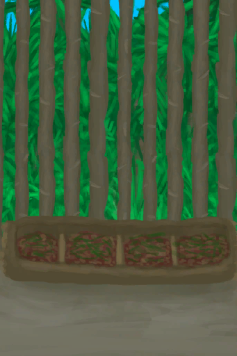
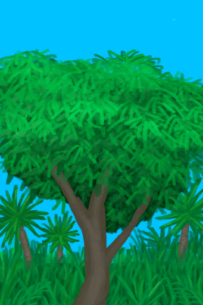
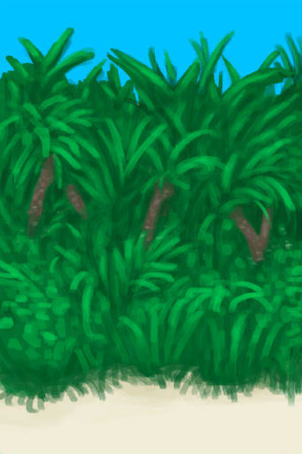

# 木工(技能)  
> 显示你木工的熟练度。当熟练度提高时解锁新的蓝图。  
> 这项技能可以解锁对长期生存至关重要的多个装置、娱乐和建筑<b>蓝图</b>。 <b>木板、家具、鼓和木雕</b>等物品都通过这项技能制造。  要提高木工技能，您需要<b>制造相关物品，砍伐木材或切割木屑</b>。  
  

<b>基础值: </b> 0 
  

<b>变化范围: </b> 0 ~ 150 
  

<b>基础变化率: </b> 无 
  

<b>衰减: </b>相同来源3小时内衰减80%，叠加2次 
  
## 可被以下操作改变  
<table class="table table-bordered" data-toggle="table"  ><thead style=""><tr ><th  style="text-align:left;vertical-align:top;"  >来源</th><th  style="text-align:left;vertical-align:top;"  >操作</th><th  style="text-align:left;vertical-align:top;"  data-sortable="true"  >值</th></tr></thead><tr ><td  style="text-align:left;vertical-align:top;"  >[

[神赐壶](CoconutFlaskAmbrosia.md)](CoconutFlaskAmbrosia.md)</td><td  style="text-align:left;vertical-align:top;"  >饮用</td><td  style="text-align:left;vertical-align:top;"  >150</td></tr><tr ><td  style="text-align:left;vertical-align:top;"  >[

[木床(蓝图)](Bp_BedWooden.md)](Bp_BedWooden.md)</td><td  style="text-align:left;vertical-align:top;"  >蓝图制造</td><td  style="text-align:left;vertical-align:top;"  >2</td></tr><tr ><td  style="text-align:left;vertical-align:top;"  >[

[猪食槽(蓝图)](Bp_BoarFeeder.md)](Bp_BoarFeeder.md)</td><td  style="text-align:left;vertical-align:top;"  >蓝图制造</td><td  style="text-align:left;vertical-align:top;"  >2</td></tr><tr ><td  style="text-align:left;vertical-align:top;"  >[

[椅子(蓝图)](Bp_Chair.md)](Bp_Chair.md)</td><td  style="text-align:left;vertical-align:top;"  >蓝图制造</td><td  style="text-align:left;vertical-align:top;"  >2</td></tr><tr ><td  style="text-align:left;vertical-align:top;"  >[

[鼓(蓝图)](Bp_Drum.md)](Bp_Drum.md)</td><td  style="text-align:left;vertical-align:top;"  >蓝图制造</td><td  style="text-align:left;vertical-align:top;"  >2</td></tr><tr ><td  style="text-align:left;vertical-align:top;"  >[

[蜥蜴皮手鼓(蓝图)](Bp_LizardDrum.md)](Bp_LizardDrum.md)</td><td  style="text-align:left;vertical-align:top;"  >蓝图制造</td><td  style="text-align:left;vertical-align:top;"  >2</td></tr><tr ><td  style="text-align:left;vertical-align:top;"  >[

[陶轮(蓝图)](Bp_PotteryWheel.md)](Bp_PotteryWheel.md)</td><td  style="text-align:left;vertical-align:top;"  >蓝图制造</td><td  style="text-align:left;vertical-align:top;"  >2</td></tr><tr ><td  style="text-align:left;vertical-align:top;"  >[

[木桌(蓝图)](Bp_Table.md)](Bp_Table.md)</td><td  style="text-align:left;vertical-align:top;"  >蓝图制造</td><td  style="text-align:left;vertical-align:top;"  >2</td></tr><tr ><td  style="text-align:left;vertical-align:top;"  >[

[盾牌(蓝图)](Bp_Shield.md)](Bp_Shield.md)</td><td  style="text-align:left;vertical-align:top;"  >蓝图制造</td><td  style="text-align:left;vertical-align:top;"  >1.5</td></tr><tr ><td  style="text-align:left;vertical-align:top;"  >[

[弓(蓝图)](Bp_Bow.md)](Bp_Bow.md)</td><td  style="text-align:left;vertical-align:top;"  >蓝图制造</td><td  style="text-align:left;vertical-align:top;"  >1</td></tr><tr ><td  style="text-align:left;vertical-align:top;"  >[

[木板(蓝图)](Bp_Planks.md)](Bp_Planks.md)</td><td  style="text-align:left;vertical-align:top;"  >蓝图制造</td><td  style="text-align:left;vertical-align:top;"  >1</td></tr><tr ><td  style="text-align:left;vertical-align:top;"  >[

[木铲(蓝图)](Bp_WoodenShovel.md)](Bp_WoodenShovel.md)</td><td  style="text-align:left;vertical-align:top;"  >蓝图制造</td><td  style="text-align:left;vertical-align:top;"  >1</td></tr><tr ><td  style="text-align:left;vertical-align:top;"  >[

[未完成的木雕](WoodCarving_Unfinished.md)](WoodCarving_Unfinished.md)</td><td  style="text-align:left;vertical-align:top;"  >雕刻 ** 拖入：**[“高级切割工具”](tag_CutterAdv.md)</td><td  style="text-align:left;vertical-align:top;"  >1</td></tr><tr ><td  style="text-align:left;vertical-align:top;"  >[

[大树](LargeTree.md)](LargeTree.md)</td><td  style="text-align:left;vertical-align:top;"  >砍树 ** 拖入：**[石斧](StoneAxe.md)</td><td  style="text-align:left;vertical-align:top;"  >1</td></tr><tr ><td  style="text-align:left;vertical-align:top;"  >[

[大树](LargeTree.md)](LargeTree.md)</td><td  style="text-align:left;vertical-align:top;"  >砍树 ** 拖入：**[“高级斧”](tag_AxeAdv.md)</td><td  style="text-align:left;vertical-align:top;"  >1</td></tr><tr ><td  style="text-align:left;vertical-align:top;"  >[

[倒下的大树](LargeTreeFelled.md)](LargeTreeFelled.md)</td><td  style="text-align:left;vertical-align:top;"  >修整原木 ** 拖入：**[石斧](StoneAxe.md)</td><td  style="text-align:left;vertical-align:top;"  >1</td></tr><tr ><td  style="text-align:left;vertical-align:top;"  >[

[倒下的大树](LargeTreeFelled.md)](LargeTreeFelled.md)</td><td  style="text-align:left;vertical-align:top;"  >修整原木 ** 拖入：**[“斧”](tag_Axe.md)</td><td  style="text-align:left;vertical-align:top;"  >1</td></tr><tr ><td  style="text-align:left;vertical-align:top;"  >[

[摘光的芒果树](MangoTreeCleared.md)](MangoTreeCleared.md)</td><td  style="text-align:left;vertical-align:top;"  >砍树 ** 拖入：**[石斧](StoneAxe.md)</td><td  style="text-align:left;vertical-align:top;"  >1</td></tr><tr ><td  style="text-align:left;vertical-align:top;"  >[

[摘光的芒果树](MangoTreeCleared.md)](MangoTreeCleared.md)</td><td  style="text-align:left;vertical-align:top;"  >砍树 ** 拖入：**[“高级斧”](tag_AxeAdv.md)</td><td  style="text-align:left;vertical-align:top;"  >1</td></tr><tr ><td  style="text-align:left;vertical-align:top;"  >[

[摘光的热带杏仁树](TropicalAlmondTreeCleared.md)](TropicalAlmondTreeCleared.md)</td><td  style="text-align:left;vertical-align:top;"  >砍树 ** 拖入：**[石斧](StoneAxe.md)</td><td  style="text-align:left;vertical-align:top;"  >1</td></tr><tr ><td  style="text-align:left;vertical-align:top;"  >[

[摘光的热带杏仁树](TropicalAlmondTreeCleared.md)](TropicalAlmondTreeCleared.md)</td><td  style="text-align:left;vertical-align:top;"  >砍树 ** 拖入：**[“高级斧”](tag_AxeAdv.md)</td><td  style="text-align:left;vertical-align:top;"  >1</td></tr><tr ><td  style="text-align:left;vertical-align:top;"  >[

[倒下的热带杏仁树](TropicalAlmondTreeFelled.md)](TropicalAlmondTreeFelled.md)</td><td  style="text-align:left;vertical-align:top;"  >清理树枝 ** 拖入：**[石斧](StoneAxe.md)</td><td  style="text-align:left;vertical-align:top;"  >1</td></tr><tr ><td  style="text-align:left;vertical-align:top;"  >[

[倒下的热带杏仁树](TropicalAlmondTreeFelled.md)](TropicalAlmondTreeFelled.md)</td><td  style="text-align:left;vertical-align:top;"  >清理树枝 ** 拖入：**[“斧”](tag_Axe.md)</td><td  style="text-align:left;vertical-align:top;"  >1</td></tr><tr ><td  style="text-align:left;vertical-align:top;"  >[

[半根原木](HalfLog.md)](HalfLog.md)</td><td  style="text-align:left;vertical-align:top;"  >切割成木材 ** 拖入：**[石斧](StoneAxe.md)</td><td  style="text-align:left;vertical-align:top;"  >0.5</td></tr><tr ><td  style="text-align:left;vertical-align:top;"  >[

[原木](Log.md)](Log.md)</td><td  style="text-align:left;vertical-align:top;"  >截成两段 ** 拖入：**[石斧](StoneAxe.md)</td><td  style="text-align:left;vertical-align:top;"  >0.5</td></tr><tr ><td  style="text-align:left;vertical-align:top;"  >[

[箭矢(蓝图)](Bp_Arrow.md)](Bp_Arrow.md)</td><td  style="text-align:left;vertical-align:top;"  >蓝图制造</td><td  style="text-align:left;vertical-align:top;"  >0.5</td></tr><tr ><td  style="text-align:left;vertical-align:top;"  >[

[书架(蓝图)](Bp_Bookshelf.md)](Bp_Bookshelf.md)</td><td  style="text-align:left;vertical-align:top;"  >蓝图制造</td><td  style="text-align:left;vertical-align:top;"  >0.5</td></tr><tr ><td  style="text-align:left;vertical-align:top;"  >[

[弓钻(蓝图)](Bp_BowDrill.md)](Bp_BowDrill.md)</td><td  style="text-align:left;vertical-align:top;"  >蓝图制造</td><td  style="text-align:left;vertical-align:top;"  >0.5</td></tr><tr ><td  style="text-align:left;vertical-align:top;"  >[

[木质餐具(蓝图)](Bp_EatingUtensilsWooden.md)](Bp_EatingUtensilsWooden.md)</td><td  style="text-align:left;vertical-align:top;"  >蓝图制造</td><td  style="text-align:left;vertical-align:top;"  >0.5</td></tr><tr ><td  style="text-align:left;vertical-align:top;"  >[

[手钻(蓝图)](Bp_HandDrill.md)](Bp_HandDrill.md)</td><td  style="text-align:left;vertical-align:top;"  >蓝图制造</td><td  style="text-align:left;vertical-align:top;"  >0.5</td></tr><tr ><td  style="text-align:left;vertical-align:top;"  >[

[简易长矛(蓝图)](Bp_RusticSpear.md)](Bp_RusticSpear.md)</td><td  style="text-align:left;vertical-align:top;"  >蓝图制造</td><td  style="text-align:left;vertical-align:top;"  >0.5</td></tr><tr ><td  style="text-align:left;vertical-align:top;"  >[

[架子(蓝图)](Bp_Shelf.md)](Bp_Shelf.md)</td><td  style="text-align:left;vertical-align:top;"  >蓝图制造</td><td  style="text-align:left;vertical-align:top;"  >0.5</td></tr><tr ><td  style="text-align:left;vertical-align:top;"  >[

[木钉(蓝图)](Bp_Treenails.md)](Bp_Treenails.md)</td><td  style="text-align:left;vertical-align:top;"  >蓝图制造</td><td  style="text-align:left;vertical-align:top;"  >0.5</td></tr><tr ><td  style="text-align:left;vertical-align:top;"  >[

[木雕(蓝图)](Bp_WoodCarvings.md)](Bp_WoodCarvings.md)</td><td  style="text-align:left;vertical-align:top;"  >蓝图制造</td><td  style="text-align:left;vertical-align:top;"  >0.5</td></tr><tr ><td  style="text-align:left;vertical-align:top;"  >[

[木屑(蓝图)](Bp_WoodShavings.md)](Bp_WoodShavings.md)</td><td  style="text-align:left;vertical-align:top;"  >蓝图制造</td><td  style="text-align:left;vertical-align:top;"  >0.5</td></tr><tr ><td  style="text-align:left;vertical-align:top;"  >[

[木针(蓝图)](Bp_WoodenNeedles.md)](Bp_WoodenNeedles.md)</td><td  style="text-align:left;vertical-align:top;"  >蓝图制造</td><td  style="text-align:left;vertical-align:top;"  >0.5</td></tr><tr ><td  style="text-align:left;vertical-align:top;"  >[

[小树枝](Sticks.md)](Sticks.md)</td><td  style="text-align:left;vertical-align:top;"  >制作手钻 ** 拖入：**[“切割工具”](tag_Cutter.md)</td><td  style="text-align:left;vertical-align:top;"  >0.5</td></tr><tr ><td  style="text-align:left;vertical-align:top;"  >[

[野猪牙](Tusk.md)](Tusk.md)</td><td  style="text-align:left;vertical-align:top;"  >雕刻 ** 拖入：**[“高级切割工具”](tag_CutterAdv.md)</td><td  style="text-align:left;vertical-align:top;"  >0.5</td></tr><tr ><td  style="text-align:left;vertical-align:top;"  >[

[木材](Wood.md)](Wood.md)</td><td  style="text-align:left;vertical-align:top;"  >刨花 ** 拖入：**[“高级切割工具”](tag_CutterAdv.md)</td><td  style="text-align:left;vertical-align:top;"  >0.5</td></tr><tr ><td  style="text-align:left;vertical-align:top;"  >[

[丛林深处](DeepJungle.md)](DeepJungle.md)</td><td  style="text-align:left;vertical-align:top;"  >砍伐木材 ** 拖入：**[“高级斧”](tag_AxeAdv.md)</td><td  style="text-align:left;vertical-align:top;"  >0.5</td></tr><tr ><td  style="text-align:left;vertical-align:top;"  >[

[丛林深处](DeepJungle.md)](DeepJungle.md)</td><td  style="text-align:left;vertical-align:top;"  >砍伐木材 ** 拖入：**[“斧”](tag_Axe.md)</td><td  style="text-align:left;vertical-align:top;"  >0.5</td></tr><tr ><td  style="text-align:left;vertical-align:top;"  >[

[丛林](Jungle.md)](Jungle.md)</td><td  style="text-align:left;vertical-align:top;"  >砍伐木材 ** 拖入：**[“高级斧”](tag_AxeAdv.md)</td><td  style="text-align:left;vertical-align:top;"  >0.5</td></tr><tr ><td  style="text-align:left;vertical-align:top;"  >[

[丛林](Jungle.md)](Jungle.md)</td><td  style="text-align:left;vertical-align:top;"  >砍伐木材 ** 拖入：**[“斧”](tag_Axe.md)</td><td  style="text-align:left;vertical-align:top;"  >0.5</td></tr><tr ><td  style="text-align:left;vertical-align:top;"  >[

[丛林高地](JungleHighlands.md)](JungleHighlands.md)</td><td  style="text-align:left;vertical-align:top;"  >砍伐木材 ** 拖入：**[“高级斧”](tag_AxeAdv.md)</td><td  style="text-align:left;vertical-align:top;"  >0.5</td></tr><tr ><td  style="text-align:left;vertical-align:top;"  >[

[丛林高地](JungleHighlands.md)](JungleHighlands.md)</td><td  style="text-align:left;vertical-align:top;"  >砍伐木材 ** 拖入：**[“斧”](tag_Axe.md)</td><td  style="text-align:left;vertical-align:top;"  >0.5</td></tr><tr ><td  style="text-align:left;vertical-align:top;"  >[

[丛林边缘](Outskirts.md)](Outskirts.md)</td><td  style="text-align:left;vertical-align:top;"  >砍伐木材 ** 拖入：**[“高级斧”](tag_AxeAdv.md)</td><td  style="text-align:left;vertical-align:top;"  >0.5</td></tr><tr ><td  style="text-align:left;vertical-align:top;"  >[

[丛林边缘](Outskirts.md)](Outskirts.md)</td><td  style="text-align:left;vertical-align:top;"  >砍伐木材 ** 拖入：**[“斧”](tag_Axe.md)</td><td  style="text-align:left;vertical-align:top;"  >0.5</td></tr><tr ><td  style="text-align:left;vertical-align:top;"  >[

[湿地丛林(湿地)](Wetlands.md)](Wetlands.md)</td><td  style="text-align:left;vertical-align:top;"  >砍伐木材 ** 拖入：**[“高级斧”](tag_AxeAdv.md)</td><td  style="text-align:left;vertical-align:top;"  >0.5</td></tr><tr ><td  style="text-align:left;vertical-align:top;"  >[

[湿地丛林(湿地)](Wetlands.md)](Wetlands.md)</td><td  style="text-align:left;vertical-align:top;"  >砍伐木材 ** 拖入：**[“斧”](tag_Axe.md)</td><td  style="text-align:left;vertical-align:top;"  >0.5</td></tr><tr ><td  style="text-align:left;vertical-align:top;"  >[

[摘完的椰子树](PalmTreeCleared.md)](PalmTreeCleared.md)</td><td  style="text-align:left;vertical-align:top;"  >砍倒 ** 拖入：**[石斧](StoneAxe.md)</td><td  style="text-align:left;vertical-align:top;"  >0.5</td></tr><tr ><td  style="text-align:left;vertical-align:top;"  >[

[摘完的椰子树](PalmTreeCleared.md)](PalmTreeCleared.md)</td><td  style="text-align:left;vertical-align:top;"  >砍倒 ** 拖入：**[“高级斧”](tag_AxeAdv.md)</td><td  style="text-align:left;vertical-align:top;"  >0.5</td></tr><tr ><td  style="text-align:left;vertical-align:top;"  >[

[倒下的棕榈树](PalmTreeFelled.md)](PalmTreeFelled.md)</td><td  style="text-align:left;vertical-align:top;"  >清除 ** 拖入：**[石斧](StoneAxe.md)</td><td  style="text-align:left;vertical-align:top;"  >0.5</td></tr><tr ><td  style="text-align:left;vertical-align:top;"  >[

[倒下的棕榈树](PalmTreeFelled.md)](PalmTreeFelled.md)</td><td  style="text-align:left;vertical-align:top;"  >清除 ** 拖入：**[“斧”](tag_Axe.md)</td><td  style="text-align:left;vertical-align:top;"  >0.5</td></tr><tr ><td  style="text-align:left;vertical-align:top;"  >[

[椰子树](PalmTreeNew.md)](PalmTreeNew.md)</td><td  style="text-align:left;vertical-align:top;"  >砍倒 ** 拖入：**[石斧](StoneAxe.md)</td><td  style="text-align:left;vertical-align:top;"  >0.5</td></tr><tr ><td  style="text-align:left;vertical-align:top;"  >[

[椰子树](PalmTreeNew.md)](PalmTreeNew.md)</td><td  style="text-align:left;vertical-align:top;"  >砍倒 ** 拖入：**[“高级斧”](tag_AxeAdv.md)</td><td  style="text-align:left;vertical-align:top;"  >0.5</td></tr><tr ><td  style="text-align:left;vertical-align:top;"  >[

[椰子树(多事件旧)](PalmTreeNewMultiEventOld.md)](PalmTreeNewMultiEventOld.md)</td><td  style="text-align:left;vertical-align:top;"  >砍倒 ** 拖入：**[石斧](StoneAxe.md)</td><td  style="text-align:left;vertical-align:top;"  >0.5</td></tr><tr ><td  style="text-align:left;vertical-align:top;"  >[

[椰子树(多事件旧)](PalmTreeNewMultiEventOld.md)](PalmTreeNewMultiEventOld.md)</td><td  style="text-align:left;vertical-align:top;"  >砍倒 ** 拖入：**[“高级斧”](tag_AxeAdv.md)</td><td  style="text-align:left;vertical-align:top;"  >0.5</td></tr><tr ><td  style="text-align:left;vertical-align:top;"  >[

[椰子树(旧)](PalmTreeOld.md)](PalmTreeOld.md)</td><td  style="text-align:left;vertical-align:top;"  >砍倒 ** 拖入：**[石斧](StoneAxe.md)</td><td  style="text-align:left;vertical-align:top;"  >0.5</td></tr><tr ><td  style="text-align:left;vertical-align:top;"  >[

[椰子树(旧)](PalmTreeOld.md)](PalmTreeOld.md)</td><td  style="text-align:left;vertical-align:top;"  >砍倒 ** 拖入：**[“高级斧”](tag_AxeAdv.md)</td><td  style="text-align:left;vertical-align:top;"  >0.5</td></tr><tr ><td  style="text-align:left;vertical-align:top;"  >[

[东部高地](HighlandsEastern.md)](HighlandsEastern.md)</td><td  style="text-align:left;vertical-align:top;"  >砍伐木材 ** 拖入：**[“高级斧”](tag_AxeAdv.md)</td><td  style="text-align:left;vertical-align:top;"  >0.25</td></tr><tr ><td  style="text-align:left;vertical-align:top;"  >[

[东部高地](HighlandsEastern.md)](HighlandsEastern.md)</td><td  style="text-align:left;vertical-align:top;"  >砍伐木材 ** 拖入：**[“斧”](tag_Axe.md)</td><td  style="text-align:left;vertical-align:top;"  >0.25</td></tr><tr ><td  style="text-align:left;vertical-align:top;"  >[

[西部高地](HighlandsWestern.md)](HighlandsWestern.md)</td><td  style="text-align:left;vertical-align:top;"  >砍伐木材 ** 拖入：**[“高级斧”](tag_AxeAdv.md)</td><td  style="text-align:left;vertical-align:top;"  >0.25</td></tr><tr ><td  style="text-align:left;vertical-align:top;"  >[

[西部高地](HighlandsWestern.md)](HighlandsWestern.md)</td><td  style="text-align:left;vertical-align:top;"  >砍伐木材 ** 拖入：**[“斧”](tag_Axe.md)</td><td  style="text-align:left;vertical-align:top;"  >0.25</td></tr><tr ><td  style="text-align:left;vertical-align:top;"  >[

[红树林](Mangroves.md)](Mangroves.md)</td><td  style="text-align:left;vertical-align:top;"  >砍伐木材 ** 拖入：**[“高级斧”](tag_AxeAdv.md)</td><td  style="text-align:left;vertical-align:top;"  >0.25</td></tr><tr ><td  style="text-align:left;vertical-align:top;"  >[

[红树林](Mangroves.md)](Mangroves.md)</td><td  style="text-align:left;vertical-align:top;"  >砍伐木材 ** 拖入：**[“斧”](tag_Axe.md)</td><td  style="text-align:left;vertical-align:top;"  >0.25</td></tr></tbody></table>  
  
## 被以下操作需求  
<table class="table table-bordered" data-toggle="table"  ><thead style=""><tr ><th  style="text-align:left;vertical-align:top;"  >来源</th><th  style="text-align:left;vertical-align:top;"  >操作</th><th  style="text-align:left;vertical-align:top;"  >值</th></tr></thead><tr ><td  style="text-align:left;vertical-align:top;"  >[木工技能提升！(事件)](Event_SkillWoodworking4.md)</td><td  style="text-align:left;vertical-align:top;"  >触发事件</td><td  style="text-align:left;vertical-align:top;"  >150</td></tr><tr ><td  style="text-align:left;vertical-align:top;"  >[木工技能提升！(事件)](Event_SkillWoodworking3.md)</td><td  style="text-align:left;vertical-align:top;"  >触发事件</td><td  style="text-align:left;vertical-align:top;"  >70 ~ 150</td></tr><tr ><td  style="text-align:left;vertical-align:top;"  >[木工技能提升！(事件)](Event_SkillWoodworking2.md)</td><td  style="text-align:left;vertical-align:top;"  >触发事件</td><td  style="text-align:left;vertical-align:top;"  >30 ~ 150</td></tr><tr ><td  style="text-align:left;vertical-align:top;"  >[木工技能提升！(事件)](Event_SkillWoodworking1.md)</td><td  style="text-align:left;vertical-align:top;"  >触发事件</td><td  style="text-align:left;vertical-align:top;"  >10 ~ 150</td></tr><tr ><td  style="text-align:left;vertical-align:top;"  >[野猪牙](Tusk.md)</td><td  style="text-align:left;vertical-align:top;"  >影响</td><td  style="text-align:left;vertical-align:top;"  >1 ~ 150</td></tr><tr ><td  style="text-align:left;vertical-align:top;"  >[未完成的木雕](WoodCarving_Unfinished.md)</td><td  style="text-align:left;vertical-align:top;"  >影响</td><td  style="text-align:left;vertical-align:top;"  >1 ~ 150</td></tr></tbody></table>  
  

