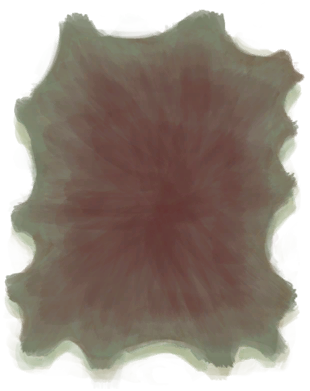

# 刮净的蜥蜴皮  
> 下一步是等它干燥。  
   
> 皮革可以通过剥大型动物（如野猪、山羊或巨蜥）的皮获得。 在能使用之前，新鲜兽皮需要用切割工具剔除残留的肉后晾干一段时间。  
  
<table class="table table-bordered"><tbody><tr ><td  style="width:80%;text-align:left;vertical-align:top;" >** 不可删除 **  **重量：**250</td><td  style="width:20%;text-align:left;vertical-align:top;" >

</td></tr></tbody></tbody></table>  
  
## 获取来源  
<table class="table table-bordered"><thead><tr ><th  style="text-align:left;vertical-align:top;" >来源</th><th  style="text-align:left;vertical-align:top;" >操作</th></tr></thead><tr ><td  style="text-align:left;vertical-align:top;" >[

[蜥蜴生皮](SkinFreshReptile.md)](SkinFreshReptile.md)</td><td  style="text-align:left;vertical-align:top;" >刮皮 ** 拖入：**[黑曜石刀](KnifeObsidian.md)</td></tr><tr ><td  style="text-align:left;vertical-align:top;" >[

[蜥蜴生皮](SkinFreshReptile.md)](SkinFreshReptile.md)</td><td  style="text-align:left;vertical-align:top;" >刮皮 ** 拖入：**[“切割工具”](tag_Cutter.md)</td></tr></tbody></table>  
  
## 属性   
<table class="table table-bordered"><thead><tr ><th  style="text-align:left;vertical-align:top;" >属性</th><th  style="text-align:left;vertical-align:top;" >值</th><th  style="text-align:left;vertical-align:top;" >耗时</th><th  style="text-align:left;vertical-align:top;" >变化</th></tr></thead><tr ><td  style="text-align:left;vertical-align:top;" >耐久</td><td  style="text-align:left;vertical-align:top;" >初始：384</td><td  style="text-align:left;vertical-align:top;" >每15分钟-1 最多需要：4天</td><td  style="text-align:left;vertical-align:top;" >** 到达0时：皮鞣制好了！ **  ** 自身 ** → [

[鞣制巨蜥皮](CuredSkinReptile.md)](CuredSkinReptile.md)</td></tr></tbody></table>  
  

