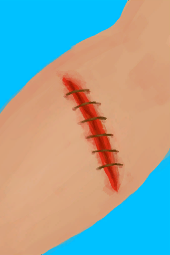
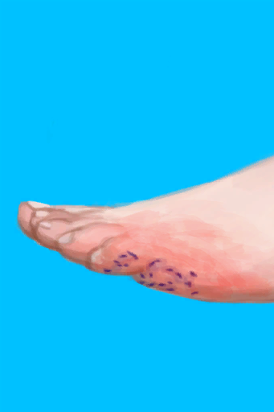
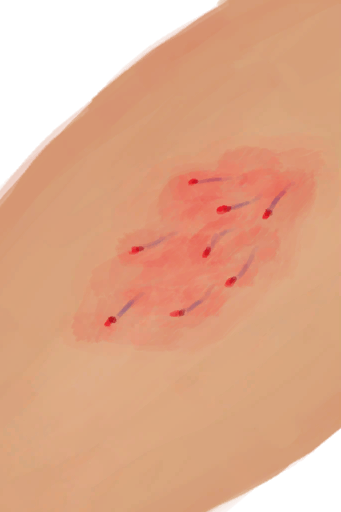
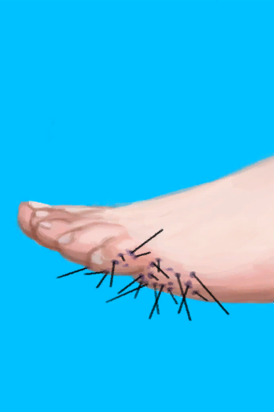

# 皮肤完整度  

<b>基础值: </b> 5 
  

<b>变化范围: </b> -20 ~ 5 
  

<b>基础变化率: </b> 无 
  
## 阶段  

<table><tr style="height:2em;"><td style="background-color:#F0F0F0;text-align:center;width:180px;font-size:1.4em;font-weight:bold;vertical-align:middle;">
5

100%
</td><td colspan=2 style="font-size:1.1em;vertical-align:middle;background-color:#F9F9F9;">
<b>

</b>

</td></tr><tr><td colspan=2><b>影响：</b>[

[表面细菌](BacteriaSurface.md)](BacteriaSurface.md)-5</td></tr><tr><td colspan=2></td></tr><tr style="height:2em;"><td style="background-color:#F0F0F0;text-align:center;width:180px;font-size:1.4em;font-weight:bold;vertical-align:middle;">
4

80%
</td><td colspan=2 style="font-size:1.1em;vertical-align:middle;background-color:#F9F9F9;">
<b>

</b>

</td></tr><tr><td colspan=2><b>影响：</b>[

[表面细菌](BacteriaSurface.md)](BacteriaSurface.md)-4</td></tr><tr><td colspan=2></td></tr><tr style="height:2em;"><td style="background-color:#F0F0F0;text-align:center;width:180px;font-size:1.4em;font-weight:bold;vertical-align:middle;">
3

60%
</td><td colspan=2 style="font-size:1.1em;vertical-align:middle;background-color:#F9F9F9;">
<b>

</b>

</td></tr><tr><td colspan=2><b>影响：</b>[

[表面细菌](BacteriaSurface.md)](BacteriaSurface.md)-3</td></tr><tr><td colspan=2></td></tr><tr style="height:2em;"><td style="background-color:#F0F0F0;text-align:center;width:180px;font-size:1.4em;font-weight:bold;vertical-align:middle;">
2

40%
</td><td colspan=2 style="font-size:1.1em;vertical-align:middle;background-color:#F9F9F9;">
<b>

</b>

</td></tr><tr><td colspan=2><b>影响：</b>[

[表面细菌](BacteriaSurface.md)](BacteriaSurface.md)-2</td></tr><tr><td colspan=2></td></tr><tr style="height:2em;"><td style="background-color:#F0F0F0;text-align:center;width:180px;font-size:1.4em;font-weight:bold;vertical-align:middle;">
-20 ～ 1

-400% ～ 20%
</td><td colspan=2 style="font-size:1.1em;vertical-align:middle;background-color:#F9F9F9;">
<b>

</b>

</td></tr><tr><td colspan=2><b>影响：</b>[

[表面细菌](BacteriaSurface.md)](BacteriaSurface.md)-1</td></tr><tr><td colspan=2></td></tr></table>
  
## 相关卡牌  
[晒伤](Sunburn.md)  |  [烧伤](Burns.md)  |  [皮肤潮湿度](SkinHumidity.md)  |  [蚊虫叮咬](BugBites.md)  |  [蜜蜂蛰刺](BeeStings.md)  |  [手掌损伤](HandDamage.md)  |  [足部损伤](FootDamage.md)  
## 加成值影响因素  
<table class="table table-bordered" data-toggle="table"  ><thead style=""><tr ><th  style="text-align:left;vertical-align:top;"  >来源</th><th  style="text-align:left;vertical-align:top;"  >操作</th><th  style="text-align:left;vertical-align:top;"  >值</th></tr></thead><tr ><td  style="text-align:left;vertical-align:top;"  >[已缝合的轻微撕裂伤](W_MinorLacerationStitched.md)</td><td  style="text-align:left;vertical-align:top;"  >条件被动</td><td  style="text-align:left;vertical-align:top;"  >加成+0</td></tr></tbody></table>  
  
## 可被以下操作改变  
<table class="table table-bordered" data-toggle="table"  ><thead style=""><tr ><th  style="text-align:left;vertical-align:top;"  >来源</th><th  style="text-align:left;vertical-align:top;"  >操作</th><th  style="text-align:left;vertical-align:top;"  data-sortable="true"  >值</th></tr></thead><tr ><td  style="text-align:left;vertical-align:top;"  >[

[擦伤](W_Abrasion.md)](W_Abrasion.md)</td><td  style="text-align:left;vertical-align:top;"  >条件被动</td><td  style="text-align:left;vertical-align:top;"  >2</td></tr><tr ><td  style="text-align:left;vertical-align:top;"  >[

[左臂撕裂伤](W_ArmLacerationL.md)](W_ArmLacerationL.md)</td><td  style="text-align:left;vertical-align:top;"  >条件被动</td><td  style="text-align:left;vertical-align:top;"  >2</td></tr><tr ><td  style="text-align:left;vertical-align:top;"  >[

[已缝合的左臂撕裂伤](W_ArmLacerationLStitched.md)](W_ArmLacerationLStitched.md)</td><td  style="text-align:left;vertical-align:top;"  >条件被动</td><td  style="text-align:left;vertical-align:top;"  >2</td></tr><tr ><td  style="text-align:left;vertical-align:top;"  >[

[右臂撕裂伤](W_ArmLacerationR.md)](W_ArmLacerationR.md)</td><td  style="text-align:left;vertical-align:top;"  >条件被动</td><td  style="text-align:left;vertical-align:top;"  >2</td></tr><tr ><td  style="text-align:left;vertical-align:top;"  >[

[已缝合的右臂撕裂伤](W_ArmLacerationRStitched.md)](W_ArmLacerationRStitched.md)</td><td  style="text-align:left;vertical-align:top;"  >条件被动</td><td  style="text-align:left;vertical-align:top;"  >2</td></tr><tr ><td  style="text-align:left;vertical-align:top;"  >[

[狗咬伤](W_DogBite.md)](W_DogBite.md)</td><td  style="text-align:left;vertical-align:top;"  >条件被动</td><td  style="text-align:left;vertical-align:top;"  >2</td></tr><tr ><td  style="text-align:left;vertical-align:top;"  >[

[左腿撕裂伤](W_LegLacerationL.md)](W_LegLacerationL.md)</td><td  style="text-align:left;vertical-align:top;"  >条件被动</td><td  style="text-align:left;vertical-align:top;"  >2</td></tr><tr ><td  style="text-align:left;vertical-align:top;"  >[

[已缝合的左腿撕裂伤](W_LegLacerationLStitched.md)](W_LegLacerationLStitched.md)</td><td  style="text-align:left;vertical-align:top;"  >条件被动</td><td  style="text-align:left;vertical-align:top;"  >2</td></tr><tr ><td  style="text-align:left;vertical-align:top;"  >[

[右腿撕裂伤](W_LegLacerationR.md)](W_LegLacerationR.md)</td><td  style="text-align:left;vertical-align:top;"  >条件被动</td><td  style="text-align:left;vertical-align:top;"  >2</td></tr><tr ><td  style="text-align:left;vertical-align:top;"  >[

[已缝合的右腿撕裂伤](W_LegLacerationRStitched.md)](W_LegLacerationRStitched.md)</td><td  style="text-align:left;vertical-align:top;"  >条件被动</td><td  style="text-align:left;vertical-align:top;"  >2</td></tr><tr ><td  style="text-align:left;vertical-align:top;"  >[

[猕猴咬伤](W_MacaqueBite.md)](W_MacaqueBite.md)</td><td  style="text-align:left;vertical-align:top;"  >条件被动</td><td  style="text-align:left;vertical-align:top;"  >2</td></tr><tr ><td  style="text-align:left;vertical-align:top;"  >[

[轻微撕裂伤](W_MinorLaceration.md)](W_MinorLaceration.md)</td><td  style="text-align:left;vertical-align:top;"  >条件被动</td><td  style="text-align:left;vertical-align:top;"  >2</td></tr><tr ><td  style="text-align:left;vertical-align:top;"  >[

[已缝合的轻微撕裂伤](W_MinorLacerationStitched.md)](W_MinorLacerationStitched.md)</td><td  style="text-align:left;vertical-align:top;"  >条件被动</td><td  style="text-align:left;vertical-align:top;"  >2</td></tr><tr ><td  style="text-align:left;vertical-align:top;"  >[

[巨蜥咬伤](W_MonitorBite.md)](W_MonitorBite.md)</td><td  style="text-align:left;vertical-align:top;"  >条件被动</td><td  style="text-align:left;vertical-align:top;"  >2</td></tr><tr ><td  style="text-align:left;vertical-align:top;"  >[

[鲨鱼咬伤](W_SharkBite.md)](W_SharkBite.md)</td><td  style="text-align:left;vertical-align:top;"  >条件被动</td><td  style="text-align:left;vertical-align:top;"  >2</td></tr><tr ><td  style="text-align:left;vertical-align:top;"  >[

[海胆刺伤](W_UrchinWound.md)](W_UrchinWound.md)</td><td  style="text-align:left;vertical-align:top;"  >条件被动</td><td  style="text-align:left;vertical-align:top;"  >2</td></tr><tr ><td  style="text-align:left;vertical-align:top;"  >[

[海怪刺伤](W_SeahoundSting.md)](W_SeahoundSting.md)</td><td  style="text-align:left;vertical-align:top;"  >条件被动</td><td  style="text-align:left;vertical-align:top;"  >1</td></tr><tr ><td  style="text-align:left;vertical-align:top;"  >[

[蜘蛛咬伤](W_SpiderBite.md)](W_SpiderBite.md)</td><td  style="text-align:left;vertical-align:top;"  >条件被动</td><td  style="text-align:left;vertical-align:top;"  >1</td></tr><tr ><td  style="text-align:left;vertical-align:top;"  >[

[擦伤](W_Abrasion.md)](W_Abrasion.md)</td><td  style="text-align:left;vertical-align:top;"  >条件被动</td><td  style="text-align:left;vertical-align:top;"  >-1</td></tr><tr ><td  style="text-align:left;vertical-align:top;"  >[

[狗咬伤](W_DogBite.md)](W_DogBite.md)</td><td  style="text-align:left;vertical-align:top;"  >条件被动</td><td  style="text-align:left;vertical-align:top;"  >-1</td></tr><tr ><td  style="text-align:left;vertical-align:top;"  >[

[猕猴咬伤](W_MacaqueBite.md)](W_MacaqueBite.md)</td><td  style="text-align:left;vertical-align:top;"  >条件被动</td><td  style="text-align:left;vertical-align:top;"  >-1</td></tr><tr ><td  style="text-align:left;vertical-align:top;"  >[

[轻微撕裂伤](W_MinorLaceration.md)](W_MinorLaceration.md)</td><td  style="text-align:left;vertical-align:top;"  >条件被动</td><td  style="text-align:left;vertical-align:top;"  >-1</td></tr><tr ><td  style="text-align:left;vertical-align:top;"  >[

[已缝合的轻微撕裂伤](W_MinorLacerationStitched.md)](W_MinorLacerationStitched.md)</td><td  style="text-align:left;vertical-align:top;"  >条件被动</td><td  style="text-align:left;vertical-align:top;"  >-1</td></tr><tr ><td  style="text-align:left;vertical-align:top;"  >[

[巨蜥咬伤](W_MonitorBite.md)](W_MonitorBite.md)</td><td  style="text-align:left;vertical-align:top;"  >条件被动</td><td  style="text-align:left;vertical-align:top;"  >-1</td></tr><tr ><td  style="text-align:left;vertical-align:top;"  >[

[海怪刺伤](W_SeahoundSting.md)](W_SeahoundSting.md)</td><td  style="text-align:left;vertical-align:top;"  >条件被动</td><td  style="text-align:left;vertical-align:top;"  >-1</td></tr><tr ><td  style="text-align:left;vertical-align:top;"  >[

[鲨鱼咬伤](W_SharkBite.md)](W_SharkBite.md)</td><td  style="text-align:left;vertical-align:top;"  >条件被动</td><td  style="text-align:left;vertical-align:top;"  >-1</td></tr><tr ><td  style="text-align:left;vertical-align:top;"  >[

[蜘蛛咬伤](W_SpiderBite.md)](W_SpiderBite.md)</td><td  style="text-align:left;vertical-align:top;"  >条件被动</td><td  style="text-align:left;vertical-align:top;"  >-1</td></tr><tr ><td  style="text-align:left;vertical-align:top;"  >[

[海胆刺伤](W_UrchinWound.md)](W_UrchinWound.md)</td><td  style="text-align:left;vertical-align:top;"  >条件被动</td><td  style="text-align:left;vertical-align:top;"  >-1</td></tr><tr ><td  style="text-align:left;vertical-align:top;"  >[

[海胆刺伤](W_UrchinWoundSpines.md)](W_UrchinWoundSpines.md)</td><td  style="text-align:left;vertical-align:top;"  >条件被动</td><td  style="text-align:left;vertical-align:top;"  >-1</td></tr><tr ><td  style="text-align:left;vertical-align:top;"  >[

[已缝合的左臂撕裂伤](W_ArmLacerationLStitched.md)](W_ArmLacerationLStitched.md)</td><td  style="text-align:left;vertical-align:top;"  >条件被动</td><td  style="text-align:left;vertical-align:top;"  >-1.5</td></tr><tr ><td  style="text-align:left;vertical-align:top;"  >[

[已缝合的左腿撕裂伤](W_LegLacerationLStitched.md)](W_LegLacerationLStitched.md)</td><td  style="text-align:left;vertical-align:top;"  >条件被动</td><td  style="text-align:left;vertical-align:top;"  >-1.5</td></tr><tr ><td  style="text-align:left;vertical-align:top;"  >[

[已缝合的右腿撕裂伤](W_LegLacerationRStitched.md)](W_LegLacerationRStitched.md)</td><td  style="text-align:left;vertical-align:top;"  >条件被动</td><td  style="text-align:left;vertical-align:top;"  >-1.5</td></tr><tr ><td  style="text-align:left;vertical-align:top;"  >[

[擦伤](W_Abrasion.md)](W_Abrasion.md)</td><td  style="text-align:left;vertical-align:top;"  >条件被动</td><td  style="text-align:left;vertical-align:top;"  >-2</td></tr><tr ><td  style="text-align:left;vertical-align:top;"  >[

[已缝合的左臂撕裂伤](W_ArmLacerationLStitched.md)](W_ArmLacerationLStitched.md)</td><td  style="text-align:left;vertical-align:top;"  >条件被动</td><td  style="text-align:left;vertical-align:top;"  >-2</td></tr><tr ><td  style="text-align:left;vertical-align:top;"  >[

[已缝合的右臂撕裂伤](W_ArmLacerationRStitched.md)](W_ArmLacerationRStitched.md)</td><td  style="text-align:left;vertical-align:top;"  >条件被动</td><td  style="text-align:left;vertical-align:top;"  >-2</td></tr><tr ><td  style="text-align:left;vertical-align:top;"  >[

[狗咬伤](W_DogBite.md)](W_DogBite.md)</td><td  style="text-align:left;vertical-align:top;"  >条件被动</td><td  style="text-align:left;vertical-align:top;"  >-2</td></tr><tr ><td  style="text-align:left;vertical-align:top;"  >[

[已缝合的左腿撕裂伤](W_LegLacerationLStitched.md)](W_LegLacerationLStitched.md)</td><td  style="text-align:left;vertical-align:top;"  >条件被动</td><td  style="text-align:left;vertical-align:top;"  >-2</td></tr><tr ><td  style="text-align:left;vertical-align:top;"  >[

[已缝合的右腿撕裂伤](W_LegLacerationRStitched.md)](W_LegLacerationRStitched.md)</td><td  style="text-align:left;vertical-align:top;"  >条件被动</td><td  style="text-align:left;vertical-align:top;"  >-2</td></tr><tr ><td  style="text-align:left;vertical-align:top;"  >[

[猕猴咬伤](W_MacaqueBite.md)](W_MacaqueBite.md)</td><td  style="text-align:left;vertical-align:top;"  >条件被动</td><td  style="text-align:left;vertical-align:top;"  >-2</td></tr><tr ><td  style="text-align:left;vertical-align:top;"  >[

[轻微撕裂伤](W_MinorLaceration.md)](W_MinorLaceration.md)</td><td  style="text-align:left;vertical-align:top;"  >条件被动</td><td  style="text-align:left;vertical-align:top;"  >-2</td></tr><tr ><td  style="text-align:left;vertical-align:top;"  >[

[巨蜥咬伤](W_MonitorBite.md)](W_MonitorBite.md)</td><td  style="text-align:left;vertical-align:top;"  >条件被动</td><td  style="text-align:left;vertical-align:top;"  >-2</td></tr><tr ><td  style="text-align:left;vertical-align:top;"  >[

[鲨鱼咬伤](W_SharkBite.md)](W_SharkBite.md)</td><td  style="text-align:left;vertical-align:top;"  >条件被动</td><td  style="text-align:left;vertical-align:top;"  >-2</td></tr><tr ><td  style="text-align:left;vertical-align:top;"  >[

[海胆刺伤](W_UrchinWound.md)](W_UrchinWound.md)</td><td  style="text-align:left;vertical-align:top;"  >条件被动</td><td  style="text-align:left;vertical-align:top;"  >-2</td></tr><tr ><td  style="text-align:left;vertical-align:top;"  >[

[左臂撕裂伤](W_ArmLacerationL.md)](W_ArmLacerationL.md)</td><td  style="text-align:left;vertical-align:top;"  >条件被动</td><td  style="text-align:left;vertical-align:top;"  >-3</td></tr><tr ><td  style="text-align:left;vertical-align:top;"  >[

[右臂撕裂伤](W_ArmLacerationR.md)](W_ArmLacerationR.md)</td><td  style="text-align:left;vertical-align:top;"  >条件被动</td><td  style="text-align:left;vertical-align:top;"  >-3</td></tr><tr ><td  style="text-align:left;vertical-align:top;"  >[

[已缝合的右臂撕裂伤](W_ArmLacerationRStitched.md)](W_ArmLacerationRStitched.md)</td><td  style="text-align:left;vertical-align:top;"  >条件被动</td><td  style="text-align:left;vertical-align:top;"  >-3</td></tr><tr ><td  style="text-align:left;vertical-align:top;"  >[

[左腿撕裂伤](W_LegLacerationL.md)](W_LegLacerationL.md)</td><td  style="text-align:left;vertical-align:top;"  >条件被动</td><td  style="text-align:left;vertical-align:top;"  >-3</td></tr><tr ><td  style="text-align:left;vertical-align:top;"  >[

[右腿撕裂伤](W_LegLacerationR.md)](W_LegLacerationR.md)</td><td  style="text-align:left;vertical-align:top;"  >条件被动</td><td  style="text-align:left;vertical-align:top;"  >-3</td></tr><tr ><td  style="text-align:left;vertical-align:top;"  >[

[左臂撕裂伤](W_ArmLacerationL.md)](W_ArmLacerationL.md)</td><td  style="text-align:left;vertical-align:top;"  >条件被动</td><td  style="text-align:left;vertical-align:top;"  >-4</td></tr><tr ><td  style="text-align:left;vertical-align:top;"  >[

[右臂撕裂伤](W_ArmLacerationR.md)](W_ArmLacerationR.md)</td><td  style="text-align:left;vertical-align:top;"  >条件被动</td><td  style="text-align:left;vertical-align:top;"  >-4</td></tr><tr ><td  style="text-align:left;vertical-align:top;"  >[

[已缝合的右臂撕裂伤](W_ArmLacerationRStitched.md)](W_ArmLacerationRStitched.md)</td><td  style="text-align:left;vertical-align:top;"  >条件被动</td><td  style="text-align:left;vertical-align:top;"  >-4</td></tr><tr ><td  style="text-align:left;vertical-align:top;"  >[

[左腿撕裂伤](W_LegLacerationL.md)](W_LegLacerationL.md)</td><td  style="text-align:left;vertical-align:top;"  >条件被动</td><td  style="text-align:left;vertical-align:top;"  >-4</td></tr><tr ><td  style="text-align:left;vertical-align:top;"  >[

[右腿撕裂伤](W_LegLacerationR.md)](W_LegLacerationR.md)</td><td  style="text-align:left;vertical-align:top;"  >条件被动</td><td  style="text-align:left;vertical-align:top;"  >-4</td></tr><tr ><td  style="text-align:left;vertical-align:top;"  >[

[左臂撕裂伤](W_ArmLacerationL.md)](W_ArmLacerationL.md)</td><td  style="text-align:left;vertical-align:top;"  >条件被动</td><td  style="text-align:left;vertical-align:top;"  >-5</td></tr><tr ><td  style="text-align:left;vertical-align:top;"  >[

[右臂撕裂伤](W_ArmLacerationR.md)](W_ArmLacerationR.md)</td><td  style="text-align:left;vertical-align:top;"  >条件被动</td><td  style="text-align:left;vertical-align:top;"  >-5</td></tr><tr ><td  style="text-align:left;vertical-align:top;"  >[

[左腿撕裂伤](W_LegLacerationL.md)](W_LegLacerationL.md)</td><td  style="text-align:left;vertical-align:top;"  >条件被动</td><td  style="text-align:left;vertical-align:top;"  >-5</td></tr><tr ><td  style="text-align:left;vertical-align:top;"  >[

[右腿撕裂伤](W_LegLacerationR.md)](W_LegLacerationR.md)</td><td  style="text-align:left;vertical-align:top;"  >条件被动</td><td  style="text-align:left;vertical-align:top;"  >-5</td></tr></tbody></table>  
  

