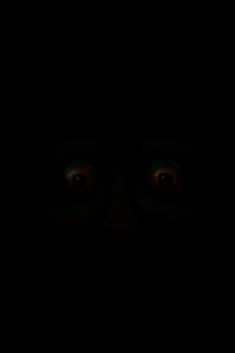

# 睡眠钟  
  

<b>基础值: </b> 0 
  

<b>变化范围: </b> 0 ~ 999 
  

<b>基础变化率: </b> -1 / 每15分钟 
  
## 阶段  

<table><tr style="height:2em;"><td style="background-color:#F0F0F0;text-align:center;width:180px;font-size:1.4em;font-weight:bold;vertical-align:middle;">
1 ～ 999

0% ～ 100%
</td><td colspan=2 style="font-size:1.1em;vertical-align:middle;background-color:#F9F9F9;">
<b></b>

</td></tr><tr><td colspan=2><b>影响：</b>[

[体感温度](TemperaturePerceived.md)](TemperaturePerceived.md)<b>-2</b></td></tr><tr><td colspan=2></td></tr></table>
  
## 可被以下操作改变  
<table class="table table-bordered" data-toggle="table"  ><thead style=""><tr ><th  style="text-align:left;vertical-align:top;"  >来源</th><th  style="text-align:left;vertical-align:top;"  >操作</th><th  style="text-align:left;vertical-align:top;"  data-sortable="true"  >值</th></tr></thead><tr ><td  style="text-align:left;vertical-align:top;"  >[

[睡袋](BedRoll.md)](BedRoll.md)</td><td  style="text-align:left;vertical-align:top;"  >睡觉</td><td  style="text-align:left;vertical-align:top;"  >31</td></tr><tr ><td  style="text-align:left;vertical-align:top;"  >[

[简易床](BedRustic.md)](BedRustic.md)</td><td  style="text-align:left;vertical-align:top;"  >睡觉</td><td  style="text-align:left;vertical-align:top;"  >31</td></tr><tr ><td  style="text-align:left;vertical-align:top;"  >[

[木床](BedWooden.md)](BedWooden.md)</td><td  style="text-align:left;vertical-align:top;"  >睡觉</td><td  style="text-align:left;vertical-align:top;"  >31</td></tr><tr ><td  style="text-align:left;vertical-align:top;"  >[

[吊床](Hammock.md)](Hammock.md)</td><td  style="text-align:left;vertical-align:top;"  >睡觉</td><td  style="text-align:left;vertical-align:top;"  >31</td></tr><tr ><td  style="text-align:left;vertical-align:top;"  >[

[叶床](LeafBed.md)](LeafBed.md)</td><td  style="text-align:left;vertical-align:top;"  >睡觉</td><td  style="text-align:left;vertical-align:top;"  >31</td></tr><tr ><td  style="text-align:left;vertical-align:top;"  >[

[人鱼巢](MermaidNest.md)](MermaidNest.md)</td><td  style="text-align:left;vertical-align:top;"  >睡觉</td><td  style="text-align:left;vertical-align:top;"  >31</td></tr><tr ><td  style="text-align:left;vertical-align:top;"  >[

[窝棚](Shelter.md)](Shelter.md)</td><td  style="text-align:left;vertical-align:top;"  >睡觉</td><td  style="text-align:left;vertical-align:top;"  >31</td></tr><tr ><td  style="text-align:left;vertical-align:top;"  >[

[有遮蔽的叶床](ShelteredLeafBed.md)](ShelteredLeafBed.md)</td><td  style="text-align:left;vertical-align:top;"  >睡觉</td><td  style="text-align:left;vertical-align:top;"  >31</td></tr><tr ><td  style="text-align:left;vertical-align:top;"  >[

[帐篷](TentDeployed.md)](TentDeployed.md)</td><td  style="text-align:left;vertical-align:top;"  >睡觉</td><td  style="text-align:left;vertical-align:top;"  >31</td></tr><tr ><td  style="text-align:left;vertical-align:top;"  >[

[木筏庇护所](RaftShelter.md)](RaftShelter.md)</td><td  style="text-align:left;vertical-align:top;"  >睡觉</td><td  style="text-align:left;vertical-align:top;"  >31</td></tr><tr ><td  style="text-align:left;vertical-align:top;"  >[

[睡袋](BedRoll.md)](BedRoll.md)</td><td  style="text-align:left;vertical-align:top;"  >小憩</td><td  style="text-align:left;vertical-align:top;"  >15</td></tr><tr ><td  style="text-align:left;vertical-align:top;"  >[

[简易床](BedRustic.md)](BedRustic.md)</td><td  style="text-align:left;vertical-align:top;"  >小憩</td><td  style="text-align:left;vertical-align:top;"  >15</td></tr><tr ><td  style="text-align:left;vertical-align:top;"  >[

[木床](BedWooden.md)](BedWooden.md)</td><td  style="text-align:left;vertical-align:top;"  >小憩</td><td  style="text-align:left;vertical-align:top;"  >15</td></tr><tr ><td  style="text-align:left;vertical-align:top;"  >[

[吊床](Hammock.md)](Hammock.md)</td><td  style="text-align:left;vertical-align:top;"  >小憩</td><td  style="text-align:left;vertical-align:top;"  >15</td></tr><tr ><td  style="text-align:left;vertical-align:top;"  >[

[叶床](LeafBed.md)](LeafBed.md)</td><td  style="text-align:left;vertical-align:top;"  >小憩</td><td  style="text-align:left;vertical-align:top;"  >15</td></tr><tr ><td  style="text-align:left;vertical-align:top;"  >[

[人鱼巢](MermaidNest.md)](MermaidNest.md)</td><td  style="text-align:left;vertical-align:top;"  >小憩</td><td  style="text-align:left;vertical-align:top;"  >15</td></tr><tr ><td  style="text-align:left;vertical-align:top;"  >[

[窝棚](Shelter.md)](Shelter.md)</td><td  style="text-align:left;vertical-align:top;"  >小憩</td><td  style="text-align:left;vertical-align:top;"  >15</td></tr><tr ><td  style="text-align:left;vertical-align:top;"  >[

[有遮蔽的叶床](ShelteredLeafBed.md)](ShelteredLeafBed.md)</td><td  style="text-align:left;vertical-align:top;"  >小憩</td><td  style="text-align:left;vertical-align:top;"  >15</td></tr><tr ><td  style="text-align:left;vertical-align:top;"  >[

[帐篷](TentDeployed.md)](TentDeployed.md)</td><td  style="text-align:left;vertical-align:top;"  >小憩</td><td  style="text-align:left;vertical-align:top;"  >15</td></tr><tr ><td  style="text-align:left;vertical-align:top;"  >[

[你睡着了！(事件)](Event_FallingAsleep.md)](Event_FallingAsleep.md)</td><td  style="text-align:left;vertical-align:top;"  >Zzz……</td><td  style="text-align:left;vertical-align:top;"  >15</td></tr><tr ><td  style="text-align:left;vertical-align:top;"  >[

[木筏庇护所](RaftShelter.md)](RaftShelter.md)</td><td  style="text-align:left;vertical-align:top;"  >小憩</td><td  style="text-align:left;vertical-align:top;"  >15</td></tr><tr ><td  style="text-align:left;vertical-align:top;"  >[

[噩梦！(事件)](Event_Nightmare.md)](Event_Nightmare.md)</td><td  style="text-align:left;vertical-align:top;"  >试着冷静下来……</td><td  style="text-align:left;vertical-align:top;"  >-999</td></tr><tr ><td  style="text-align:left;vertical-align:top;"  >[

[一只蜘蛛咬了我！(事件)](Event_SpiderNight.md)](Event_SpiderNight.md)</td><td  style="text-align:left;vertical-align:top;"  >赶走蜘蛛！</td><td  style="text-align:left;vertical-align:top;"  >-999</td></tr></tbody></table>  
  
## 被以下操作需求  
<table class="table table-bordered" data-toggle="table"  ><thead style=""><tr ><th  style="text-align:left;vertical-align:top;"  >来源</th><th  style="text-align:left;vertical-align:top;"  >操作</th><th  style="text-align:left;vertical-align:top;"  >值</th></tr></thead><tr ><td  style="text-align:left;vertical-align:top;"  >[船长(Special1a)(事件)](Event_CaptainSpecial1a.md)</td><td  style="text-align:left;vertical-align:top;"  >触发事件</td><td  style="text-align:left;vertical-align:top;"  >1 ~ 999</td></tr><tr ><td  style="text-align:left;vertical-align:top;"  >[噩梦！(事件)](Event_Nightmare.md)</td><td  style="text-align:left;vertical-align:top;"  >触发事件</td><td  style="text-align:left;vertical-align:top;"  >1 ~ 14</td></tr><tr ><td  style="text-align:left;vertical-align:top;"  >[韦斯顿(Special1a)(事件)](Event_WestonSpecial1a.md)</td><td  style="text-align:left;vertical-align:top;"  >触发事件</td><td  style="text-align:left;vertical-align:top;"  >1 ~ 999</td></tr></tbody></table>  
  

