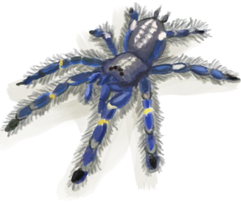

# 睡眠中断  
  

<b>基础值: </b> 0 
  

<b>变化范围: </b> 0 ~ 1 
  

<b>基础变化率: </b> 无 
  
## 可被以下操作改变  
<table class="table table-bordered table4026" data-toggle="table"  ><thead style=""><tr ><th  style=""  >来源</th><th  style=""  >操作</th><th  style=""  data-sortable="true"  >值</th></tr></thead><tr ><td  style=""  >[

[风太大了！(事件)](Event_Flood.md)](Event_Flood.md)</td><td  style=""  >躲避一会</td><td  style=""  >1</td></tr><tr ><td  style=""  >[

[风太大了！(事件)](Event_Storm.md)](Event_Storm.md)</td><td  style=""  >躲避狂风暴雨</td><td  style=""  >1</td></tr><tr ><td  style=""  >[

[有船来了！(事件)](Event_ShipRescueDistance.md)](Event_ShipRescueDistance.md)</td><td  style=""  >触发事件</td><td  style=""  >1</td></tr><tr ><td  style=""  >[

[船长(Special1a)(事件)](Event_CaptainSpecial1a.md)](Event_CaptainSpecial1a.md)</td><td  style=""  >触发事件</td><td  style=""  >1</td></tr><tr ><td  style=""  >[

[猎手来了(事件)](Event_HunterFight.md)](Event_HunterFight.md)</td><td  style=""  >触发事件</td><td  style=""  >1</td></tr><tr ><td  style=""  >[

[噩梦！(事件)](Event_Nightmare.md)](Event_Nightmare.md)</td><td  style=""  >触发事件</td><td  style=""  >1</td></tr><tr ><td  style=""  >[

[监视者(事件)](Event_WatchedExperience1a.md)](Event_WatchedExperience1a.md)</td><td  style=""  >触发事件</td><td  style=""  >1</td></tr><tr ><td  style=""  >[

[韦斯顿(Special1a)(事件)](Event_WestonSpecial1a.md)](Event_WestonSpecial1a.md)</td><td  style=""  >触发事件</td><td  style=""  >1</td></tr><tr ><td  style=""  >[

[睡袋](BedRoll.md)](BedRoll.md)</td><td  style=""  >小憩</td><td  style=""  >-1</td></tr><tr ><td  style=""  >[

[睡袋](BedRoll.md)](BedRoll.md)</td><td  style=""  >睡觉</td><td  style=""  >-1</td></tr><tr ><td  style=""  >[

[简易床](BedRustic.md)](BedRustic.md)</td><td  style=""  >小憩</td><td  style=""  >-1</td></tr><tr ><td  style=""  >[

[简易床](BedRustic.md)](BedRustic.md)</td><td  style=""  >睡觉</td><td  style=""  >-1</td></tr><tr ><td  style=""  >[

[木床](BedWooden.md)](BedWooden.md)</td><td  style=""  >小憩</td><td  style=""  >-1</td></tr><tr ><td  style=""  >[

[木床](BedWooden.md)](BedWooden.md)</td><td  style=""  >睡觉</td><td  style=""  >-1</td></tr><tr ><td  style=""  >[

[吊床](Hammock.md)](Hammock.md)</td><td  style=""  >小憩</td><td  style=""  >-1</td></tr><tr ><td  style=""  >[

[吊床](Hammock.md)](Hammock.md)</td><td  style=""  >睡觉</td><td  style=""  >-1</td></tr><tr ><td  style=""  >[

[叶床](LeafBed.md)](LeafBed.md)</td><td  style=""  >小憩</td><td  style=""  >-1</td></tr><tr ><td  style=""  >[

[叶床](LeafBed.md)](LeafBed.md)</td><td  style=""  >睡觉</td><td  style=""  >-1</td></tr><tr ><td  style=""  >[

[人鱼巢](MermaidNest.md)](MermaidNest.md)</td><td  style=""  >小憩</td><td  style=""  >-1</td></tr><tr ><td  style=""  >[

[人鱼巢](MermaidNest.md)](MermaidNest.md)</td><td  style=""  >睡觉</td><td  style=""  >-1</td></tr><tr ><td  style=""  >[

[窝棚](Shelter.md)](Shelter.md)</td><td  style=""  >小憩</td><td  style=""  >-1</td></tr><tr ><td  style=""  >[

[窝棚](Shelter.md)](Shelter.md)</td><td  style=""  >睡觉</td><td  style=""  >-1</td></tr><tr ><td  style=""  >[

[有遮蔽的叶床](ShelteredLeafBed.md)](ShelteredLeafBed.md)</td><td  style=""  >小憩</td><td  style=""  >-1</td></tr><tr ><td  style=""  >[

[有遮蔽的叶床](ShelteredLeafBed.md)](ShelteredLeafBed.md)</td><td  style=""  >睡觉</td><td  style=""  >-1</td></tr><tr ><td  style=""  >[

[帐篷](TentDeployed.md)](TentDeployed.md)</td><td  style=""  >小憩</td><td  style=""  >-1</td></tr><tr ><td  style=""  >[

[帐篷](TentDeployed.md)](TentDeployed.md)</td><td  style=""  >睡觉</td><td  style=""  >-1</td></tr><tr ><td  style=""  >[

[船长(Special1a)(事件)](Event_CaptainSpecial1a.md)](Event_CaptainSpecial1a.md)</td><td  style=""  >啥？？现在吗？？</td><td  style=""  >-1</td></tr><tr ><td  style=""  >[

[你睡着了！(事件)](Event_FallingAsleep.md)](Event_FallingAsleep.md)</td><td  style=""  >Zzz……</td><td  style=""  >-1</td></tr><tr ><td  style=""  >[

[噩梦！(事件)](Event_Nightmare.md)](Event_Nightmare.md)</td><td  style=""  >试着冷静下来……</td><td  style=""  >-1</td></tr><tr ><td  style=""  >[

[一只蜘蛛咬了我！(事件)](Event_SpiderNight.md)](Event_SpiderNight.md)</td><td  style=""  >赶走蜘蛛！</td><td  style=""  >-1</td></tr><tr ><td  style=""  >[

[韦斯顿(Special1a)(事件)](Event_WestonSpecial1a.md)](Event_WestonSpecial1a.md)</td><td  style=""  >唔……我现在醒了。</td><td  style=""  >-1</td></tr><tr ><td  style=""  >[

[木筏庇护所](RaftShelter.md)](RaftShelter.md)</td><td  style=""  >小憩</td><td  style=""  >-1</td></tr><tr ><td  style=""  >[

[木筏庇护所](RaftShelter.md)](RaftShelter.md)</td><td  style=""  >睡觉</td><td  style=""  >-1</td></tr></tbody></table>  
  
## 被以下操作需求  
<table class="table table-bordered table1153" data-toggle="table"  ><thead style=""><tr ><th  style=""  >来源</th><th  style=""  >操作</th><th  style=""  data-sortable="true"  >值</th></tr></thead><tr ><td  style=""  >[睡袋](BedRoll.md)</td><td  style=""  >小憩</td><td  style=""  >1</td></tr><tr ><td  style=""  >[睡袋](BedRoll.md)</td><td  style=""  >睡觉</td><td  style=""  >1</td></tr><tr ><td  style=""  >[简易床](BedRustic.md)</td><td  style=""  >小憩</td><td  style=""  >1</td></tr><tr ><td  style=""  >[简易床](BedRustic.md)</td><td  style=""  >睡觉</td><td  style=""  >1</td></tr><tr ><td  style=""  >[木床](BedWooden.md)</td><td  style=""  >小憩</td><td  style=""  >1</td></tr><tr ><td  style=""  >[木床](BedWooden.md)</td><td  style=""  >睡觉</td><td  style=""  >1</td></tr><tr ><td  style=""  >[吊床](Hammock.md)</td><td  style=""  >小憩</td><td  style=""  >1</td></tr><tr ><td  style=""  >[吊床](Hammock.md)</td><td  style=""  >睡觉</td><td  style=""  >1</td></tr><tr ><td  style=""  >[叶床](LeafBed.md)</td><td  style=""  >小憩</td><td  style=""  >1</td></tr><tr ><td  style=""  >[叶床](LeafBed.md)</td><td  style=""  >睡觉</td><td  style=""  >1</td></tr><tr ><td  style=""  >[人鱼巢](MermaidNest.md)</td><td  style=""  >小憩</td><td  style=""  >1</td></tr><tr ><td  style=""  >[人鱼巢](MermaidNest.md)</td><td  style=""  >睡觉</td><td  style=""  >1</td></tr><tr ><td  style=""  >[窝棚](Shelter.md)</td><td  style=""  >小憩</td><td  style=""  >1</td></tr><tr ><td  style=""  >[窝棚](Shelter.md)</td><td  style=""  >睡觉</td><td  style=""  >1</td></tr><tr ><td  style=""  >[有遮蔽的叶床](ShelteredLeafBed.md)</td><td  style=""  >小憩</td><td  style=""  >1</td></tr><tr ><td  style=""  >[有遮蔽的叶床](ShelteredLeafBed.md)</td><td  style=""  >睡觉</td><td  style=""  >1</td></tr><tr ><td  style=""  >[帐篷](TentDeployed.md)</td><td  style=""  >小憩</td><td  style=""  >1</td></tr><tr ><td  style=""  >[帐篷](TentDeployed.md)</td><td  style=""  >睡觉</td><td  style=""  >1</td></tr><tr ><td  style=""  >[你睡着了！(事件)](Event_FallingAsleep.md)</td><td  style=""  >Zzz……</td><td  style=""  >1</td></tr><tr ><td  style=""  >[木筏庇护所](RaftShelter.md)</td><td  style=""  >小憩</td><td  style=""  >1</td></tr><tr ><td  style=""  >[木筏庇护所](RaftShelter.md)</td><td  style=""  >睡觉</td><td  style=""  >1</td></tr></tbody></table>  
  

