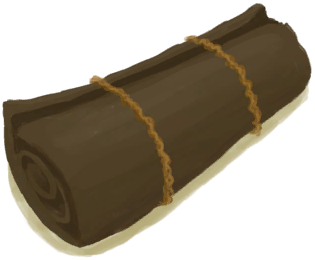

# 睡眠中断  
  

<b>基础值: </b> 0 
  

<b>变化范围: </b> 0 ~ 1 
  

<b>基础变化率: </b> 无 
  
  
## 可被以下操作改变  
<table class="table table-bordered" data-toggle="table"  ><thead style=""><tr ><th  style="text-align:left;vertical-align:top;"  >来源</th><th  style="text-align:left;vertical-align:top;"  >操作</th><th  style="text-align:left;vertical-align:top;"  data-sortable="true"  >值</th></tr></thead><tr ><td  style="text-align:left;vertical-align:top;"  >[

[风太大了！(事件)](Event_Flood.md)](Event_Flood.md)(未实装)</td><td  style="text-align:left;vertical-align:top;"  >躲避一会</td><td  style="text-align:left;vertical-align:top;"  >1</td></tr><tr ><td  style="text-align:left;vertical-align:top;"  >[

[风太大了！(事件)](Event_Storm.md)](Event_Storm.md)</td><td  style="text-align:left;vertical-align:top;"  >躲避狂风暴雨</td><td  style="text-align:left;vertical-align:top;"  >1</td></tr><tr ><td  style="text-align:left;vertical-align:top;"  >[

[有船来了！(事件)](Event_ShipRescueDistance.md)](Event_ShipRescueDistance.md)</td><td  style="text-align:left;vertical-align:top;"  >触发事件</td><td  style="text-align:left;vertical-align:top;"  >1</td></tr><tr ><td  style="text-align:left;vertical-align:top;"  >[

[船长(Special1a)(事件)](Event_CaptainSpecial1a.md)](Event_CaptainSpecial1a.md)</td><td  style="text-align:left;vertical-align:top;"  >触发事件</td><td  style="text-align:left;vertical-align:top;"  >1</td></tr><tr ><td  style="text-align:left;vertical-align:top;"  >[

[猎手来了！(事件)](Combat_EventHunter_1.md)](Combat_EventHunter_1.md)</td><td  style="text-align:left;vertical-align:top;"  >触发事件</td><td  style="text-align:left;vertical-align:top;"  >1</td></tr><tr ><td  style="text-align:left;vertical-align:top;"  >[

[噩梦！(事件)](Event_Nightmare.md)](Event_Nightmare.md)</td><td  style="text-align:left;vertical-align:top;"  >触发事件</td><td  style="text-align:left;vertical-align:top;"  >1</td></tr><tr ><td  style="text-align:left;vertical-align:top;"  >[

[监视者(事件)](Event_WatchedExperience1a.md)](Event_WatchedExperience1a.md)</td><td  style="text-align:left;vertical-align:top;"  >触发事件</td><td  style="text-align:left;vertical-align:top;"  >1</td></tr><tr ><td  style="text-align:left;vertical-align:top;"  >[

[韦斯顿(Special1a)(事件)](Event_WestonSpecial1a.md)](Event_WestonSpecial1a.md)</td><td  style="text-align:left;vertical-align:top;"  >触发事件</td><td  style="text-align:left;vertical-align:top;"  >1</td></tr><tr ><td  style="text-align:left;vertical-align:top;"  >[

[睡袋](BedRoll.md)](BedRoll.md)</td><td  style="text-align:left;vertical-align:top;"  >小憩</td><td  style="text-align:left;vertical-align:top;"  >-1</td></tr><tr ><td  style="text-align:left;vertical-align:top;"  >[

[睡袋](BedRoll.md)](BedRoll.md)</td><td  style="text-align:left;vertical-align:top;"  >睡觉</td><td  style="text-align:left;vertical-align:top;"  >-1</td></tr><tr ><td  style="text-align:left;vertical-align:top;"  >[

[简易床](BedRustic.md)](BedRustic.md)</td><td  style="text-align:left;vertical-align:top;"  >小憩</td><td  style="text-align:left;vertical-align:top;"  >-1</td></tr><tr ><td  style="text-align:left;vertical-align:top;"  >[

[简易床](BedRustic.md)](BedRustic.md)</td><td  style="text-align:left;vertical-align:top;"  >睡觉</td><td  style="text-align:left;vertical-align:top;"  >-1</td></tr><tr ><td  style="text-align:left;vertical-align:top;"  >[

[木床](BedWooden.md)](BedWooden.md)</td><td  style="text-align:left;vertical-align:top;"  >小憩</td><td  style="text-align:left;vertical-align:top;"  >-1</td></tr><tr ><td  style="text-align:left;vertical-align:top;"  >[

[木床](BedWooden.md)](BedWooden.md)</td><td  style="text-align:left;vertical-align:top;"  >睡觉</td><td  style="text-align:left;vertical-align:top;"  >-1</td></tr><tr ><td  style="text-align:left;vertical-align:top;"  >[

[吊床](Hammock.md)](Hammock.md)</td><td  style="text-align:left;vertical-align:top;"  >小憩</td><td  style="text-align:left;vertical-align:top;"  >-1</td></tr><tr ><td  style="text-align:left;vertical-align:top;"  >[

[吊床](Hammock.md)](Hammock.md)</td><td  style="text-align:left;vertical-align:top;"  >睡觉</td><td  style="text-align:left;vertical-align:top;"  >-1</td></tr><tr ><td  style="text-align:left;vertical-align:top;"  >[

[叶床](LeafBed.md)](LeafBed.md)</td><td  style="text-align:left;vertical-align:top;"  >小憩</td><td  style="text-align:left;vertical-align:top;"  >-1</td></tr><tr ><td  style="text-align:left;vertical-align:top;"  >[

[叶床](LeafBed.md)](LeafBed.md)</td><td  style="text-align:left;vertical-align:top;"  >睡觉</td><td  style="text-align:left;vertical-align:top;"  >-1</td></tr><tr ><td  style="text-align:left;vertical-align:top;"  >[

[人鱼巢](MermaidNest.md)](MermaidNest.md)</td><td  style="text-align:left;vertical-align:top;"  >小憩</td><td  style="text-align:left;vertical-align:top;"  >-1</td></tr><tr ><td  style="text-align:left;vertical-align:top;"  >[

[人鱼巢](MermaidNest.md)](MermaidNest.md)</td><td  style="text-align:left;vertical-align:top;"  >睡觉</td><td  style="text-align:left;vertical-align:top;"  >-1</td></tr><tr ><td  style="text-align:left;vertical-align:top;"  >[

[窝棚](Shelter.md)](Shelter.md)</td><td  style="text-align:left;vertical-align:top;"  >小憩</td><td  style="text-align:left;vertical-align:top;"  >-1</td></tr><tr ><td  style="text-align:left;vertical-align:top;"  >[

[窝棚](Shelter.md)](Shelter.md)</td><td  style="text-align:left;vertical-align:top;"  >睡觉</td><td  style="text-align:left;vertical-align:top;"  >-1</td></tr><tr ><td  style="text-align:left;vertical-align:top;"  >[

[有遮蔽的叶床](ShelteredLeafBed.md)](ShelteredLeafBed.md)</td><td  style="text-align:left;vertical-align:top;"  >小憩</td><td  style="text-align:left;vertical-align:top;"  >-1</td></tr><tr ><td  style="text-align:left;vertical-align:top;"  >[

[有遮蔽的叶床](ShelteredLeafBed.md)](ShelteredLeafBed.md)</td><td  style="text-align:left;vertical-align:top;"  >睡觉</td><td  style="text-align:left;vertical-align:top;"  >-1</td></tr><tr ><td  style="text-align:left;vertical-align:top;"  >[

[帐篷](TentDeployed.md)](TentDeployed.md)</td><td  style="text-align:left;vertical-align:top;"  >小憩</td><td  style="text-align:left;vertical-align:top;"  >-1</td></tr><tr ><td  style="text-align:left;vertical-align:top;"  >[

[帐篷](TentDeployed.md)](TentDeployed.md)</td><td  style="text-align:left;vertical-align:top;"  >睡觉</td><td  style="text-align:left;vertical-align:top;"  >-1</td></tr><tr ><td  style="text-align:left;vertical-align:top;"  >[

[船长(Special1a)(事件)](Event_CaptainSpecial1a.md)](Event_CaptainSpecial1a.md)</td><td  style="text-align:left;vertical-align:top;"  >啥？？现在吗？？</td><td  style="text-align:left;vertical-align:top;"  >-1</td></tr><tr ><td  style="text-align:left;vertical-align:top;"  >[

[你睡着了！(事件)](Event_FallingAsleep.md)](Event_FallingAsleep.md)</td><td  style="text-align:left;vertical-align:top;"  >Zzz……</td><td  style="text-align:left;vertical-align:top;"  >-1</td></tr><tr ><td  style="text-align:left;vertical-align:top;"  >[

[噩梦！(事件)](Event_Nightmare.md)](Event_Nightmare.md)</td><td  style="text-align:left;vertical-align:top;"  >试着冷静下来……</td><td  style="text-align:left;vertical-align:top;"  >-1</td></tr><tr ><td  style="text-align:left;vertical-align:top;"  >[

[一只蜘蛛咬了我！(事件)](Event_SpiderNight.md)](Event_SpiderNight.md)</td><td  style="text-align:left;vertical-align:top;"  >赶走蜘蛛！</td><td  style="text-align:left;vertical-align:top;"  >-1</td></tr><tr ><td  style="text-align:left;vertical-align:top;"  >[

[韦斯顿(Special1a)(事件)](Event_WestonSpecial1a.md)](Event_WestonSpecial1a.md)</td><td  style="text-align:left;vertical-align:top;"  >唔……我现在醒了。</td><td  style="text-align:left;vertical-align:top;"  >-1</td></tr><tr ><td  style="text-align:left;vertical-align:top;"  >[

[木筏庇护所](RaftShelter.md)](RaftShelter.md)</td><td  style="text-align:left;vertical-align:top;"  >小憩</td><td  style="text-align:left;vertical-align:top;"  >-1</td></tr><tr ><td  style="text-align:left;vertical-align:top;"  >[

[木筏庇护所](RaftShelter.md)](RaftShelter.md)</td><td  style="text-align:left;vertical-align:top;"  >睡觉</td><td  style="text-align:left;vertical-align:top;"  >-1</td></tr></tbody></table>  
  
  
## 被以下操作需求  
<table class="table table-bordered" data-toggle="table"  ><thead style=""><tr ><th  style="text-align:left;vertical-align:top;"  >来源</th><th  style="text-align:left;vertical-align:top;"  >操作</th><th  style="text-align:left;vertical-align:top;"  data-sortable="true"  >值</th></tr></thead><tr ><td  style="text-align:left;vertical-align:top;"  >[睡袋](BedRoll.md)</td><td  style="text-align:left;vertical-align:top;"  >小憩</td><td  style="text-align:left;vertical-align:top;"  >1</td></tr><tr ><td  style="text-align:left;vertical-align:top;"  >[睡袋](BedRoll.md)</td><td  style="text-align:left;vertical-align:top;"  >睡觉</td><td  style="text-align:left;vertical-align:top;"  >1</td></tr><tr ><td  style="text-align:left;vertical-align:top;"  >[简易床](BedRustic.md)</td><td  style="text-align:left;vertical-align:top;"  >小憩</td><td  style="text-align:left;vertical-align:top;"  >1</td></tr><tr ><td  style="text-align:left;vertical-align:top;"  >[简易床](BedRustic.md)</td><td  style="text-align:left;vertical-align:top;"  >睡觉</td><td  style="text-align:left;vertical-align:top;"  >1</td></tr><tr ><td  style="text-align:left;vertical-align:top;"  >[木床](BedWooden.md)</td><td  style="text-align:left;vertical-align:top;"  >小憩</td><td  style="text-align:left;vertical-align:top;"  >1</td></tr><tr ><td  style="text-align:left;vertical-align:top;"  >[木床](BedWooden.md)</td><td  style="text-align:left;vertical-align:top;"  >睡觉</td><td  style="text-align:left;vertical-align:top;"  >1</td></tr><tr ><td  style="text-align:left;vertical-align:top;"  >[吊床](Hammock.md)</td><td  style="text-align:left;vertical-align:top;"  >小憩</td><td  style="text-align:left;vertical-align:top;"  >1</td></tr><tr ><td  style="text-align:left;vertical-align:top;"  >[吊床](Hammock.md)</td><td  style="text-align:left;vertical-align:top;"  >睡觉</td><td  style="text-align:left;vertical-align:top;"  >1</td></tr><tr ><td  style="text-align:left;vertical-align:top;"  >[叶床](LeafBed.md)</td><td  style="text-align:left;vertical-align:top;"  >小憩</td><td  style="text-align:left;vertical-align:top;"  >1</td></tr><tr ><td  style="text-align:left;vertical-align:top;"  >[叶床](LeafBed.md)</td><td  style="text-align:left;vertical-align:top;"  >睡觉</td><td  style="text-align:left;vertical-align:top;"  >1</td></tr><tr ><td  style="text-align:left;vertical-align:top;"  >[人鱼巢](MermaidNest.md)</td><td  style="text-align:left;vertical-align:top;"  >小憩</td><td  style="text-align:left;vertical-align:top;"  >1</td></tr><tr ><td  style="text-align:left;vertical-align:top;"  >[人鱼巢](MermaidNest.md)</td><td  style="text-align:left;vertical-align:top;"  >睡觉</td><td  style="text-align:left;vertical-align:top;"  >1</td></tr><tr ><td  style="text-align:left;vertical-align:top;"  >[窝棚](Shelter.md)</td><td  style="text-align:left;vertical-align:top;"  >小憩</td><td  style="text-align:left;vertical-align:top;"  >1</td></tr><tr ><td  style="text-align:left;vertical-align:top;"  >[窝棚](Shelter.md)</td><td  style="text-align:left;vertical-align:top;"  >睡觉</td><td  style="text-align:left;vertical-align:top;"  >1</td></tr><tr ><td  style="text-align:left;vertical-align:top;"  >[有遮蔽的叶床](ShelteredLeafBed.md)</td><td  style="text-align:left;vertical-align:top;"  >小憩</td><td  style="text-align:left;vertical-align:top;"  >1</td></tr><tr ><td  style="text-align:left;vertical-align:top;"  >[有遮蔽的叶床](ShelteredLeafBed.md)</td><td  style="text-align:left;vertical-align:top;"  >睡觉</td><td  style="text-align:left;vertical-align:top;"  >1</td></tr><tr ><td  style="text-align:left;vertical-align:top;"  >[帐篷](TentDeployed.md)</td><td  style="text-align:left;vertical-align:top;"  >小憩</td><td  style="text-align:left;vertical-align:top;"  >1</td></tr><tr ><td  style="text-align:left;vertical-align:top;"  >[帐篷](TentDeployed.md)</td><td  style="text-align:left;vertical-align:top;"  >睡觉</td><td  style="text-align:left;vertical-align:top;"  >1</td></tr><tr ><td  style="text-align:left;vertical-align:top;"  >[你睡着了！(事件)](Event_FallingAsleep.md)</td><td  style="text-align:left;vertical-align:top;"  >Zzz……</td><td  style="text-align:left;vertical-align:top;"  >1</td></tr><tr ><td  style="text-align:left;vertical-align:top;"  >[木筏庇护所](RaftShelter.md)</td><td  style="text-align:left;vertical-align:top;"  >小憩</td><td  style="text-align:left;vertical-align:top;"  >1</td></tr><tr ><td  style="text-align:left;vertical-align:top;"  >[木筏庇护所](RaftShelter.md)</td><td  style="text-align:left;vertical-align:top;"  >睡觉</td><td  style="text-align:left;vertical-align:top;"  >1</td></tr></tbody></table>  
  
  
## 相关触发器  

<table><tr style="background-color:#F8F8F8"><td><b>到达目的地</b></td></tr><tr><td><b>触发条件：</b>[

[距离](Distance.md)](Distance.md): <b>2016-2016</b></td></tr><tr><td><b>触发后：</b>[睡眠中断](SleepInterrupt.md)<b>+1</b></td></tr><tr><td>[

[有船来了！(事件)](Event_ShipRescueDistance.md)](Event_ShipRescueDistance.md)(<b>+1</b>)</td></tr></table>
  

<table><tr style="background-color:#F8F8F8"><td><b>船长的特别谈话1</b></td></tr><tr><td><b>触发条件：</b>[船长亲密关系](CaptainPropinquity.md): <b>2000-3000</b>, [睡眠钟](SleepClock.md): <b>1-999</b></td></tr><tr><td><b>触发后：</b>[睡眠中断](SleepInterrupt.md)<b>+1</b></td></tr><tr><td>[

[船长(Special1a)(事件)](Event_CaptainSpecial1a.md)](Event_CaptainSpecial1a.md)(<b>+1</b>)</td></tr></table>
  

<table><tr style="background-color:#F8F8F8"><td><b>追杀体验</b></td></tr><tr><td><b>触发条件：</b>[

[猎手接近](HuntersProximity.md)](HuntersProximity.md): <b>96-96</b>, [精神失常计数器](PsychoCounter.md): <b>0-0</b>, [夜晚](IsNight.md): <b>1-1</b></td></tr><tr><td><b>触发后：</b>[精神失常计数器](PsychoCounter.md)<b>+96</b>, [睡眠中断](SleepInterrupt.md)<b>+1</b></td></tr><tr><td>[

[猎手来了！(事件)](Combat_EventHunter_1.md)](Combat_EventHunter_1.md)(<b>+1</b>)</td></tr></table>
  

<table><tr style="background-color:#F8F8F8"><td><b>梦魇</b></td></tr><tr><td><b>触发条件：</b>[

[压力](Stress.md)](Stress.md): <b>193-240</b>, [睡眠钟](SleepClock.md): <b>1-14</b>, [梦魇计数器](NightmareCounter.md): <b>0-0</b></td></tr><tr><td><b>触发后：</b>[睡眠中断](SleepInterrupt.md)<b>+1</b>, [梦魇计数器](NightmareCounter.md)<b>+36～+144</b></td></tr><tr><td>[

[噩梦！(事件)](Event_Nightmare.md)](Event_Nightmare.md)(<b>+1</b>)</td></tr></table>
  

<table><tr style="background-color:#F8F8F8"><td><b>监视体验</b></td></tr><tr><td><b>触发条件：</b>[

[监视者的凝视](WatchersGlare.md)](WatchersGlare.md): <b>96-96</b>, [精神失常计数器](PsychoCounter.md): <b>0-0</b></td></tr><tr><td><b>触发后：</b>[精神失常计数器](PsychoCounter.md)<b>+96</b>, [睡眠中断](SleepInterrupt.md)<b>+1</b></td></tr><tr><td>[

[监视者(事件)](Event_WatchedExperience1a.md)](Event_WatchedExperience1a.md)(<b>+1</b>)</td></tr></table>
  

<table><tr style="background-color:#F8F8F8"><td><b>韦斯顿的特别谈话1</b></td></tr><tr><td><b>触发条件：</b>[韦斯顿亲密关系](WestonPropinquity.md): <b>2000-3000</b>, [睡眠钟](SleepClock.md): <b>1-999</b></td></tr><tr><td><b>触发后：</b>[睡眠中断](SleepInterrupt.md)<b>+1</b></td></tr><tr><td>[

[韦斯顿(Special1a)(事件)](Event_WestonSpecial1a.md)](Event_WestonSpecial1a.md)(<b>+1</b>)</td></tr></table>
  

