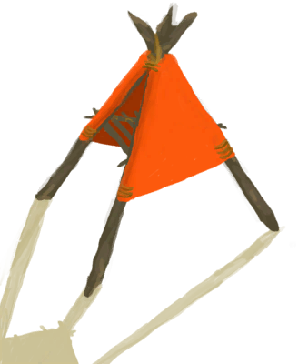

# 烟熏炉  
> 我可以用火种重新引燃它。  
  
<table class="table table-bordered" data-toggle="table"  data-show-header="false"><thead style="display:none"><tr ><th  style="width:50%;text-align:left;vertical-align:top;"  >title</th><th  style="width:50%;text-align:left;vertical-align:top;"  ></th></tr></thead><tr ><td  style="width:50%;text-align:left;vertical-align:top;"  >** 不可删除 **  **槽位：**4</td><td  style="width:50%;text-align:left;vertical-align:top;"  >

<a href="SmokerExtinguishedPlastic.md" style="color:black">烟熏炉</a>

</td></tr></tbody></table>  
  
## 获取来源  

熄灭火焰

[烟熏炉(塑料布)(点燃)](SmokerPlastic.md)

转化

[烟熏炉(塑料布)(点燃)](SmokerPlastic.md)

  
  
## 动作  

<table><tr><td rowspan="2" style="width:200px;text-align:center;font-size:1.3em;font-weight:bold">

移除烟熏炉

30分

</td><td></td></tr><tr><td><b>自身：</b>→ [

[营火(熄灭)](CampfireExtinguished.md)](CampfireExtinguished.md)</td></tr><tr><td colspan="2">[

[烟熏炉(塑料布)(无火)](SmokerNoFirePlastic.md)](SmokerNoFirePlastic.md)(<b>+1</b>)</td></tr></table>
  
  
  
## 可拖入  

<table style="margin-bottom:0px;"><tr><td style="width:40%;text-align:left; background-color:#FEFEFE"><b>拖入：</b>[

[木材](Wood.md)](Wood.md)</td><td style="width:40%;font-size:1em;font-weight:bold;background-color:#FEFEFE">添入柴火  </td></tr><tr style="background-color:#FFFFFF"><td style=""><b>使用物：</b>→消失</td><td style=""><b>自身：</b>燃料  <b>+28(29.17%)</b></td></tr></table>
  

<table style="margin-bottom:0px;"><tr><td style="width:40%;text-align:left; background-color:#FEFEFE"><b>拖入：</b>[

[木炭](Charcoal.md)](Charcoal.md)</td><td style="width:40%;font-size:1em;font-weight:bold;background-color:#FEFEFE">添入木炭  </td></tr><tr style="background-color:#FFFFFF"><td style=""><b>使用物：</b>→消失</td><td style=""><b>自身：</b>燃料  <b>+25(26.04%)</b></td></tr></table>
  

<table style="margin-bottom:0px;"><tr><td style="width:40%;text-align:left; background-color:#FEFEFE"><b>拖入：</b>[

[小树枝](Sticks.md)](Sticks.md)</td><td style="width:40%;font-size:1em;font-weight:bold;background-color:#FEFEFE">添入小树枝  </td></tr><tr style="background-color:#FFFFFF"><td style=""><b>使用物：</b>→消失</td><td style=""><b>自身：</b>燃料  <b>+4(4.17%)</b></td></tr></table>
  

<table style="margin-bottom:0px;"><tr><td style="width:40%;text-align:left; background-color:#FEFEFE"><b>拖入：</b>[

[枯叶](LeavesDry.md)](LeavesDry.md) | [

[纤维](Fibers.md)](Fibers.md)</td><td style="width:40%;font-size:1em;font-weight:bold;background-color:#FEFEFE">添入火绒  </td></tr><tr style="background-color:#FFFFFF"><td style=""><b>使用物：</b>→消失</td><td style=""><b>自身：</b>燃料  <b>+1(1.04%)</b></td></tr></table>
  

<table style="margin-bottom:0px;"><tr><td style="width:40%;text-align:left; background-color:#FEFEFE"><b>拖入：</b>[

[火种](TinderLit.md)](TinderLit.md)</td><td style="width:40%;font-size:1em;font-weight:bold;background-color:#FEFEFE">点燃  </td></tr><tr style="background-color:#FFFFFF"><td style=""><b>使用物：</b>→消失</td><td style=""><b>自身：</b>→ [

[烟熏炉(塑料布)(点燃)](SmokerPlastic.md)](SmokerPlastic.md), 燃料  <b>+1(1.04%)</b></td></tr></table>
  

<table style="margin-bottom:0px;"><tr><td style="width:40%;text-align:left; background-color:#FEFEFE"><b>拖入：</b>[

[椰子壳](CoconutShell.md)](CoconutShell.md)</td><td style="width:40%;font-size:1em;font-weight:bold;background-color:#FEFEFE">添入椰子壳  </td></tr><tr style="background-color:#FFFFFF"><td style=""><b>使用物：</b>→消失</td><td style=""><b>自身：</b>燃料  <b>+2(2.08%)</b></td></tr></table>
  

<table style="margin-bottom:0px;"><tr><td style="width:40%;text-align:left; background-color:#FEFEFE"><b>拖入：</b>[

[棕榈叶](PalmFronds.md)](PalmFronds.md)</td><td style="width:40%;font-size:1em;font-weight:bold;background-color:#FEFEFE">添入棕榈叶  </td></tr><tr style="background-color:#FFFFFF"><td style=""><b>使用物：</b>→消失</td><td style=""><b>自身：</b>燃料  <b>+2(2.08%)</b></td></tr></table>
  
  
## 属性   

<table style="margin-bottom:0px;"><tr><td style="width:30%;text-align:left; background-color:#FEFEFE;font-size:1.3em;font-weight:bold;">燃料</td><td style="font-size:1em;background-color:#FEFEFE">初始：1 , 最大：96 -</td></tr><tr style="background-color:#FFFFFF"><td colspan=2></td></tr></table>
  

