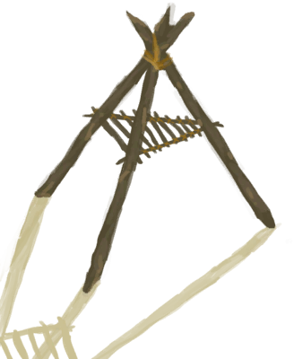

# 烟熏炉框架  
> 我需要加入一些大块布匹或塑料布来完成它。  
  
<table class="table table-bordered" data-toggle="table"  data-show-header="false"><thead style="display:none"><tr ><th  style="width:50%;text-align:left;vertical-align:top;"  >title</th><th  style="width:50%;text-align:left;vertical-align:top;"  ></th></tr></thead><tr ><td  style="width:50%;text-align:left;vertical-align:top;"  >** 不可删除 **</td><td  style="width:50%;text-align:left;vertical-align:top;"  >

<a href="SmokerFrame.md" style="color:black">烟熏炉框架</a>

</td></tr></tbody></table>  
  
## 获取来源  

移除布匹

[烟熏炉(无火)](SmokerNoFire.md)

移除塑料布

[烟熏炉(塑料布)(无火)](SmokerNoFirePlastic.md)

  
  
## 动作  

<table><tr><td rowspan="2" style="width:200px;text-align:center;font-size:1.3em;font-weight:bold">

移除树枝

15分

</td><td></td></tr><tr><td></td></tr><tr><td colspan="2"><b>需求：</b>[

[光亮](Light.md)](Light.md): 10-100</td></tr><tr><td colspan="2">[

[小树枝](Sticks.md)](Sticks.md)(+1)</td></tr></table>
  
  
  
## 可拖入  

<table style="margin-bottom:0px;"><tr><td style="width:40%;text-align:left; background-color:#FEFEFE"><b>拖入：</b>[

[塑料布](PlasticSheet.md)](PlasticSheet.md)</td><td style="width:40%;font-size:1em;font-weight:bold;background-color:#FEFEFE">覆盖烟熏炉 (30分) </td></tr><tr style="background-color:#FFFFFF"><td style=""><b>使用物：</b>→消失</td><td style=""><b>自身：</b>→ [

[烟熏炉(塑料布)(无火)](SmokerNoFirePlastic.md)](SmokerNoFirePlastic.md)</td></tr><tr><td colspan="2"><b>需求：</b>[

[光亮](Light.md)](Light.md): 10-100</td></tr></table>
  
  

