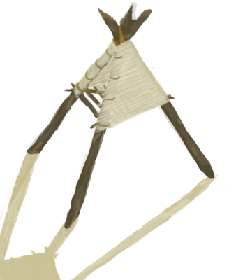
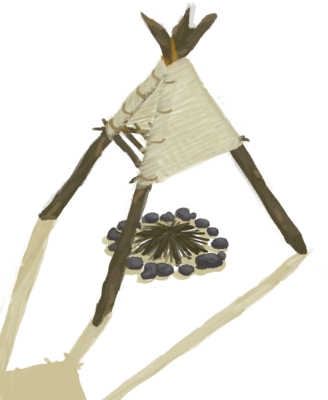

# 烟熏炉  
> 我应该把它放在营火上。  
  
<table class="table table-bordered" data-toggle="table" ><tbody><tr ><td  style="width:80%;text-align:left;vertical-align:top;"  >** 不可删除 **</td><td  style="width:20%;text-align:left;vertical-align:top;"  >

</td></tr></tbody></tbody></table>  
  
## 获取来源  
<table class="table table-bordered" data-toggle="table" ><thead><tr ><th  style="text-align:left;vertical-align:top;"  >来源</th><th  style="text-align:left;vertical-align:top;"  >操作</th></tr></thead><tr ><td  style="text-align:left;vertical-align:top;"  >[

[烟熏炉](Smoker.md)](Smoker.md)</td><td  style="text-align:left;vertical-align:top;"  >移除烟熏炉</td></tr><tr ><td  style="text-align:left;vertical-align:top;"  >[

[烟熏炉(熄灭)](SmokerExtinguished.md)](SmokerExtinguished.md)</td><td  style="text-align:left;vertical-align:top;"  >移除烟熏炉</td></tr><tr ><td  style="text-align:left;vertical-align:top;"  >[

[烟熏炉框架](SmokerFrame.md)](SmokerFrame.md)</td><td  style="text-align:left;vertical-align:top;"  >覆盖烟熏炉</td></tr></tbody></table>  
  
## 动作  
<table class="table table-bordered" data-toggle="table" ><thead><tr ><th  style="text-align:left;vertical-align:top;"  >动作</th><th  style="text-align:left;vertical-align:top;"  >耗时</th><th  style="text-align:left;vertical-align:top;"  >条件</th><th  style="text-align:left;vertical-align:top;"  >变化</th><th  style="text-align:left;vertical-align:top;"  data-sortable="true"  >状态</th></tr></thead><tr ><td  style="text-align:left;vertical-align:top;"  >移除布匹 </td><td  style="text-align:left;vertical-align:top;"  >2TP</td><td  style="text-align:left;vertical-align:top;"  >[

[光亮](Light.md)](Light.md): 10-100</td><td  style="text-align:left;vertical-align:top;"  >** 自身：** →消失  ** 获得： **   [

[烟熏炉框架](SmokerFrame.md)](SmokerFrame.md)(+1) 基础权重：1</td><td  style="text-align:left;vertical-align:top;"  ></td></tr></tbody></table>  
  

