# 烟熏炉  
> 我可以在这里烹饪或熏制食物。  
  
<table class="table table-bordered" data-toggle="table"  data-show-header="false"><thead style="display:none"><tr ><th  style="width:50%;text-align:left;vertical-align:top;"  >title</th><th  style="width:50%;text-align:left;vertical-align:top;"  ></th></tr></thead><tr ><td  style="width:50%;text-align:left;vertical-align:top;"  >** 不可删除 **  **槽位：**4  **过滤器：**[“可烹饪的”](tag_Cookable.md) , [“储水容器”](tag_WaterContainer.md)  ** 效果: ** [

[保温](InsulationCold.md)](InsulationCold.md)+20 [

[湿度](Wetness.md)](Wetness.md)加成-1 [

[湿度](Wetness.md)](Wetness.md)加成-1 [

[光亮](Light.md)](Light.md)+20</td><td  style="width:50%;text-align:left;vertical-align:top;"  >

<a href="SmokerPlastic.md" style="color:black">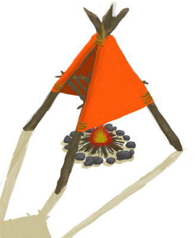烟熏炉</a>

</td></tr></tbody></table>  
  
## 获取来源  
<table class="table table-bordered" data-toggle="table"  ><thead style=""><tr ><th  style="text-align:left;vertical-align:top;"  >来源</th><th  style="text-align:left;vertical-align:top;"  >操作</th></tr></thead><tr ><td  style="text-align:left;vertical-align:top;"  >[

[烟熏炉(塑料布)(熄灭)](SmokerExtinguishedPlastic.md)](SmokerExtinguishedPlastic.md)</td><td  style="text-align:left;vertical-align:top;"  >点燃 ** 拖入：**[火种](TinderLit.md)</td></tr></tbody></table>  
  
## 动作  
<table class="table table-bordered" data-toggle="table"  ><thead style=""><tr ><th  style="text-align:left;vertical-align:top;"  >动作</th><th  style="text-align:left;vertical-align:top;"  >耗时</th><th  style="text-align:left;vertical-align:top;"  data-sortable="true"  >条件</th><th  style="text-align:left;vertical-align:top;"  >变化</th><th  style="text-align:left;vertical-align:top;"  data-sortable="true"  >状态</th></tr></thead><tr ><td  style="text-align:left;vertical-align:top;"  >取出火炭 </td><td  style="text-align:left;vertical-align:top;"  >-</td><td  style="text-align:left;vertical-align:top;"  ></td><td  style="text-align:left;vertical-align:top;"  >** 自身：** 燃料  -4(-4.17%)  ** 获得： ** ** [Embers]  **   [
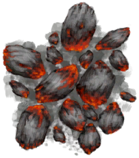
[火炭](Embers.md)](Embers.md)(+1) 基础权重：1</td><td  style="text-align:left;vertical-align:top;"  ></td></tr><tr ><td  style="text-align:left;vertical-align:top;"  >熄灭火焰 </td><td  style="text-align:left;vertical-align:top;"  >-</td><td  style="text-align:left;vertical-align:top;"  ></td><td  style="text-align:left;vertical-align:top;"  >** 自身：** → [

[烟熏炉(塑料布)(熄灭)](SmokerExtinguishedPlastic.md)](SmokerExtinguishedPlastic.md)</td><td  style="text-align:left;vertical-align:top;"  ></td></tr><tr ><td  style="text-align:left;vertical-align:top;"  >移除烟熏炉 </td><td  style="text-align:left;vertical-align:top;"  >30分</td><td  style="text-align:left;vertical-align:top;"  ></td><td  style="text-align:left;vertical-align:top;"  >** 自身：** → [
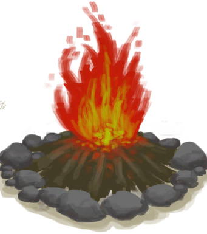
[营火](Campfire.md)](Campfire.md)  ** 获得： **   [
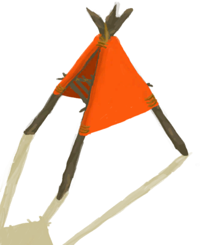
[烟熏炉(塑料布)(无火)](SmokerNoFirePlastic.md)](SmokerNoFirePlastic.md)(+1) 基础权重：1</td><td  style="text-align:left;vertical-align:top;"  ></td></tr></tbody></table>  
  
## 可拖入  
<table class="table table-bordered" data-toggle="table"  ><thead style=""><tr ><th  style="text-align:left;vertical-align:top;"  >使用</th><th  style="text-align:left;vertical-align:top;"  >动作</th><th  style="text-align:left;vertical-align:top;"  >耗时</th><th  style="text-align:left;vertical-align:top;"  data-sortable="true"  >条件</th><th  style="text-align:left;vertical-align:top;"  >变化</th><th  style="text-align:left;vertical-align:top;"  >玩家状态</th></tr></thead><tr ><td  style="text-align:left;vertical-align:top;"  >[

[木材](Wood.md)](Wood.md)</td><td  style="text-align:left;vertical-align:top;"  >添入柴火 </td><td  style="text-align:left;vertical-align:top;"  >-</td><td  style="text-align:left;vertical-align:top;"  ></td><td  style="text-align:left;vertical-align:top;"  >** 自身: ** 燃料  +28(29.17%)  ** 使用物: ** →消失</td><td  style="text-align:left;vertical-align:top;"  ></td></tr><tr ><td  style="text-align:left;vertical-align:top;"  >[

[木炭](Charcoal.md)](Charcoal.md)</td><td  style="text-align:left;vertical-align:top;"  >添入木炭 </td><td  style="text-align:left;vertical-align:top;"  >-</td><td  style="text-align:left;vertical-align:top;"  ></td><td  style="text-align:left;vertical-align:top;"  >** 自身: ** 燃料  +25(26.04%)  ** 使用物: ** →消失</td><td  style="text-align:left;vertical-align:top;"  ></td></tr><tr ><td  style="text-align:left;vertical-align:top;"  >[

[小树枝](Sticks.md)](Sticks.md)</td><td  style="text-align:left;vertical-align:top;"  >添入火种 </td><td  style="text-align:left;vertical-align:top;"  >-</td><td  style="text-align:left;vertical-align:top;"  ></td><td  style="text-align:left;vertical-align:top;"  >** 自身: ** 燃料  +4(4.17%)  ** 使用物: ** →消失</td><td  style="text-align:left;vertical-align:top;"  ></td></tr><tr ><td  style="text-align:left;vertical-align:top;"  >[
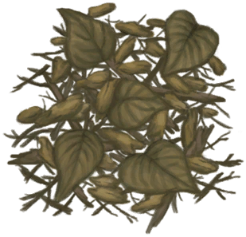
[枯叶](LeavesDry.md)](LeavesDry.md) [

[火种](TinderLit.md)](TinderLit.md) [

[纤维](Fibers.md)](Fibers.md)</td><td  style="text-align:left;vertical-align:top;"  >添入火绒 </td><td  style="text-align:left;vertical-align:top;"  >-</td><td  style="text-align:left;vertical-align:top;"  ></td><td  style="text-align:left;vertical-align:top;"  >** 自身: ** 燃料  +1(1.04%)  ** 使用物: ** →消失</td><td  style="text-align:left;vertical-align:top;"  ></td></tr><tr ><td  style="text-align:left;vertical-align:top;"  >[

[长木棍](StickLong.md)](StickLong.md)</td><td  style="text-align:left;vertical-align:top;"  >制作简易长矛 </td><td  style="text-align:left;vertical-align:top;"  >45分</td><td  style="text-align:left;vertical-align:top;"  ></td><td  style="text-align:left;vertical-align:top;"  > ** 使用物: ** → [

[简易长矛](SpearRustic.md)](SpearRustic.md)</td><td  style="text-align:left;vertical-align:top;"  >[

[情绪](Morale.md)](Morale.md)+1</td></tr><tr ><td  style="text-align:left;vertical-align:top;"  >[
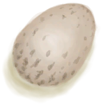
[蛋](Egg.md)](Egg.md)</td><td  style="text-align:left;vertical-align:top;"  >烤蛋 </td><td  style="text-align:left;vertical-align:top;"  >15分</td><td  style="text-align:left;vertical-align:top;"  ></td><td  style="text-align:left;vertical-align:top;"  > ** 使用物: ** → [
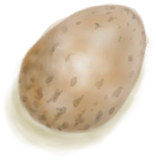
[烤蛋](EggCooked.md)](EggCooked.md)</td><td  style="text-align:left;vertical-align:top;"  >[

[情绪](Morale.md)](Morale.md)+1</td></tr><tr ><td  style="text-align:left;vertical-align:top;"  >[

[绯鲤](Goatfish.md)](Goatfish.md)</td><td  style="text-align:left;vertical-align:top;"  >烹饪绯鲤 </td><td  style="text-align:left;vertical-align:top;"  >30分</td><td  style="text-align:left;vertical-align:top;"  ></td><td  style="text-align:left;vertical-align:top;"  > ** 使用物: ** → [
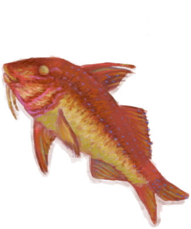
[烤绯鲤](GoatfishCooked.md)](GoatfishCooked.md)</td><td  style="text-align:left;vertical-align:top;"  >[

[情绪](Morale.md)](Morale.md)+1</td></tr><tr ><td  style="text-align:left;vertical-align:top;"  >[

[石斑鱼肉](GrouperMeat.md)](GrouperMeat.md)</td><td  style="text-align:left;vertical-align:top;"  >熏石斑鱼 </td><td  style="text-align:left;vertical-align:top;"  >30分</td><td  style="text-align:left;vertical-align:top;"  ></td><td  style="text-align:left;vertical-align:top;"  > ** 使用物: ** → [

[烤石斑鱼](GrouperMeatCooked.md)](GrouperMeatCooked.md)</td><td  style="text-align:left;vertical-align:top;"  >[

[情绪](Morale.md)](Morale.md)+1</td></tr><tr ><td  style="text-align:left;vertical-align:top;"  >[
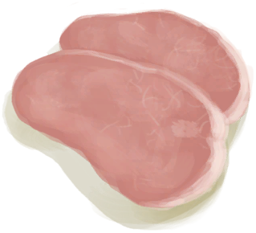
[野猪肉](BoarMeat.md)](BoarMeat.md)</td><td  style="text-align:left;vertical-align:top;"  >熏野猪肉 </td><td  style="text-align:left;vertical-align:top;"  >30分</td><td  style="text-align:left;vertical-align:top;"  ></td><td  style="text-align:left;vertical-align:top;"  > ** 使用物: ** → [
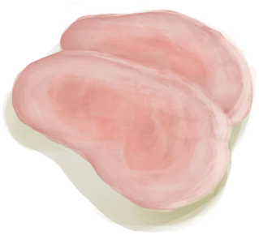
[烤野猪肉](BoarMeatCooked.md)](BoarMeatCooked.md)</td><td  style="text-align:left;vertical-align:top;"  >[

[情绪](Morale.md)](Morale.md)+1</td></tr><tr ><td  style="text-align:left;vertical-align:top;"  >[
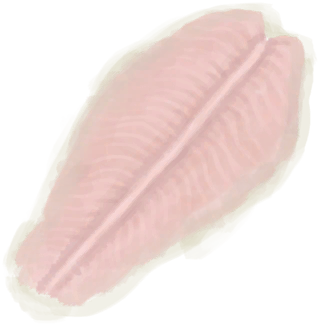
[北梭鱼肉](BonefishMeat.md)](BonefishMeat.md)</td><td  style="text-align:left;vertical-align:top;"  >熏梭鱼肉 </td><td  style="text-align:left;vertical-align:top;"  >30分</td><td  style="text-align:left;vertical-align:top;"  ></td><td  style="text-align:left;vertical-align:top;"  > ** 使用物: ** → [
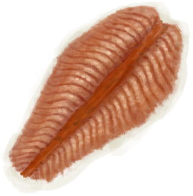
[烤北梭鱼](BonefishCooked.md)](BonefishCooked.md)</td><td  style="text-align:left;vertical-align:top;"  >[

[情绪](Morale.md)](Morale.md)+1</td></tr><tr ><td  style="text-align:left;vertical-align:top;"  >[
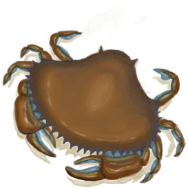
[螃蟹](Crab.md)](Crab.md)</td><td  style="text-align:left;vertical-align:top;"  >烤螃蟹 </td><td  style="text-align:left;vertical-align:top;"  >30分</td><td  style="text-align:left;vertical-align:top;"  ></td><td  style="text-align:left;vertical-align:top;"  >** 自身: ** 燃料  +0～+2(0%～2.08%)  ** 使用物: ** → [
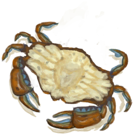
[烤螃蟹](CrabCooked.md)](CrabCooked.md)</td><td  style="text-align:left;vertical-align:top;"  >[

[情绪](Morale.md)](Morale.md)+1</td></tr><tr ><td  style="text-align:left;vertical-align:top;"  >[
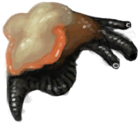
[海螺肉](ConchMeat.md)](ConchMeat.md)</td><td  style="text-align:left;vertical-align:top;"  >烤海螺肉 </td><td  style="text-align:left;vertical-align:top;"  >30分</td><td  style="text-align:left;vertical-align:top;"  ></td><td  style="text-align:left;vertical-align:top;"  >** 自身: ** 燃料  +0～+2(0%～2.08%)  ** 使用物: ** → [
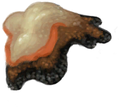
[烤海螺肉](ConchMeatCooked.md)](ConchMeatCooked.md)</td><td  style="text-align:left;vertical-align:top;"  >[

[情绪](Morale.md)](Morale.md)+1</td></tr><tr ><td  style="text-align:left;vertical-align:top;"  >[

[松软的海螺肉](ConchMeatSoft.md)](ConchMeatSoft.md)</td><td  style="text-align:left;vertical-align:top;"  >烤松软的海螺肉 </td><td  style="text-align:left;vertical-align:top;"  >30分</td><td  style="text-align:left;vertical-align:top;"  ></td><td  style="text-align:left;vertical-align:top;"  >** 自身: ** 燃料  +2(2.08%)  ** 使用物: ** → [

[松软的烤海螺肉](ConchMeatSoftCooked.md)](ConchMeatSoftCooked.md)</td><td  style="text-align:left;vertical-align:top;"  >[

[情绪](Morale.md)](Morale.md)+1</td></tr><tr ><td  style="text-align:left;vertical-align:top;"  >[
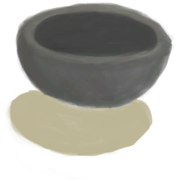
[未烧制的陶碗](ClayBowlUnfired.md)](ClayBowlUnfired.md)</td><td  style="text-align:left;vertical-align:top;"  >烧制陶碗 </td><td  style="text-align:left;vertical-align:top;"  >1小时</td><td  style="text-align:left;vertical-align:top;"  ></td><td  style="text-align:left;vertical-align:top;"  >** 自身: ** 燃料  +2(2.08%)  ** 使用物: ** → [
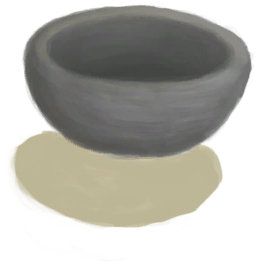
[陶碗](ClayBowl.md)](ClayBowl.md)</td><td  style="text-align:left;vertical-align:top;"  >[

[情绪](Morale.md)](Morale.md)+1</td></tr><tr ><td  style="text-align:left;vertical-align:top;"  >[
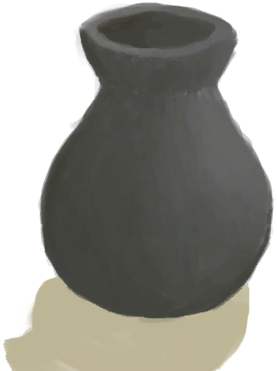
[未烧制的陶罐](ClayVaseUnfired.md)](ClayVaseUnfired.md)</td><td  style="text-align:left;vertical-align:top;"  >烧制陶瓶 </td><td  style="text-align:left;vertical-align:top;"  >2小时</td><td  style="text-align:left;vertical-align:top;"  ></td><td  style="text-align:left;vertical-align:top;"  >** 自身: ** 燃料  +2(2.08%)  ** 使用物: ** → [
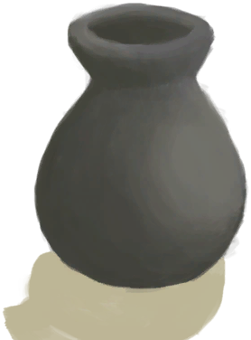
[陶罐](ClayVase.md)](ClayVase.md)</td><td  style="text-align:left;vertical-align:top;"  >[

[情绪](Morale.md)](Morale.md)+2</td></tr><tr ><td  style="text-align:left;vertical-align:top;"  >[
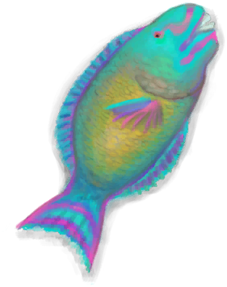
[鹦哥鱼](ParrotFish.md)](ParrotFish.md)</td><td  style="text-align:left;vertical-align:top;"  >熏鹦哥鱼 </td><td  style="text-align:left;vertical-align:top;"  >30分</td><td  style="text-align:left;vertical-align:top;"  ></td><td  style="text-align:left;vertical-align:top;"  >** 自身: ** 燃料  +0～+2(0%～2.08%)  ** 使用物: ** → [
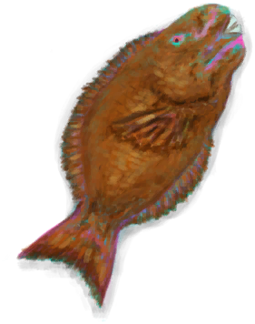
[烤鹦哥鱼](ParrotFishCooked.md)](ParrotFishCooked.md)</td><td  style="text-align:left;vertical-align:top;"  >[

[情绪](Morale.md)](Morale.md)+1</td></tr><tr ><td  style="text-align:left;vertical-align:top;"  >[

[热带杏仁核](TropicalAlmondKernels.md)](TropicalAlmondKernels.md)</td><td  style="text-align:left;vertical-align:top;"  >烤杏仁 </td><td  style="text-align:left;vertical-align:top;"  >15分</td><td  style="text-align:left;vertical-align:top;"  ></td><td  style="text-align:left;vertical-align:top;"  >** 自身: ** 燃料  +0～+2(0%～2.08%)  ** 使用物: ** → [

[烤热带杏仁](TropicalAlmondsRoasted.md)](TropicalAlmondsRoasted.md)</td><td  style="text-align:left;vertical-align:top;"  >[

[情绪](Morale.md)](Morale.md)+1</td></tr><tr ><td  style="text-align:left;vertical-align:top;"  >[

[椰子壳](CoconutShell.md)](CoconutShell.md)</td><td  style="text-align:left;vertical-align:top;"  >添入椰子壳 </td><td  style="text-align:left;vertical-align:top;"  >-</td><td  style="text-align:left;vertical-align:top;"  ></td><td  style="text-align:left;vertical-align:top;"  >** 自身: ** 燃料  +2(2.08%)  ** 使用物: ** →消失</td><td  style="text-align:left;vertical-align:top;"  ></td></tr><tr ><td  style="text-align:left;vertical-align:top;"  >[

[棕榈叶](PalmFronds.md)](PalmFronds.md)</td><td  style="text-align:left;vertical-align:top;"  >添入棕榈叶 </td><td  style="text-align:left;vertical-align:top;"  >-</td><td  style="text-align:left;vertical-align:top;"  ></td><td  style="text-align:left;vertical-align:top;"  >** 自身: ** 燃料  +2(2.08%)  ** 使用物: ** →消失</td><td  style="text-align:left;vertical-align:top;"  ></td></tr></tbody></table>  
  
## 转化  
<table class="table table-bordered" data-toggle="table"  ><thead style=""><tr ><th  style="text-align:left;vertical-align:top;"  >放入</th><th  style="text-align:left;vertical-align:top;"  >动作</th><th  style="text-align:left;vertical-align:top;"  >耗时</th><th  style="text-align:left;vertical-align:top;"  data-sortable="true"  >条件</th><th  style="text-align:left;vertical-align:top;"  >变化</th><th  style="text-align:left;vertical-align:top;"  data-sortable="true"  >玩家状态</th></tr></thead><tr ><td  style="text-align:left;vertical-align:top;"  >[

[海螺肉](ConchMeat.md)](ConchMeat.md)</td><td  style="text-align:left;vertical-align:top;"  >海螺肉</td><td  style="text-align:left;vertical-align:top;"  >30分</td><td  style="text-align:left;vertical-align:top;"  ></td><td  style="text-align:left;vertical-align:top;"  >[

[烤海螺肉](ConchMeatCooked.md)](ConchMeatCooked.md)(+1)</td><td  style="text-align:left;vertical-align:top;"  ></td></tr><tr ><td  style="text-align:left;vertical-align:top;"  >[

[松软的海螺肉](ConchMeatSoft.md)](ConchMeatSoft.md)</td><td  style="text-align:left;vertical-align:top;"  >松软的海螺肉</td><td  style="text-align:left;vertical-align:top;"  >30分</td><td  style="text-align:left;vertical-align:top;"  ></td><td  style="text-align:left;vertical-align:top;"  >[

[松软的烤海螺肉](ConchMeatSoftCooked.md)](ConchMeatSoftCooked.md)(+1)</td><td  style="text-align:left;vertical-align:top;"  ></td></tr><tr ><td  style="text-align:left;vertical-align:top;"  >[

[螃蟹](Crab.md)](Crab.md)</td><td  style="text-align:left;vertical-align:top;"  >螃蟹</td><td  style="text-align:left;vertical-align:top;"  >30分</td><td  style="text-align:left;vertical-align:top;"  ></td><td  style="text-align:left;vertical-align:top;"  >[

[烤螃蟹](CrabCooked.md)](CrabCooked.md)(+1)</td><td  style="text-align:left;vertical-align:top;"  ></td></tr><tr ><td  style="text-align:left;vertical-align:top;"  >[

[野猪肉](BoarMeat.md)](BoarMeat.md)</td><td  style="text-align:left;vertical-align:top;"  >野猪肉</td><td  style="text-align:left;vertical-align:top;"  >30分</td><td  style="text-align:left;vertical-align:top;"  ></td><td  style="text-align:left;vertical-align:top;"  >[

[烤野猪肉](BoarMeatCooked.md)](BoarMeatCooked.md)(+1)</td><td  style="text-align:left;vertical-align:top;"  ></td></tr><tr ><td  style="text-align:left;vertical-align:top;"  >[

[烤野猪肉](BoarMeatCooked.md)](BoarMeatCooked.md)</td><td  style="text-align:left;vertical-align:top;"  >野猪肉熏制好了</td><td  style="text-align:left;vertical-align:top;"  >30分</td><td  style="text-align:left;vertical-align:top;"  ></td><td  style="text-align:left;vertical-align:top;"  >[

[烟熏野猪肉](BoarMeatSmoked.md)](BoarMeatSmoked.md)(+1)</td><td  style="text-align:left;vertical-align:top;"  ></td></tr><tr ><td  style="text-align:left;vertical-align:top;"  >[

[石斑鱼肉](GrouperMeat.md)](GrouperMeat.md)</td><td  style="text-align:left;vertical-align:top;"  >石斑鱼</td><td  style="text-align:left;vertical-align:top;"  >30分</td><td  style="text-align:left;vertical-align:top;"  ></td><td  style="text-align:left;vertical-align:top;"  >[

[烤石斑鱼](GrouperMeatCooked.md)](GrouperMeatCooked.md)(+1)</td><td  style="text-align:left;vertical-align:top;"  ></td></tr><tr ><td  style="text-align:left;vertical-align:top;"  >[

[烤石斑鱼](GrouperMeatCooked.md)](GrouperMeatCooked.md)</td><td  style="text-align:left;vertical-align:top;"  >烟熏石斑鱼</td><td  style="text-align:left;vertical-align:top;"  >30分</td><td  style="text-align:left;vertical-align:top;"  ></td><td  style="text-align:left;vertical-align:top;"  >[

[烟熏石斑鱼](GrouperMeatSmoked.md)](GrouperMeatSmoked.md)(+1)</td><td  style="text-align:left;vertical-align:top;"  ></td></tr><tr ><td  style="text-align:left;vertical-align:top;"  >[

[蛋](Egg.md)](Egg.md)</td><td  style="text-align:left;vertical-align:top;"  >蛋</td><td  style="text-align:left;vertical-align:top;"  >15分</td><td  style="text-align:left;vertical-align:top;"  ></td><td  style="text-align:left;vertical-align:top;"  >[

[烤蛋](EggCooked.md)](EggCooked.md)(+1)</td><td  style="text-align:left;vertical-align:top;"  ></td></tr><tr ><td  style="text-align:left;vertical-align:top;"  >[

[绯鲤](Goatfish.md)](Goatfish.md)</td><td  style="text-align:left;vertical-align:top;"  >绯鲤</td><td  style="text-align:left;vertical-align:top;"  >30分</td><td  style="text-align:left;vertical-align:top;"  ></td><td  style="text-align:left;vertical-align:top;"  >[

[烤绯鲤](GoatfishCooked.md)](GoatfishCooked.md)(+1)</td><td  style="text-align:left;vertical-align:top;"  ></td></tr><tr ><td  style="text-align:left;vertical-align:top;"  >[

[烤绯鲤](GoatfishCooked.md)](GoatfishCooked.md)</td><td  style="text-align:left;vertical-align:top;"  >绯鲤熏制好了</td><td  style="text-align:left;vertical-align:top;"  >3小时</td><td  style="text-align:left;vertical-align:top;"  ></td><td  style="text-align:left;vertical-align:top;"  >[

[烟熏绯鲤](GoatfishSmoked.md)](GoatfishSmoked.md)(+1)</td><td  style="text-align:left;vertical-align:top;"  ></td></tr><tr ><td  style="text-align:left;vertical-align:top;"  >[

[北梭鱼肉](BonefishMeat.md)](BonefishMeat.md)</td><td  style="text-align:left;vertical-align:top;"  >北梭鱼</td><td  style="text-align:left;vertical-align:top;"  >30分</td><td  style="text-align:left;vertical-align:top;"  ></td><td  style="text-align:left;vertical-align:top;"  >[

[烤北梭鱼](BonefishCooked.md)](BonefishCooked.md)(+1)</td><td  style="text-align:left;vertical-align:top;"  ></td></tr><tr ><td  style="text-align:left;vertical-align:top;"  >[

[烤北梭鱼](BonefishCooked.md)](BonefishCooked.md)</td><td  style="text-align:left;vertical-align:top;"  >北梭鱼熏制好了</td><td  style="text-align:left;vertical-align:top;"  >3小时</td><td  style="text-align:left;vertical-align:top;"  ></td><td  style="text-align:left;vertical-align:top;"  >[

[烟熏北梭鱼](BonefishSmoked.md)](BonefishSmoked.md)(+1)</td><td  style="text-align:left;vertical-align:top;"  ></td></tr><tr ><td  style="text-align:left;vertical-align:top;"  >[

[鹦哥鱼](ParrotFish.md)](ParrotFish.md)</td><td  style="text-align:left;vertical-align:top;"  >鹦哥鱼</td><td  style="text-align:left;vertical-align:top;"  >30分</td><td  style="text-align:left;vertical-align:top;"  ></td><td  style="text-align:left;vertical-align:top;"  >[

[烤鹦哥鱼](ParrotFishCooked.md)](ParrotFishCooked.md)(+1)</td><td  style="text-align:left;vertical-align:top;"  ></td></tr><tr ><td  style="text-align:left;vertical-align:top;"  >[

[烤鹦哥鱼](ParrotFishCooked.md)](ParrotFishCooked.md)</td><td  style="text-align:left;vertical-align:top;"  >鹦哥鱼熏制好了</td><td  style="text-align:left;vertical-align:top;"  >3小时</td><td  style="text-align:left;vertical-align:top;"  ></td><td  style="text-align:left;vertical-align:top;"  >[

[烟熏鹦哥鱼](ParrotFishSmoked.md)](ParrotFishSmoked.md)(+1)</td><td  style="text-align:left;vertical-align:top;"  ></td></tr><tr ><td  style="text-align:left;vertical-align:top;"  >[

[热带杏仁核](TropicalAlmondKernels.md)](TropicalAlmondKernels.md)</td><td  style="text-align:left;vertical-align:top;"  >热带杏仁</td><td  style="text-align:left;vertical-align:top;"  >30分</td><td  style="text-align:left;vertical-align:top;"  ></td><td  style="text-align:left;vertical-align:top;"  >[

[烤热带杏仁](TropicalAlmondsRoasted.md)](TropicalAlmondsRoasted.md)(+1)</td><td  style="text-align:left;vertical-align:top;"  ></td></tr><tr ><td  style="text-align:left;vertical-align:top;"  >[

[石头](Stone.md)](Stone.md)</td><td  style="text-align:left;vertical-align:top;"  >石头</td><td  style="text-align:left;vertical-align:top;"  >30分</td><td  style="text-align:left;vertical-align:top;"  ></td><td  style="text-align:left;vertical-align:top;"  ></td><td  style="text-align:left;vertical-align:top;"  ></td></tr><tr ><td  style="text-align:left;vertical-align:top;"  >[

[烤海螺肉](ConchMeatCooked.md)](ConchMeatCooked.md) [

[松软的烤海螺肉](ConchMeatSoftCooked.md)](ConchMeatSoftCooked.md) [

[烤螃蟹](CrabCooked.md)](CrabCooked.md) [

[烤热带杏仁](TropicalAlmondsRoasted.md)](TropicalAlmondsRoasted.md) [

[烤蛋](EggCooked.md)](EggCooked.md) [

[水煮蛋](EggBoiled.md)](EggBoiled.md)</td><td  style="text-align:left;vertical-align:top;"  >烧焦物</td><td  style="text-align:left;vertical-align:top;"  >1小时</td><td  style="text-align:left;vertical-align:top;"  ></td><td  style="text-align:left;vertical-align:top;"  >[

[烧焦物](CharredRemains.md)](CharredRemains.md)(+1)</td><td  style="text-align:left;vertical-align:top;"  ></td></tr><tr ><td  style="text-align:left;vertical-align:top;"  ></td><td  style="text-align:left;vertical-align:top;"  >加热</td><td  style="text-align:left;vertical-align:top;"  >30分</td><td  style="text-align:left;vertical-align:top;"  ></td><td  style="text-align:left;vertical-align:top;"  ></td><td  style="text-align:left;vertical-align:top;"  ></td></tr><tr ><td  style="text-align:left;vertical-align:top;"  ></td><td  style="text-align:left;vertical-align:top;"  >蒸发制盐</td><td  style="text-align:left;vertical-align:top;"  >1小时</td><td  style="text-align:left;vertical-align:top;"  ></td><td  style="text-align:left;vertical-align:top;"  >[

[椰子壳](CoconutShell.md)](CoconutShell.md)(+1) [
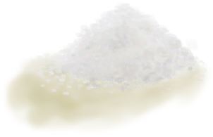
[盐](Salt.md)](Salt.md)(+1)</td><td  style="text-align:left;vertical-align:top;"  ></td></tr><tr ><td  style="text-align:left;vertical-align:top;"  ></td><td  style="text-align:left;vertical-align:top;"  >加热</td><td  style="text-align:left;vertical-align:top;"  >30分</td><td  style="text-align:left;vertical-align:top;"  ></td><td  style="text-align:left;vertical-align:top;"  ></td><td  style="text-align:left;vertical-align:top;"  ></td></tr><tr ><td  style="text-align:left;vertical-align:top;"  ></td><td  style="text-align:left;vertical-align:top;"  >蒸发制盐</td><td  style="text-align:left;vertical-align:top;"  >1小时</td><td  style="text-align:left;vertical-align:top;"  ></td><td  style="text-align:left;vertical-align:top;"  >[

[盐](Salt.md)](Salt.md)(+1)</td><td  style="text-align:left;vertical-align:top;"  ></td></tr><tr ><td  style="text-align:left;vertical-align:top;"  ></td><td  style="text-align:left;vertical-align:top;"  >加热</td><td  style="text-align:left;vertical-align:top;"  >30分</td><td  style="text-align:left;vertical-align:top;"  ></td><td  style="text-align:left;vertical-align:top;"  ></td><td  style="text-align:left;vertical-align:top;"  ></td></tr><tr ><td  style="text-align:left;vertical-align:top;"  ></td><td  style="text-align:left;vertical-align:top;"  >加热</td><td  style="text-align:left;vertical-align:top;"  >45分</td><td  style="text-align:left;vertical-align:top;"  ></td><td  style="text-align:left;vertical-align:top;"  ></td><td  style="text-align:left;vertical-align:top;"  ></td></tr></tbody></table>  
  
## 属性   
<table class="table table-bordered" data-toggle="table"  ><thead style=""><tr ><th  style="text-align:left;vertical-align:top;"  >属性</th><th  style="text-align:left;vertical-align:top;"  >值</th><th  style="text-align:left;vertical-align:top;"  >耗时</th><th  style="text-align:left;vertical-align:top;"  >变化</th></tr></thead><tr ><td  style="text-align:left;vertical-align:top;"  >燃料</td><td  style="text-align:left;vertical-align:top;"  >初始：1 最大：96</td><td  style="text-align:left;vertical-align:top;"  >每15分钟-1 最多需要：1天</td><td  style="text-align:left;vertical-align:top;"  >** 到达0时： **  ** 自身 ** → [

[烟熏炉(塑料布)(熄灭)](SmokerExtinguishedPlastic.md)](SmokerExtinguishedPlastic.md)</td></tr></tbody></table>  
  

