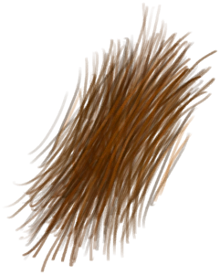

# 蛇草  
> 我应该能从中提取到搓绳用的纤维。也可以捣碎它来保护自己免受虫子叮咬。  
  
<table class="table table-bordered" data-toggle="table"  data-show-header="false"><thead style="display:none"><tr ><th  style="width:50%;text-align:left;vertical-align:top;"  >title</th><th  style="width:50%;text-align:left;vertical-align:top;"  ></th></tr></thead><tr ><td  style="width:50%;text-align:left;vertical-align:top;"  >**重量：**100  **标签：**	[“树叶”](tag_Leaves.md)</td><td  style="width:50%;text-align:left;vertical-align:top;"  >

<a href="SnakeGrass.md" style="color:black">蛇草</a>

一种非常有用的植物，具有<b>驱虫</b>的功效，可以在岛上大部分<b>丛林</b>中找到。  它的叶子可以用来制作<b>细线和驱虫膏</b>，可以在营火上燃烧来保护你免受昆虫的伤害，还可以用于<b>烹饪食谱</b>甚至更多。</td></tr></tbody></table>  
  
## 获取来源  
<table class="table table-bordered" data-toggle="table"  ><thead style=""><tr ><th  style="text-align:left;vertical-align:top;"  >来源</th><th  style="text-align:left;vertical-align:top;"  >操作</th></tr></thead><tr ><td  style="text-align:left;vertical-align:top;"  >[

[蛇草丛](SnakegrassPatch.md)](SnakegrassPatch.md)</td><td  style="text-align:left;vertical-align:top;"  >采集</td></tr></tbody></table>  
  
## 动作  
<table class="table table-bordered" data-toggle="table"  ><thead style=""><tr ><th  style="text-align:left;vertical-align:top;"  >动作</th><th  style="text-align:left;vertical-align:top;"  >耗时</th><th  style="text-align:left;vertical-align:top;"  >条件</th><th  style="text-align:left;vertical-align:top;"  >变化</th><th  style="text-align:left;vertical-align:top;"  data-sortable="true"  >状态</th></tr></thead><tr ><td  style="text-align:left;vertical-align:top;"  >提取纤维 [“手部动作(组)”](HandAction.md)</td><td  style="text-align:left;vertical-align:top;"  >15分</td><td  style="text-align:left;vertical-align:top;"  >[

[光亮](Light.md)](Light.md): 10-100</td><td  style="text-align:left;vertical-align:top;"  >** 自身：** →消失  ** 获得： ** ** [Fibers]  **   [

[纤维](Fibers.md)](Fibers.md)(+2) </td><td  style="text-align:left;vertical-align:top;"  ></td></tr></tbody></table>  
  
## 可拖入  
<table class="table table-bordered" data-toggle="table"  ><thead style=""><tr ><th  style="text-align:left;vertical-align:top;"  >使用</th><th  style="text-align:left;vertical-align:top;"  >动作</th><th  style="text-align:left;vertical-align:top;"  >耗时</th><th  style="text-align:left;vertical-align:top;"  >条件</th><th  style="text-align:left;vertical-align:top;"  >变化</th><th  style="text-align:left;vertical-align:top;"  >玩家状态</th></tr></thead><tr ><td  style="text-align:left;vertical-align:top;"  >[“锤”](tag_Hammer.md)</td><td  style="text-align:left;vertical-align:top;"  >捣碎 [“手部动作(组)”](HandAction.md)</td><td  style="text-align:left;vertical-align:top;"  >15分</td><td  style="text-align:left;vertical-align:top;"  >[

[光亮](Light.md)](Light.md): 10-100</td><td  style="text-align:left;vertical-align:top;"  >** 自身: ** → [

[捣碎的蛇草](SnakeGrassGround.md)](SnakeGrassGround.md)</td><td  style="text-align:left;vertical-align:top;"  >[

[体重](Weight.md)](Weight.md)-1 [

[污垢](Filth.md)](Filth.md)+4 [

[手掌损伤](HandDamage.md)](HandDamage.md)+20 [

[薬草学(技能)](Skill_Herbology.md)](Skill_Herbology.md)+1</td></tr></tbody></table>  
  
## 可拖至  

[叶床](LeafBed.md)

[有遮蔽的叶床](ShelteredLeafBed.md)

[堆肥箱](CompostBin.md)

[未栽种的农田(空)](CropPlotEmpty.md)

[蒸馏器(关)](AlembicOff.md)

[蒸馏器(开)](AlembicOn.md)

[营火](Campfire.md)

[营火](Campfire.md)

[营火(熄灭)](CampfireExtinguished.md)

[粘土火盆](ClayFirePit.md)

[粘土火盆](ClayFirePit.md)

[粘土火盆(熄灭)](ClayFirePitExtinguished.md)

[火堆](Fire.md)

[火堆](Fire.md)

[火堆(熄灭)](FireExtinguished.md)

[熔炉](Forge.md)

[熔炉(熄灭)](ForgeExtinguished.md)

[窑炉](Kiln.md)

[高级窑炉](KilnAdvanced.md)

[高级窑炉(熄灭)](KilnAdvancedExtinguished.md)

[窑炉(熄灭)](KilnExtinguished.md)

[火炉](Stove.md)

[火炉(熄灭)](StoveExtinguished.md)

[羊食槽](GoatFeeder.md)

[羊食槽(空)](GoatFeederEmpty.md)

[母山羊](GoatEnclosureFemale.md)

[小羊](GoatEnclosureKid.md)

[哺乳期山羊](GoatEnclosureLactating.md)

[公山羊](GoatEnclosureMale.md)

[母山羊](GoatTiedFemale.md)

[哺乳期山羊](GoatTiedFemaleLactating.md)

[小羊](GoatTiedKid.md)

[公山羊](GoatTiedMale.md)

[太阳能蒸馏器](SolarStill.md)

  
  
## 可用于蓝图  

[

[木床(蓝图)](Bp_BedWooden.md)](Bp_BedWooden.md)

[

[山羊饲料(蓝图)](Bp_FeedGoat.md)](Bp_FeedGoat.md)

[

[叶床(蓝图)](Bp_Leafbed.md)](Bp_Leafbed.md)

[

[骨头汤(蓝图)](Bp_BoneBroth.md)](Bp_BoneBroth.md)

[

[鸡肉三明治(蓝图)](Bp_ChickenSandwich.md)](Bp_ChickenSandwich.md)

[

[椰子鱼(蓝图)](Bp_CoconutFish.md)](Bp_CoconutFish.md)

[

[鱼肉煎蛋饼(蓝图)](Bp_FishOmelette.md)](Bp_FishOmelette.md)

[

[鱼肉塔可(蓝图)](Bp_FishTaco.md)](Bp_FishTaco.md)

[

[炒菇球(蓝图)](Bp_FriedPuffballs.md)](Bp_FriedPuffballs.md)

[

[炖羊肉(蓝图)](Bp_GoatStew.md)](Bp_GoatStew.md)

[

[热带烤鸡(蓝图)](Bp_IslandChicken.md)](Bp_IslandChicken.md)

[

[丛林沙拉(蓝图)](Bp_JungleSalad.md)](Bp_JungleSalad.md)

[

[西米糕(蓝图)](Bp_SagoSlime.md)](Bp_SagoSlime.md)

[

[海鲜杂烩(蓝图)](Bp_SeafoodCup.md)](Bp_SeafoodCup.md)

  
  
  

