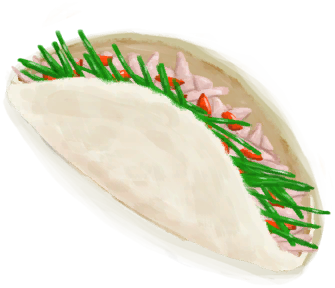

# 蛇草  
> 我应该能从中提取到搓绳用的纤维。也可以捣碎它来保护自己免受虫子叮咬。  
  
<table class="table table-bordered" data-toggle="table"  data-show-header="false"><thead style="display:none"><tr ><th  style="width:50%;text-align:left;vertical-align:top;"  >title</th><th  style="width:50%;text-align:left;vertical-align:top;"  ></th></tr></thead><tr ><td  style="width:50%;text-align:left;vertical-align:top;"  >**重量：**100  **标签：**	[“树叶”](tag_Leaves.md), [“可烹饪的”](tag_Cookable.md), [“低糖分”](tag_SugarsPoor.md)</td><td  style="width:50%;text-align:left;vertical-align:top;"  >

<a href="SnakeGrass.md" style="color:black">蛇草</a>

一种非常有用的植物，具有<b>驱虫</b>的功效，可以在岛上大部分<b>丛林</b>中找到。  它的叶子可以用来制作<b>细线和驱虫膏</b>，可以在营火上燃烧来保护你免受昆虫的伤害，还可以用于<b>烹饪食谱</b>甚至更多。</td></tr></tbody></table>  
  
## 获取来源  

采集

[蛇草丛](SnakegrassPatch.md)

  
  
## 动作  

<table><tr><td rowspan="2" style="width:200px;text-align:center;font-size:1.3em;font-weight:bold">

提取纤维

15分

</td><td>[“手部动作(组)”](HandAction.md)</td></tr><tr><td><b>自身：</b>→消失</td></tr><tr><td colspan="2"><b>需求：</b>[

[光亮](Light.md)](Light.md): <b>10-100</b></td></tr><tr><td colspan="2">[

[纤维](Fibers.md)](Fibers.md)(<b>+2</b>)</td></tr></table>
  
  
  
## 可拖入  

<table style="margin-bottom:0px;"><tr><td style="width:40%;text-align:left; background-color:#FEFEFE"><b>拖入：</b>[“锤”](tag_Hammer.md)</td><td style="width:40%;font-size:1em;font-weight:bold;background-color:#FEFEFE">捣碎 (15分) [“手部动作(组)”](HandAction.md)</td></tr><tr><td colspan="2"><b>需求：</b>[

[光亮](Light.md)](Light.md): <b>10-100</b></td></tr><tr style="background-color:#FFFFFF"><td style=""><b>使用物：</b></td><td style=""><b>自身：</b>→ [

[捣碎的蛇草](SnakeGrassGround.md)](SnakeGrassGround.md)</td></tr><tr><td colspan="2"><b>状态变化：</b>[

[体重](Weight.md)](Weight.md)<b>-1</b>, [

[污垢](Filth.md)](Filth.md)<b>+4</b>, [

[手掌损伤](HandDamage.md)](HandDamage.md)<b>+20</b>, [

[药草学(技能)](Skill_Herbology.md)](Skill_Herbology.md)<b>+1</b></td></tr></table>
  
  
## 可拖至  

[叶床](LeafBed.md)

[有遮蔽的叶床](ShelteredLeafBed.md)

[猪食槽](BoarFeeder.md)

[猪食槽(空)](BoarFeederEmpty.md)

[堆肥箱](CompostBin.md)

[蒸馏器(关)](AlembicOff.md)

[蒸馏器(开)](AlembicOn.md)

[营火](Campfire.md)

[营火(熄灭)](CampfireExtinguished.md)

[粘土火盆](ClayFirePit.md)

[粘土火盆(熄灭)](ClayFirePitExtinguished.md)

[火堆](Fire.md)

[火堆(熄灭)](FireExtinguished.md)

[熔炉](Forge.md)

[熔炉(熄灭)](ForgeExtinguished.md)

[窑炉](Kiln.md)

[高级窑炉](KilnAdvanced.md)

[高级窑炉(熄灭)](KilnAdvancedExtinguished.md)

[窑炉(熄灭)](KilnExtinguished.md)

[火炉](Stove.md)

[火炉(熄灭)](StoveExtinguished.md)

[羊食槽](GoatFeeder.md)

[羊食槽(空)](GoatFeederEmpty.md)

[灰山鹑喂食器](PartridgeFeeder.md)

[灰山鹑喂食器(空)](PartridgeFeederEmpty.md)

[母猪](BoarEnclosureFemale.md)

[公猪](BoarEnclosureMale.md)

[小猪](BoarEnclosurePiglet.md)

[母猪](BoarTiedFemale.md)

[公猪](BoarTiedMale.md)

[小猪](BoarTiedPiglet.md)

[母山羊](GoatEnclosureFemale.md)

[小羊](GoatEnclosureKid.md)

[泌乳期山羊](GoatEnclosureLactating.md)

[公山羊](GoatEnclosureMale.md)

[母山羊](GoatTiedFemale.md)

[泌乳期山羊](GoatTiedFemaleLactating.md)

[小羊](GoatTiedKid.md)

[公山羊](GoatTiedMale.md)

[小灰山鹑](PartridgeChick.md)

[雌灰山鹑](PartridgeFemaleEnclosure.md)

[雌灰山鹑](PartridgeFemaleLive.md)

[雄灰山鹑](PartridgeMaleEnclosure.md)

[雄灰山鹑](PartridgeMaleLive.md)

[太阳能蒸馏器](SolarStill.md)

  
  
## 可用于蓝图  

<a href="Bp_BedWooden.md" style="color:black">木床</a>

<a href="Bp_FeedGoat.md" style="color:black">山羊饲料</a>

<a href="Bp_Leafbed.md" style="color:black">叶床</a>

<a href="Bp_BoneBroth.md" style="color:black">骨头汤</a>

<a href="Bp_ChickenSandwich.md" style="color:black">鸡肉三明治</a>

<a href="Bp_CoconutFish.md" style="color:black">椰子鱼</a>

<a href="Bp_FishOmelette.md" style="color:black">鱼肉煎蛋饼</a>

<a href="Bp_FishTaco.md" style="color:black">鱼肉塔可</a>

<a href="Bp_FriedPuffballs.md" style="color:black">炒菇球</a>

<a href="Bp_GoatStew.md" style="color:black">炖羊肉</a>

<a href="Bp_IslandChicken.md" style="color:black">热带烤鸡</a>

<a href="Bp_JungleSalad.md" style="color:black">丛林沙拉</a>

<a href="Bp_SagoSlime.md" style="color:black">西米糕</a>

<a href="Bp_SeafoodCup.md" style="color:black">海鲜杂烩</a>

  
  
  

