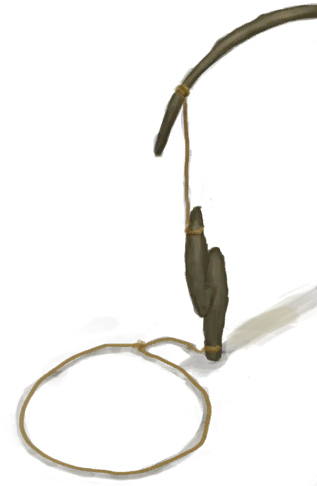
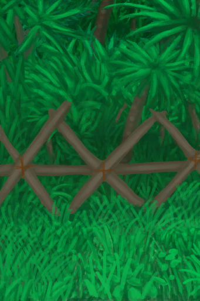
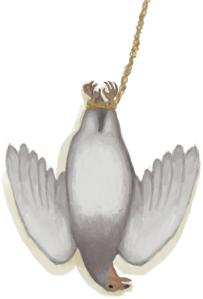

# 套索陷阱  
> 我应该在里面放上诱饵，过段时间再来看看。（更换诱饵会重置陷阱）  
  
<table class="table table-bordered" data-toggle="table"  data-show-header="false"><thead style="display:none"><tr ><th  style="width:50%;text-align:left;vertical-align:top;"  >title</th><th  style="width:50%;text-align:left;vertical-align:top;"  ></th></tr></thead><tr ><td  style="width:50%;text-align:left;vertical-align:top;"  >** 不可删除 **  ** 不可堆叠 **  **槽位：**1  **过滤器：**[“诱饵”](tag_Bait.md) , [“饲料”](tag_Feed.md)</td><td  style="width:50%;text-align:left;vertical-align:top;"  >

<a href="SnareTrap.md" style="color:black">套索陷阱</a>

一个有用的陷阱，可以建立在有树的地区，并能够捕获活的<b>灰山鹑</b>。  它还可以捕捉小动物，如<b>老鼠，蜥蜴，螃蟹和海鸥</b>。  这些陷阱需要<b>诱饵</b>才能工作，并且必须在每次触发后<b>重置</b>。 除非真的有必要，否则尽量不要更换诱饵，这样做会重置陷阱的计时器。</td></tr></tbody></table>  
  
## 获取来源  

重置陷阱

[套索陷阱(未重置)](SnareTrapTriggered.md)

蓝图制造

[套索陷阱(蓝图)](Bp_SnareTrap.md)

  
  
## 动作  

<table><tr><td rowspan="2" style="width:200px;text-align:center;font-size:1.3em;font-weight:bold">

拆除陷阱

15分

</td><td>[“手部动作(组)”](HandAction.md)</td></tr><tr><td><b>自身：</b>→消失</td></tr><tr><td colspan="2"><b>需求：</b>[

[光亮](Light.md)](Light.md): <b>10-100</b></td></tr><tr><td colspan="2">[

[小树枝](Sticks.md)](Sticks.md)(<b>+2</b>), [

[细线](CordFiber.md)](CordFiber.md)(<b>+2</b>)</td></tr></table>
  
  
  
## 转化  

<table style="margin-bottom:0px;"><tr><td  colspan=2 style="font-size:1em;font-weight:bold;background-color:#FEFEFE">捕捉猎物</td><td style="text-align:right; background-color:#FEFEFE">[

[陷阱(技能)](Skill_Trapping.md)](Skill_Trapping.md)<b>+0.5</b></td></tr><tr style="background-color:#FFFFFF"><td style="width:30%;font-size:1em;text-align:right;vertical-align:middle;">[“诱饵”](tag_Bait.md) [“饲料”](tag_Feed.md)</td><td style="text-align:center;width:20%;vertical-align:middle;">
18小时45分 ～ 2天8小时15分

捕捉猎物
</td><td style="text-align:left;vertical-align:middle;"></td></tr><tr><td colspan="3"><b>自身：</b>→ [

[套索陷阱(未重置)](SnareTrapTriggered.md)](SnareTrapTriggered.md)</td></tr><tr><td colspan="3">

<table style="margin-bottom:3px;"><tr><td rowspan=2 style="text-align:center" width="80px">
基础权重

100
</td><td style="font-size:0.6em;line-height:0.6em;font-weight:bold">Fail</td></tr><tr><td></td></tr><tr><td colspan=2><li>[

[陷阱(技能)](Skill_Trapping.md)](Skill_Trapping.md)为<b>0～150</b>时权重<b>+0～-75</b></li><li>[

[陷阱栅栏](Imp_TrappingFences.md)](Imp_TrappingFences.md)存在于*手中/面板*，权重<b>-20</b>(可叠加),</li></td></tr></table>

<table style="margin-bottom:3px;"><tr><td rowspan=2 style="text-align:center" width="80px">
基础权重

0
</td><td style="font-size:0.6em;line-height:0.6em;font-weight:bold">Crab</td></tr><tr><td>[

[螃蟹](Crab.md)](Crab.md)(<b>+1</b>)[螃蟹种群数量](Pop_Crab.md)<b>-1000</b></td></tr><tr><td colspan=2><li>位于[

[沙滩(环境)](Env_Beach.md)](Env_Beach.md),[螃蟹种群数量](Pop_Crab.md)为<b>1000～60000</b>时权重限定为<b>+1～+20</b></li><li>位于[

[海湾(环境)](Env_Bay.md)](Env_Bay.md),[螃蟹种群数量](Pop_Crab.md)为<b>1000～60000</b>时权重限定为<b>+1～+20</b></li><li>位于[

[荒芜沙滩(环境)](Env_DesolateBeach.md)](Env_DesolateBeach.md),[螃蟹种群数量](Pop_Crab.md)为<b>1000～60000</b>时权重限定为<b>+1～+20</b></li></td></tr></table>

<table style="margin-bottom:3px;"><tr><td rowspan=2 style="text-align:center" width="80px">
基础权重

0
</td><td style="font-size:0.6em;line-height:0.6em;font-weight:bold">Seagull</td></tr><tr><td>[

[海鸥尸体](SeagullDead.md)](SeagullDead.md)(<b>+1</b>)[海鸥种群数量](Pop_Seagull.md)<b>-1000</b> [海鸥之惧](SeagullFear.md)<b>+100</b></td></tr><tr><td colspan=2><li>位于[

[沙滩(环境)](Env_Beach.md)](Env_Beach.md),[海鸥种群数量](Pop_Seagull.md)为<b>1000～4500</b>时权重限定为<b>+0～+10</b></li></td></tr></table>

<table style="margin-bottom:3px;"><tr><td rowspan=2 style="text-align:center" width="80px">
基础权重

0
</td><td style="font-size:0.6em;line-height:0.6em;font-weight:bold">Lizard</td></tr><tr><td>[

[蜥蜴](Lizard.md)](Lizard.md)(<b>+1</b>)[蜥蜴种群数量](Pop_Lizard.md)<b>-1000</b></td></tr><tr><td colspan=2><li>位于[

[丛林边缘(环境)](Env_Outskirts.md)](Env_Outskirts.md),[蜥蜴种群数量](Pop_Lizard.md)为<b>1000～60000</b>时权重限定为<b>+0～+20</b></li><li>位于[

[西部高地(环境)](Env_HighlandsWestern.md)](Env_HighlandsWestern.md),[蜥蜴种群数量](Pop_Lizard.md)为<b>1000～60000</b>时权重限定为<b>+0～+20</b></li><li>位于[

[东部高地(环境)](Env_HighlandsEastern.md)](Env_HighlandsEastern.md),[蜥蜴种群数量](Pop_Lizard.md)为<b>1000～60000</b>时权重限定为<b>+0～+20</b></li><li>位于[

[西部草原(环境)](Env_GrasslandsW.md)](Env_GrasslandsW.md),[蜥蜴种群数量](Pop_Lizard.md)为<b>1000～60000</b>时权重限定为<b>+0～+20</b></li><li>位于[

[东部草原(环境)](Env_GrasslandsE.md)](Env_GrasslandsE.md),[蜥蜴种群数量](Pop_Lizard.md)为<b>1000～60000</b>时权重限定为<b>+0～+20</b></li><li>位于[

[荒芜沙滩(环境)](Env_DesolateBeach.md)](Env_DesolateBeach.md),[蜥蜴种群数量](Pop_Lizard.md)为<b>1000～60000</b>时权重限定为<b>+0～+20</b></li><li>位于[

[沙滩(环境)](Env_Beach.md)](Env_Beach.md),[蜥蜴种群数量](Pop_Lizard.md)为<b>1000～60000</b>时权重限定为<b>+0～+10</b></li><li>位于[

[丛林(环境)](Env_Jungle.md)](Env_Jungle.md),[蜥蜴种群数量](Pop_Lizard.md)为<b>1000～60000</b>时权重限定为<b>+0～+5</b></li></td></tr></table>

<table style="margin-bottom:3px;"><tr><td rowspan=2 style="text-align:center" width="80px">
基础权重

0
</td><td style="font-size:0.6em;line-height:0.6em;font-weight:bold">Mouse</td></tr><tr><td>[

[老鼠尸体](Mouse.md)](Mouse.md)(<b>+1</b>)[老鼠种群数量](Pop_Mouse.md)<b>-1000</b> [老鼠种群数量](Pop_Mouse.md)<b>-1000</b></td></tr><tr><td colspan=2><li>位于[

[丛林边缘(环境)](Env_Outskirts.md)](Env_Outskirts.md),[老鼠种群数量](Pop_Mouse.md)为<b>1000～100000</b>时权重限定为<b>+0～+25</b></li><li>位于[

[西部高地(环境)](Env_HighlandsWestern.md)](Env_HighlandsWestern.md),[老鼠种群数量](Pop_Mouse.md)为<b>1000～100000</b>时权重限定为<b>+0～+25</b></li><li>位于[

[东部高地(环境)](Env_HighlandsEastern.md)](Env_HighlandsEastern.md),[老鼠种群数量](Pop_Mouse.md)为<b>1000～100000</b>时权重限定为<b>+0～+25</b></li><li>位于[

[丛林高地(环境)](Env_JungleHighlands.md)](Env_JungleHighlands.md),[老鼠种群数量](Pop_Mouse.md)为<b>1000～100000</b>时权重限定为<b>+0～+25</b></li><li>位于[

[神秘谷(环境)](Env_SecretValley.md)](Env_SecretValley.md),[老鼠种群数量](Pop_Mouse.md)为<b>1000～100000</b>时权重限定为<b>+0～+25</b></li><li>位于[

[西部草原(环境)](Env_GrasslandsW.md)](Env_GrasslandsW.md),[老鼠种群数量](Pop_Mouse.md)为<b>1000～100000</b>时权重限定为<b>+0～+25</b></li><li>位于[

[东部草原(环境)](Env_GrasslandsE.md)](Env_GrasslandsE.md),[老鼠种群数量](Pop_Mouse.md)为<b>1000～100000</b>时权重限定为<b>+0～+25</b></li><li>位于[

[丛林(环境)](Env_Jungle.md)](Env_Jungle.md),[老鼠种群数量](Pop_Mouse.md)为<b>1000～100000</b>时权重限定为<b>+0～+35</b></li><li>位于[

[丛林深处(环境)](Env_DeepJungle.md)](Env_DeepJungle.md),[老鼠种群数量](Pop_Mouse.md)为<b>1000～100000</b>时权重限定为<b>+0～+35</b></li><li>位于[

[湿地(环境)](Env_Wetlands.md)](Env_Wetlands.md),[老鼠种群数量](Pop_Mouse.md)为<b>1000～100000</b>时权重限定为<b>+0～+35</b></li><li>位于[

[红树林(环境)](Env_Mangroves.md)](Env_Mangroves.md),[老鼠种群数量](Pop_Mouse.md)为<b>1000～100000</b>时权重限定为<b>+0～+10</b></li></td></tr></table>

<table style="margin-bottom:3px;"><tr><td rowspan=2 style="text-align:center" width="80px">
基础权重

0
</td><td style="font-size:0.6em;line-height:0.6em;font-weight:bold">Partridge</td></tr><tr><td>[

[雌灰山鹑](PartridgeFemaleLive.md)](PartridgeFemaleLive.md)(<b>+1</b>)[灰山鹑种群数量](Pop_Partridge.md)<b>-1000</b></td></tr><tr><td colspan=2><li>位于[

[丛林(环境)](Env_Jungle.md)](Env_Jungle.md),[灰山鹑种群数量](Pop_Partridge.md)为<b>1000～40000</b>时权重限定为<b>+0～+22</b></li><li>位于[

[丛林高地(环境)](Env_JungleHighlands.md)](Env_JungleHighlands.md),[灰山鹑种群数量](Pop_Partridge.md)为<b>1000～40000</b>时权重限定为<b>+0～+22</b></li><li>位于[

[丛林深处(环境)](Env_DeepJungle.md)](Env_DeepJungle.md),[灰山鹑种群数量](Pop_Partridge.md)为<b>1000～40000</b>时权重限定为<b>+0～+22</b></li><li>位于[

[湿地(环境)](Env_Wetlands.md)](Env_Wetlands.md),[灰山鹑种群数量](Pop_Partridge.md)为<b>1000～40000</b>时权重限定为<b>+0～+22</b></li><li>位于[

[西部高地(环境)](Env_HighlandsWestern.md)](Env_HighlandsWestern.md),[灰山鹑种群数量](Pop_Partridge.md)为<b>1000～40000</b>时权重限定为<b>+0～+22</b></li><li>位于[

[西部草原(环境)](Env_GrasslandsW.md)](Env_GrasslandsW.md),[灰山鹑种群数量](Pop_Partridge.md)为<b>1000～40000</b>时权重限定为<b>+0～+22</b>[巨蜥种群数量](Pop_Monitor.md)为<b>1000～14000</b>时权重限定为<b>+0～-30</b></li><li>位于[

[东部草原(环境)](Env_GrasslandsE.md)](Env_GrasslandsE.md),[灰山鹑种群数量](Pop_Partridge.md)为<b>1000～40000</b>时权重限定为<b>+0～+22</b>[巨蜥种群数量](Pop_Monitor.md)为<b>1000～14000</b>时权重限定为<b>+0～-30</b></li><li>位于[

[神秘谷(环境)](Env_SecretValley.md)](Env_SecretValley.md),[灰山鹑种群数量](Pop_Partridge.md)为<b>1000～40000</b>时权重限定为<b>+0～+4</b></li></td></tr></table>

<table style="margin-bottom:3px;"><tr><td rowspan=2 style="text-align:center" width="80px">
基础权重

0
</td><td style="font-size:0.6em;line-height:0.6em;font-weight:bold">Partridge Male</td></tr><tr><td>[

[雄灰山鹑](PartridgeMaleLive.md)](PartridgeMaleLive.md)(<b>+1</b>)[灰山鹑种群数量](Pop_Partridge.md)<b>-1000</b></td></tr><tr><td colspan=2><li>位于[

[丛林(环境)](Env_Jungle.md)](Env_Jungle.md),[灰山鹑种群数量](Pop_Partridge.md)为<b>1000～40000</b>时权重限定为<b>+0～+8</b></li><li>位于[

[丛林高地(环境)](Env_JungleHighlands.md)](Env_JungleHighlands.md),[灰山鹑种群数量](Pop_Partridge.md)为<b>1000～40000</b>时权重限定为<b>+0～+8</b></li><li>位于[

[丛林深处(环境)](Env_DeepJungle.md)](Env_DeepJungle.md),[灰山鹑种群数量](Pop_Partridge.md)为<b>1000～40000</b>时权重限定为<b>+0～+8</b></li><li>位于[

[湿地(环境)](Env_Wetlands.md)](Env_Wetlands.md),[灰山鹑种群数量](Pop_Partridge.md)为<b>1000～40000</b>时权重限定为<b>+0～+8</b></li><li>位于[

[西部高地(环境)](Env_HighlandsWestern.md)](Env_HighlandsWestern.md),[灰山鹑种群数量](Pop_Partridge.md)为<b>1000～40000</b>时权重限定为<b>+0～+8</b></li><li>位于[

[西部草原(环境)](Env_GrasslandsW.md)](Env_GrasslandsW.md),[灰山鹑种群数量](Pop_Partridge.md)为<b>1000～40000</b>时权重限定为<b>+0～+8</b>[巨蜥种群数量](Pop_Monitor.md)为<b>1000～14000</b>时权重限定为<b>+0～-30</b></li><li>位于[

[东部草原(环境)](Env_GrasslandsE.md)](Env_GrasslandsE.md),[灰山鹑种群数量](Pop_Partridge.md)为<b>1000～40000</b>时权重限定为<b>+0～+8</b>[巨蜥种群数量](Pop_Monitor.md)为<b>1000～14000</b>时权重限定为<b>+0～-30</b></li><li>位于[

[神秘谷(环境)](Env_SecretValley.md)](Env_SecretValley.md),[灰山鹑种群数量](Pop_Partridge.md)为<b>1000～40000</b>时权重限定为<b>+0～+4</b></li></td></tr></table>
<button class="btn btn-secondary btn-sm" style="" data-toggle="modal" onclick="setCollectionDataBase64('eyJ0aXRsZSI6IuamgueOh+aooeaLnzog5o2V5o2J54yO54mpICjlpZfntKLpmbfpmLEpIiwiY29sbGVjdGlvbnMiOlt7ImRyb3AiOiLml6AiLCJiYXNlIjoxMDAsImNvbmRpdGlvbiI6W3sia2V5IjoiU2tpbGxfVHJhcHBpbmciLCJ0aXRsZSI6IumZt+mYsSjmioDog70pIiwidHlwZSI6InJhbmdlIiwibWF4IjpbMCwxNTBdLCJyYW5nZSI6WzAsMTUwXSwid2VpZ2h0IjpbMCwtNzVdLCJkZWZhdWx0VmFsdWUiOjAsIndoZW5PdXRPZlJhbmdlIjowfSx7ImtleSI6IkltcF9UcmFwcGluZ0ZlbmNlc19hbW91bnQiLCJ0aXRsZSI6IumZt+mYseagheagjyIsInR5cGUiOiJyYW5nZSIsInJhbmdlIjpbMCwyMF0sIm1heCI6WzAsMjBdLCJ3ZWlnaHQiOlswLC00MDBdLCJkZWZhdWx0VmFsdWUiOjAsIndoZW5PdXRPZlJhbmdlIjowLCJtYXhTdGFja0dyb3VwIjoiIn1dfSx7ImRyb3AiOiI8ZGl2IHN0eWxlPVwid2lkdGg6MjVweDtkaXNwbGF5OmlubGluZS1ibG9jazt0ZXh0LWFsaWduOmNlbnRlclwiPjxpbWcgZGVjb2Rpbmc9XCJhc3luY1wiIHNyYz1cIlNwcml0ZS9DcmFiLnBuZ1wiIGhyZWY9XCJhLm1kXCIgc3R5bGU9XCJtYXgtd2lkdGg6MjVweDttYXgtaGVpZ2h0OjI1cHg7XCI+PC9kaXY+6J6D6J+5IiwiYmFzZSI6MCwiY29uZGl0aW9uIjpbeyJrZXkiOiJFbnZfQmVhY2giLCJ0aXRsZSI6IuS9jeS6jjxkaXYgc3R5bGU9XCJ3aWR0aDoyMHB4O2Rpc3BsYXk6aW5saW5lLWJsb2NrO3RleHQtYWxpZ246Y2VudGVyXCI+PGltZyBkZWNvZGluZz1cImFzeW5jXCIgc3JjPVwiU3ByaXRlL0JpZ0lzbGFuZC5wbmdcIiBocmVmPVwiYS5tZFwiIHN0eWxlPVwibWF4LXdpZHRoOjIwcHg7bWF4LWhlaWdodDoyMHB4O1wiPjwvZGl2Puaymea7qSjnjq/looMpIiwidHlwZSI6InRvZ2dsZSIsInJhbmdlIjpbMCwxXSwibWF4IjpbMCwxXSwid2VpZ2h0IjpbMCwwXSwiZGVmYXVsdFZhbHVlIjowLCJ3aGVuT3V0T2ZSYW5nZSI6MCwibWF4U3RhY2tHcm91cCI6IiJ9LHsia2V5IjoiUG9wX0NyYWIiLCJ0aXRsZSI6Iuieg+ifueenjee+pOaVsOmHjyIsInR5cGUiOiJyYW5nZSIsIm1heCI6WzAsNjAwMDBdLCJyYW5nZSI6WzEwMDAsNjAwMDBdLCJ3ZWlnaHQiOlsxLDIwXSwiZGVmYXVsdFZhbHVlIjo2MDAwMCwid2hlbk91dE9mUmFuZ2UiOjEsInByZWQiOiJFbnZfQmVhY2gifSx7ImtleSI6IkVudl9CYXkiLCJ0aXRsZSI6IuS9jeS6jjxkaXYgc3R5bGU9XCJ3aWR0aDoyMHB4O2Rpc3BsYXk6aW5saW5lLWJsb2NrO3RleHQtYWxpZ246Y2VudGVyXCI+PGltZyBkZWNvZGluZz1cImFzeW5jXCIgc3JjPVwiU3ByaXRlL0JheS5wbmdcIiBocmVmPVwiYS5tZFwiIHN0eWxlPVwibWF4LXdpZHRoOjIwcHg7bWF4LWhlaWdodDoyMHB4O1wiPjwvZGl2Pua1t+a5vijnjq/looMpIiwidHlwZSI6InRvZ2dsZSIsInJhbmdlIjpbMCwxXSwibWF4IjpbMCwxXSwid2VpZ2h0IjpbMCwwXSwiZGVmYXVsdFZhbHVlIjowLCJ3aGVuT3V0T2ZSYW5nZSI6MCwibWF4U3RhY2tHcm91cCI6IiJ9LHsia2V5IjoiUG9wX0NyYWIiLCJ0aXRsZSI6Iuieg+ifueenjee+pOaVsOmHjyIsInR5cGUiOiJyYW5nZSIsIm1heCI6WzAsNjAwMDBdLCJyYW5nZSI6WzEwMDAsNjAwMDBdLCJ3ZWlnaHQiOlsxLDIwXSwiZGVmYXVsdFZhbHVlIjo2MDAwMCwid2hlbk91dE9mUmFuZ2UiOjEsInByZWQiOiJFbnZfQmF5In0seyJrZXkiOiJFbnZfRGVzb2xhdGVCZWFjaCIsInRpdGxlIjoi5L2N5LqOPGRpdiBzdHlsZT1cIndpZHRoOjIwcHg7ZGlzcGxheTppbmxpbmUtYmxvY2s7dGV4dC1hbGlnbjpjZW50ZXJcIj48aW1nIGRlY29kaW5nPVwiYXN5bmNcIiBzcmM9XCJTcHJpdGUvRGVzb2xhdGVCZWFjaC5wbmdcIiBocmVmPVwiYS5tZFwiIHN0eWxlPVwibWF4LXdpZHRoOjIwcHg7bWF4LWhlaWdodDoyMHB4O1wiPjwvZGl2PuiNkuiKnOaymea7qSjnjq/looMpIiwidHlwZSI6InRvZ2dsZSIsInJhbmdlIjpbMCwxXSwibWF4IjpbMCwxXSwid2VpZ2h0IjpbMCwwXSwiZGVmYXVsdFZhbHVlIjowLCJ3aGVuT3V0T2ZSYW5nZSI6MCwibWF4U3RhY2tHcm91cCI6IiJ9LHsia2V5IjoiUG9wX0NyYWIiLCJ0aXRsZSI6Iuieg+ifueenjee+pOaVsOmHjyIsInR5cGUiOiJyYW5nZSIsIm1heCI6WzAsNjAwMDBdLCJyYW5nZSI6WzEwMDAsNjAwMDBdLCJ3ZWlnaHQiOlsxLDIwXSwiZGVmYXVsdFZhbHVlIjo2MDAwMCwid2hlbk91dE9mUmFuZ2UiOjEsInByZWQiOiJFbnZfRGVzb2xhdGVCZWFjaCJ9XX0seyJkcm9wIjoiPGRpdiBzdHlsZT1cIndpZHRoOjI1cHg7ZGlzcGxheTppbmxpbmUtYmxvY2s7dGV4dC1hbGlnbjpjZW50ZXJcIj48aW1nIGRlY29kaW5nPVwiYXN5bmNcIiBzcmM9XCJTcHJpdGUvU2VhZ3VsbERlYWQucG5nXCIgaHJlZj1cImEubWRcIiBzdHlsZT1cIm1heC13aWR0aDoyNXB4O21heC1oZWlnaHQ6MjVweDtcIj48L2Rpdj7mtbfpuKXlsLjkvZMiLCJiYXNlIjowLCJjb25kaXRpb24iOlt7ImtleSI6IkVudl9CZWFjaCIsInRpdGxlIjoi5L2N5LqOPGRpdiBzdHlsZT1cIndpZHRoOjIwcHg7ZGlzcGxheTppbmxpbmUtYmxvY2s7dGV4dC1hbGlnbjpjZW50ZXJcIj48aW1nIGRlY29kaW5nPVwiYXN5bmNcIiBzcmM9XCJTcHJpdGUvQmlnSXNsYW5kLnBuZ1wiIGhyZWY9XCJhLm1kXCIgc3R5bGU9XCJtYXgtd2lkdGg6MjBweDttYXgtaGVpZ2h0OjIwcHg7XCI+PC9kaXY+5rKZ5rupKOeOr+WigykiLCJ0eXBlIjoidG9nZ2xlIiwicmFuZ2UiOlswLDFdLCJtYXgiOlswLDFdLCJ3ZWlnaHQiOlswLDBdLCJkZWZhdWx0VmFsdWUiOjAsIndoZW5PdXRPZlJhbmdlIjowLCJtYXhTdGFja0dyb3VwIjoiIn0seyJrZXkiOiJQb3BfU2VhZ3VsbCIsInRpdGxlIjoi5rW36bil56eN576k5pWw6YePIiwidHlwZSI6InJhbmdlIiwibWF4IjpbMCw0NTAwMF0sInJhbmdlIjpbMTAwMCw0NTAwXSwid2VpZ2h0IjpbMCwxMF0sImRlZmF1bHRWYWx1ZSI6NDUwMDAsIndoZW5PdXRPZlJhbmdlIjoxLCJwcmVkIjoiRW52X0JlYWNoIn1dfSx7ImRyb3AiOiI8ZGl2IHN0eWxlPVwid2lkdGg6MjVweDtkaXNwbGF5OmlubGluZS1ibG9jazt0ZXh0LWFsaWduOmNlbnRlclwiPjxpbWcgZGVjb2Rpbmc9XCJhc3luY1wiIHNyYz1cIlNwcml0ZS9MaXphcmQucG5nXCIgaHJlZj1cImEubWRcIiBzdHlsZT1cIm1heC13aWR0aDoyNXB4O21heC1oZWlnaHQ6MjVweDtcIj48L2Rpdj7onKXonLQiLCJiYXNlIjowLCJjb25kaXRpb24iOlt7ImtleSI6IkVudl9PdXRza2lydHMiLCJ0aXRsZSI6IuS9jeS6jjxkaXYgc3R5bGU9XCJ3aWR0aDoyMHB4O2Rpc3BsYXk6aW5saW5lLWJsb2NrO3RleHQtYWxpZ246Y2VudGVyXCI+PGltZyBkZWNvZGluZz1cImFzeW5jXCIgc3JjPVwiU3ByaXRlL0p1bmdsZS5wbmdcIiBocmVmPVwiYS5tZFwiIHN0eWxlPVwibWF4LXdpZHRoOjIwcHg7bWF4LWhlaWdodDoyMHB4O1wiPjwvZGl2PuS4m+ael+i+uee8mCjnjq/looMpIiwidHlwZSI6InRvZ2dsZSIsInJhbmdlIjpbMCwxXSwibWF4IjpbMCwxXSwid2VpZ2h0IjpbMCwwXSwiZGVmYXVsdFZhbHVlIjowLCJ3aGVuT3V0T2ZSYW5nZSI6MCwibWF4U3RhY2tHcm91cCI6IiJ9LHsia2V5IjoiUG9wX0xpemFyZCIsInRpdGxlIjoi6Jyl6Jy056eN576k5pWw6YePIiwidHlwZSI6InJhbmdlIiwibWF4IjpbMCw2MDAwMF0sInJhbmdlIjpbMTAwMCw2MDAwMF0sIndlaWdodCI6WzAsMjBdLCJkZWZhdWx0VmFsdWUiOjYwMDAwLCJ3aGVuT3V0T2ZSYW5nZSI6MSwicHJlZCI6IkVudl9PdXRza2lydHMifSx7ImtleSI6IkVudl9IaWdobGFuZHNXZXN0ZXJuIiwidGl0bGUiOiLkvY3kuo48ZGl2IHN0eWxlPVwid2lkdGg6MjBweDtkaXNwbGF5OmlubGluZS1ibG9jazt0ZXh0LWFsaWduOmNlbnRlclwiPjxpbWcgZGVjb2Rpbmc9XCJhc3luY1wiIHNyYz1cIlNwcml0ZS9KdW5nbGUucG5nXCIgaHJlZj1cImEubWRcIiBzdHlsZT1cIm1heC13aWR0aDoyMHB4O21heC1oZWlnaHQ6MjBweDtcIj48L2Rpdj7opb/pg6jpq5jlnLAo546v5aKDKSIsInR5cGUiOiJ0b2dnbGUiLCJyYW5nZSI6WzAsMV0sIm1heCI6WzAsMV0sIndlaWdodCI6WzAsMF0sImRlZmF1bHRWYWx1ZSI6MCwid2hlbk91dE9mUmFuZ2UiOjAsIm1heFN0YWNrR3JvdXAiOiIifSx7ImtleSI6IlBvcF9MaXphcmQiLCJ0aXRsZSI6IuicpeictOenjee+pOaVsOmHjyIsInR5cGUiOiJyYW5nZSIsIm1heCI6WzAsNjAwMDBdLCJyYW5nZSI6WzEwMDAsNjAwMDBdLCJ3ZWlnaHQiOlswLDIwXSwiZGVmYXVsdFZhbHVlIjo2MDAwMCwid2hlbk91dE9mUmFuZ2UiOjEsInByZWQiOiJFbnZfSGlnaGxhbmRzV2VzdGVybiJ9LHsia2V5IjoiRW52X0hpZ2hsYW5kc0Vhc3Rlcm4iLCJ0aXRsZSI6IuS9jeS6jjxkaXYgc3R5bGU9XCJ3aWR0aDoyMHB4O2Rpc3BsYXk6aW5saW5lLWJsb2NrO3RleHQtYWxpZ246Y2VudGVyXCI+PGltZyBkZWNvZGluZz1cImFzeW5jXCIgc3JjPVwiU3ByaXRlL0hpZ2hsYW5kc0Vhc3Rlcm4ucG5nXCIgaHJlZj1cImEubWRcIiBzdHlsZT1cIm1heC13aWR0aDoyMHB4O21heC1oZWlnaHQ6MjBweDtcIj48L2Rpdj7kuJzpg6jpq5jlnLAo546v5aKDKSIsInR5cGUiOiJ0b2dnbGUiLCJyYW5nZSI6WzAsMV0sIm1heCI6WzAsMV0sIndlaWdodCI6WzAsMF0sImRlZmF1bHRWYWx1ZSI6MCwid2hlbk91dE9mUmFuZ2UiOjAsIm1heFN0YWNrR3JvdXAiOiIifSx7ImtleSI6IlBvcF9MaXphcmQiLCJ0aXRsZSI6IuicpeictOenjee+pOaVsOmHjyIsInR5cGUiOiJyYW5nZSIsIm1heCI6WzAsNjAwMDBdLCJyYW5nZSI6WzEwMDAsNjAwMDBdLCJ3ZWlnaHQiOlswLDIwXSwiZGVmYXVsdFZhbHVlIjo2MDAwMCwid2hlbk91dE9mUmFuZ2UiOjEsInByZWQiOiJFbnZfSGlnaGxhbmRzRWFzdGVybiJ9LHsia2V5IjoiRW52X0dyYXNzbGFuZHNXIiwidGl0bGUiOiLkvY3kuo48ZGl2IHN0eWxlPVwid2lkdGg6MjBweDtkaXNwbGF5OmlubGluZS1ibG9jazt0ZXh0LWFsaWduOmNlbnRlclwiPjxpbWcgZGVjb2Rpbmc9XCJhc3luY1wiIHNyYz1cIlNwcml0ZS9KdW5nbGUucG5nXCIgaHJlZj1cImEubWRcIiBzdHlsZT1cIm1heC13aWR0aDoyMHB4O21heC1oZWlnaHQ6MjBweDtcIj48L2Rpdj7opb/pg6jojYnljp8o546v5aKDKSIsInR5cGUiOiJ0b2dnbGUiLCJyYW5nZSI6WzAsMV0sIm1heCI6WzAsMV0sIndlaWdodCI6WzAsMF0sImRlZmF1bHRWYWx1ZSI6MCwid2hlbk91dE9mUmFuZ2UiOjAsIm1heFN0YWNrR3JvdXAiOiIifSx7ImtleSI6IlBvcF9MaXphcmQiLCJ0aXRsZSI6IuicpeictOenjee+pOaVsOmHjyIsInR5cGUiOiJyYW5nZSIsIm1heCI6WzAsNjAwMDBdLCJyYW5nZSI6WzEwMDAsNjAwMDBdLCJ3ZWlnaHQiOlswLDIwXSwiZGVmYXVsdFZhbHVlIjo2MDAwMCwid2hlbk91dE9mUmFuZ2UiOjEsInByZWQiOiJFbnZfR3Jhc3NsYW5kc1cifSx7ImtleSI6IkVudl9HcmFzc2xhbmRzRSIsInRpdGxlIjoi5L2N5LqOPGRpdiBzdHlsZT1cIndpZHRoOjIwcHg7ZGlzcGxheTppbmxpbmUtYmxvY2s7dGV4dC1hbGlnbjpjZW50ZXJcIj48aW1nIGRlY29kaW5nPVwiYXN5bmNcIiBzcmM9XCJTcHJpdGUvSnVuZ2xlLnBuZ1wiIGhyZWY9XCJhLm1kXCIgc3R5bGU9XCJtYXgtd2lkdGg6MjBweDttYXgtaGVpZ2h0OjIwcHg7XCI+PC9kaXY+5Lic6YOo6I2J5Y6fKOeOr+WigykiLCJ0eXBlIjoidG9nZ2xlIiwicmFuZ2UiOlswLDFdLCJtYXgiOlswLDFdLCJ3ZWlnaHQiOlswLDBdLCJkZWZhdWx0VmFsdWUiOjAsIndoZW5PdXRPZlJhbmdlIjowLCJtYXhTdGFja0dyb3VwIjoiIn0seyJrZXkiOiJQb3BfTGl6YXJkIiwidGl0bGUiOiLonKXonLTnp43nvqTmlbDph48iLCJ0eXBlIjoicmFuZ2UiLCJtYXgiOlswLDYwMDAwXSwicmFuZ2UiOlsxMDAwLDYwMDAwXSwid2VpZ2h0IjpbMCwyMF0sImRlZmF1bHRWYWx1ZSI6NjAwMDAsIndoZW5PdXRPZlJhbmdlIjoxLCJwcmVkIjoiRW52X0dyYXNzbGFuZHNFIn0seyJrZXkiOiJFbnZfRGVzb2xhdGVCZWFjaCIsInRpdGxlIjoi5L2N5LqOPGRpdiBzdHlsZT1cIndpZHRoOjIwcHg7ZGlzcGxheTppbmxpbmUtYmxvY2s7dGV4dC1hbGlnbjpjZW50ZXJcIj48aW1nIGRlY29kaW5nPVwiYXN5bmNcIiBzcmM9XCJTcHJpdGUvRGVzb2xhdGVCZWFjaC5wbmdcIiBocmVmPVwiYS5tZFwiIHN0eWxlPVwibWF4LXdpZHRoOjIwcHg7bWF4LWhlaWdodDoyMHB4O1wiPjwvZGl2PuiNkuiKnOaymea7qSjnjq/looMpIiwidHlwZSI6InRvZ2dsZSIsInJhbmdlIjpbMCwxXSwibWF4IjpbMCwxXSwid2VpZ2h0IjpbMCwwXSwiZGVmYXVsdFZhbHVlIjowLCJ3aGVuT3V0T2ZSYW5nZSI6MCwibWF4U3RhY2tHcm91cCI6IiJ9LHsia2V5IjoiUG9wX0xpemFyZCIsInRpdGxlIjoi6Jyl6Jy056eN576k5pWw6YePIiwidHlwZSI6InJhbmdlIiwibWF4IjpbMCw2MDAwMF0sInJhbmdlIjpbMTAwMCw2MDAwMF0sIndlaWdodCI6WzAsMjBdLCJkZWZhdWx0VmFsdWUiOjYwMDAwLCJ3aGVuT3V0T2ZSYW5nZSI6MSwicHJlZCI6IkVudl9EZXNvbGF0ZUJlYWNoIn0seyJrZXkiOiJFbnZfQmVhY2giLCJ0aXRsZSI6IuS9jeS6jjxkaXYgc3R5bGU9XCJ3aWR0aDoyMHB4O2Rpc3BsYXk6aW5saW5lLWJsb2NrO3RleHQtYWxpZ246Y2VudGVyXCI+PGltZyBkZWNvZGluZz1cImFzeW5jXCIgc3JjPVwiU3ByaXRlL0JpZ0lzbGFuZC5wbmdcIiBocmVmPVwiYS5tZFwiIHN0eWxlPVwibWF4LXdpZHRoOjIwcHg7bWF4LWhlaWdodDoyMHB4O1wiPjwvZGl2Puaymea7qSjnjq/looMpIiwidHlwZSI6InRvZ2dsZSIsInJhbmdlIjpbMCwxXSwibWF4IjpbMCwxXSwid2VpZ2h0IjpbMCwwXSwiZGVmYXVsdFZhbHVlIjowLCJ3aGVuT3V0T2ZSYW5nZSI6MCwibWF4U3RhY2tHcm91cCI6IiJ9LHsia2V5IjoiUG9wX0xpemFyZCIsInRpdGxlIjoi6Jyl6Jy056eN576k5pWw6YePIiwidHlwZSI6InJhbmdlIiwibWF4IjpbMCw2MDAwMF0sInJhbmdlIjpbMTAwMCw2MDAwMF0sIndlaWdodCI6WzAsMTBdLCJkZWZhdWx0VmFsdWUiOjYwMDAwLCJ3aGVuT3V0T2ZSYW5nZSI6MSwicHJlZCI6IkVudl9CZWFjaCJ9LHsia2V5IjoiRW52X0p1bmdsZSIsInRpdGxlIjoi5L2N5LqOPGRpdiBzdHlsZT1cIndpZHRoOjIwcHg7ZGlzcGxheTppbmxpbmUtYmxvY2s7dGV4dC1hbGlnbjpjZW50ZXJcIj48aW1nIGRlY29kaW5nPVwiYXN5bmNcIiBzcmM9XCJTcHJpdGUvSnVuZ2xlLnBuZ1wiIGhyZWY9XCJhLm1kXCIgc3R5bGU9XCJtYXgtd2lkdGg6MjBweDttYXgtaGVpZ2h0OjIwcHg7XCI+PC9kaXY+5Lib5p6XKOeOr+WigykiLCJ0eXBlIjoidG9nZ2xlIiwicmFuZ2UiOlswLDFdLCJtYXgiOlswLDFdLCJ3ZWlnaHQiOlswLDBdLCJkZWZhdWx0VmFsdWUiOjAsIndoZW5PdXRPZlJhbmdlIjowLCJtYXhTdGFja0dyb3VwIjoiIn0seyJrZXkiOiJQb3BfTGl6YXJkIiwidGl0bGUiOiLonKXonLTnp43nvqTmlbDph48iLCJ0eXBlIjoicmFuZ2UiLCJtYXgiOlswLDYwMDAwXSwicmFuZ2UiOlsxMDAwLDYwMDAwXSwid2VpZ2h0IjpbMCw1XSwiZGVmYXVsdFZhbHVlIjo2MDAwMCwid2hlbk91dE9mUmFuZ2UiOjEsInByZWQiOiJFbnZfSnVuZ2xlIn1dfSx7ImRyb3AiOiI8ZGl2IHN0eWxlPVwid2lkdGg6MjVweDtkaXNwbGF5OmlubGluZS1ibG9jazt0ZXh0LWFsaWduOmNlbnRlclwiPjxpbWcgZGVjb2Rpbmc9XCJhc3luY1wiIHNyYz1cIlNwcml0ZS9Nb3VzZS5wbmdcIiBocmVmPVwiYS5tZFwiIHN0eWxlPVwibWF4LXdpZHRoOjI1cHg7bWF4LWhlaWdodDoyNXB4O1wiPjwvZGl2PuiAgem8oOWwuOS9kyIsImJhc2UiOjAsImNvbmRpdGlvbiI6W3sia2V5IjoiRW52X091dHNraXJ0cyIsInRpdGxlIjoi5L2N5LqOPGRpdiBzdHlsZT1cIndpZHRoOjIwcHg7ZGlzcGxheTppbmxpbmUtYmxvY2s7dGV4dC1hbGlnbjpjZW50ZXJcIj48aW1nIGRlY29kaW5nPVwiYXN5bmNcIiBzcmM9XCJTcHJpdGUvSnVuZ2xlLnBuZ1wiIGhyZWY9XCJhLm1kXCIgc3R5bGU9XCJtYXgtd2lkdGg6MjBweDttYXgtaGVpZ2h0OjIwcHg7XCI+PC9kaXY+5Lib5p6X6L6557yYKOeOr+WigykiLCJ0eXBlIjoidG9nZ2xlIiwicmFuZ2UiOlswLDFdLCJtYXgiOlswLDFdLCJ3ZWlnaHQiOlswLDBdLCJkZWZhdWx0VmFsdWUiOjAsIndoZW5PdXRPZlJhbmdlIjowLCJtYXhTdGFja0dyb3VwIjoiIn0seyJrZXkiOiJQb3BfTW91c2UiLCJ0aXRsZSI6IuiAgem8oOenjee+pOaVsOmHjyIsInR5cGUiOiJyYW5nZSIsIm1heCI6WzAsMTAwMDAwXSwicmFuZ2UiOlsxMDAwLDEwMDAwMF0sIndlaWdodCI6WzAsMjVdLCJkZWZhdWx0VmFsdWUiOjUwMDAwLCJ3aGVuT3V0T2ZSYW5nZSI6MSwicHJlZCI6IkVudl9PdXRza2lydHMifSx7ImtleSI6IkVudl9IaWdobGFuZHNXZXN0ZXJuIiwidGl0bGUiOiLkvY3kuo48ZGl2IHN0eWxlPVwid2lkdGg6MjBweDtkaXNwbGF5OmlubGluZS1ibG9jazt0ZXh0LWFsaWduOmNlbnRlclwiPjxpbWcgZGVjb2Rpbmc9XCJhc3luY1wiIHNyYz1cIlNwcml0ZS9KdW5nbGUucG5nXCIgaHJlZj1cImEubWRcIiBzdHlsZT1cIm1heC13aWR0aDoyMHB4O21heC1oZWlnaHQ6MjBweDtcIj48L2Rpdj7opb/pg6jpq5jlnLAo546v5aKDKSIsInR5cGUiOiJ0b2dnbGUiLCJyYW5nZSI6WzAsMV0sIm1heCI6WzAsMV0sIndlaWdodCI6WzAsMF0sImRlZmF1bHRWYWx1ZSI6MCwid2hlbk91dE9mUmFuZ2UiOjAsIm1heFN0YWNrR3JvdXAiOiIifSx7ImtleSI6IlBvcF9Nb3VzZSIsInRpdGxlIjoi6ICB6byg56eN576k5pWw6YePIiwidHlwZSI6InJhbmdlIiwibWF4IjpbMCwxMDAwMDBdLCJyYW5nZSI6WzEwMDAsMTAwMDAwXSwid2VpZ2h0IjpbMCwyNV0sImRlZmF1bHRWYWx1ZSI6NTAwMDAsIndoZW5PdXRPZlJhbmdlIjoxLCJwcmVkIjoiRW52X0hpZ2hsYW5kc1dlc3Rlcm4ifSx7ImtleSI6IkVudl9IaWdobGFuZHNFYXN0ZXJuIiwidGl0bGUiOiLkvY3kuo48ZGl2IHN0eWxlPVwid2lkdGg6MjBweDtkaXNwbGF5OmlubGluZS1ibG9jazt0ZXh0LWFsaWduOmNlbnRlclwiPjxpbWcgZGVjb2Rpbmc9XCJhc3luY1wiIHNyYz1cIlNwcml0ZS9IaWdobGFuZHNFYXN0ZXJuLnBuZ1wiIGhyZWY9XCJhLm1kXCIgc3R5bGU9XCJtYXgtd2lkdGg6MjBweDttYXgtaGVpZ2h0OjIwcHg7XCI+PC9kaXY+5Lic6YOo6auY5ZywKOeOr+WigykiLCJ0eXBlIjoidG9nZ2xlIiwicmFuZ2UiOlswLDFdLCJtYXgiOlswLDFdLCJ3ZWlnaHQiOlswLDBdLCJkZWZhdWx0VmFsdWUiOjAsIndoZW5PdXRPZlJhbmdlIjowLCJtYXhTdGFja0dyb3VwIjoiIn0seyJrZXkiOiJQb3BfTW91c2UiLCJ0aXRsZSI6IuiAgem8oOenjee+pOaVsOmHjyIsInR5cGUiOiJyYW5nZSIsIm1heCI6WzAsMTAwMDAwXSwicmFuZ2UiOlsxMDAwLDEwMDAwMF0sIndlaWdodCI6WzAsMjVdLCJkZWZhdWx0VmFsdWUiOjUwMDAwLCJ3aGVuT3V0T2ZSYW5nZSI6MSwicHJlZCI6IkVudl9IaWdobGFuZHNFYXN0ZXJuIn0seyJrZXkiOiJFbnZfSnVuZ2xlSGlnaGxhbmRzIiwidGl0bGUiOiLkvY3kuo48ZGl2IHN0eWxlPVwid2lkdGg6MjBweDtkaXNwbGF5OmlubGluZS1ibG9jazt0ZXh0LWFsaWduOmNlbnRlclwiPjxpbWcgZGVjb2Rpbmc9XCJhc3luY1wiIHNyYz1cIlNwcml0ZS9KdW5nbGUucG5nXCIgaHJlZj1cImEubWRcIiBzdHlsZT1cIm1heC13aWR0aDoyMHB4O21heC1oZWlnaHQ6MjBweDtcIj48L2Rpdj7kuJvmnpfpq5jlnLAo546v5aKDKSIsInR5cGUiOiJ0b2dnbGUiLCJyYW5nZSI6WzAsMV0sIm1heCI6WzAsMV0sIndlaWdodCI6WzAsMF0sImRlZmF1bHRWYWx1ZSI6MCwid2hlbk91dE9mUmFuZ2UiOjAsIm1heFN0YWNrR3JvdXAiOiIifSx7ImtleSI6IlBvcF9Nb3VzZSIsInRpdGxlIjoi6ICB6byg56eN576k5pWw6YePIiwidHlwZSI6InJhbmdlIiwibWF4IjpbMCwxMDAwMDBdLCJyYW5nZSI6WzEwMDAsMTAwMDAwXSwid2VpZ2h0IjpbMCwyNV0sImRlZmF1bHRWYWx1ZSI6NTAwMDAsIndoZW5PdXRPZlJhbmdlIjoxLCJwcmVkIjoiRW52X0p1bmdsZUhpZ2hsYW5kcyJ9LHsia2V5IjoiRW52X1NlY3JldFZhbGxleSIsInRpdGxlIjoi5L2N5LqOPGRpdiBzdHlsZT1cIndpZHRoOjIwcHg7ZGlzcGxheTppbmxpbmUtYmxvY2s7dGV4dC1hbGlnbjpjZW50ZXJcIj48aW1nIGRlY29kaW5nPVwiYXN5bmNcIiBzcmM9XCJTcHJpdGUvSnVuZ2xlLnBuZ1wiIGhyZWY9XCJhLm1kXCIgc3R5bGU9XCJtYXgtd2lkdGg6MjBweDttYXgtaGVpZ2h0OjIwcHg7XCI+PC9kaXY+56We56eY6LC3KOeOr+WigykiLCJ0eXBlIjoidG9nZ2xlIiwicmFuZ2UiOlswLDFdLCJtYXgiOlswLDFdLCJ3ZWlnaHQiOlswLDBdLCJkZWZhdWx0VmFsdWUiOjAsIndoZW5PdXRPZlJhbmdlIjowLCJtYXhTdGFja0dyb3VwIjoiIn0seyJrZXkiOiJQb3BfTW91c2UiLCJ0aXRsZSI6IuiAgem8oOenjee+pOaVsOmHjyIsInR5cGUiOiJyYW5nZSIsIm1heCI6WzAsMTAwMDAwXSwicmFuZ2UiOlsxMDAwLDEwMDAwMF0sIndlaWdodCI6WzAsMjVdLCJkZWZhdWx0VmFsdWUiOjUwMDAwLCJ3aGVuT3V0T2ZSYW5nZSI6MSwicHJlZCI6IkVudl9TZWNyZXRWYWxsZXkifSx7ImtleSI6IkVudl9HcmFzc2xhbmRzVyIsInRpdGxlIjoi5L2N5LqOPGRpdiBzdHlsZT1cIndpZHRoOjIwcHg7ZGlzcGxheTppbmxpbmUtYmxvY2s7dGV4dC1hbGlnbjpjZW50ZXJcIj48aW1nIGRlY29kaW5nPVwiYXN5bmNcIiBzcmM9XCJTcHJpdGUvSnVuZ2xlLnBuZ1wiIGhyZWY9XCJhLm1kXCIgc3R5bGU9XCJtYXgtd2lkdGg6MjBweDttYXgtaGVpZ2h0OjIwcHg7XCI+PC9kaXY+6KW/6YOo6I2J5Y6fKOeOr+WigykiLCJ0eXBlIjoidG9nZ2xlIiwicmFuZ2UiOlswLDFdLCJtYXgiOlswLDFdLCJ3ZWlnaHQiOlswLDBdLCJkZWZhdWx0VmFsdWUiOjAsIndoZW5PdXRPZlJhbmdlIjowLCJtYXhTdGFja0dyb3VwIjoiIn0seyJrZXkiOiJQb3BfTW91c2UiLCJ0aXRsZSI6IuiAgem8oOenjee+pOaVsOmHjyIsInR5cGUiOiJyYW5nZSIsIm1heCI6WzAsMTAwMDAwXSwicmFuZ2UiOlsxMDAwLDEwMDAwMF0sIndlaWdodCI6WzAsMjVdLCJkZWZhdWx0VmFsdWUiOjUwMDAwLCJ3aGVuT3V0T2ZSYW5nZSI6MSwicHJlZCI6IkVudl9HcmFzc2xhbmRzVyJ9LHsia2V5IjoiRW52X0dyYXNzbGFuZHNFIiwidGl0bGUiOiLkvY3kuo48ZGl2IHN0eWxlPVwid2lkdGg6MjBweDtkaXNwbGF5OmlubGluZS1ibG9jazt0ZXh0LWFsaWduOmNlbnRlclwiPjxpbWcgZGVjb2Rpbmc9XCJhc3luY1wiIHNyYz1cIlNwcml0ZS9KdW5nbGUucG5nXCIgaHJlZj1cImEubWRcIiBzdHlsZT1cIm1heC13aWR0aDoyMHB4O21heC1oZWlnaHQ6MjBweDtcIj48L2Rpdj7kuJzpg6jojYnljp8o546v5aKDKSIsInR5cGUiOiJ0b2dnbGUiLCJyYW5nZSI6WzAsMV0sIm1heCI6WzAsMV0sIndlaWdodCI6WzAsMF0sImRlZmF1bHRWYWx1ZSI6MCwid2hlbk91dE9mUmFuZ2UiOjAsIm1heFN0YWNrR3JvdXAiOiIifSx7ImtleSI6IlBvcF9Nb3VzZSIsInRpdGxlIjoi6ICB6byg56eN576k5pWw6YePIiwidHlwZSI6InJhbmdlIiwibWF4IjpbMCwxMDAwMDBdLCJyYW5nZSI6WzEwMDAsMTAwMDAwXSwid2VpZ2h0IjpbMCwyNV0sImRlZmF1bHRWYWx1ZSI6NTAwMDAsIndoZW5PdXRPZlJhbmdlIjoxLCJwcmVkIjoiRW52X0dyYXNzbGFuZHNFIn0seyJrZXkiOiJFbnZfSnVuZ2xlIiwidGl0bGUiOiLkvY3kuo48ZGl2IHN0eWxlPVwid2lkdGg6MjBweDtkaXNwbGF5OmlubGluZS1ibG9jazt0ZXh0LWFsaWduOmNlbnRlclwiPjxpbWcgZGVjb2Rpbmc9XCJhc3luY1wiIHNyYz1cIlNwcml0ZS9KdW5nbGUucG5nXCIgaHJlZj1cImEubWRcIiBzdHlsZT1cIm1heC13aWR0aDoyMHB4O21heC1oZWlnaHQ6MjBweDtcIj48L2Rpdj7kuJvmnpco546v5aKDKSIsInR5cGUiOiJ0b2dnbGUiLCJyYW5nZSI6WzAsMV0sIm1heCI6WzAsMV0sIndlaWdodCI6WzAsMF0sImRlZmF1bHRWYWx1ZSI6MCwid2hlbk91dE9mUmFuZ2UiOjAsIm1heFN0YWNrR3JvdXAiOiIifSx7ImtleSI6IlBvcF9Nb3VzZSIsInRpdGxlIjoi6ICB6byg56eN576k5pWw6YePIiwidHlwZSI6InJhbmdlIiwibWF4IjpbMCwxMDAwMDBdLCJyYW5nZSI6WzEwMDAsMTAwMDAwXSwid2VpZ2h0IjpbMCwzNV0sImRlZmF1bHRWYWx1ZSI6NTAwMDAsIndoZW5PdXRPZlJhbmdlIjoxLCJwcmVkIjoiRW52X0p1bmdsZSJ9LHsia2V5IjoiRW52X0RlZXBKdW5nbGUiLCJ0aXRsZSI6IuS9jeS6jjxkaXYgc3R5bGU9XCJ3aWR0aDoyMHB4O2Rpc3BsYXk6aW5saW5lLWJsb2NrO3RleHQtYWxpZ246Y2VudGVyXCI+PGltZyBkZWNvZGluZz1cImFzeW5jXCIgc3JjPVwiU3ByaXRlL0p1bmdsZS5wbmdcIiBocmVmPVwiYS5tZFwiIHN0eWxlPVwibWF4LXdpZHRoOjIwcHg7bWF4LWhlaWdodDoyMHB4O1wiPjwvZGl2PuS4m+ael+a3seWkhCjnjq/looMpIiwidHlwZSI6InRvZ2dsZSIsInJhbmdlIjpbMCwxXSwibWF4IjpbMCwxXSwid2VpZ2h0IjpbMCwwXSwiZGVmYXVsdFZhbHVlIjowLCJ3aGVuT3V0T2ZSYW5nZSI6MCwibWF4U3RhY2tHcm91cCI6IiJ9LHsia2V5IjoiUG9wX01vdXNlIiwidGl0bGUiOiLogIHpvKDnp43nvqTmlbDph48iLCJ0eXBlIjoicmFuZ2UiLCJtYXgiOlswLDEwMDAwMF0sInJhbmdlIjpbMTAwMCwxMDAwMDBdLCJ3ZWlnaHQiOlswLDM1XSwiZGVmYXVsdFZhbHVlIjo1MDAwMCwid2hlbk91dE9mUmFuZ2UiOjEsInByZWQiOiJFbnZfRGVlcEp1bmdsZSJ9LHsia2V5IjoiRW52X1dldGxhbmRzIiwidGl0bGUiOiLkvY3kuo48ZGl2IHN0eWxlPVwid2lkdGg6MjBweDtkaXNwbGF5OmlubGluZS1ibG9jazt0ZXh0LWFsaWduOmNlbnRlclwiPjxpbWcgZGVjb2Rpbmc9XCJhc3luY1wiIHNyYz1cIlNwcml0ZS9XZXRsYW5kcy5wbmdcIiBocmVmPVwiYS5tZFwiIHN0eWxlPVwibWF4LXdpZHRoOjIwcHg7bWF4LWhlaWdodDoyMHB4O1wiPjwvZGl2Pua5v+WcsCjnjq/looMpIiwidHlwZSI6InRvZ2dsZSIsInJhbmdlIjpbMCwxXSwibWF4IjpbMCwxXSwid2VpZ2h0IjpbMCwwXSwiZGVmYXVsdFZhbHVlIjowLCJ3aGVuT3V0T2ZSYW5nZSI6MCwibWF4U3RhY2tHcm91cCI6IiJ9LHsia2V5IjoiUG9wX01vdXNlIiwidGl0bGUiOiLogIHpvKDnp43nvqTmlbDph48iLCJ0eXBlIjoicmFuZ2UiLCJtYXgiOlswLDEwMDAwMF0sInJhbmdlIjpbMTAwMCwxMDAwMDBdLCJ3ZWlnaHQiOlswLDM1XSwiZGVmYXVsdFZhbHVlIjo1MDAwMCwid2hlbk91dE9mUmFuZ2UiOjEsInByZWQiOiJFbnZfV2V0bGFuZHMifSx7ImtleSI6IkVudl9NYW5ncm92ZXMiLCJ0aXRsZSI6IuS9jeS6jjxkaXYgc3R5bGU9XCJ3aWR0aDoyMHB4O2Rpc3BsYXk6aW5saW5lLWJsb2NrO3RleHQtYWxpZ246Y2VudGVyXCI+PGltZyBkZWNvZGluZz1cImFzeW5jXCIgc3JjPVwiU3ByaXRlL01hbmdyb3Zlcy5wbmdcIiBocmVmPVwiYS5tZFwiIHN0eWxlPVwibWF4LXdpZHRoOjIwcHg7bWF4LWhlaWdodDoyMHB4O1wiPjwvZGl2Pue6ouagkeaelyjnjq/looMpIiwidHlwZSI6InRvZ2dsZSIsInJhbmdlIjpbMCwxXSwibWF4IjpbMCwxXSwid2VpZ2h0IjpbMCwwXSwiZGVmYXVsdFZhbHVlIjowLCJ3aGVuT3V0T2ZSYW5nZSI6MCwibWF4U3RhY2tHcm91cCI6IiJ9LHsia2V5IjoiUG9wX01vdXNlIiwidGl0bGUiOiLogIHpvKDnp43nvqTmlbDph48iLCJ0eXBlIjoicmFuZ2UiLCJtYXgiOlswLDEwMDAwMF0sInJhbmdlIjpbMTAwMCwxMDAwMDBdLCJ3ZWlnaHQiOlswLDEwXSwiZGVmYXVsdFZhbHVlIjo1MDAwMCwid2hlbk91dE9mUmFuZ2UiOjEsInByZWQiOiJFbnZfTWFuZ3JvdmVzIn1dfSx7ImRyb3AiOiI8ZGl2IHN0eWxlPVwid2lkdGg6MjVweDtkaXNwbGF5OmlubGluZS1ibG9jazt0ZXh0LWFsaWduOmNlbnRlclwiPjxpbWcgZGVjb2Rpbmc9XCJhc3luY1wiIHNyYz1cIlNwcml0ZS9QYXJ0cmlkZ2VIYW5naW5nLnBuZ1wiIGhyZWY9XCJhLm1kXCIgc3R5bGU9XCJtYXgtd2lkdGg6MjVweDttYXgtaGVpZ2h0OjI1cHg7XCI+PC9kaXY+6ZuM54Gw5bGx6bmRIiwiYmFzZSI6MCwiY29uZGl0aW9uIjpbeyJrZXkiOiJFbnZfSnVuZ2xlIiwidGl0bGUiOiLkvY3kuo48ZGl2IHN0eWxlPVwid2lkdGg6MjBweDtkaXNwbGF5OmlubGluZS1ibG9jazt0ZXh0LWFsaWduOmNlbnRlclwiPjxpbWcgZGVjb2Rpbmc9XCJhc3luY1wiIHNyYz1cIlNwcml0ZS9KdW5nbGUucG5nXCIgaHJlZj1cImEubWRcIiBzdHlsZT1cIm1heC13aWR0aDoyMHB4O21heC1oZWlnaHQ6MjBweDtcIj48L2Rpdj7kuJvmnpco546v5aKDKSIsInR5cGUiOiJ0b2dnbGUiLCJyYW5nZSI6WzAsMV0sIm1heCI6WzAsMV0sIndlaWdodCI6WzAsMF0sImRlZmF1bHRWYWx1ZSI6MCwid2hlbk91dE9mUmFuZ2UiOjAsIm1heFN0YWNrR3JvdXAiOiIifSx7ImtleSI6IlBvcF9QYXJ0cmlkZ2UiLCJ0aXRsZSI6IueBsOWxsem5keenjee+pOaVsOmHjyIsInR5cGUiOiJyYW5nZSIsIm1heCI6WzAsNDAwMDBdLCJyYW5nZSI6WzEwMDAsNDAwMDBdLCJ3ZWlnaHQiOlswLDIyXSwiZGVmYXVsdFZhbHVlIjo0MDAwMCwid2hlbk91dE9mUmFuZ2UiOjEsInByZWQiOiJFbnZfSnVuZ2xlIn0seyJrZXkiOiJFbnZfSnVuZ2xlSGlnaGxhbmRzIiwidGl0bGUiOiLkvY3kuo48ZGl2IHN0eWxlPVwid2lkdGg6MjBweDtkaXNwbGF5OmlubGluZS1ibG9jazt0ZXh0LWFsaWduOmNlbnRlclwiPjxpbWcgZGVjb2Rpbmc9XCJhc3luY1wiIHNyYz1cIlNwcml0ZS9KdW5nbGUucG5nXCIgaHJlZj1cImEubWRcIiBzdHlsZT1cIm1heC13aWR0aDoyMHB4O21heC1oZWlnaHQ6MjBweDtcIj48L2Rpdj7kuJvmnpfpq5jlnLAo546v5aKDKSIsInR5cGUiOiJ0b2dnbGUiLCJyYW5nZSI6WzAsMV0sIm1heCI6WzAsMV0sIndlaWdodCI6WzAsMF0sImRlZmF1bHRWYWx1ZSI6MCwid2hlbk91dE9mUmFuZ2UiOjAsIm1heFN0YWNrR3JvdXAiOiIifSx7ImtleSI6IlBvcF9QYXJ0cmlkZ2UiLCJ0aXRsZSI6IueBsOWxsem5keenjee+pOaVsOmHjyIsInR5cGUiOiJyYW5nZSIsIm1heCI6WzAsNDAwMDBdLCJyYW5nZSI6WzEwMDAsNDAwMDBdLCJ3ZWlnaHQiOlswLDIyXSwiZGVmYXVsdFZhbHVlIjo0MDAwMCwid2hlbk91dE9mUmFuZ2UiOjEsInByZWQiOiJFbnZfSnVuZ2xlSGlnaGxhbmRzIn0seyJrZXkiOiJFbnZfRGVlcEp1bmdsZSIsInRpdGxlIjoi5L2N5LqOPGRpdiBzdHlsZT1cIndpZHRoOjIwcHg7ZGlzcGxheTppbmxpbmUtYmxvY2s7dGV4dC1hbGlnbjpjZW50ZXJcIj48aW1nIGRlY29kaW5nPVwiYXN5bmNcIiBzcmM9XCJTcHJpdGUvSnVuZ2xlLnBuZ1wiIGhyZWY9XCJhLm1kXCIgc3R5bGU9XCJtYXgtd2lkdGg6MjBweDttYXgtaGVpZ2h0OjIwcHg7XCI+PC9kaXY+5Lib5p6X5rex5aSEKOeOr+WigykiLCJ0eXBlIjoidG9nZ2xlIiwicmFuZ2UiOlswLDFdLCJtYXgiOlswLDFdLCJ3ZWlnaHQiOlswLDBdLCJkZWZhdWx0VmFsdWUiOjAsIndoZW5PdXRPZlJhbmdlIjowLCJtYXhTdGFja0dyb3VwIjoiIn0seyJrZXkiOiJQb3BfUGFydHJpZGdlIiwidGl0bGUiOiLngbDlsbHpuZHnp43nvqTmlbDph48iLCJ0eXBlIjoicmFuZ2UiLCJtYXgiOlswLDQwMDAwXSwicmFuZ2UiOlsxMDAwLDQwMDAwXSwid2VpZ2h0IjpbMCwyMl0sImRlZmF1bHRWYWx1ZSI6NDAwMDAsIndoZW5PdXRPZlJhbmdlIjoxLCJwcmVkIjoiRW52X0RlZXBKdW5nbGUifSx7ImtleSI6IkVudl9XZXRsYW5kcyIsInRpdGxlIjoi5L2N5LqOPGRpdiBzdHlsZT1cIndpZHRoOjIwcHg7ZGlzcGxheTppbmxpbmUtYmxvY2s7dGV4dC1hbGlnbjpjZW50ZXJcIj48aW1nIGRlY29kaW5nPVwiYXN5bmNcIiBzcmM9XCJTcHJpdGUvV2V0bGFuZHMucG5nXCIgaHJlZj1cImEubWRcIiBzdHlsZT1cIm1heC13aWR0aDoyMHB4O21heC1oZWlnaHQ6MjBweDtcIj48L2Rpdj7mub/lnLAo546v5aKDKSIsInR5cGUiOiJ0b2dnbGUiLCJyYW5nZSI6WzAsMV0sIm1heCI6WzAsMV0sIndlaWdodCI6WzAsMF0sImRlZmF1bHRWYWx1ZSI6MCwid2hlbk91dE9mUmFuZ2UiOjAsIm1heFN0YWNrR3JvdXAiOiIifSx7ImtleSI6IlBvcF9QYXJ0cmlkZ2UiLCJ0aXRsZSI6IueBsOWxsem5keenjee+pOaVsOmHjyIsInR5cGUiOiJyYW5nZSIsIm1heCI6WzAsNDAwMDBdLCJyYW5nZSI6WzEwMDAsNDAwMDBdLCJ3ZWlnaHQiOlswLDIyXSwiZGVmYXVsdFZhbHVlIjo0MDAwMCwid2hlbk91dE9mUmFuZ2UiOjEsInByZWQiOiJFbnZfV2V0bGFuZHMifSx7ImtleSI6IkVudl9IaWdobGFuZHNXZXN0ZXJuIiwidGl0bGUiOiLkvY3kuo48ZGl2IHN0eWxlPVwid2lkdGg6MjBweDtkaXNwbGF5OmlubGluZS1ibG9jazt0ZXh0LWFsaWduOmNlbnRlclwiPjxpbWcgZGVjb2Rpbmc9XCJhc3luY1wiIHNyYz1cIlNwcml0ZS9KdW5nbGUucG5nXCIgaHJlZj1cImEubWRcIiBzdHlsZT1cIm1heC13aWR0aDoyMHB4O21heC1oZWlnaHQ6MjBweDtcIj48L2Rpdj7opb/pg6jpq5jlnLAo546v5aKDKSIsInR5cGUiOiJ0b2dnbGUiLCJyYW5nZSI6WzAsMV0sIm1heCI6WzAsMV0sIndlaWdodCI6WzAsMF0sImRlZmF1bHRWYWx1ZSI6MCwid2hlbk91dE9mUmFuZ2UiOjAsIm1heFN0YWNrR3JvdXAiOiIifSx7ImtleSI6IlBvcF9QYXJ0cmlkZ2UiLCJ0aXRsZSI6IueBsOWxsem5keenjee+pOaVsOmHjyIsInR5cGUiOiJyYW5nZSIsIm1heCI6WzAsNDAwMDBdLCJyYW5nZSI6WzEwMDAsNDAwMDBdLCJ3ZWlnaHQiOlswLDIyXSwiZGVmYXVsdFZhbHVlIjo0MDAwMCwid2hlbk91dE9mUmFuZ2UiOjEsInByZWQiOiJFbnZfSGlnaGxhbmRzV2VzdGVybiJ9LHsia2V5IjoiRW52X0dyYXNzbGFuZHNXIiwidGl0bGUiOiLkvY3kuo48ZGl2IHN0eWxlPVwid2lkdGg6MjBweDtkaXNwbGF5OmlubGluZS1ibG9jazt0ZXh0LWFsaWduOmNlbnRlclwiPjxpbWcgZGVjb2Rpbmc9XCJhc3luY1wiIHNyYz1cIlNwcml0ZS9KdW5nbGUucG5nXCIgaHJlZj1cImEubWRcIiBzdHlsZT1cIm1heC13aWR0aDoyMHB4O21heC1oZWlnaHQ6MjBweDtcIj48L2Rpdj7opb/pg6jojYnljp8o546v5aKDKSIsInR5cGUiOiJ0b2dnbGUiLCJyYW5nZSI6WzAsMV0sIm1heCI6WzAsMV0sIndlaWdodCI6WzAsMF0sImRlZmF1bHRWYWx1ZSI6MCwid2hlbk91dE9mUmFuZ2UiOjAsIm1heFN0YWNrR3JvdXAiOiIifSx7ImtleSI6IlBvcF9QYXJ0cmlkZ2UiLCJ0aXRsZSI6IueBsOWxsem5keenjee+pOaVsOmHjyIsInR5cGUiOiJyYW5nZSIsIm1heCI6WzAsNDAwMDBdLCJyYW5nZSI6WzEwMDAsNDAwMDBdLCJ3ZWlnaHQiOlswLDIyXSwiZGVmYXVsdFZhbHVlIjo0MDAwMCwid2hlbk91dE9mUmFuZ2UiOjEsInByZWQiOiJFbnZfR3Jhc3NsYW5kc1cifSx7ImtleSI6IkVudl9HcmFzc2xhbmRzRSIsInRpdGxlIjoi5L2N5LqOPGRpdiBzdHlsZT1cIndpZHRoOjIwcHg7ZGlzcGxheTppbmxpbmUtYmxvY2s7dGV4dC1hbGlnbjpjZW50ZXJcIj48aW1nIGRlY29kaW5nPVwiYXN5bmNcIiBzcmM9XCJTcHJpdGUvSnVuZ2xlLnBuZ1wiIGhyZWY9XCJhLm1kXCIgc3R5bGU9XCJtYXgtd2lkdGg6MjBweDttYXgtaGVpZ2h0OjIwcHg7XCI+PC9kaXY+5Lic6YOo6I2J5Y6fKOeOr+WigykiLCJ0eXBlIjoidG9nZ2xlIiwicmFuZ2UiOlswLDFdLCJtYXgiOlswLDFdLCJ3ZWlnaHQiOlswLDBdLCJkZWZhdWx0VmFsdWUiOjAsIndoZW5PdXRPZlJhbmdlIjowLCJtYXhTdGFja0dyb3VwIjoiIn0seyJrZXkiOiJQb3BfUGFydHJpZGdlIiwidGl0bGUiOiLngbDlsbHpuZHnp43nvqTmlbDph48iLCJ0eXBlIjoicmFuZ2UiLCJtYXgiOlswLDQwMDAwXSwicmFuZ2UiOlsxMDAwLDQwMDAwXSwid2VpZ2h0IjpbMCwyMl0sImRlZmF1bHRWYWx1ZSI6NDAwMDAsIndoZW5PdXRPZlJhbmdlIjoxLCJwcmVkIjoiRW52X0dyYXNzbGFuZHNFIn0seyJrZXkiOiJFbnZfU2VjcmV0VmFsbGV5IiwidGl0bGUiOiLkvY3kuo48ZGl2IHN0eWxlPVwid2lkdGg6MjBweDtkaXNwbGF5OmlubGluZS1ibG9jazt0ZXh0LWFsaWduOmNlbnRlclwiPjxpbWcgZGVjb2Rpbmc9XCJhc3luY1wiIHNyYz1cIlNwcml0ZS9KdW5nbGUucG5nXCIgaHJlZj1cImEubWRcIiBzdHlsZT1cIm1heC13aWR0aDoyMHB4O21heC1oZWlnaHQ6MjBweDtcIj48L2Rpdj7npZ7np5josLco546v5aKDKSIsInR5cGUiOiJ0b2dnbGUiLCJyYW5nZSI6WzAsMV0sIm1heCI6WzAsMV0sIndlaWdodCI6WzAsMF0sImRlZmF1bHRWYWx1ZSI6MCwid2hlbk91dE9mUmFuZ2UiOjAsIm1heFN0YWNrR3JvdXAiOiIifSx7ImtleSI6IlBvcF9QYXJ0cmlkZ2UiLCJ0aXRsZSI6IueBsOWxsem5keenjee+pOaVsOmHjyIsInR5cGUiOiJyYW5nZSIsIm1heCI6WzAsNDAwMDBdLCJyYW5nZSI6WzEwMDAsNDAwMDBdLCJ3ZWlnaHQiOlswLDRdLCJkZWZhdWx0VmFsdWUiOjQwMDAwLCJ3aGVuT3V0T2ZSYW5nZSI6MSwicHJlZCI6IkVudl9TZWNyZXRWYWxsZXkifV19LHsiZHJvcCI6IjxkaXYgc3R5bGU9XCJ3aWR0aDoyNXB4O2Rpc3BsYXk6aW5saW5lLWJsb2NrO3RleHQtYWxpZ246Y2VudGVyXCI+PGltZyBkZWNvZGluZz1cImFzeW5jXCIgc3JjPVwiU3ByaXRlL1BhcnRyaWRnZUhhbmdpbmdNYWxlLnBuZ1wiIGhyZWY9XCJhLm1kXCIgc3R5bGU9XCJtYXgtd2lkdGg6MjVweDttYXgtaGVpZ2h0OjI1cHg7XCI+PC9kaXY+6ZuE54Gw5bGx6bmRIiwiYmFzZSI6MCwiY29uZGl0aW9uIjpbeyJrZXkiOiJFbnZfSnVuZ2xlIiwidGl0bGUiOiLkvY3kuo48ZGl2IHN0eWxlPVwid2lkdGg6MjBweDtkaXNwbGF5OmlubGluZS1ibG9jazt0ZXh0LWFsaWduOmNlbnRlclwiPjxpbWcgZGVjb2Rpbmc9XCJhc3luY1wiIHNyYz1cIlNwcml0ZS9KdW5nbGUucG5nXCIgaHJlZj1cImEubWRcIiBzdHlsZT1cIm1heC13aWR0aDoyMHB4O21heC1oZWlnaHQ6MjBweDtcIj48L2Rpdj7kuJvmnpco546v5aKDKSIsInR5cGUiOiJ0b2dnbGUiLCJyYW5nZSI6WzAsMV0sIm1heCI6WzAsMV0sIndlaWdodCI6WzAsMF0sImRlZmF1bHRWYWx1ZSI6MCwid2hlbk91dE9mUmFuZ2UiOjAsIm1heFN0YWNrR3JvdXAiOiIifSx7ImtleSI6IlBvcF9QYXJ0cmlkZ2UiLCJ0aXRsZSI6IueBsOWxsem5keenjee+pOaVsOmHjyIsInR5cGUiOiJyYW5nZSIsIm1heCI6WzAsNDAwMDBdLCJyYW5nZSI6WzEwMDAsNDAwMDBdLCJ3ZWlnaHQiOlswLDhdLCJkZWZhdWx0VmFsdWUiOjQwMDAwLCJ3aGVuT3V0T2ZSYW5nZSI6MSwicHJlZCI6IkVudl9KdW5nbGUifSx7ImtleSI6IkVudl9KdW5nbGVIaWdobGFuZHMiLCJ0aXRsZSI6IuS9jeS6jjxkaXYgc3R5bGU9XCJ3aWR0aDoyMHB4O2Rpc3BsYXk6aW5saW5lLWJsb2NrO3RleHQtYWxpZ246Y2VudGVyXCI+PGltZyBkZWNvZGluZz1cImFzeW5jXCIgc3JjPVwiU3ByaXRlL0p1bmdsZS5wbmdcIiBocmVmPVwiYS5tZFwiIHN0eWxlPVwibWF4LXdpZHRoOjIwcHg7bWF4LWhlaWdodDoyMHB4O1wiPjwvZGl2PuS4m+ael+mrmOWcsCjnjq/looMpIiwidHlwZSI6InRvZ2dsZSIsInJhbmdlIjpbMCwxXSwibWF4IjpbMCwxXSwid2VpZ2h0IjpbMCwwXSwiZGVmYXVsdFZhbHVlIjowLCJ3aGVuT3V0T2ZSYW5nZSI6MCwibWF4U3RhY2tHcm91cCI6IiJ9LHsia2V5IjoiUG9wX1BhcnRyaWRnZSIsInRpdGxlIjoi54Gw5bGx6bmR56eN576k5pWw6YePIiwidHlwZSI6InJhbmdlIiwibWF4IjpbMCw0MDAwMF0sInJhbmdlIjpbMTAwMCw0MDAwMF0sIndlaWdodCI6WzAsOF0sImRlZmF1bHRWYWx1ZSI6NDAwMDAsIndoZW5PdXRPZlJhbmdlIjoxLCJwcmVkIjoiRW52X0p1bmdsZUhpZ2hsYW5kcyJ9LHsia2V5IjoiRW52X0RlZXBKdW5nbGUiLCJ0aXRsZSI6IuS9jeS6jjxkaXYgc3R5bGU9XCJ3aWR0aDoyMHB4O2Rpc3BsYXk6aW5saW5lLWJsb2NrO3RleHQtYWxpZ246Y2VudGVyXCI+PGltZyBkZWNvZGluZz1cImFzeW5jXCIgc3JjPVwiU3ByaXRlL0p1bmdsZS5wbmdcIiBocmVmPVwiYS5tZFwiIHN0eWxlPVwibWF4LXdpZHRoOjIwcHg7bWF4LWhlaWdodDoyMHB4O1wiPjwvZGl2PuS4m+ael+a3seWkhCjnjq/looMpIiwidHlwZSI6InRvZ2dsZSIsInJhbmdlIjpbMCwxXSwibWF4IjpbMCwxXSwid2VpZ2h0IjpbMCwwXSwiZGVmYXVsdFZhbHVlIjowLCJ3aGVuT3V0T2ZSYW5nZSI6MCwibWF4U3RhY2tHcm91cCI6IiJ9LHsia2V5IjoiUG9wX1BhcnRyaWRnZSIsInRpdGxlIjoi54Gw5bGx6bmR56eN576k5pWw6YePIiwidHlwZSI6InJhbmdlIiwibWF4IjpbMCw0MDAwMF0sInJhbmdlIjpbMTAwMCw0MDAwMF0sIndlaWdodCI6WzAsOF0sImRlZmF1bHRWYWx1ZSI6NDAwMDAsIndoZW5PdXRPZlJhbmdlIjoxLCJwcmVkIjoiRW52X0RlZXBKdW5nbGUifSx7ImtleSI6IkVudl9XZXRsYW5kcyIsInRpdGxlIjoi5L2N5LqOPGRpdiBzdHlsZT1cIndpZHRoOjIwcHg7ZGlzcGxheTppbmxpbmUtYmxvY2s7dGV4dC1hbGlnbjpjZW50ZXJcIj48aW1nIGRlY29kaW5nPVwiYXN5bmNcIiBzcmM9XCJTcHJpdGUvV2V0bGFuZHMucG5nXCIgaHJlZj1cImEubWRcIiBzdHlsZT1cIm1heC13aWR0aDoyMHB4O21heC1oZWlnaHQ6MjBweDtcIj48L2Rpdj7mub/lnLAo546v5aKDKSIsInR5cGUiOiJ0b2dnbGUiLCJyYW5nZSI6WzAsMV0sIm1heCI6WzAsMV0sIndlaWdodCI6WzAsMF0sImRlZmF1bHRWYWx1ZSI6MCwid2hlbk91dE9mUmFuZ2UiOjAsIm1heFN0YWNrR3JvdXAiOiIifSx7ImtleSI6IlBvcF9QYXJ0cmlkZ2UiLCJ0aXRsZSI6IueBsOWxsem5keenjee+pOaVsOmHjyIsInR5cGUiOiJyYW5nZSIsIm1heCI6WzAsNDAwMDBdLCJyYW5nZSI6WzEwMDAsNDAwMDBdLCJ3ZWlnaHQiOlswLDhdLCJkZWZhdWx0VmFsdWUiOjQwMDAwLCJ3aGVuT3V0T2ZSYW5nZSI6MSwicHJlZCI6IkVudl9XZXRsYW5kcyJ9LHsia2V5IjoiRW52X0hpZ2hsYW5kc1dlc3Rlcm4iLCJ0aXRsZSI6IuS9jeS6jjxkaXYgc3R5bGU9XCJ3aWR0aDoyMHB4O2Rpc3BsYXk6aW5saW5lLWJsb2NrO3RleHQtYWxpZ246Y2VudGVyXCI+PGltZyBkZWNvZGluZz1cImFzeW5jXCIgc3JjPVwiU3ByaXRlL0p1bmdsZS5wbmdcIiBocmVmPVwiYS5tZFwiIHN0eWxlPVwibWF4LXdpZHRoOjIwcHg7bWF4LWhlaWdodDoyMHB4O1wiPjwvZGl2Puilv+mDqOmrmOWcsCjnjq/looMpIiwidHlwZSI6InRvZ2dsZSIsInJhbmdlIjpbMCwxXSwibWF4IjpbMCwxXSwid2VpZ2h0IjpbMCwwXSwiZGVmYXVsdFZhbHVlIjowLCJ3aGVuT3V0T2ZSYW5nZSI6MCwibWF4U3RhY2tHcm91cCI6IiJ9LHsia2V5IjoiUG9wX1BhcnRyaWRnZSIsInRpdGxlIjoi54Gw5bGx6bmR56eN576k5pWw6YePIiwidHlwZSI6InJhbmdlIiwibWF4IjpbMCw0MDAwMF0sInJhbmdlIjpbMTAwMCw0MDAwMF0sIndlaWdodCI6WzAsOF0sImRlZmF1bHRWYWx1ZSI6NDAwMDAsIndoZW5PdXRPZlJhbmdlIjoxLCJwcmVkIjoiRW52X0hpZ2hsYW5kc1dlc3Rlcm4ifSx7ImtleSI6IkVudl9HcmFzc2xhbmRzVyIsInRpdGxlIjoi5L2N5LqOPGRpdiBzdHlsZT1cIndpZHRoOjIwcHg7ZGlzcGxheTppbmxpbmUtYmxvY2s7dGV4dC1hbGlnbjpjZW50ZXJcIj48aW1nIGRlY29kaW5nPVwiYXN5bmNcIiBzcmM9XCJTcHJpdGUvSnVuZ2xlLnBuZ1wiIGhyZWY9XCJhLm1kXCIgc3R5bGU9XCJtYXgtd2lkdGg6MjBweDttYXgtaGVpZ2h0OjIwcHg7XCI+PC9kaXY+6KW/6YOo6I2J5Y6fKOeOr+WigykiLCJ0eXBlIjoidG9nZ2xlIiwicmFuZ2UiOlswLDFdLCJtYXgiOlswLDFdLCJ3ZWlnaHQiOlswLDBdLCJkZWZhdWx0VmFsdWUiOjAsIndoZW5PdXRPZlJhbmdlIjowLCJtYXhTdGFja0dyb3VwIjoiIn0seyJrZXkiOiJQb3BfUGFydHJpZGdlIiwidGl0bGUiOiLngbDlsbHpuZHnp43nvqTmlbDph48iLCJ0eXBlIjoicmFuZ2UiLCJtYXgiOlswLDQwMDAwXSwicmFuZ2UiOlsxMDAwLDQwMDAwXSwid2VpZ2h0IjpbMCw4XSwiZGVmYXVsdFZhbHVlIjo0MDAwMCwid2hlbk91dE9mUmFuZ2UiOjEsInByZWQiOiJFbnZfR3Jhc3NsYW5kc1cifSx7ImtleSI6IkVudl9HcmFzc2xhbmRzRSIsInRpdGxlIjoi5L2N5LqOPGRpdiBzdHlsZT1cIndpZHRoOjIwcHg7ZGlzcGxheTppbmxpbmUtYmxvY2s7dGV4dC1hbGlnbjpjZW50ZXJcIj48aW1nIGRlY29kaW5nPVwiYXN5bmNcIiBzcmM9XCJTcHJpdGUvSnVuZ2xlLnBuZ1wiIGhyZWY9XCJhLm1kXCIgc3R5bGU9XCJtYXgtd2lkdGg6MjBweDttYXgtaGVpZ2h0OjIwcHg7XCI+PC9kaXY+5Lic6YOo6I2J5Y6fKOeOr+WigykiLCJ0eXBlIjoidG9nZ2xlIiwicmFuZ2UiOlswLDFdLCJtYXgiOlswLDFdLCJ3ZWlnaHQiOlswLDBdLCJkZWZhdWx0VmFsdWUiOjAsIndoZW5PdXRPZlJhbmdlIjowLCJtYXhTdGFja0dyb3VwIjoiIn0seyJrZXkiOiJQb3BfUGFydHJpZGdlIiwidGl0bGUiOiLngbDlsbHpuZHnp43nvqTmlbDph48iLCJ0eXBlIjoicmFuZ2UiLCJtYXgiOlswLDQwMDAwXSwicmFuZ2UiOlsxMDAwLDQwMDAwXSwid2VpZ2h0IjpbMCw4XSwiZGVmYXVsdFZhbHVlIjo0MDAwMCwid2hlbk91dE9mUmFuZ2UiOjEsInByZWQiOiJFbnZfR3Jhc3NsYW5kc0UifSx7ImtleSI6IkVudl9TZWNyZXRWYWxsZXkiLCJ0aXRsZSI6IuS9jeS6jjxkaXYgc3R5bGU9XCJ3aWR0aDoyMHB4O2Rpc3BsYXk6aW5saW5lLWJsb2NrO3RleHQtYWxpZ246Y2VudGVyXCI+PGltZyBkZWNvZGluZz1cImFzeW5jXCIgc3JjPVwiU3ByaXRlL0p1bmdsZS5wbmdcIiBocmVmPVwiYS5tZFwiIHN0eWxlPVwibWF4LXdpZHRoOjIwcHg7bWF4LWhlaWdodDoyMHB4O1wiPjwvZGl2PuelnuenmOiwtyjnjq/looMpIiwidHlwZSI6InRvZ2dsZSIsInJhbmdlIjpbMCwxXSwibWF4IjpbMCwxXSwid2VpZ2h0IjpbMCwwXSwiZGVmYXVsdFZhbHVlIjowLCJ3aGVuT3V0T2ZSYW5nZSI6MCwibWF4U3RhY2tHcm91cCI6IiJ9LHsia2V5IjoiUG9wX1BhcnRyaWRnZSIsInRpdGxlIjoi54Gw5bGx6bmR56eN576k5pWw6YePIiwidHlwZSI6InJhbmdlIiwibWF4IjpbMCw0MDAwMF0sInJhbmdlIjpbMTAwMCw0MDAwMF0sIndlaWdodCI6WzAsNF0sImRlZmF1bHRWYWx1ZSI6NDAwMDAsIndoZW5PdXRPZlJhbmdlIjoxLCJwcmVkIjoiRW52X1NlY3JldFZhbGxleSJ9XX1dfQ==')" data-target="#modelCollectionSimulator">概率模拟</button>
</td></tr></table>
  

