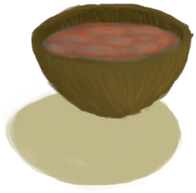

# 湿肥皂  
> 我可以趁它湿的时候清洁自己。  
   
> 肥皂可以更有效地清洁你的身体和伤口，它花费更少的水和时间。在使用之前，肥皂必须先被打湿。  要制作它，你需要油或脂肪与碱液混合（碱液由在水中加入灰烬然后煮沸制得）。然后将得到的混合物放入火中煮沸。  
  
<table class="table table-bordered" data-toggle="table" ><tbody><tr ><td  style="width:80%;text-align:left;vertical-align:top;"  >**重量：**25  **可用次数：**15</td><td  style="width:20%;text-align:left;vertical-align:top;"  >

</td></tr></tbody></tbody></table>  
  
## 获取来源  
<table class="table table-bordered" data-toggle="table" ><thead><tr ><th  style="text-align:left;vertical-align:top;"  >来源</th><th  style="text-align:left;vertical-align:top;"  >操作</th></tr></thead><tr ><td  style="text-align:left;vertical-align:top;"  >[

[肥皂](SoapDry.md)](SoapDry.md)</td><td  style="text-align:left;vertical-align:top;"  >打湿 ** 拖入：**[“水(任意)”](tag_WaterAny.md) , [“海”](tag_Sea.md)</td></tr><tr ><td  style="text-align:left;vertical-align:top;"  >[

[湿肥皂](SoapWet.md)](SoapWet.md)</td><td  style="text-align:left;vertical-align:top;"  >打湿 ** 拖入：**[“水(任意)”](tag_WaterAny.md) , [“海”](tag_Sea.md)</td></tr></tbody></table>  
  
## 动作  
<table class="table table-bordered" data-toggle="table" ><thead><tr ><th  style="text-align:left;vertical-align:top;"  >动作</th><th  style="text-align:left;vertical-align:top;"  >耗时</th><th  style="text-align:left;vertical-align:top;"  data-sortable="true"  >条件</th><th  style="text-align:left;vertical-align:top;"  >变化</th><th  style="text-align:left;vertical-align:top;"  >状态</th></tr></thead><tr ><td  style="text-align:left;vertical-align:top;"  >洗个澡 [“手部动作(组)”](HandAction.md)</td><td  style="text-align:left;vertical-align:top;"  >1TP</td><td  style="text-align:left;vertical-align:top;"  ></td><td  style="text-align:left;vertical-align:top;"  >** 自身：** 耐久  -3(-75%) 使用次数  -1</td><td  style="text-align:left;vertical-align:top;"  >[

[湿度](Wetness.md)](Wetness.md)+15 [

[污垢](Filth.md)](Filth.md)-300 [

[泥巴防护](MudProtection.md)](MudProtection.md)-50 [

[芦荟膏防护](AloeVeraGelProtection.md)](AloeVeraGelProtection.md)-50 [

[驱虫](BugRepellentApplied.md)](BugRepellentApplied.md)-50</td></tr></tbody></table>  
  
## 可拖入  
<table class="table table-bordered" data-toggle="table" ><thead><tr ><th  style="text-align:left;vertical-align:top;"  >使用</th><th  style="text-align:left;vertical-align:top;"  >动作</th><th  style="text-align:left;vertical-align:top;"  data-sortable="true"  >耗时</th><th  style="text-align:left;vertical-align:top;"  data-sortable="true"  >条件</th><th  style="text-align:left;vertical-align:top;"  >变化</th><th  style="text-align:left;vertical-align:top;"  data-sortable="true"  >玩家状态</th></tr></thead><tr ><td  style="text-align:left;vertical-align:top;"  >[“水(任意)”](tag_WaterAny.md) [“海”](tag_Sea.md)</td><td  style="text-align:left;vertical-align:top;"  >打湿 </td><td  style="text-align:left;vertical-align:top;"  >-</td><td  style="text-align:left;vertical-align:top;"  ></td><td  style="text-align:left;vertical-align:top;"  >** 自身: ** → [

[湿肥皂](SoapWet.md)](SoapWet.md) 耐久  +4(100%)  ** 使用物: ** 耐久  -250 可用次数  -1 含水量  -100</td><td  style="text-align:left;vertical-align:top;"  ></td></tr></tbody></table>  
  
## 可拖至  

[擦伤](W_Abrasion.md)

[左臂撕裂伤](W_ArmLacerationL.md)

[已缝合的左臂撕裂伤](W_ArmLacerationLStitched.md)

[右臂撕裂伤](W_ArmLacerationR.md)

[已缝合的右臂撕裂伤](W_ArmLacerationRStitched.md)

[狗咬伤](W_DogBite.md)

[左腿撕裂伤](W_LegLacerationL.md)

[已缝合的左腿撕裂伤](W_LegLacerationLStitched.md)

[右腿撕裂伤](W_LegLacerationR.md)

[已缝合的右腿撕裂伤](W_LegLacerationRStitched.md)

[猕猴咬伤](W_MacaqueBite.md)

[轻微撕裂伤](W_MinorLaceration.md)

[已缝合的轻微撕裂伤](W_MinorLacerationStitched.md)

[巨蜥咬伤](W_MonitorBite.md)

[海怪刺伤](W_SeahoundSting.md)

[鲨鱼咬伤](W_SharkBite.md)

[蜘蛛咬伤](W_SpiderBite.md)

[海胆刺伤](W_UrchinWound.md)

  
  
## 可用于蓝图  

[

[辣椒农药(蓝图)](Bp_PesticideChilli.md)](Bp_PesticideChilli.md)

  
  
  
## 属性   
<table class="table table-bordered" data-toggle="table" ><thead><tr ><th  style="text-align:left;vertical-align:top;"  >属性</th><th  style="text-align:left;vertical-align:top;"  >值</th><th  style="text-align:left;vertical-align:top;"  >耗时</th><th  style="text-align:left;vertical-align:top;"  >变化</th></tr></thead><tr ><td  style="text-align:left;vertical-align:top;"  >耐久</td><td  style="text-align:left;vertical-align:top;"  >初始：4 最大：4</td><td  style="text-align:left;vertical-align:top;"  >每15分钟-1 最多需要：4TP</td><td  style="text-align:left;vertical-align:top;"  >** 到达0时： **  ** 自身 ** → [

[肥皂](SoapDry.md)](SoapDry.md)</td></tr><tr ><td  style="text-align:left;vertical-align:top;"  >使用次数</td><td  style="text-align:left;vertical-align:top;"  >初始：15</td><td  style="text-align:left;vertical-align:top;"  >-</td><td  style="text-align:left;vertical-align:top;"  >** 到达0时： **  ** 自身 ** →消失</td></tr></tbody></table>  
  

