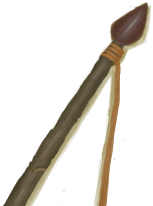

# 燧石长矛  
> 一柄狩猎工具。  
  
<table class="table table-bordered" data-toggle="table"  data-show-header="false"><thead style="display:none"><tr ><th  style="width:50%;text-align:left;vertical-align:top;"  >title</th><th  style="width:50%;text-align:left;vertical-align:top;"  ></th></tr></thead><tr ><td  style="width:50%;text-align:left;vertical-align:top;"  >** 装备时等效于拿在手上 **  **重量：**250  **装备时减重：**-200  **标签：**	[“一级矛”](tag_Spear.md), [“大的”](tag_Large.md)  **装备：**[“肩部装备”](eTag_Shoulder.md)  **可用次数：**75</td><td  style="width:50%;text-align:left;vertical-align:top;"  >

<a href="SpearFlint.md" style="color:black">燧石长矛</a>

用<b>燧石</b>通过<b>石工</b>技能制成的长矛。  使用<b>绳子和细线</b>将您的<b>燧石矛头绑在长木棍上</b>。  它比简易的木制长矛要好得多，可以增加你在与动物战斗时的成功几率。</td></tr></tbody></table>  
  
## 获取来源  

蓝图制造

[燧石长矛(蓝图)](Bp_FlintSpear.md)

  
  
## 动作  

<table><tr><td rowspan="2" style="width:200px;text-align:center;font-size:1.3em;font-weight:bold">

训练

1小时

</td><td>[“手部动作(组)”](HandAction.md)</td></tr><tr><td><b>自身：</b>使用次数  <b>-1</b></td></tr><tr><td colspan="2"><b>状态变化：</b>[

[矛战(技能)](Skill_SpearFighting.md)](Skill_SpearFighting.md)<b>+1</b>, [

[耐力](Stamina.md)](Stamina.md)<b>-8</b>, [

[手掌损伤](HandDamage.md)](HandDamage.md)<b>+20</b></td></tr></table>
  

<table><tr><td rowspan="2" style="width:200px;text-align:center;font-size:1.3em;font-weight:bold">

拆解

15分

</td><td>[“手部动作(组)”](HandAction.md)</td></tr><tr><td><b>自身：</b>→消失, 使用次数  <b>-1</b></td></tr><tr><td colspan="2">[

[长木棍](StickLong.md)](StickLong.md)(<b>+1</b>), [

[绳子](Rope.md)](Rope.md)(<b>+1</b>)</td></tr></table>
  
  
  
## 可拖至  

[青椰子](CoconutHusked.md)

[母猪](BoarEnclosureFemale.md)

[公猪](BoarEnclosureMale.md)

[小猪](BoarEnclosurePiglet.md)

[母猪](BoarTiedFemale.md)

[公猪](BoarTiedMale.md)

[小猪](BoarTiedPiglet.md)

[忠犬朋友](DogFriend.md)

[母山羊](GoatEnclosureFemale.md)

[小羊](GoatEnclosureKid.md)

[哺乳期山羊](GoatEnclosureLactating.md)

[公山羊](GoatEnclosureMale.md)

[母山羊](GoatTiedFemale.md)

[哺乳期山羊](GoatTiedFemaleLactating.md)

[小羊](GoatTiedKid.md)

[公山羊](GoatTiedMale.md)

[猕猴朋友](MacaqueFriend.md)

[海(环礁)](Sea_Atoll.md)

[海(海湾)](Sea_Bay.md)

[海(沙滩)](Sea_Beach.md)

[海(沙滩)](Sea_Cove.md)

[海(荒芜沙滩)](Sea_DesolateBeach.md)

[海(红树林)](Sea_Mangroves.md)

[海(鸟岩岛)](Sea_Rocks.md)

  
  
## 属性   

<table style="margin-bottom:0px;"><tr><td style="width:30%;text-align:left; background-color:#FEFEFE;font-size:1.3em;font-weight:bold;">使用次数</td><td style="font-size:1em;background-color:#FEFEFE">初始：75 -</td></tr><tr style="background-color:#FFFFFF"><td colspan=2>** 到达0时：长矛坏了 ** 自身: → [

[小树枝](Sticks.md)](Sticks.md) [

[绳子](Rope.md)](Rope.md)(<b>+1</b>)</td></tr></table>
  

