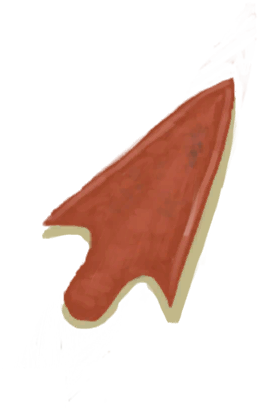

# 钝矛头  
> 想重新使用需要用石头先打磨一下。  
  
<table class="table table-bordered" data-toggle="table"  data-show-header="false"><thead style="display:none"><tr ><th  style="width:50%;text-align:left;vertical-align:top;"  >title</th><th  style="width:50%;text-align:left;vertical-align:top;"  ></th></tr></thead><tr ><td  style="width:50%;text-align:left;vertical-align:top;"  >**重量：**75  **标签：**	[“锤”](tag_Hammer.md), [“铜制小物件”](tag_CopperSmall.md), [“美丽的/好看的”](tag_Pretty.md)</td><td  style="width:50%;text-align:left;vertical-align:top;"  >

<a href="SpearHeadBlunt.md" style="color:black">钝矛头</a>

对于长矛来说，一个锋利而坚固的<b>金属矛头</b>可比别的牛鬼蛇神好用，用结实的<b>绳子和细线</b>把它绑在<b>长木棍</b>上吧。  炼制铜制矛头，你需要找到<b>铜矿</b>，在<b>熔炉</b>上熔炼，并在<b>模具</b>中冷却。  铜制矛头的其中一个优点是它比其他矛头更耐用，而且只会变<b>钝</b>而不会<b>破损</b>。  当这种情况发生时，你只需要使用<b>石头打磨矛头</b>，就能够重复使用它。</td></tr></tbody></table>  
  
## 获取来源  

拆解

[铜长矛](SpearCopper.md)

长矛坏了

[铜长矛](SpearCopper.md)

转化

[矛头](SpearHead.md)

  
  
## 可拖入  

<table style="margin-bottom:0px;"><tr><td style="width:40%;text-align:left; background-color:#FEFEFE"><b>拖入：</b>[

[石头](Stone.md)](Stone.md) | [

[大石块](StoneHeavy.md)](StoneHeavy.md)</td><td style="width:40%;font-size:1em;font-weight:bold;background-color:#FEFEFE">磨利 (30分) </td></tr><tr style="background-color:#FFFFFF"><td style=""><b>使用物：</b>可用次数  <b>-1</b></td><td style=""><b>自身：</b>→ [

[矛头](SpearHead.md)](SpearHead.md)</td></tr><tr><td colspan="2"><b>状态变化：</b>[

[手掌损伤](HandDamage.md)](HandDamage.md)<b>+20</b>, [

[压力](Stress.md)](Stress.md)<b>-5</b>, [

[金工(技能)](Skill_Metalworking.md)](Skill_Metalworking.md)<b>+0.5</b></td></tr></table>
  
  
## 可拖至  

[铜矿脉(洞穴上层)](CopperVein.md)

[干土堆](DirtPile.md)

[火炉(熄灭)](StoveExtinguished.md)

[泥堆](MudPile.md)

[水槽](WateringTrough.md)

[骨头碎片](BoneSplinters.md)

[骨头](Bones.md)

[木炭](Charcoal.md)

[椰子](Coconut.md)

[青椰子](CoconutHusked.md)

[带孔椰子](CoconutPerforated.md)

[腐烂的椰子](CoconutRotten.md)

[海螺](Conch.md)

[铜制装饰品](CopperDecoration_Mold.md)

[干辣椒](ChiliesDried.md)

[海螺肉](ConchMeat.md)

[姜](Ginger.md)

[干姜](GingerDried.md)

[茉莉花](JasmineFlowers.md)

[卡瓦根](KavaRoot.md)

[干燥的卡瓦根](KavaRootDried.md)

[柠檬草](LemongrassStalks.md)

[蜘蛛兰叶](SpiderLilyLeaves.md)

[干燥的蜘蛛兰叶](SpiderLilyLeavesDried.md)

[晶洞](Geode.md)

[大海螺](GiantConch.md)

[煅烧后的砂浆](MortarBurnt.md)

[泥砖](MudBrick.md)

[硝石晶体](NiterCrystals.md)

[牡蛎](Oyster.md)

[蛇草](SnakeGrass.md)

[煅烧后的石头](StoneBurnt.md)

[煅烧后的大石块](StoneHeavyBurnt.md)

[热带杏仁](TropicalAlmonds.md)

[海胆](Urchin.md)

[硫磺喷口(火山)](VentBrimstone.md)

[韦斯顿](Weston.md)

[狭窄通道(洞穴底层)](CrystalChamberEntranceClosed.md)

[狭窄通道(潮湿洞穴)](DarkCaveCaveEntranceClosed.md)

[狭窄通道(洞穴中层)](DarkChamberCaveEntranceClosed.md)

[狭窄通道(洞穴上层)](FloodedChamberEntranceClosed.md)

[狭窄通道(隧道)](HighChamberEntranceClosed.md)

[滤水器](WaterFilter.md)

  
  
## 可用于转化  
<table class="table table-bordered" data-toggle="table"  ><thead style=""><tr ><th  style="text-align:left;vertical-align:top;"  >转化为</th><th  style="text-align:left;vertical-align:top;"  >容器</th></tr></thead><tr ><td  style="text-align:left;vertical-align:top;"  >[

[铜](Copper.md)](Copper.md)</td><td  style="text-align:left;vertical-align:top;"  >[

[熔炉](Forge.md)](Forge.md)</td></tr><tr ><td  style="text-align:left;vertical-align:top;"  >[

[铜](Copper.md)](Copper.md)</td><td  style="text-align:left;vertical-align:top;"  >[

[高级窑炉](KilnAdvanced.md)](KilnAdvanced.md)</td></tr></tbody></table>  
  

